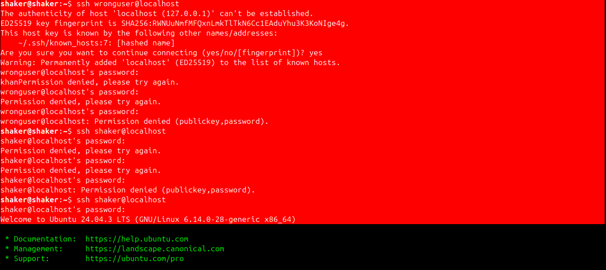
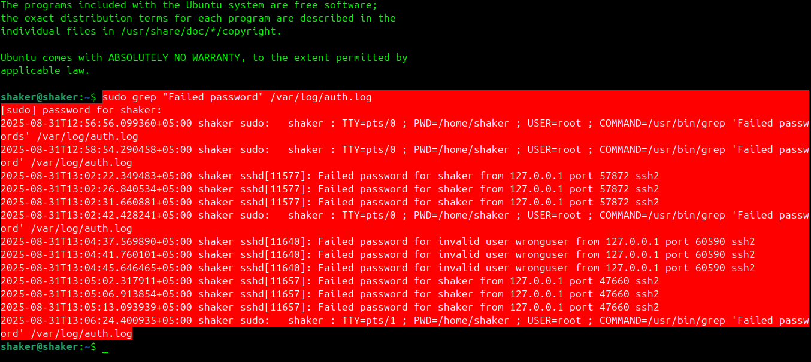

# Case Study: Failed SSH Login Attempts

**Date:** September 1, 2025  
**Environment:** Ubuntu with OpenSSH  
**Focus:** Authentication logging and basic security-event analysis

## 1. Objective

The objective was to generate controlled failed SSH authentication events and determine how they are recorded in the Linux authentication logs. This establishes a foundation for later SOC work: identifying authentication failures, distinguishing invalid users from invalid passwords, and using log evidence to investigate suspicious activity.

## 2. Environment

- Ubuntu
- OpenSSH server
- Local SSH client
- `/var/log/auth.log`

The activity was performed against the local machine, so the source address observed in the logs was `127.0.0.1`.

## 3. Procedure

### Enable OpenSSH

```bash
sudo apt install openssh-server -y
sudo systemctl enable ssh --now
```

### Generate controlled authentication failures

An invalid username and an existing account with an incorrect password were used to create two different failure conditions:

```bash
ssh wronguser@localhost
ssh shaker@localhost
```

### Review authentication events

```bash
sudo grep "Failed password" /var/log/auth.log
```

## 4. Findings

A total of **9 failed authentication attempts** were identified:

- **3** attempts involved an unknown/invalid username.
- **6** attempts involved an invalid password for an existing account.
- The observed source was `127.0.0.1` because the exercise was performed locally.

Example events:

```text
Aug 31 14:05:12 ubuntu sshd[3124]: Failed password for invalid user wronguser from 127.0.0.1 port 60590 ssh2
Aug 31 14:05:15 ubuntu sshd[3126]: Failed password for root from 127.0.0.1 port 57872 ssh2
```

## 5. Analysis

The important observation is that the SSH service records authentication failures with useful investigation fields, including the attempted account, source address, source port, and authentication method/protocol context.

From a SOC perspective, repeated authentication failures can become an indicator of password guessing or brute-force activity. A single failure is not necessarily malicious; useful detection normally considers **frequency, source, target account, timing, and surrounding events**.

This local experiment therefore demonstrates the basic evidence source that can later feed a SIEM such as Wazuh.

## 6. Result

The Ubuntu SSH service successfully recorded all generated failed authentication attempts in `/var/log/auth.log`. The experiment confirmed that the two failure types—invalid user and invalid password—can be distinguished from the log messages.

## 7. What I Learned

- How OpenSSH records authentication failures on Ubuntu.
- How to search authentication logs from the Linux command line.
- How to distinguish invalid-user events from invalid-password events.
- Why authentication logs are valuable telemetry for SOC monitoring.
- Why event context matters before classifying an authentication failure as malicious.

## 8. Evidence

### SSH login attempt



### Authentication log output



## 9. Security Context

This was a controlled local exercise. No external systems were targeted. The same type of telemetry can be used in a defensive environment to detect repeated authentication failures and investigate potential credential attacks.
