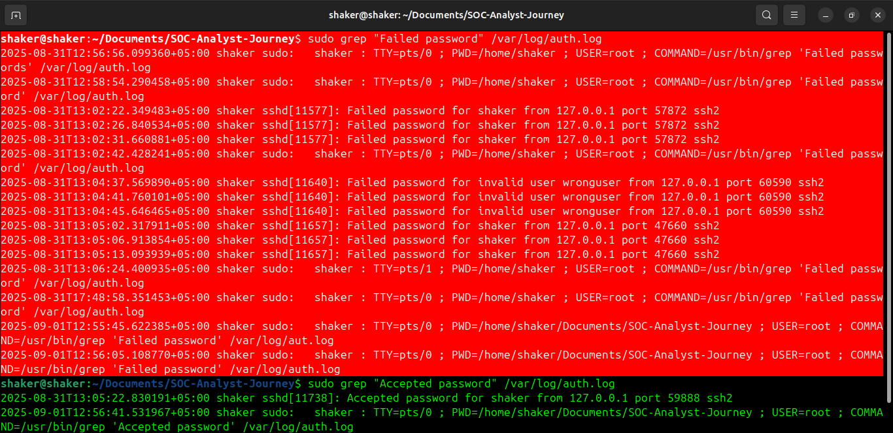
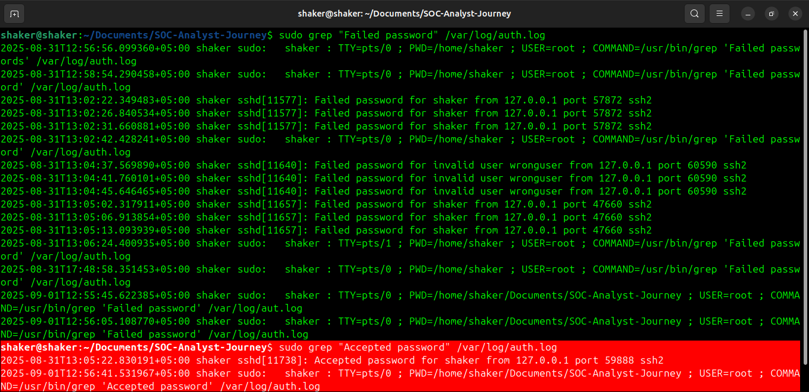
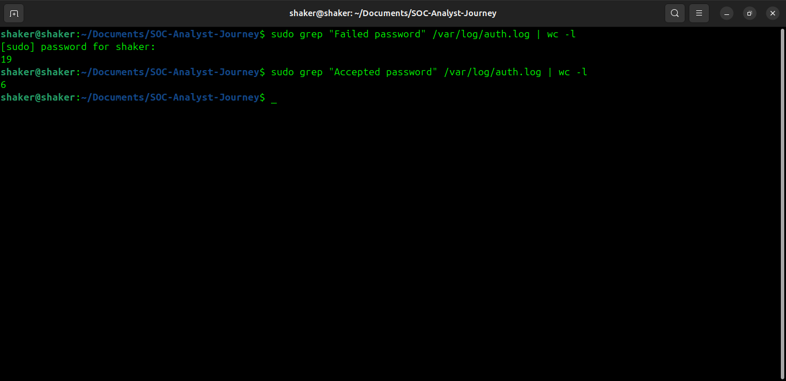
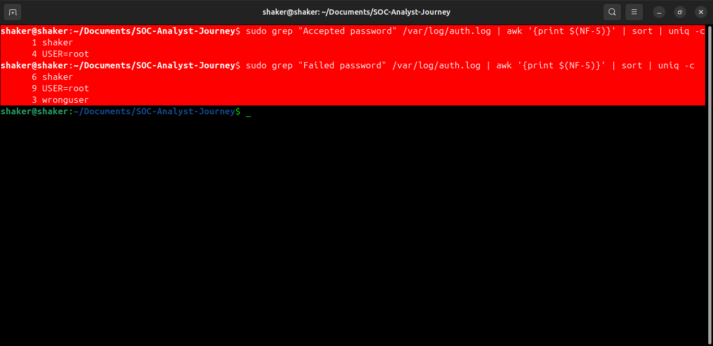

# Case Study: Successful vs Failed SSH Logins

**Environment:** Ubuntu / OpenSSH  
**Focus:** Authentication telemetry, account targeting and basic log analysis

## 1. Objective

The objective was to compare successful and failed SSH authentication events and use the available log data to identify patterns that could deserve further investigation in a SOC environment.

## 2. Evidence Source

The analysis used the Ubuntu SSH authentication log:

```text
/var/log/auth.log
```

## 3. Analysis Commands

### Failed authentication events

```bash
sudo grep "Failed password" /var/log/auth.log
```

### Successful authentication events

```bash
sudo grep "Accepted password" /var/log/auth.log
```

### Count events

```bash
sudo grep "Failed password" /var/log/auth.log | wc -l
sudo grep "Accepted password" /var/log/auth.log | wc -l
```

### Extract usernames

```bash
sudo grep "Failed password" /var/log/auth.log | awk '{print $(NF-5)}' | sort | uniq -c

sudo grep "Accepted password" /var/log/auth.log | awk '{print $(NF-5)}' | sort | uniq -c
```

> **Reproducibility note:** Log counts change as new events are generated. The commands above are the authoritative way to reproduce the counts in the current environment. The original notes contained inconsistent summary counts, so I have deliberately not repeated those figures as a fixed result here.

## 4. Observations

The captured analysis included:

- Failed authentication attempts involving the `shaker` account.
- Failed attempts involving `root`.
- Attempts against `wronguser`, an account that did not exist in the environment.
- Successful SSH authentication events involving local accounts.

The presence of failed attempts against `root` and an invalid username is useful security context, but **a failed login alone is not enough to conclude that an attack occurred**. The analyst should consider repetition, timing, source address, account importance and surrounding events.

## 5. Security Interpretation

A useful SOC investigation distinguishes between normal authentication mistakes and suspicious authentication patterns.

For example:

```text
Single failed login
      ↓
Probably insufficient evidence

Repeated failures from one source
      ↓
Potential password guessing

Repeated failures + successful login
      ↓
Higher-priority investigation
```

This analysis therefore provides the foundation for the later SSH brute-force/Wazuh case study in this repository.

## 6. Defensive Considerations

Depending on the environment and security requirements, useful SSH hardening measures can include:

- Disable direct root SSH login where appropriate.
- Prefer SSH keys over password authentication where practical.
- Enforce strong authentication policies.
- Monitor authentication failures centrally.
- Use rate limiting or tools such as Fail2ban where appropriate.
- Investigate unusual successful logins following repeated failures.

These are defensive recommendations; they were not all necessarily implemented as part of this exercise.

## 7. Evidence









## 8. What I Learned

- How successful and failed SSH authentication events differ in Linux logs.
- How command-line filtering can quickly isolate relevant security events.
- Why event frequency and context matter when classifying authentication activity.
- How authentication-log analysis connects directly to SIEM detection and incident investigation.
