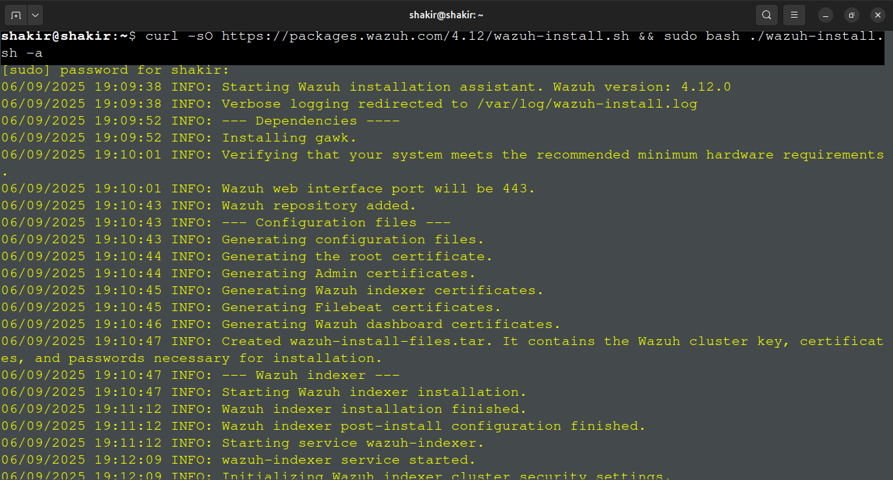
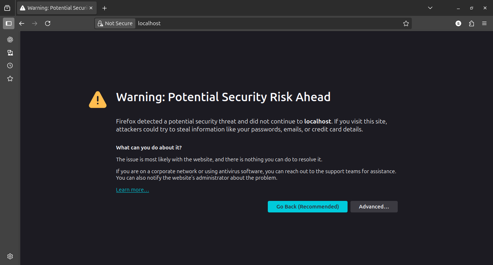
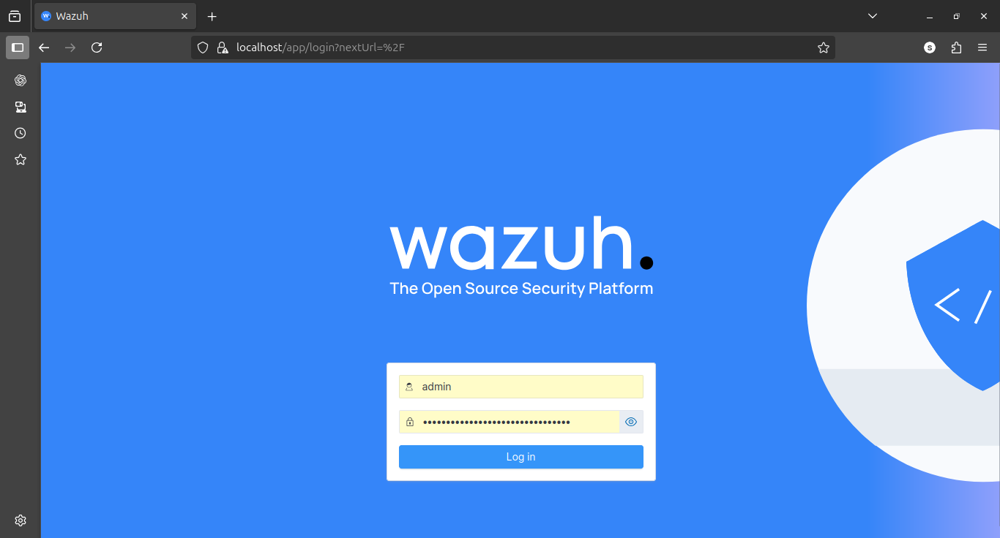
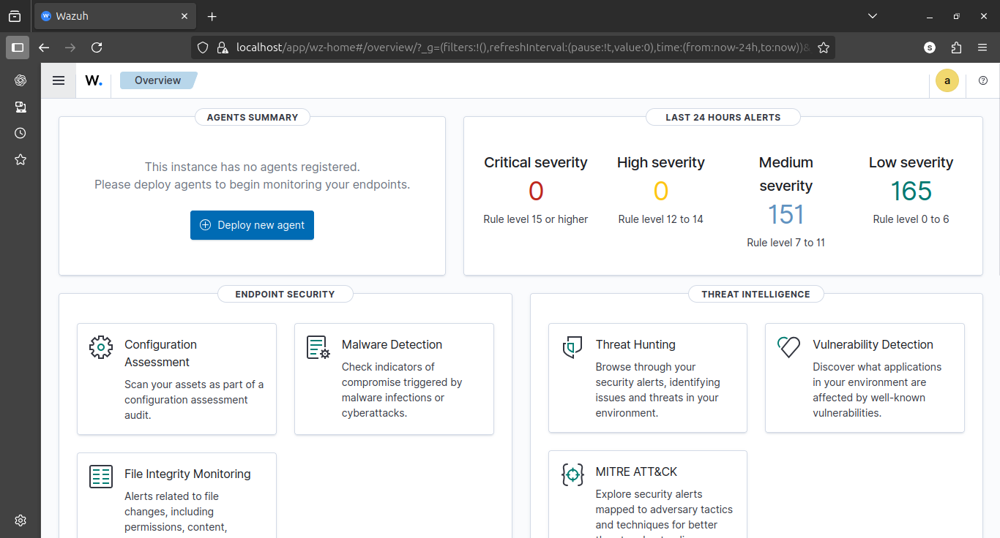
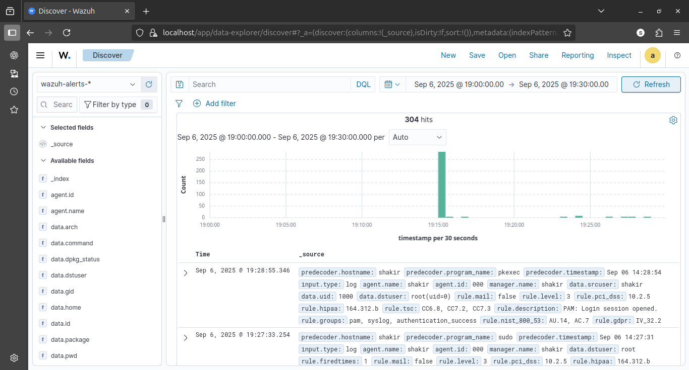
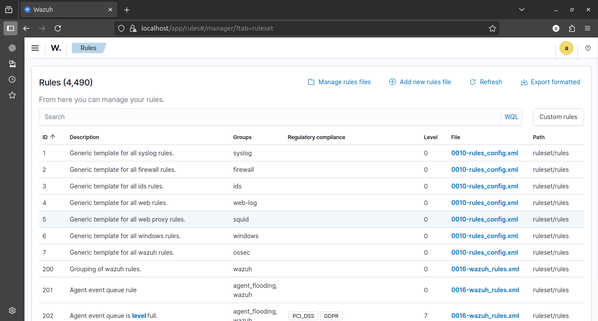
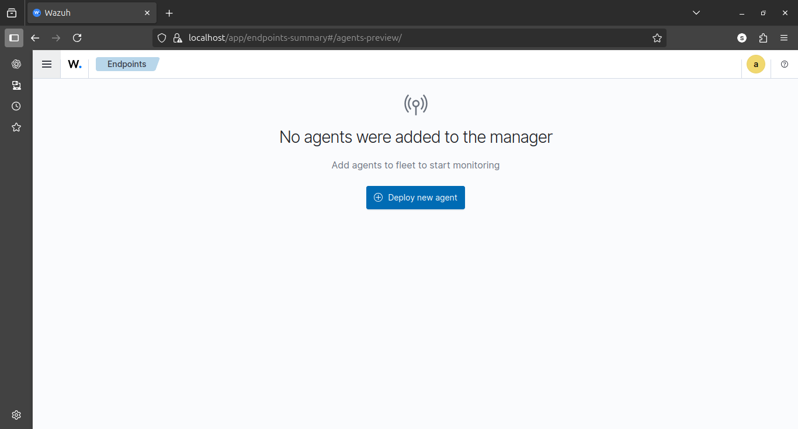

# Case Study: Wazuh SIEM Installation & Initial Exploration

**Environment:** Ubuntu  
**Focus:** SIEM deployment, dashboard exploration and security-event visibility

## 1. Objective

The objective was to install **Wazuh SIEM**, access its dashboard, and understand how a SIEM centralizes security telemetry, applies detection rules, and presents events to an analyst.

## 2. Installation

The Ubuntu system was updated before installing Wazuh:

```bash
sudo apt update && sudo apt upgrade -y
```

The Wazuh installation script was then downloaded and executed:

```bash
curl -sO https://packages.wazuh.com/4.7/wazuh-install.sh
sudo bash ./wazuh-install.sh -a
```

The generated administrative credentials were saved for dashboard access.

## 3. Dashboard Access

The dashboard was opened locally at:

```text
https://localhost:443
```

A browser security warning was encountered because the local installation used HTTPS with a certificate that was not trusted by the browser. The dashboard was then accessed for the laboratory exercise.







## 4. Initial Exploration

I explored the main Wazuh areas relevant to a beginner SOC workflow:

- **Home:** overview of the Wazuh environment.
- **Discover:** inspection of available security events and logs.
- **Ruleset:** review of built-in detection rules.
- **Agents Management:** inspection of endpoint/agent status.









## 5. Findings

The installation and initial exploration demonstrated that:

- Wazuh was successfully installed and its dashboard was accessible.
- The Discover area provided a centralized view of available event data.
- The ruleset contained predefined detections for common security events, including authentication failures and other host-security activity.
- No additional endpoint agents had yet been registered at this stage.

## 6. Security Concepts Learned

This first Wazuh exercise established several concepts that became important in later projects:

```text
Endpoint / Log Source
        ↓
   Telemetry
        ↓
Wazuh Analysis Engine
        ↓
 Detection Rules
        ↓
 Alerts / Events
        ↓
 Analyst Investigation
```

A SIEM is therefore more than a dashboard: its value comes from collecting useful telemetry, analyzing it with detection logic, and providing enough context for an analyst to investigate an event.

## 7. Limitations

At this stage the environment was primarily an initial Wazuh installation and exploration. The absence of additional endpoints meant that later exercises were required to demonstrate multi-endpoint monitoring and more realistic security-event workflows.

## 8. Outcome

The Wazuh environment was successfully established as the foundation for the subsequent SOC exercises documented in this repository, including local monitoring, SSH detection, custom rule development, and hybrid-cloud monitoring.
