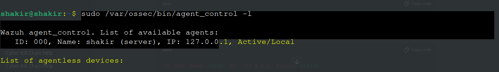
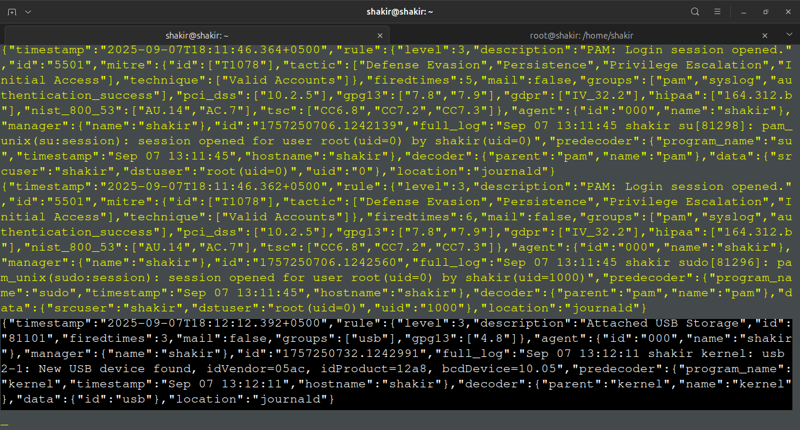

# Case Study: Wazuh Local Monitoring Lab

**Environment:** Ubuntu with Wazuh Manager  
**Focus:** Local telemetry, alert generation and security-event visibility

## 1. Objective

The objective was to understand how Wazuh can monitor activity on the same system hosting the Wazuh Manager, generate local security events, and expose those events through its alert files and logs.

## 2. Verify the Wazuh Manager

```bash
sudo systemctl status wazuh-manager
```

If required:

```bash
sudo systemctl start wazuh-manager
sudo systemctl enable wazuh-manager
```

## 3. Inspect the Local Monitoring Context

The Wazuh command-line tooling can be used to inspect the local monitoring/agent state:

```bash
sudo /var/ossec/bin/agent_control -l
```



## 4. Generate Controlled Local Events

The lab generated several types of activity so that the resulting telemetry could be inspected.

### File activity

```bash
sudo touch /etc/test_wazuh_file
sudo sh -c 'echo "Wazuh test alert" >> /etc/test_wazuh_file'
```

### Sudo activity

```bash
sudo ls /root
sudo cat /var/log/auth.log
```

### USB / kernel activity

A USB device was connected during the exercise and the kernel log was inspected:

```bash
dmesg | tail
```

> The `dmesg` command itself is evidence collection. Whether a USB event generates a Wazuh alert depends on the configured collection and detection rules; it should not automatically be assumed that every kernel event becomes an alert.

### Log activity

To append a test message to syslog while ensuring that the shell redirection is performed with appropriate privileges:

```bash
printf '%s\n' 'Testing log alert' | sudo tee -a /var/log/syslog > /dev/null
```

## 5. Observe Wazuh Alerts

Wazuh alert data can be inspected in JSON form:

```bash
sudo tail -f /var/ossec/logs/alerts/alerts.json
```



Wazuh internal operational logs can be inspected separately:

```bash
sudo tail -f /var/ossec/logs/ossec.log
```

The distinction is useful during troubleshooting:

- `alerts.json` contains generated security alerts.
- `ossec.log` contains Wazuh manager/agent operational messages.

## 6. Analysis

The exercise demonstrated a basic defensive loop:

```text
Generate controlled activity
          ↓
Collect host telemetry
          ↓
Wazuh analysis / rules
          ↓
Security alert
          ↓
Inspect evidence
```

This is the same general workflow used in later case studies, where the generated activity becomes more specific—for example, SSH authentication failures and brute-force behavior.

## 7. What I Learned

- How to verify Wazuh Manager status.
- Where Wazuh stores alert and operational log information.
- How controlled host activity can be used to validate monitoring.
- Why generating test data and observing the resulting telemetry is useful when learning detection engineering.
- Why a command that creates system activity should not automatically be treated as proof that a SIEM detection fired; the resulting alert must be verified.

## 8. Evidence


## 9. Next Stage

This local exercise provided the foundation for testing Wazuh against additional endpoints and more realistic attack simulations, which are documented in the later case studies.
