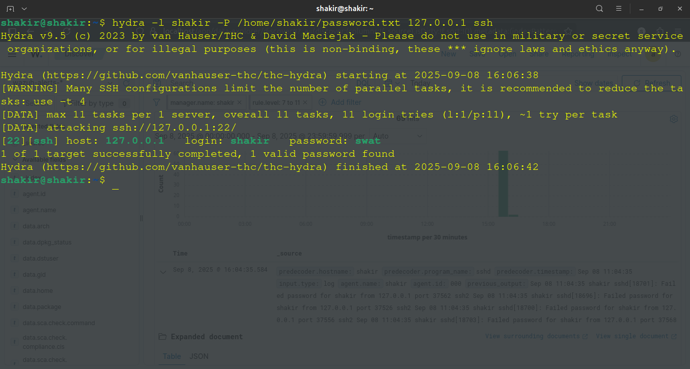
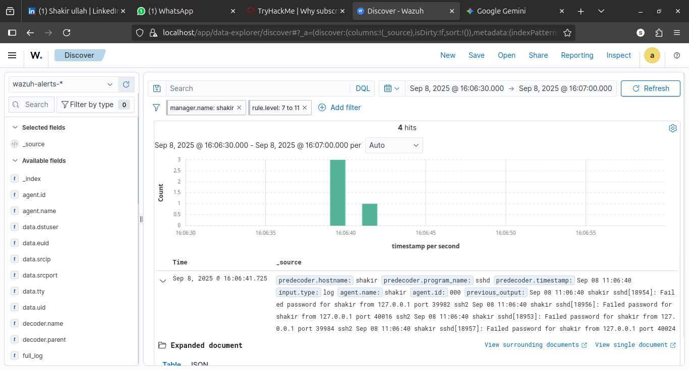
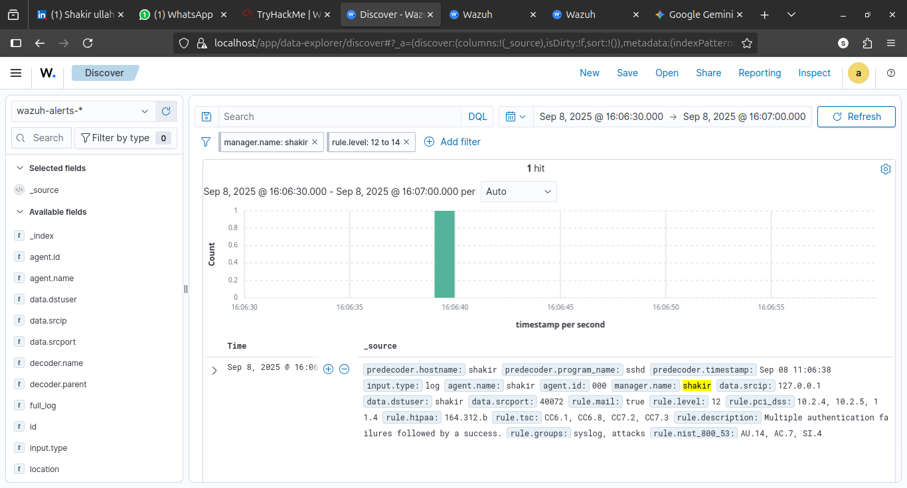

# Case Study: Detection of a Simulated SSH Brute-Force Attack

## 1. Summary

On September 8, 2025, I performed a controlled SSH brute-force simulation against a local environment monitored by **Wazuh SIEM**. The exercise used **Hydra** to generate authentication attempts and evaluated whether Wazuh could detect the resulting activity.

The test produced two important detections: a brute-force alert (**Rule ID 5712**) and a subsequent alert for multiple authentication failures followed by a successful login (**Rule ID 5716**).

> **Scope:** This was a local, controlled security exercise. The target and source were both `127.0.0.1`.

## 2. Objective

- Generate controlled SSH authentication failures.
- Determine whether Wazuh detects the resulting pattern.
- Examine the relationship between raw authentication events and SIEM alerts.
- Understand how a successful login following repeated failures changes the security significance of the event.

## 3. Tools and Environment

| Component | Purpose |
|---|---|
| **Wazuh SIEM** | Log collection, correlation, detection and alerting |
| **Hydra** | Controlled generation of SSH password-guessing attempts |
| **OpenSSH** | Target authentication service |

## 4. Attack Simulation

At approximately **16:05 PKT on September 8, 2025**, Hydra was used against the local SSH service for the account `shakir` with a small custom password list.



The purpose was not to compromise an external system, but to create realistic authentication telemetry that could be observed by the SIEM.

## 5. Detection Timeline

### Stage 1 — Brute-force detection

Wazuh correlated repeated failed SSH authentication attempts and generated a **Level 10 alert, Rule ID 5712**, identifying an SSH brute-force pattern.



### Stage 2 — Authentication success after failures

At approximately **16:17 PKT**, Wazuh generated a **Level 12 alert, Rule ID 5716**, for multiple authentication failures followed by a successful login.



This is more significant than isolated failed logins because a successful authentication after repeated failures can indicate that a guessed credential was accepted. In this lab, that success was part of the controlled simulation.

## 6. Evidence / Indicators

| Indicator | Observed value |
|---|---|
| Source address | `127.0.0.1` |
| Target username | `shakir` |
| Service | SSH / TCP 22 |
| Brute-force rule | `5712` |
| Failure-then-success rule | `5716` |

## 7. Analysis

The exercise demonstrates a useful SOC detection sequence:

```text
Repeated authentication failures
            ↓
      SIEM correlation
            ↓
   Brute-force alert
            ↓
Successful authentication
            ↓
Higher-priority investigation
```

The important lesson is that **context and event correlation are more useful than treating every failed login as an independent incident**. A mature monitoring workflow can combine multiple events and escalate when the sequence becomes more suspicious.

For a production environment, an analyst would normally investigate the source, account, timing, successful session, surrounding commands/events, and whether the account or endpoint showed additional signs of compromise.

## 8. What I Learned

- How authentication failures appear as SIEM telemetry.
- How Wazuh correlates repeated failed SSH attempts.
- How alert severity can change when a successful authentication follows failures.
- Why event correlation is important for SOC investigations.
- How controlled attack simulation can be used to validate defensive detections.

## 9. MITRE ATT&CK Context

The simulated behavior is consistent with **T1110 — Brute Force**, specifically password-guessing behavior. The ATT&CK mapping is used here to describe the simulated behavior, not to claim an external real-world incident.

## 10. Limitations

This experiment was conducted locally, so the source address was `127.0.0.1`. The small password list and controlled environment also do not represent the scale or noise of a production attack.

## 11. Conclusion

The exercise successfully demonstrated that Wazuh could identify the simulated SSH brute-force pattern and escalate the subsequent failure-then-success sequence. More importantly, it provided a practical example of how a SOC analyst can move from raw authentication events to correlated alerts and then to investigation.
