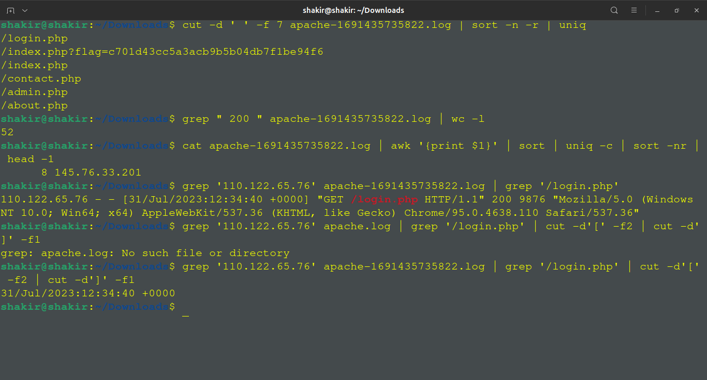
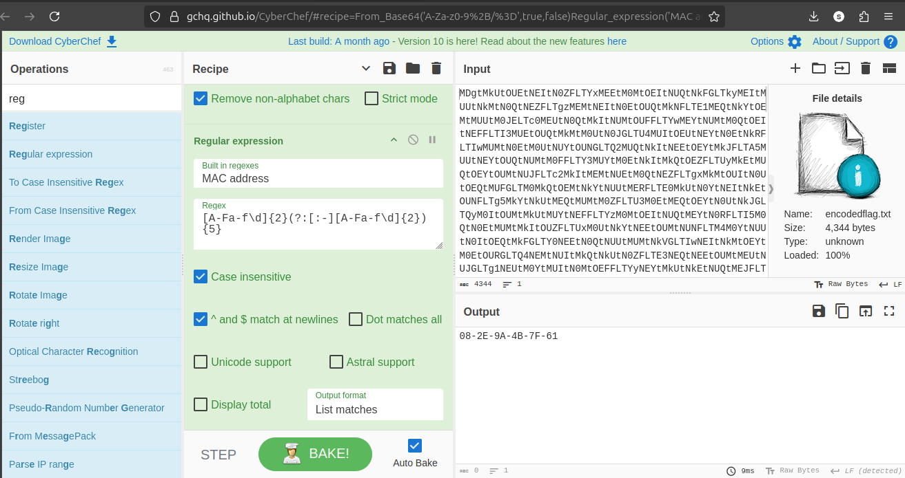
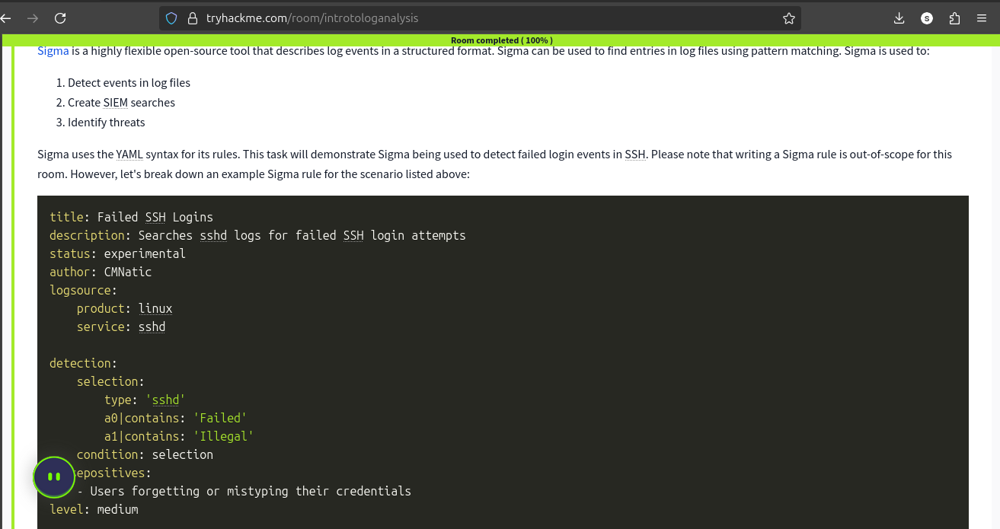
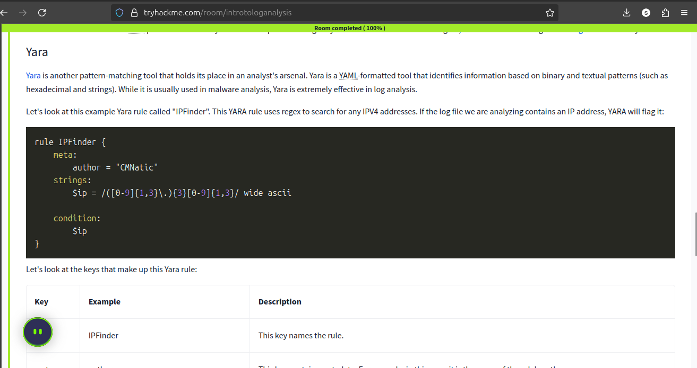
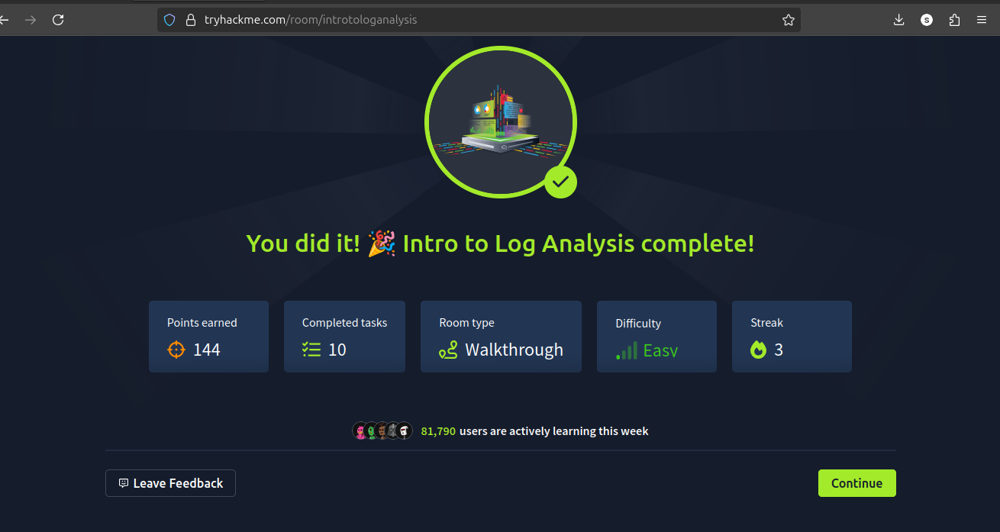

# Learning Write-up: Log Analysis & Detection Engineering

**Source:** TryHackMe — Intro to Log Analysis  
**Completed:** September 9, 2025  
**Focus:** Log analysis, investigation workflow, detection engineering and analyst tooling

> This document records the concepts and practical exercises covered in the room. It is intentionally presented as a learning write-up rather than claiming that every technique below was independently implemented as a production detection.

## 1. Why Log Analysis Matters

Security logs provide evidence of activity occurring on systems and services. A SOC analyst uses that evidence to establish what happened, when it happened, which account or process was involved, and whether multiple events form a suspicious sequence.

The room introduced a methodical investigation workflow:

```text
Event / Alert
     ↓
Collect relevant evidence
     ↓
Filter and correlate events
     ↓
Form a hypothesis
     ↓
Pivot to additional evidence
     ↓
Determine likely activity
     ↓
Document findings
```

## 2. Automated vs. Manual Analysis

The training highlighted the different roles of SIEM automation and manual investigation.

- **Automated analysis:** useful for collecting telemetry, applying rules, correlating events and surfacing alerts at scale.
- **Manual analysis:** useful when an analyst needs to inspect raw logs, test assumptions, pivot through evidence or understand an unusual event in greater depth.

This distinction is relevant to my own Wazuh work, where SIEM alerts provide the starting point for investigation while Linux command-line tools can be used to inspect the underlying evidence.

## 3. Practical Analysis Tools

### Command-line filtering

`grep` and related command-line techniques can quickly reduce a large log file to events relevant to an investigation.



### Regular expressions

Regular expressions provide a structured way to identify patterns in text. In security operations, they can help analysts locate recurring event formats or extract useful fields from semi-structured logs.

### CyberChef

CyberChef was used as a general-purpose tool for decoding, transforming and inspecting data. This is particularly useful when investigating encoded or transformed strings encountered during security analysis.



## 4. Detection Engineering

The room introduced detection engineering as the process of translating observable threat behavior into repeatable detection logic.

The important conceptual progression is:

```text
Threat behavior
      ↓
Observable evidence
      ↓
Detection logic
      ↓
Alert
      ↓
Analyst investigation
```

### Sigma

Sigma provides a generic format for describing log-based detections. The main benefit is portability: a detection can be expressed independently of one specific SIEM and then adapted to an appropriate backend.



### YARA

YARA was introduced for pattern-based identification and classification of files or malware-related artifacts. It addresses a different layer of detection from a typical log-based Sigma rule.



## 5. Connection to My Own Work

The concepts from this room connect directly with later work in my repository, particularly:

- Linux authentication-log analysis
- Wazuh SIEM deployment
- SSH brute-force detection
- Custom Wazuh rules and decoders
- Network-security monitoring

The training helped me understand why a detection should be based on observable evidence and why validation is important before relying on a rule operationally.

## 6. Key Takeaways

1. **Logs are evidence.** Good analysis starts by understanding what the event actually records.
2. **Correlation adds context.** Multiple related events can be more informative than isolated alerts.
3. **Automation and manual analysis complement each other.** SIEMs provide scale; command-line analysis provides depth and flexibility.
4. **Detection engineering is behavioral.** A useful detection describes something observable and meaningful rather than simply matching arbitrary text.
5. **Portable detection formats matter.** Sigma provides a useful way to reason about detections independently of a single SIEM product.

## 7. Evidence



## 8. Next Practical Application

The most useful follow-up is to apply these concepts to my own lab by taking a known security event, identifying its telemetry, writing detection logic, generating controlled test data, and verifying whether the expected alert is produced.
