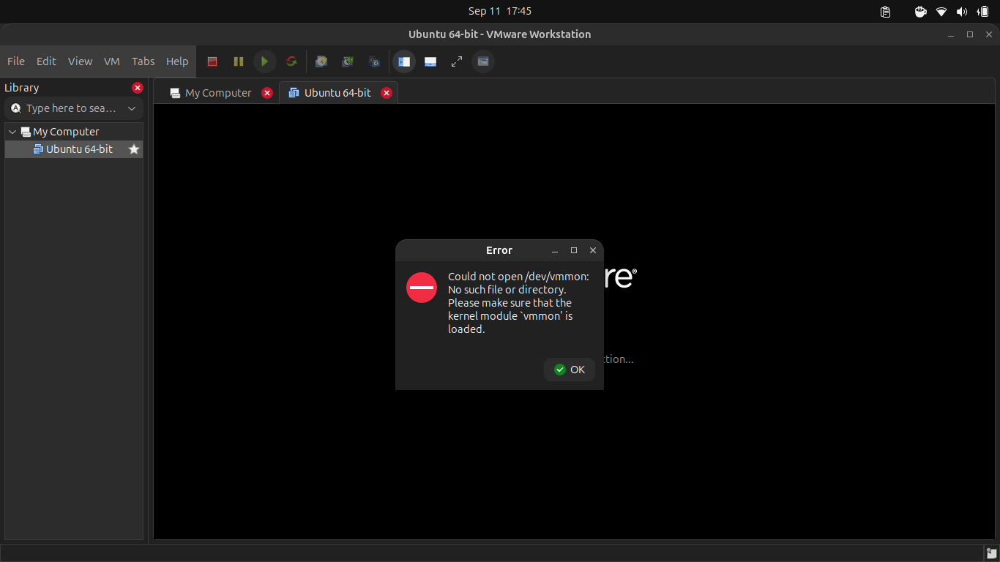
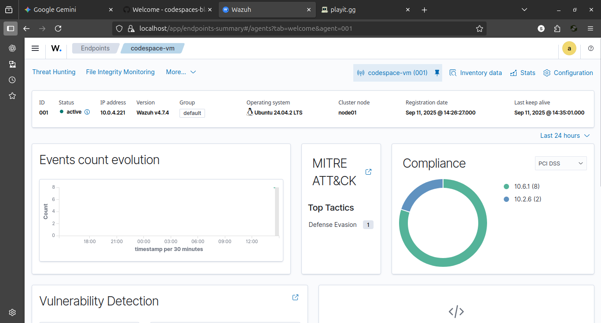

# Project Write-up: Hybrid-Cloud SIEM Lab

## 1. Overview

This project documents the engineering and troubleshooting process behind a **hybrid-cloud security monitoring lab using Wazuh SIEM**.

The original plan was to run a local virtual machine as an endpoint and monitor it with a Wazuh server. Virtualization constraints on the host forced a change in approach, leading to a lab in which a **GitHub Codespace acted as the monitored endpoint** while the **Wazuh server remained on the home laptop**.

The most valuable part of the project was not simply the final architecture, but the troubleshooting and adaptation required to reach a working monitoring path.

## 2. Objectives

- Deploy a Wazuh server in a local environment.
- Obtain endpoint telemetry from a separate environment.
- Practice remote-agent registration and log collection.
- Validate that the endpoint appears as active in the Wazuh dashboard.
- Generate controlled security events and verify that they reach the SIEM.

## 3. Initial Architecture

The original design was based on a local virtual machine:

```text
[Local VM / Endpoint] ---> [Local Wazuh Server]
```

Attempts to use VirtualBox and VMware Player encountered kernel-module errors (`vboxdrv` / `vmmon`). The investigation indicated that Secure Boot was preventing the required modules from loading. Disabling Secure Boot was not available because the BIOS password was unavailable.



## 4. Engineering Pivot

Instead of abandoning the experiment, I changed the architecture.

The final lab used:

- **Endpoint:** GitHub Codespace running Ubuntu
- **SIEM:** Wazuh server on the home laptop
- **Tunnel:** playit.gg TCP tunnel
- **Wazuh agent port:** 1514

```text
[GitHub Codespace]
       |
       | Wazuh agent traffic
       v
[playit.gg tunnel]
       |
       v
[Home Laptop]
       |
       v
[Wazuh Server / Dashboard]
```

The endpoint successfully registered and appeared as **Active** in the Wazuh Dashboard.




## 5. Troubleshooting Process

### Virtualization

The first blocker was the inability to load virtualization kernel modules because of the host's Secure Boot configuration. This required a change in the lab design rather than repeated attempts with the same configuration.

### Connectivity

A remote endpoint required a network path to the locally hosted Wazuh service. I initially investigated ngrok, but the free-tier requirements did not fit the TCP tunneling requirement. I then used playit.gg as the alternative for the lab.

This sequence demonstrates an important engineering skill: **when an implementation path is blocked, isolate the constraint, evaluate alternatives, and preserve the original learning objective.**

## 6. Validation Test

A controlled SSH brute-force test was performed from the Codespace against the local environment to generate authentication telemetry.

| Indicator | Observed value |
|---|---|
| Source | `127.0.0.1` |
| Target user | `codespace` |
| Service | SSH / 22 |
| Wazuh rules | `5712`, `5716` |

The resulting telemetry was detected by Wazuh, providing a practical validation that the endpoint-to-SIEM monitoring path was functioning.

## 7. Security Considerations

This was a laboratory architecture, not a production deployment. Exposing a service or agent port through a public tunnel introduces additional attack surface and should be treated accordingly.

For a production design, I would prefer a private network path such as a VPN or other appropriately authenticated and encrypted connectivity mechanism, together with strict firewall rules and access controls.

The tunnel was therefore used only to solve the connectivity problem in the controlled learning environment.

## 8. Skills Demonstrated

- Linux troubleshooting
- Virtualization troubleshooting
- SIEM deployment
- Wazuh agent registration
- Remote log collection
- Basic TCP/network connectivity troubleshooting
- Security-event validation
- Technical problem solving and architecture pivoting

## 9. Key Lessons

### Technical lesson

A security monitoring architecture depends on more than the SIEM itself. Endpoint connectivity, agent configuration, network reachability, and telemetry ingestion all have to work together.

### Engineering lesson

The original design failed because of a host-level constraint. Instead of treating the failure as the end of the project, I changed the architecture while keeping the same objective: obtain endpoint telemetry and investigate it centrally.

## 10. Evidence

The screenshots in this repository document the virtualization error, active Wazuh agent, and resulting monitoring state.

## 11. Future Improvements

Possible future extensions include:

- Rebuilding the same architecture over a private VPN.
- Adding additional endpoints.
- Correlating authentication events with network telemetry.
- Testing detection rules across different endpoint types.
- Documenting network segmentation and least-privilege controls.
