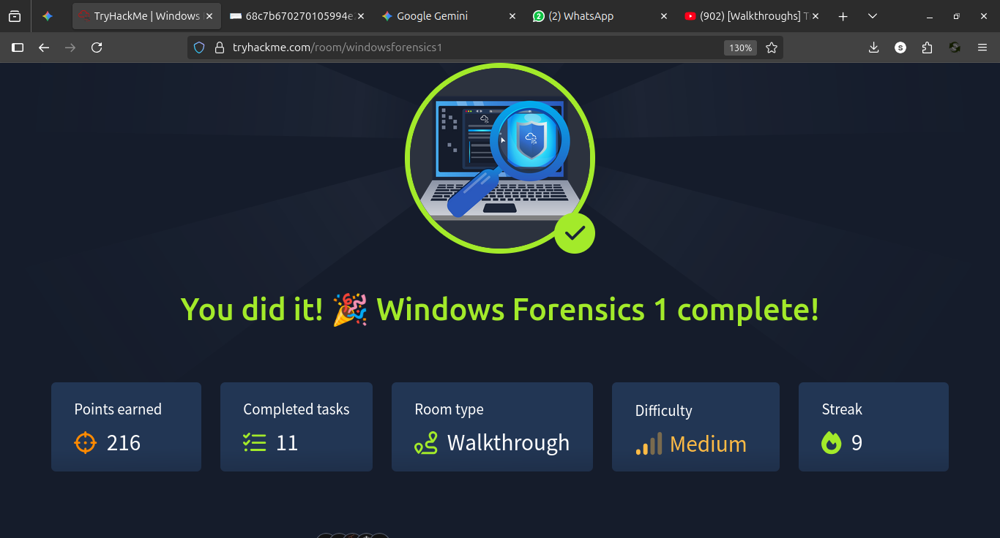
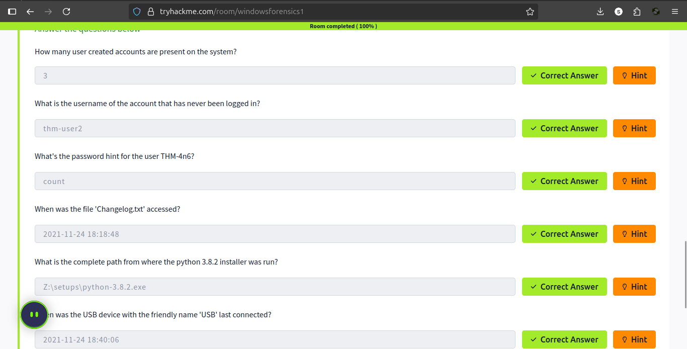
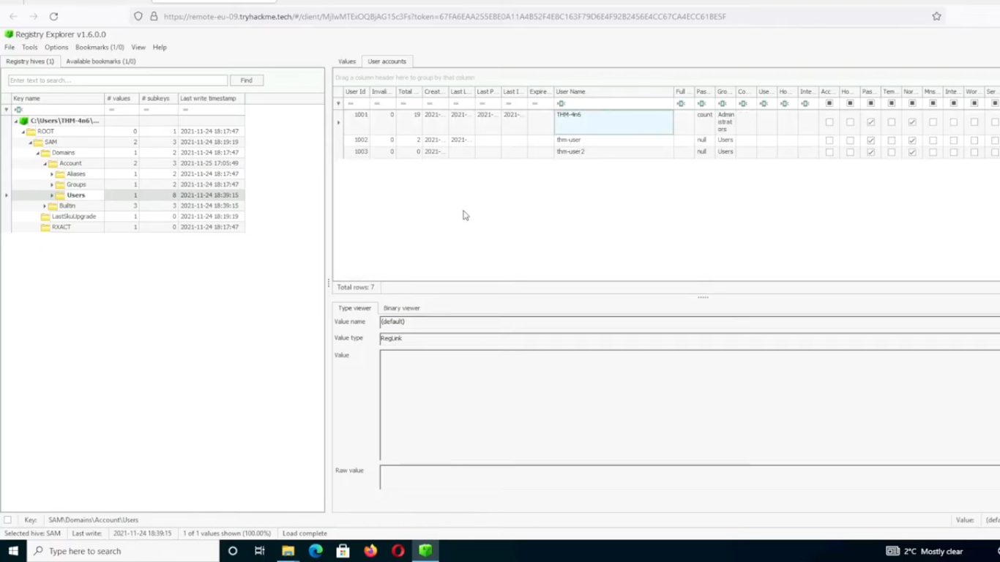

# Learning Write-up: Windows Forensics 1

**Source:** TryHackMe — Windows Forensics 1  
**Completed:** September 15, 2025  
**Focus:** Windows Registry analysis and host-based digital forensics

> This write-up summarizes the techniques and practical challenge covered in the training room. The goal is to document what I learned and how the artifacts fit into a forensic investigation, rather than present the training scenario as a real-world incident.

## 1. Investigation Objective

The room introduced a workflow for extracting and interpreting evidence from Windows Registry hives in a simulated forensic investigation.

The main questions were:

- What system and user information can be recovered?
- What evidence of user activity is available?
- Which artifacts can provide evidence related to program execution?
- What evidence can show the use of external USB storage?

## 2. Evidence Preservation Concept

A central forensic principle is to avoid unnecessarily modifying the original evidence. The training introduced extraction of Registry hives from an acquired system and **offline analysis** of those copies.

Relevant hives included:

- `SYSTEM`
- `SAM`
- `SOFTWARE`
- `NTUSER.DAT`

Offline analysis separates examination from the live operating system and supports a more defensible evidence-handling process.

## 3. Registry Artifacts Studied

### SYSTEM hive

The SYSTEM hive can provide information about the operating-system environment, configuration, services, and hardware-related settings.

### SAM hive

The SAM hive contains local account information. In forensic work it can help establish which local accounts existed on the system, subject to the limitations and security protections of the artifact.

### NTUSER.DAT

The per-user NTUSER.DAT hive can provide evidence about activity associated with a specific Windows user profile.

The training covered artifacts such as **MRU information and ShellBags**, which can help investigators understand accessed files, folders, and user activity when interpreted together with other evidence.

### UserAssist

UserAssist artifacts can provide evidence associated with execution of GUI applications by a Windows user. They should be interpreted as one source of evidence rather than treated as absolute proof of every execution scenario.

### ShimCache

ShimCache (AppCompatCache) can contain information about executable files observed by Windows compatibility mechanisms. Its forensic interpretation requires care: the presence of an entry does not, by itself, prove that a program was executed at a particular time.

### USBSTOR

The `SYSTEM\\ControlSet001\\Enum\\USBSTOR` area can contain records relating to USB storage devices connected to the system, including device-identifying information. This can be useful when investigating possible external-device use.

## 4. Investigation Workflow

The practical investigation followed a general forensic reasoning process:

```text
Acquired evidence
       ↓
Identify relevant Registry hives
       ↓
Extract artifacts of interest
       ↓
Interpret user/system activity
       ↓
Correlate multiple artifacts
       ↓
Answer investigation questions
       ↓
Document evidence and limitations
```

The important lesson is that a single artifact should rarely be interpreted in isolation. Stronger conclusions come from correlating independent pieces of evidence.

## 5. Hands-on Challenge

The room concluded with a practical challenge using acquired Registry hives from a simulated case. I applied the concepts above to identify information about the user's actions, executed programs, and connected external devices.

### Evidence of completed challenge







## 6. Skills Developed

- Windows Registry structure and forensic significance
- Offline Registry-hive analysis
- Host-based digital forensics
- User-activity investigation
- Artifact interpretation
- Evidence correlation
- Basic DFIR reasoning and documentation

## 7. Key Lessons

1. **Context matters.** Registry artifacts are most useful when correlated with other evidence.
2. **Evidence preservation matters.** Working from acquired copies reduces the risk of altering the original system during examination.
3. **Artifacts have limitations.** A forensic artifact should not automatically be treated as definitive proof without understanding how Windows creates and updates it.
4. **Documentation matters.** A good investigation records not only the answer but also the evidence and reasoning supporting it.

## 8. Connection to Cybersecurity

This training complements my SOC work by adding a host-forensics perspective. SIEM alerts can identify suspicious activity, while endpoint and forensic artifacts can help an analyst understand what happened on the affected system and support incident-response decisions.
