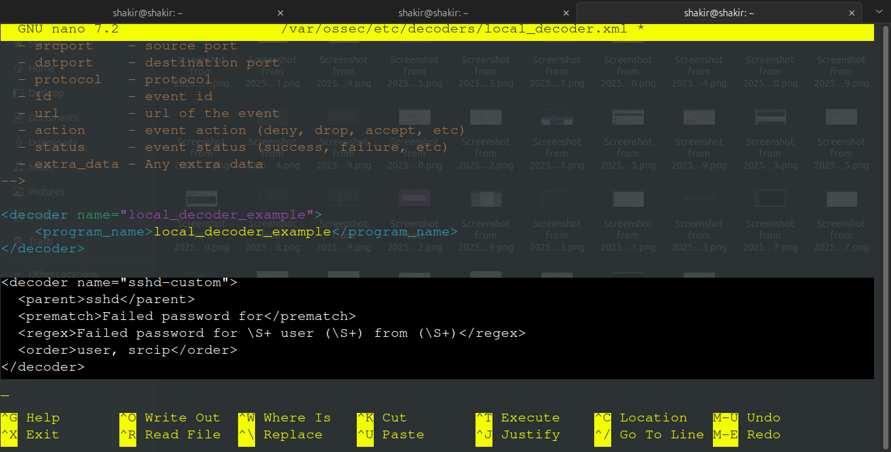
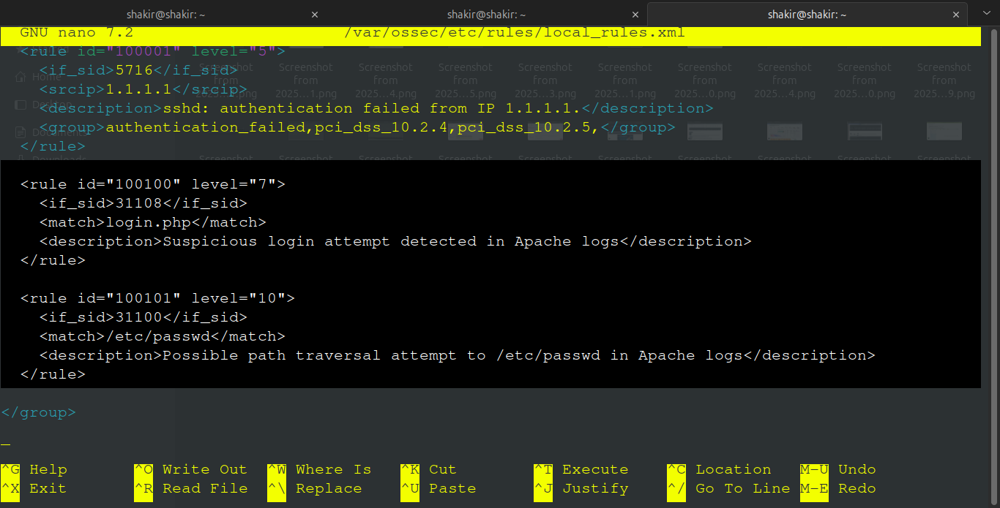
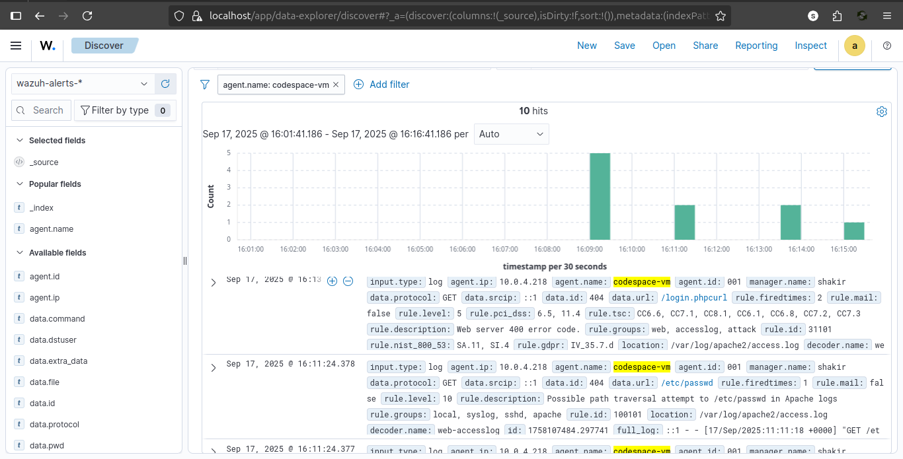

# Project: Advanced Wazuh Rule & Decoder Development

> This document details the process of developing, testing, and debugging custom rules and decoders for the Wazuh SIEM. The objective was to move beyond default detections and create tailored rules to identify specific, high-fidelity threat indicators.

---

### 🎯 Objective
To enhance the detection capabilities of a deployed Wazuh server by creating custom rules for specific SSH and Apache web server threats.

---

### 📜 The Custom Rules

Three custom rules were developed in `/var/ossec/etc/rules/local_rules.xml`:
1.  **Rule 100001:** To detect a failed SSH login from a specific, known-malicious IP address (`1.1.1.1`).
2.  **Rule 100100:** To detect suspicious access to a `login.php` page on an Apache web server.
3.  **Rule 100101:** To detect a common web attack technique, Path Traversal, specifically looking for attempts to access `/etc/passwd`.

---

### 🔧 The Troubleshooting & Debugging Process

Initial testing using the `wazuh-logtest` utility revealed that two of the three rules were not firing as expected. This initiated a deep-dive troubleshooting process.

1.  **SSH Rule Failure (`100001`):** The `wazuh-logtest` output showed `No decoder matched` for the sample SSH log. This indicated that the Wazuh analysis engine did not understand the log format, preventing it from ever being checked against the custom rule.
2.  **Path Traversal Rule Failure (`100101`):** The test for this rule triggered a built-in, lower-priority rule (`31101`) but not the intended custom rule. The root cause was an incorrect parent rule definition (`<if_sid>31108</if_sid>`) that did not match the log's characteristics.

---

### 💡 The Solution: A Custom Decoder & Rule Logic Fix

The issues were resolved with two precise fixes:

1.  **A New Custom Decoder:** A new decoder was created in `/var/ossec/etc/decoders/local_decoder.xml` to specifically parse the "Failed password" log format, correctly extracting the source IP and username.
    ```xml
    <decoder name="sshd-custom">
      <parent>sshd</parent>
      <prematch>Failed password for</prematch>
      <regex>Failed password for \S+ user (\S+) from (\S+)</regex>
      <order>user, srcip</order>
    </decoder>
    ```
2.  **Corrected Rule Logic:** The path traversal rule (`100101`) was modified to inherit from a more general parent rule (`<if_sid>31100</if_sid>`), ensuring it would be evaluated correctly.

---

### ✅ Verification

After restarting the Wazuh manager, both fixes were verified.
- The `wazuh-logtest` utility confirmed that all three custom rules now trigger correctly on their respective sample logs.
- A live, end-to-end test was performed by injecting a malicious log into the server's `/var/log/syslog`, which successfully generated the custom `100101` alert in the Wazuh dashboard.

*_(Evidence: The live alert for Rule 100101 appearing in the Wazuh Security Events dashboard.)*_
-   
-   
-   

---

### 🎓 Key Skills Demonstrated
- **Wazuh Rule Development:** Writing custom rules with specific `match`, `srcip`, and `if_sid` conditions.
- **Wazuh Decoder Development:** Creating custom decoders to parse logs not covered by the default ruleset.
- **XML Syntax Debugging:** Using `xmllint` to validate and correct file structure.
- **SIEM Testing & Validation:** Using `wazuh-logtest` to perform unit tests on rules and decoders.
- **Live End-to-End Testing:** Confirming rule functionality within the live SIEM dashboard.
