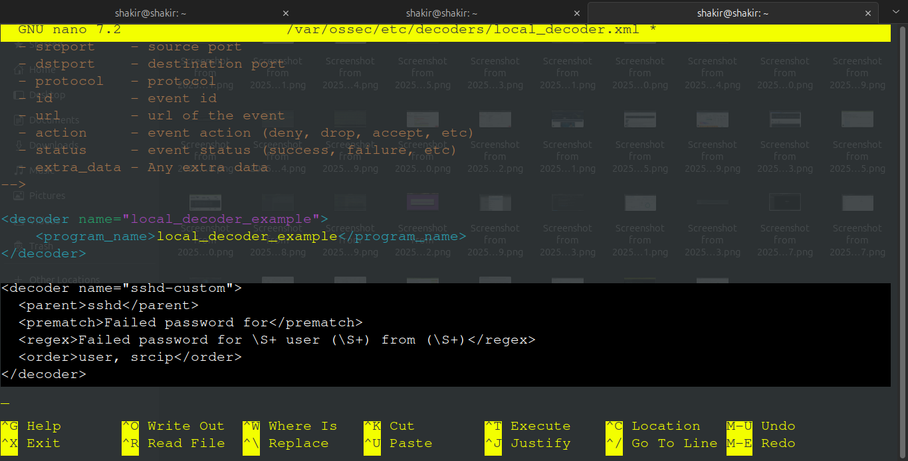
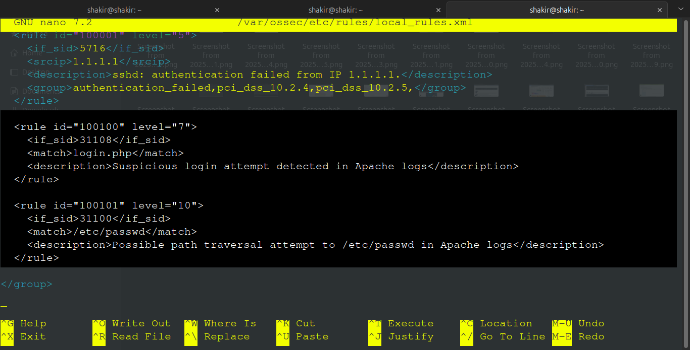
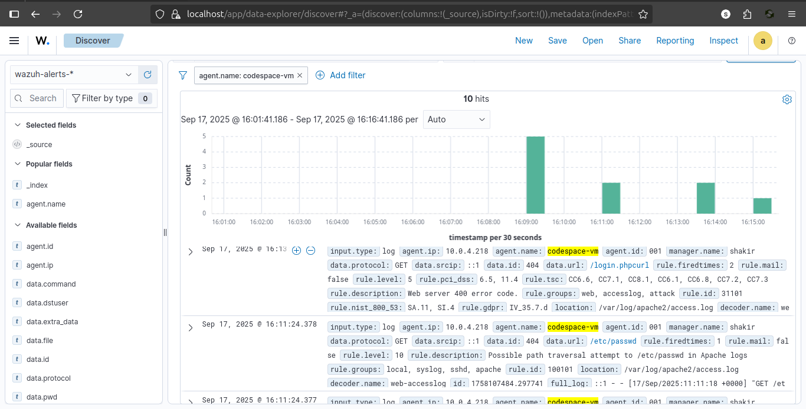

# Project: Wazuh Rule & Decoder Development

> A hands-on detection-engineering investigation focused on creating, debugging, and validating custom Wazuh rules and decoders for SSH and Apache web-server activity.

## 🎯 Objective

The objective was to move beyond default SIEM detections and build tailored, testable detections for:

1. Failed SSH authentication from a specified source IP.
2. Suspicious access to a `login.php` endpoint.
3. Path-traversal attempts targeting `/etc/passwd`.

The work was performed in an authorized lab environment.

## 🧪 Environment

- **SIEM:** Wazuh
- **Operating environment:** Linux
- **Log sources:** SSH and Apache/web-server logs
- **Testing:** `wazuh-logtest` plus controlled log injection in the lab
- **Configuration:** `local_rules.xml` and `local_decoder.xml`

## 🔎 Initial Detection Problem

During testing, two custom detections did not behave as expected.

### SSH detection — Rule 100001

`wazuh-logtest` returned **No decoder matched** for the sample SSH event. The problem was therefore upstream of the rule itself: the analysis engine was not parsing the event into the fields required by the custom rule.

### Path traversal — Rule 100101

The test event triggered an existing lower-priority rule (`31101`) instead of the intended custom detection. Investigation showed that the custom rule used an inappropriate parent rule (`<if_sid>31108</if_sid>`).

This distinction is important in detection engineering: a rule can be syntactically valid but logically unreachable for the event it is intended to detect.

## 🔧 Solution

### 1. Custom decoder

A local decoder was created to parse the relevant `Failed password` SSH log format and extract the username and source IP:

```xml
<decoder name="sshd-custom">
  <parent>sshd</parent>
  <prematch>Failed password for</prematch>
  <regex>Failed password for \S+ user (\S+) from (\S+)</regex>
  <order>user, srcip</order>
</decoder>
```

### 2. Corrected rule inheritance

The path-traversal detection was changed to inherit from a more appropriate parent rule (`31100`) so that the intended event could reach the custom rule logic.

## ✅ Validation

The changes were tested with `wazuh-logtest` and then validated with a controlled live event in the authorized lab.

The final testing confirmed that the intended custom detections could trigger and that the path-traversal rule generated the expected Wazuh security event.

Evidence from the original investigation is retained in the repository screenshots.

## 🧠 What I Learned

This investigation demonstrated several practical detection-engineering concepts:

- **Parsing comes before matching.** If the decoder does not understand an event, a rule cannot reliably evaluate the required fields.
- **Rule hierarchy matters.** Wazuh rules can depend on parent-rule conditions, so incorrect inheritance can prevent a valid detection from firing.
- **Detection development needs validation.** A rule should be tested with representative events rather than assumed to work because the XML is syntactically valid.
- **Live validation matters.** A successful `wazuh-logtest` result should be followed by an end-to-end test when practical.

## 🛡️ Security Context

The SSH and path-traversal scenarios represent common indicators that a SOC may investigate. In a production environment, these detections would also require tuning for the organization's normal traffic and authentication patterns to reduce false positives.

## 📸 Evidence

- 
- 
- 

## 🎓 Skills Demonstrated

- Wazuh rule development
- Wazuh decoder development
- XML configuration and debugging
- Log parsing
- Detection logic and rule inheritance
- SIEM testing with `wazuh-logtest`
- Controlled end-to-end validation
- Technical documentation
