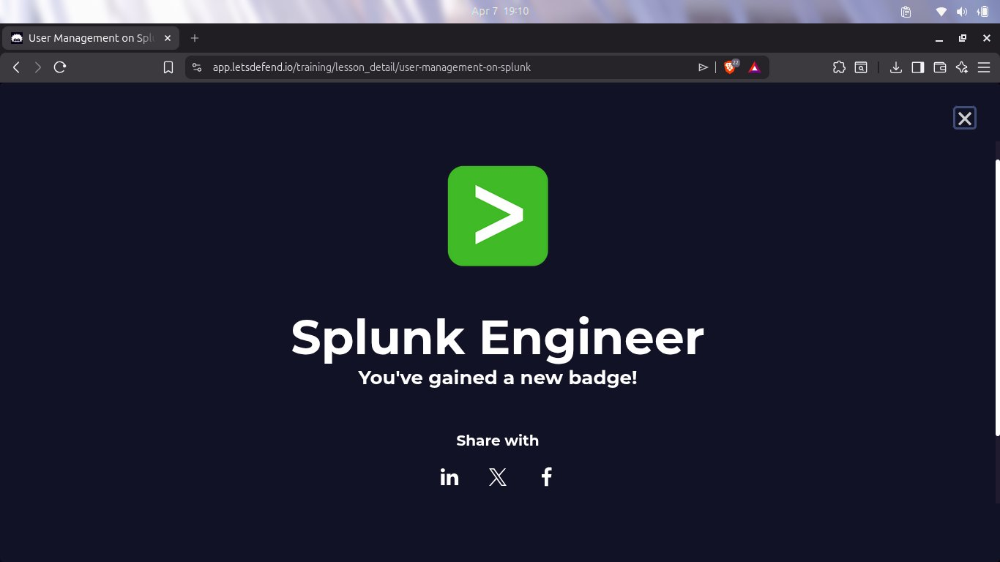
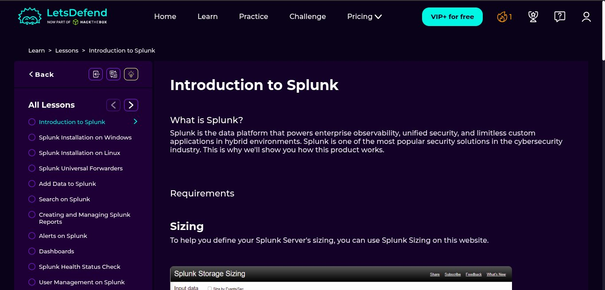
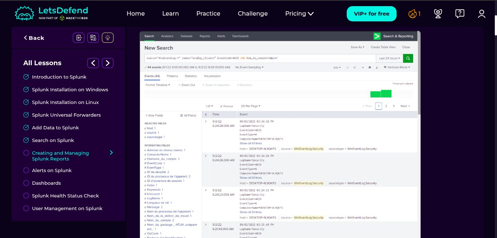
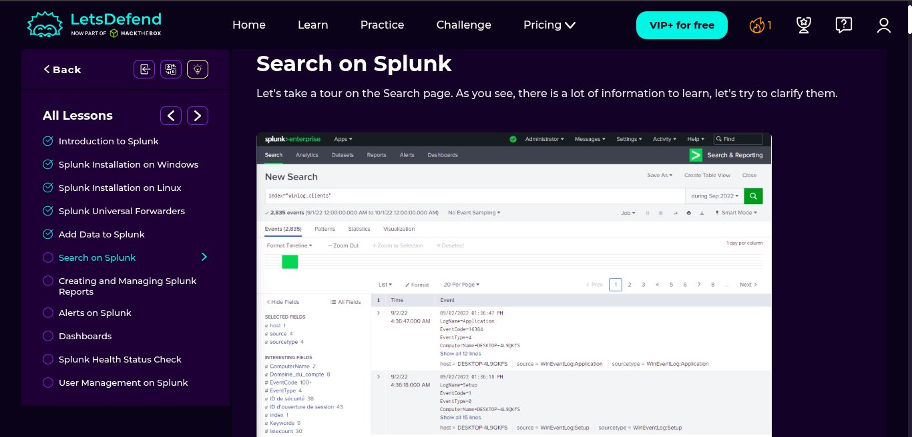
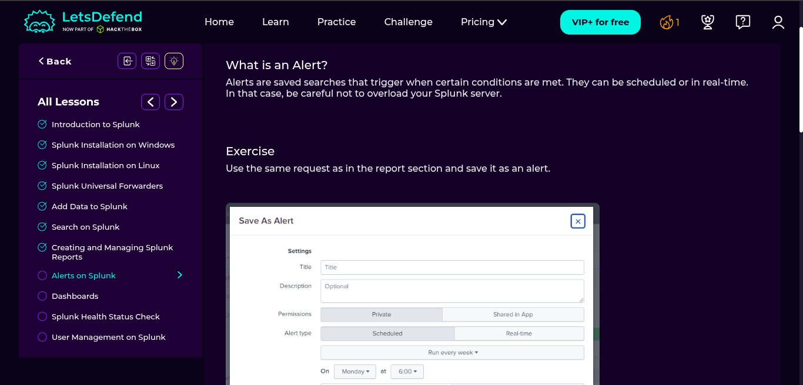

# Day 11 — Splunk Fundamentals (LetsDefend)

## 📅 Date
April 7, 2026

## 🎯 Platform
- LetsDefend.io (Free Tier)
- Course: Introduction to Splunk

## 🏆 Badge Earned
- **Splunk Engineer** — LetsDefend



---

## 📚 Topics Covered

| # | Lesson | Status |
|---|--------|--------|
| 1 | Introduction to Splunk | ✅ Completed |
| 2 | Splunk Installation on Windows | ✅ Completed |
| 3 | Splunk Installation on Linux | ✅ Completed |
| 4 | Splunk Universal Forwarders | ✅ Completed |
| 5 | Add Data to Splunk | ✅ Completed |
| 6 | Search on Splunk | ✅ Completed |
| 7 | Creating and Managing Splunk Reports | ✅ Completed |
| 8 | Alerts on Splunk | ✅ Completed |
| 9 | Dashboards | ✅ Completed |
| 10 | Splunk Health Status Check | ✅ Completed |
| 11 | User Management on Splunk | ✅ Completed |

---

## 🔍 What is Splunk?



Splunk is a data platform that powers enterprise observability, unified security,
and custom applications in hybrid environments. It is one of the most widely used
SIEM solutions in the cybersecurity industry.

### Key Components
- **Indexer** — Stores and indexes ingested log data
- **Search Head** — Interface for running SPL queries and investigations
- **Universal Forwarder** — Lightweight agent that collects and forwards logs to the indexer
- **SPL** — Splunk Processing Language, used to search and analyze data

---

## 🔎 Search on Splunk



Splunk's Search & Reporting interface allows analysts to query indexed data using SPL.

### Key SPL Concepts Learned

```spl
-- Search all events in an index
index="winlog_clients"

-- Filter by EventCode and username
source="WinEventLog:*" index="winlog_clients" EventCode=4625 AND Nom_du_compte=AdminT

-- View events in a time range
index="winlog_clients" earliest=-24h
```

### Key Fields Observed
- `host` — The machine that generated the log
- `source` — Log source (e.g. WinEventLog:Security)
- `sourcetype` — Type of log
- `EventCode` — Windows Event ID
- `ComputerName` — Name of the machine

---

## 📊 SPL Query in Action



---

## 🔔 Alerts on Splunk



- Alerts are saved searches that **automatically trigger** when conditions are met
- Can be scheduled or run in real-time
- Alert types: **Scheduled** or **Real-time**
- Care must be taken not to overload the Splunk server with too many real-time alerts

---

## 📈 Dashboards

- Dashboards visualize SPL query results
- Useful for SOC monitoring and presenting data to management
- Can include charts, tables, and single value panels

---

## 👥 User Management

- Splunk supports role-based access control (RBAC)
- Roles include: Admin, Power, User
- User permissions control what data and features each analyst can access

---

## 🔄 Wazuh vs Splunk

| Feature | Wazuh | Splunk |
|---------|-------|--------|
| Cost | Free & Open Source | Free tier limited |
| Log Ingestion | Agent-based | Agent + Forwarder |
| Search Language | Lucene-based | SPL |
| Alerting | Built-in rules | Saved searches |
| Dashboards | Kibana | Splunk Web |
| Best For | Small labs, open source | Enterprise SOC |

---

## 🏷️ MITRE ATT&CK Mapping

| Technique | ID | Relevance |
|-----------|-----|-----------|
| Valid Accounts | T1078 | Detected via EventCode 4625 failed logins |
| Brute Force | T1110 | Multiple failed login alerts |

---

## 💡 Key Takeaways

1. Splunk is one of the most in-demand SIEM tools in enterprise SOC environments
2. SPL is powerful for filtering, correlating, and visualizing log data
3. Universal Forwarders make it easy to collect logs from multiple sources
4. Alerts and dashboards automate detection and improve analyst efficiency
5. Role-based access control is critical in a real SOC environment

---

## 🔗 Resources
- [LetsDefend Splunk Course](https://app.letsdefend.io)
- [Splunk SPL Documentation](https://docs.splunk.com/Documentation/Splunk/latest/SearchReference)
- [MITRE ATT&CK](https://attack.mitre.org)
