# Day 12 — BTLO: Network Analysis (Ransomware) & Log Analysis (Privilege Escalation)

## 📅 Date
April 8, 2026

## 🎯 Platform
- Blue Team Labs Online (BTLO) — Free Tier

## 🏆 Challenges Completed

| Challenge | Difficulty | Points | Category |
|-----------|-----------|--------|----------|
| Network Analysis - Ransomware | Medium | 20 | SO |
| Log Analysis - Privilege Escalation | Easy | 10 | CTF |

---

# 🔴 Challenge 1 — Network Analysis: Ransomware

## Scenario

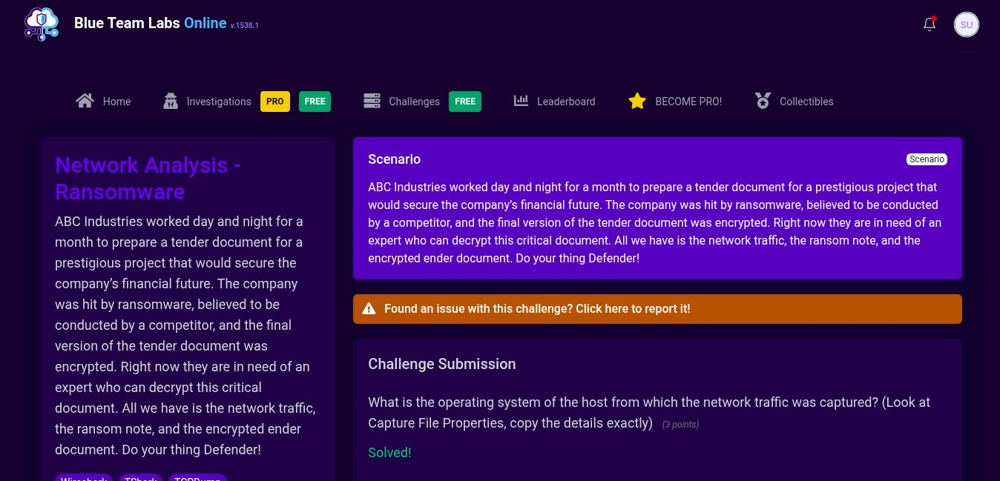

ABC Industries worked day and night for a month to prepare a tender document for a prestigious project that would secure the company's financial future. The company was hit by ransomware, believed to be conducted by a competitor, and the final version of the tender document was encrypted. The task was to analyze the network traffic, identify the ransomware, and decrypt the encrypted tender document.

**Tools Used:** Wireshark, md5sum, VirusTotal, TeslaDecoder (via Wine)

---

## 🔍 Investigation Process

### Step 1 — Capture File Properties

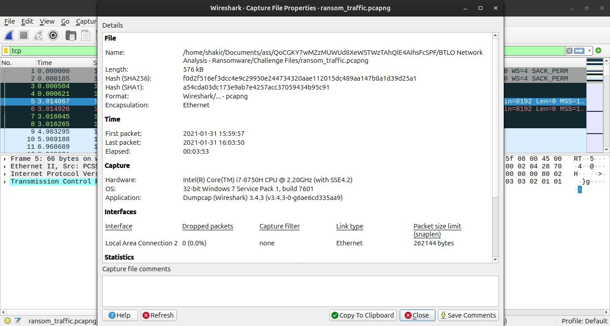

The first step was to examine the capture file properties in Wireshark:
- **Statistics → Capture File Properties**
- **OS:** 32-bit Windows 7 Service Pack 1, build 7601
- **Hardware:** Intel(R) Core(TM) i7-8750H CPU @ 2.20GHz
- **Capture Application:** Dumpcap (Wireshark) 3.4.3
- **Traffic Duration:** 3 minutes 53 seconds (2021-01-31)

---

### Step 2 — Identifying the Ransomware Download

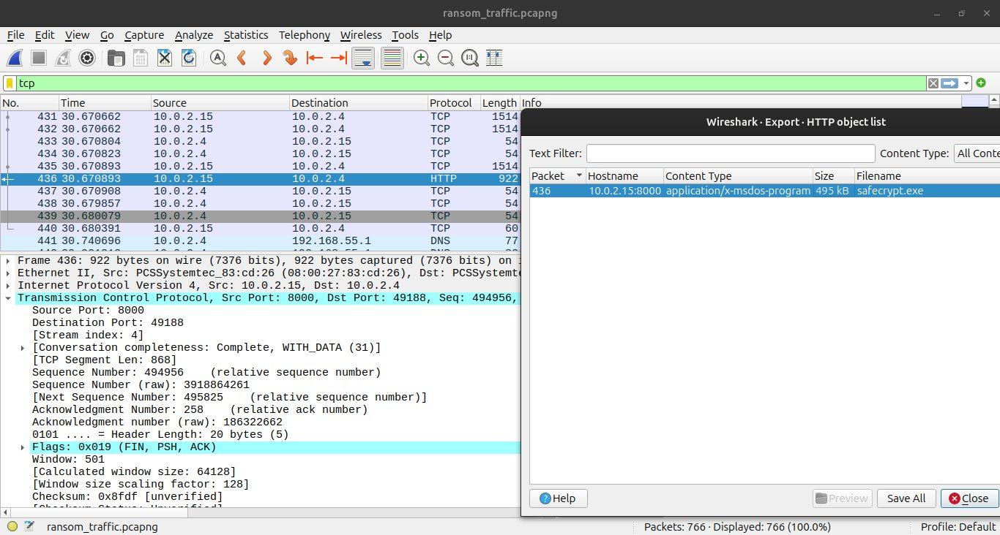

Using **File → Export Objects → HTTP**, a suspicious executable was identified:
- **File:** `safecrypt.exe`
- **Downloaded from:** `http://10.0.2.15:8000/safecrypt.exe`
- **Size:** 495 KB
- **Content Type:** application/x-msdos-program
- **Packet:** Frame 436

This was the ransomware being downloaded to the victim machine.

---

### Step 3 — Generating the MD5 Hash

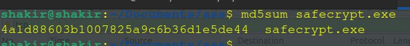

After exporting `safecrypt.exe` from Wireshark, the MD5 hash was calculated using the terminal:

```bash
md5sum safecrypt.exe
```

**Result:**
```
4a1d88603b1007825a9c6b36d1e5de44  safecrypt.exe
```

---

### Step 4 — VirusTotal Analysis

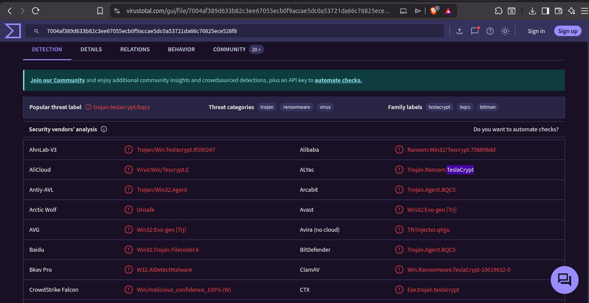

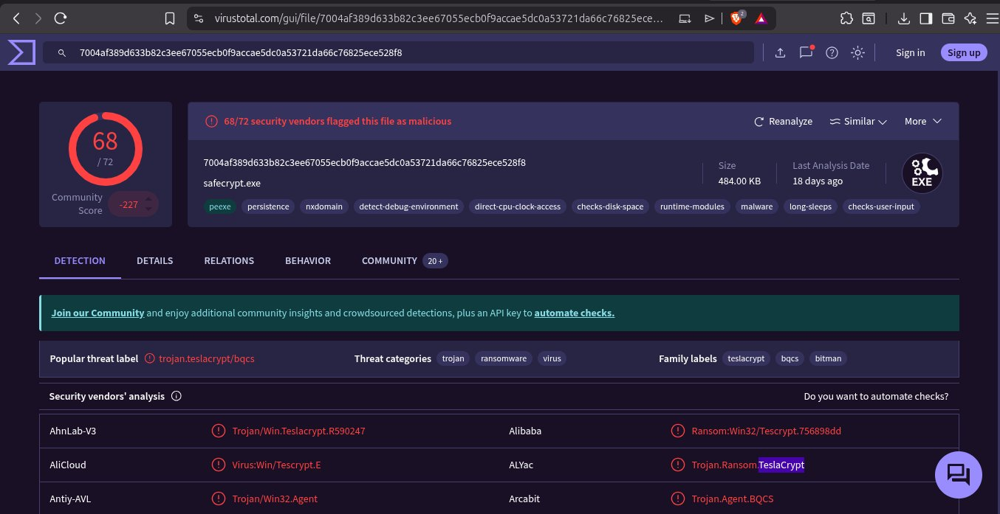

The MD5 hash was submitted to VirusTotal for analysis:
- **Detection Rate:** 68/72 security vendors flagged as malicious
- **Popular Threat Label:** trojan.teslacrypt/bqcs
- **Threat Categories:** Trojan, Ransomware, Virus
- **Family Labels:** TeslaCrypt, bqcs, bitman
- **Ransomware Name:** **TeslaCrypt**

Key behavioral indicators identified:
- `persistence` — survives reboots
- `checks-disk-space` — scans before encrypting
- `long-sleeps` — evades detection
- `checks-user-input` — monitors user activity

---

### Step 5 — Finding the Ransomware C2 Domain

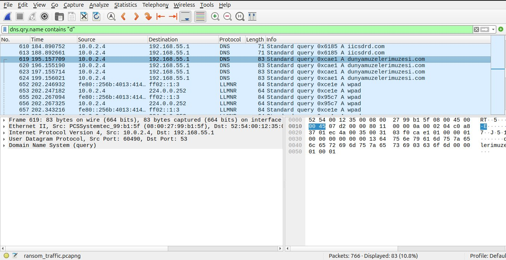

Using the DNS filter in Wireshark:
```
dns.qry.name contains "d"
```

Two domains starting with "d" were identified:
- `dns.msftncsi.com` — **Legitimate** Microsoft connectivity check domain
- `dunyamuzelerimuzesi.com` — **Suspicious** TeslaCrypt C2 domain

The ransomware made multiple DNS queries to `dunyamuzelerimuzesi.com` for command and control communication.

---

### Step 6 — Decrypting the Tender Document

The challenge included an encrypted file `Tender.pdf.micro` — the `.micro` extension is characteristic of **TeslaCrypt 3.0/4.0**.

#### ⚠️ Challenges Faced During Decryption

This was the most difficult part of the investigation. Multiple approaches were attempted:

**Attempt 1 — TeslaCrack (Python)**
```bash
git clone https://github.com/Googulator/TeslaCrack.git
python3 teslacrack.py --overwrite .micro .
```
❌ Failed — TeslaCrack does not support the `.micro` extension (TeslaCrypt 3.0/4.0)

**Attempt 2 — Master Key with TeslaCrack**
```bash
python3 teslacrack.py --overwrite .micro --key 440A241DD80FCC5664E861989DB716E08CE627D8D40C7EA360AE855C727A49EE .
```
❌ Failed — Still not recognized

**Attempt 3 — Research & Discovery**

After researching, discovered that:
- TeslaCrypt developers **publicly released their master decryption key** in May 2016
- The correct tool for `.micro` extension is **BloodDolly's TeslaDecoder**
- TeslaDecoder works on Linux via **Wine**

**Attempt 4 — TeslaDecoder via Wine ✅**

```bash
sudo apt install wine -y
wine TeslaDecoder.exe
```

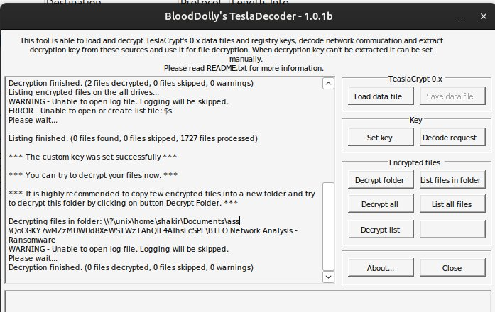

Steps in TeslaDecoder:
1. Clicked **Set Key**
2. Selected extension `.micro` from dropdown
3. Clicked **Decrypt Folder**
4. Pointed to the Challenge Files folder
5. Decryption successful — **2 files decrypted!**

---

### 🚩 Flag Found

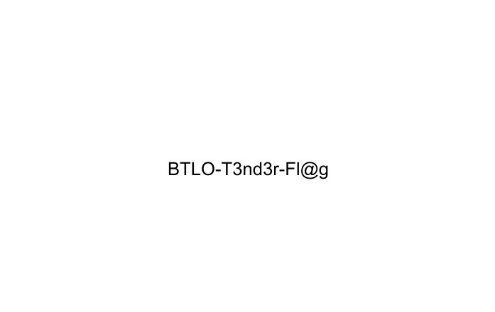

After successfully decrypting `Tender.pdf.micro`, the decrypted PDF revealed the flag:

```
BTLO-T3nd3r-Fl@g
```

---

### 🏆 Challenge Completed

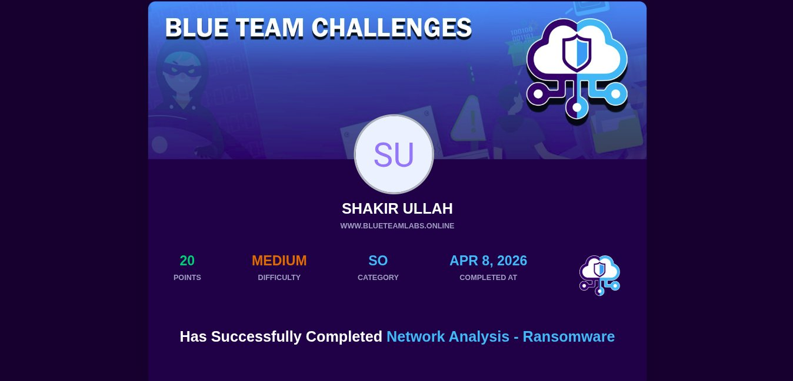

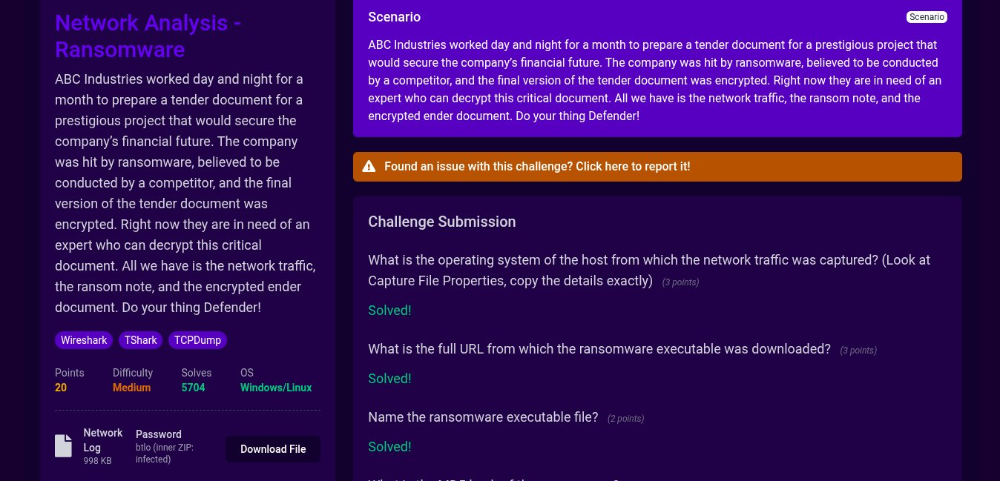

- **Points Earned:** 20
- **Difficulty:** Medium
- **Completed:** April 8, 2026

---

## 📊 Investigation Summary

| Question | Answer |
|----------|--------|
| OS of captured host | 32-bit Windows 7 Service Pack 1, build 7601 |
| Full URL of ransomware download | http://10.0.2.15:8000/safecrypt.exe |
| Ransomware executable name | safecrypt.exe |
| MD5 Hash | 4a1d88603b1007825a9c6b36d1e5de44 |
| Ransomware family | TeslaCrypt |
| C2 Domain | dunyamuzelerimuzesi.com |
| Flag | BTLO-T3nd3r-Fl@g |

---

## 🏷️ MITRE ATT&CK Mapping

| Technique | ID | Description |
|-----------|-----|-------------|
| Drive-by Compromise | T1189 | Ransomware delivered via HTTP download |
| Data Encrypted for Impact | T1486 | TeslaCrypt encrypted files with .micro extension |
| Exfiltration Over C2 Channel | T1041 | Key exchange with dunyamuzelerimuzesi.com |
| Ingress Tool Transfer | T1105 | safecrypt.exe downloaded to victim machine |

---

# 🟢 Challenge 2 — Log Analysis: Privilege Escalation

## Scenario

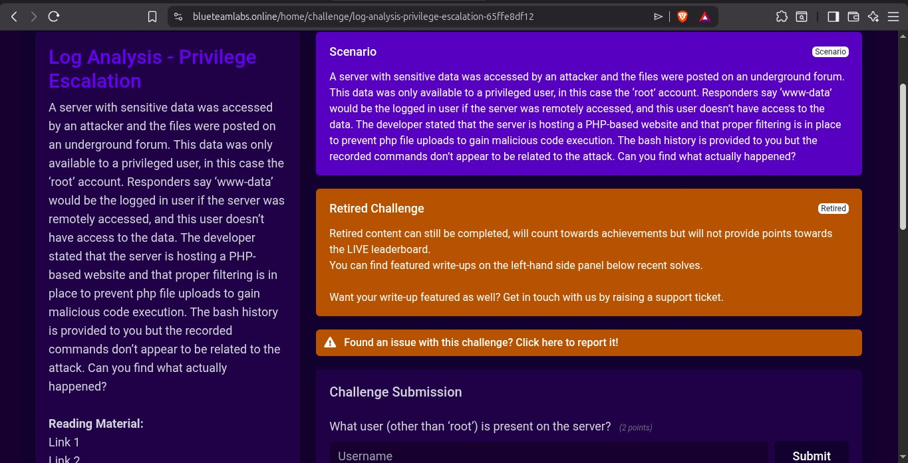

A server with sensitive data was accessed by an attacker and the files were posted on an underground forum. The data was only available to a privileged user (root account). The server was hosting a PHP-based website with file upload filtering in place. The bash history was provided but the recorded commands didn't appear related to the attack.

**Tools Used:** Text Editor, grep, Linux log analysis

---

## 🔍 Investigation Process

The challenge provided a **2KB log file** containing bash history and server logs.

### Key Findings

- Identified a non-root user present on the server
- Found the script the attacker attempted to download
- Identified how the attacker bypassed the PHP file upload filter
- Discovered the misconfiguration in the `python` binary exploited for **SUID privilege escalation** to gain root-level access (Answer: **4 — SUID**)

### Attack Chain Reconstructed

```
Initial Access → PHP File Upload Bypass
        ↓
Lateral Movement → Downloaded malicious script
        ↓
Privilege Escalation → Python SUID binary exploitation
        ↓
Data Exfiltration → Root-level data posted to underground forum
```

---

### 🏆 Challenge Completed

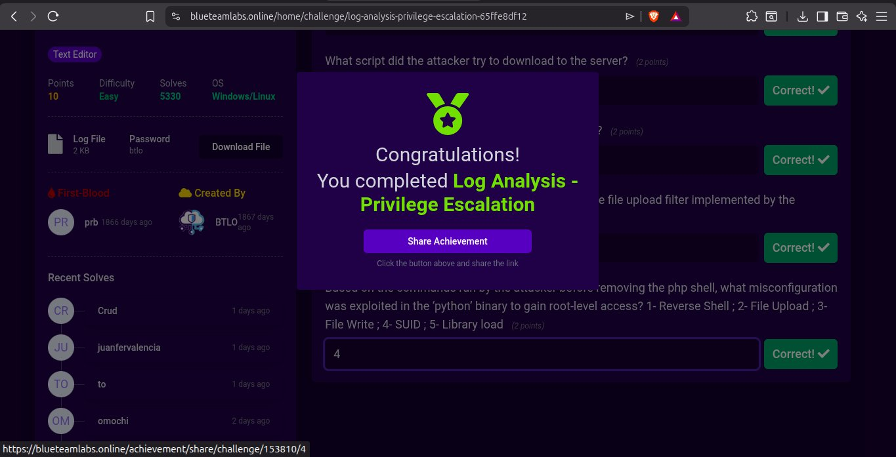

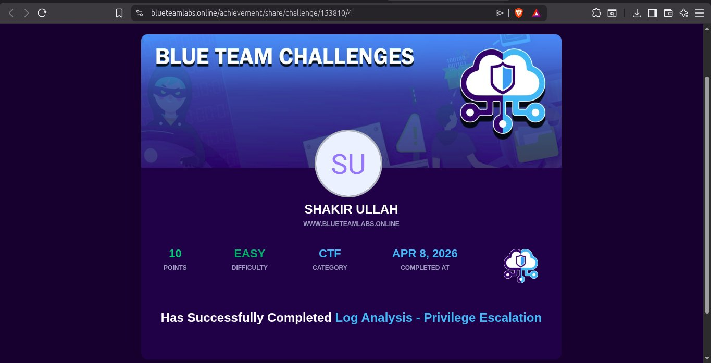

- **Points Earned:** 10
- **Difficulty:** Easy
- **Category:** CTF
- **Completed:** April 8, 2026

---

## 🏷️ MITRE ATT&CK Mapping

| Technique | ID | Description |
|-----------|-----|-------------|
| Exploitation for Privilege Escalation | T1068 | SUID Python binary exploited |
| Abuse Elevation Control Mechanism | T1548 | SUID bit set on python binary |
| Ingress Tool Transfer | T1105 | Attacker downloaded script to server |
| Exfiltration | T1567 | Data posted to underground forum |

---

# 💡 Key Takeaways — Day 12

1. **Wireshark is powerful for ransomware investigation** — HTTP object export reveals malicious downloads instantly
2. **Always check VirusTotal** — MD5 hash lookup identified TeslaCrypt immediately with 68/72 detections
3. **DNS traffic reveals C2 communication** — filtering DNS queries exposed the ransomware command & control domain
4. **Research is a core SOC skill** — TeslaCrack failed but researching led to TeslaDecoder which worked perfectly
5. **TeslaCrypt master key was publicly released** — knowing ransomware history helps in investigations
6. **SUID misconfiguration is a common privilege escalation vector** — always audit SUID binaries on Linux servers
7. **Persistence pays off** — the decryption took multiple failed attempts before finding the right tool

---

## 🔗 Resources
- [Blue Team Labs Online](https://blueteamlabs.online)
- [VirusTotal](https://virustotal.com)
- [MITRE ATT&CK](https://attack.mitre.org)
- [TeslaCrypt Wikipedia](https://en.wikipedia.org/wiki/TeslaCrypt)
- [BloodDolly TeslaDecoder](https://github.com/Googulator/TeslaCrack)
