# Day 13 — BTLO: Memory Analysis (Ransomware) & Phishing Analysis

## 📅 Date
April 9, 2026

## 🎯 Platform
- Blue Team Labs Online (BTLO) — Free Tier

## 🏆 Challenges Completed

| Challenge | Difficulty | Points | Category |
|-----------|-----------|--------|----------|
| Memory Analysis - Ransomware | Medium | 20 | DF |
| Phishing Analysis | Easy | 10 | SO |

---

# 🔴 Challenge 1 — Memory Analysis: Ransomware

## Scenario

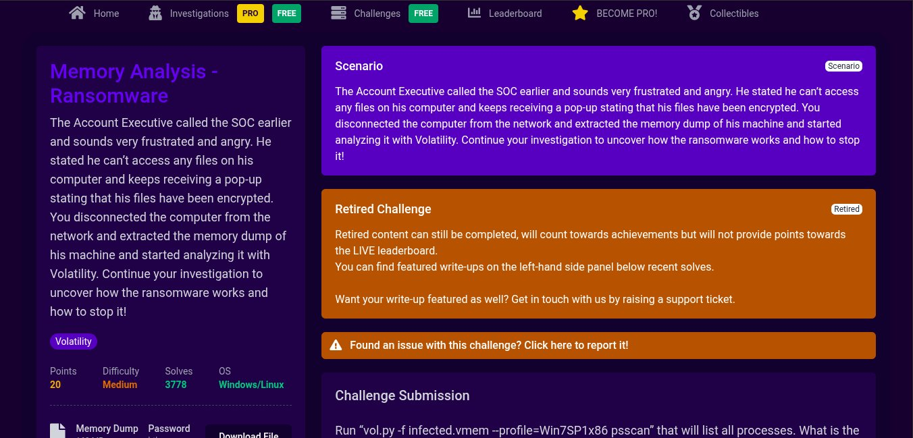

The Account Executive called the SOC and stated he could not access any files on his computer and kept receiving a pop-up stating his files were encrypted. The computer was disconnected from the network and a memory dump was extracted. The task was to analyze the memory dump using Volatility to uncover how the ransomware works.

**Tools Used:** Volatility 2.6.1, strings, grep

---

## 🔍 Investigation Process

### Step 1 — List All Running Processes

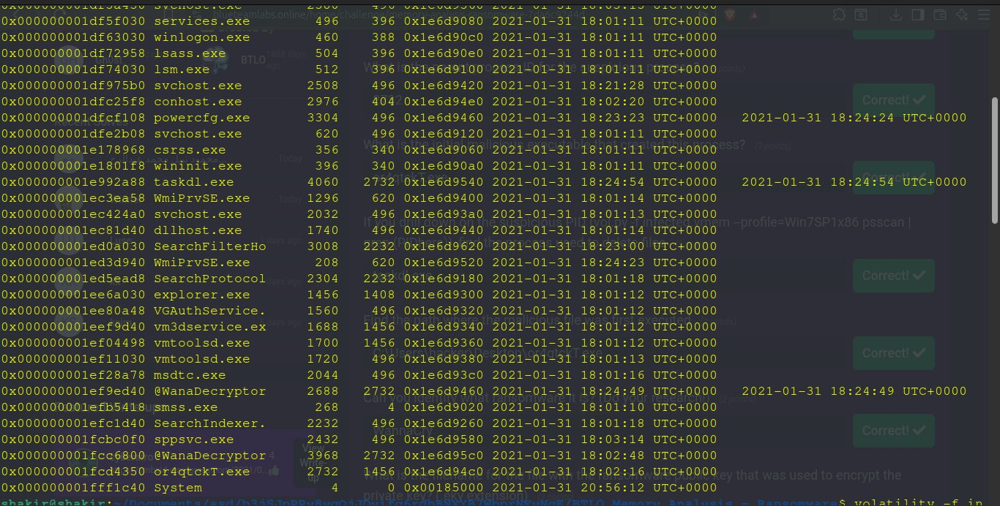

```bash
volatility -f infected.vmem --profile=Win7SP1x86 psscan
```

This listed all processes from the memory dump. The following suspicious processes were identified:

| Process | PID | PPID | Notes |
|---------|-----|------|-------|
| `@WanaDecryptor` | 2688 | 2732 | WannaCry ransomware UI |
| `@WanaDecryptor` | 3968 | 2732 | WannaCry ransomware UI |
| `or4qtckT.exe` | 2732 | 1456 | Initial malicious dropper |
| `taskdl.exe` | 4060 | 2732 | File deletion component |
| `taskhsvc.exe` | 2968 | 2924 | Task host service |

---

### Step 2 — Identifying the Suspicious Process

**Suspicious Process:** `@WanaDecryptor`

This is the WannaCry ransomware decryptor UI — it displays the ransom demand popup that the user sees.

**Parent Process ID:** `2732` (or4qtckT.exe)

**Initial Malicious Executable:** `or4qtckT.exe` (PID 2732)
- This is the dropper that launched the entire infection chain
- It was spawned by `explorer.exe` (PID 1456) — meaning the user executed it

---

### Step 3 — Process Used to Delete Files

**Answer:** `taskdl.exe`

**How I identified it:**
- Name contains `dl` = **delete**
- Parent process is `or4qtckT.exe` (PID 2732) — same malware family
- Created and exited in the **same second** — typical fast deletion behavior:
```
Time created: 2021-01-31 18:24:54
Time exited:  2021-01-31 18:24:54
```

**WannaCry Process Tree:**
```
or4qtckT.exe (2732)        ← initial malicious executable
    ├── @WanaDecryptor (2688)   ← ransomware UI
    ├── @WanaDecryptor (3968)   ← ransomware UI
    ├── taskdl.exe (4060)       ← deletes original files
    └── taskhsvc.exe (2968)     ← task host service
```

---

### Step 4 — Finding the Execution Path

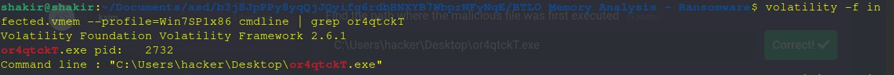

```bash
volatility -f infected.vmem --profile=Win7SP1x86 cmdline | grep or4qtckT
```

**Result:**
```
or4qtckT.exe pid: 2732
Command line: "C:\Users\hacker\Desktop\or4qtckT.exe"
```

**Execution Path:** `C:\Users\hacker\Desktop\or4qtckT.exe`

The malware was executed directly from the **Desktop** — meaning the user likely downloaded and double-clicked it.

---

### Step 5 — Identifying the Ransomware

**Ransomware:** `WannaCry` (also known as WanaCrypt0r 2.0)

Identified from:
- `@WanaDecryptor` process name
- `or4qtckT.exe` — known WannaCry dropper naming pattern
- `taskdl.exe` — known WannaCry file deletion component

**WannaCry Background:**
- One of the most devastating ransomware attacks in history
- Launched in May 2017
- Exploited EternalBlue (MS17-010) SMB vulnerability
- Infected over 200,000 systems in 150 countries
- Affected NHS, FedEx, and many other organizations

---

### Step 6 — Finding the .eky Public Key File

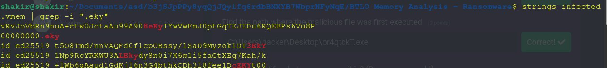

```bash
strings infected.vmem | grep -i ".eky"
```

**Result:**
```
00000000.eky
```

**Answer:** `00000000.eky`

This is WannaCry's public key file used to encrypt the victim's private key — making decryption impossible without the attacker's private key.

---

### 🏆 Challenge Completed

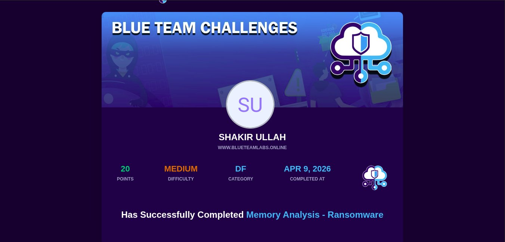

- **Points Earned:** 20
- **Difficulty:** Medium
- **Category:** DF (Digital Forensics)
- **Completed:** April 9, 2026

---

## 📊 Investigation Summary

| Question | Answer |
|----------|--------|
| Suspicious process | @WanaDecryptor |
| Parent PID | 2732 |
| Initial malicious executable | or4qtckT.exe |
| Process used to delete files | taskdl.exe |
| Execution path | C:\Users\hacker\Desktop\or4qtckT.exe |
| Ransomware name | WannaCry |
| Public key filename | 00000000.eky |

---

## 🏷️ MITRE ATT&CK Mapping

| Technique | ID | Description |
|-----------|-----|-------------|
| User Execution | T1204 | User executed or4qtckT.exe from Desktop |
| Data Encrypted for Impact | T1486 | WannaCry encrypted all files |
| Inhibit System Recovery | T1490 | taskdl.exe deleted original files |
| Process Injection | T1055 | WannaCry spawned multiple malicious processes |

---

# 🟢 Challenge 2 — Phishing Analysis

## Scenario


A user received a phishing email and forwarded it to the SOC. The task was to investigate the email and attachment to collect useful artifacts.

**Tools Used:** Text Editor, Mozilla Thunderbird, Whois DomainTools, URL2PNG

---

## 🔍 Investigation Process

### Step 1 — Opening the Email

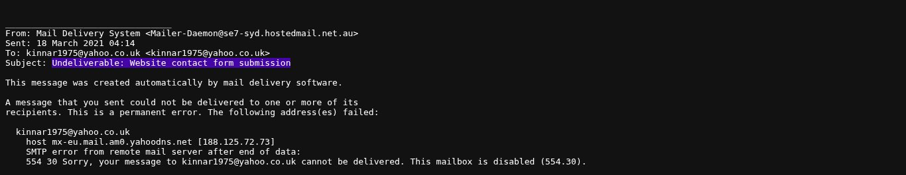

The email was opened in **Mozilla Thunderbird** to view the full email structure including headers and attachment.

**Key Email Details:**
- **From:** Mail Delivery System `<Mailer-Daemon@se7-syd.hostedmail.net.au>`
- **To:** `kinnar1975@yahoo.co.uk`
- **Subject:** `Undeliverable: Website contact form submission`
- **Date:** `18 March 2021 04:14`

---

### Step 2 — Email Analysis

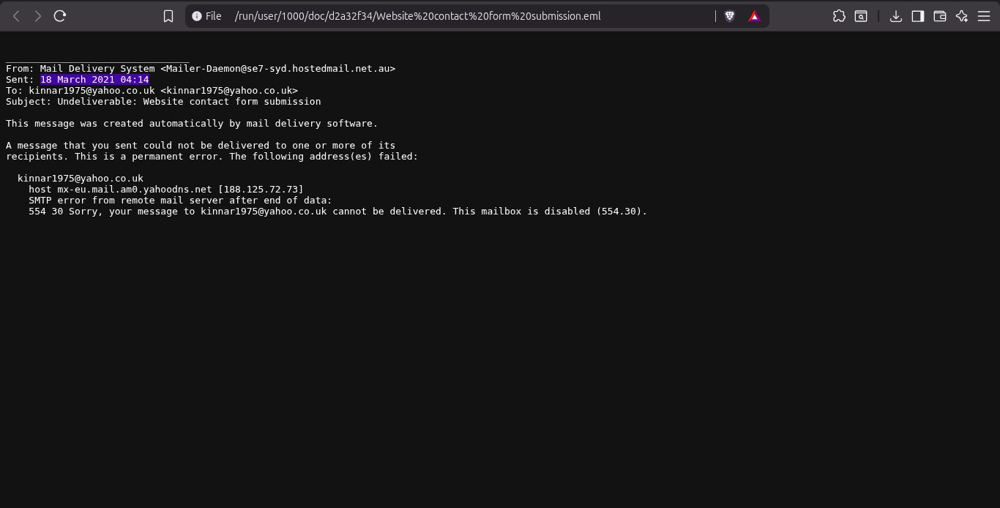

The outer email was a **Mail Delivery System bounce** — a common phishing technique to disguise malicious content as a legitimate undeliverable notification.

The attached `.eml` file contained the actual phishing content with:
- Fake contact form submission from "Robertbiolo"
- Malicious URL embedded in the body

---

### Step 3 — Finding the Originating IP

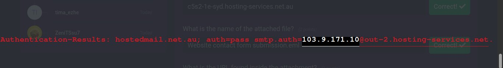

From the email authentication headers:
```
Authentication-Results: hostedmail.net.au; auth=pass smtp.auth=103.9.171.10@out-2.hosting-services.net.au
```

**Originating IP:** `103.9.171.10`

---

### Step 4 — Reverse DNS Lookup

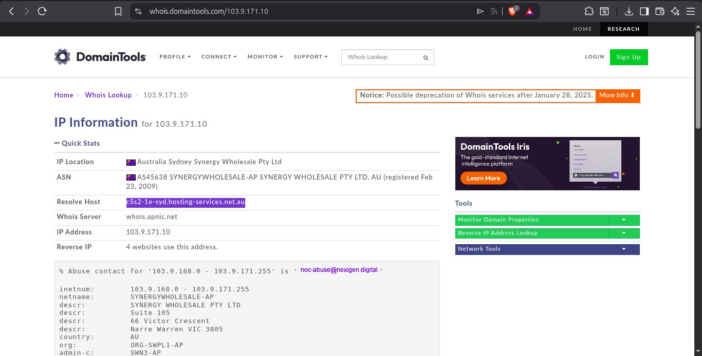

Using 👉 [whois.domaintools.com/103.9.171.10](https://whois.domaintools.com/103.9.171.10)

**Results:**
- **IP Location:** Australia, Sydney — Synergy Wholesale Pty Ltd
- **Resolved Host:** `c5s2-1e-syd.hosting-services.net.au`
- **ASN:** AS45638 SYNERGYWHOLESALE-AP

---

### Step 5 — Attachment Analysis

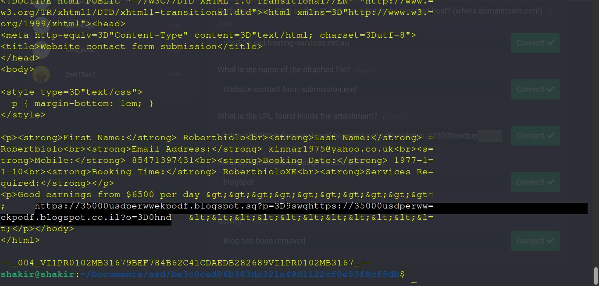

**Attachment Filename:** `Website contact form submission.eml`

Inside the attachment the following malicious URL was found:
```
https://35000usdperwwekpodf.blogspot.sg?p=9swg
https://35000usdperwwekpodf.blogspot.co.il?o=0hnd
```

**Hosted on:** `Blogspot` (Google's blogging platform — commonly abused for phishing)

---

### Step 6 — URL2PNG Analysis

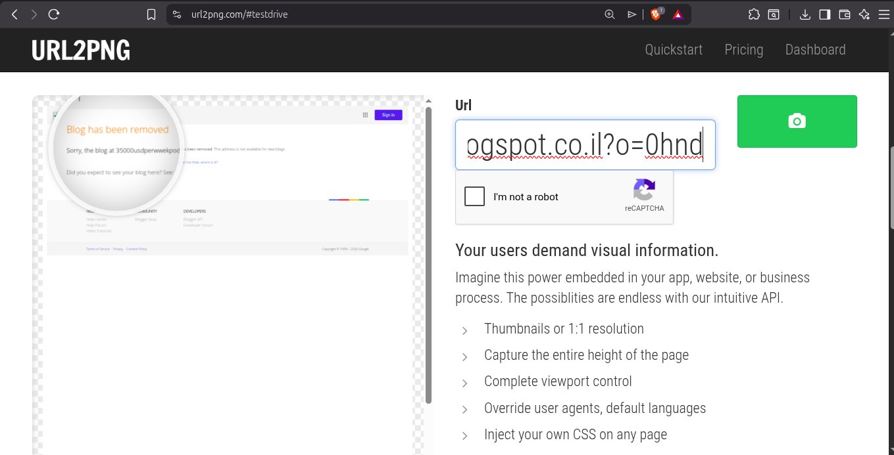

Using 👉 [url2png.com](https://url2png.com) to capture a screenshot of the malicious page:

**Heading Text:** `Blog has been removed`

The blog was taken down by Google, but URL2PNG confirmed it existed and showed the page content at time of capture.

---

### 🏆 Challenge Completed

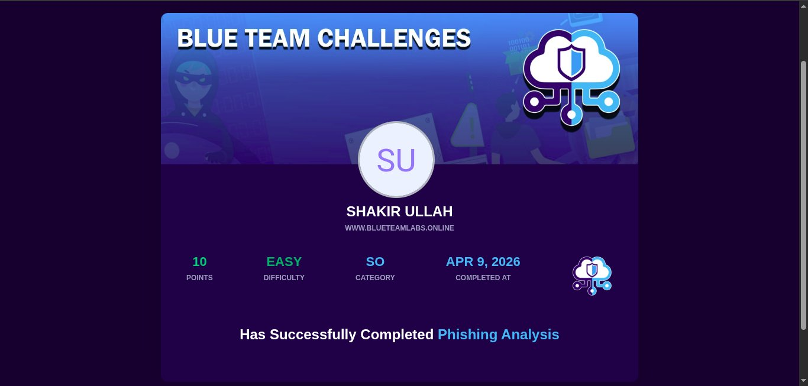

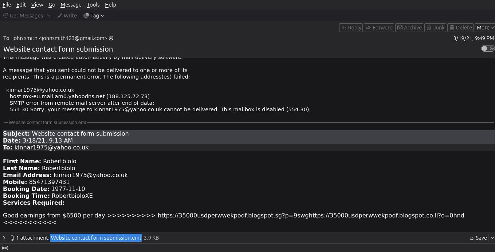

- **Points Earned:** 10
- **Difficulty:** Easy
- **Category:** SO (Security Operations)
- **Completed:** April 9, 2026

---

## 📊 Investigation Summary

| Question | Answer |
|----------|--------|
| Primary recipient | kinnar1975@yahoo.co.uk |
| Subject | Undeliverable: Website contact form submission |
| Date and time sent | 18 March 2021 04:14 |
| Originating IP | 103.9.171.10 |
| Resolved host | c5s2-1e-syd.hosting-services.net.au |
| Attached filename | Website contact form submission.eml |
| URL in attachment | https://35000usdperwwekpodf.blogspot.sg?p=9swg |
| Hosting service | Blogspot |
| Heading text (URL2PNG) | Blog has been removed |

---

## 🏷️ MITRE ATT&CK Mapping

| Technique | ID | Description |
|-----------|-----|-------------|
| Phishing | T1566 | Email with malicious attachment |
| Spearphishing Attachment | T1566.001 | .eml attachment containing malicious URL |
| Web Service | T1102 | Blogspot used as C2/phishing hosting |
| Masquerading | T1036 | Email disguised as undeliverable bounce |

---

# 💡 Key Takeaways — Day 13

1. **Volatility is essential for memory forensics** — psscan reveals all running processes including hidden malware
2. **Process trees reveal attack chains** — following parent/child relationships exposes the full infection
3. **WannaCry is well documented** — knowing ransomware families speeds up investigation dramatically
4. **Phishing emails often disguise as legitimate bounces** — always check the attached .eml files
5. **Email headers reveal originating IP** — Authentication-Results header is key for attribution
6. **Blogspot and other free hosting platforms are abused** — treat all free hosting links with suspicion
7. **URL2PNG is great for SOC work** — captures pages even after they are taken down

---

## 🔗 Resources
- [Blue Team Labs Online](https://blueteamlabs.online)
- [Volatility Framework](https://volatilityfoundation.org)
- [Whois DomainTools](https://whois.domaintools.com)
- [URL2PNG](https://url2png.com)
- [MITRE ATT&CK](https://attack.mitre.org)
- [WannaCry Wikipedia](https://en.wikipedia.org/wiki/WannaCry_ransomware_attack)
