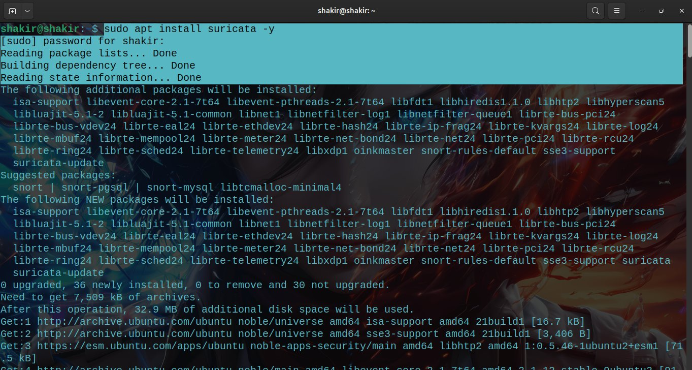
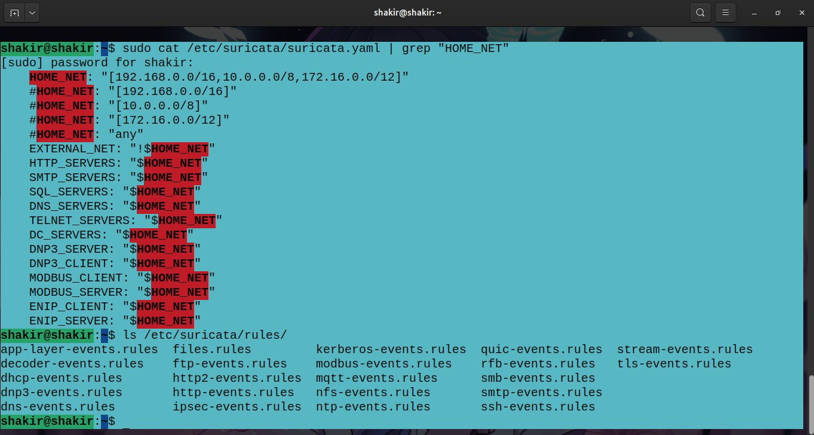
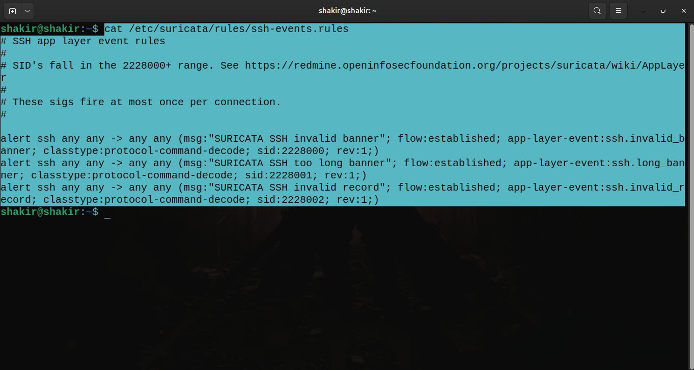
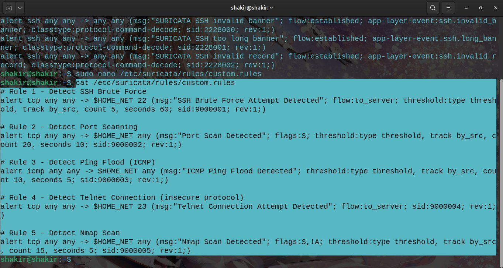
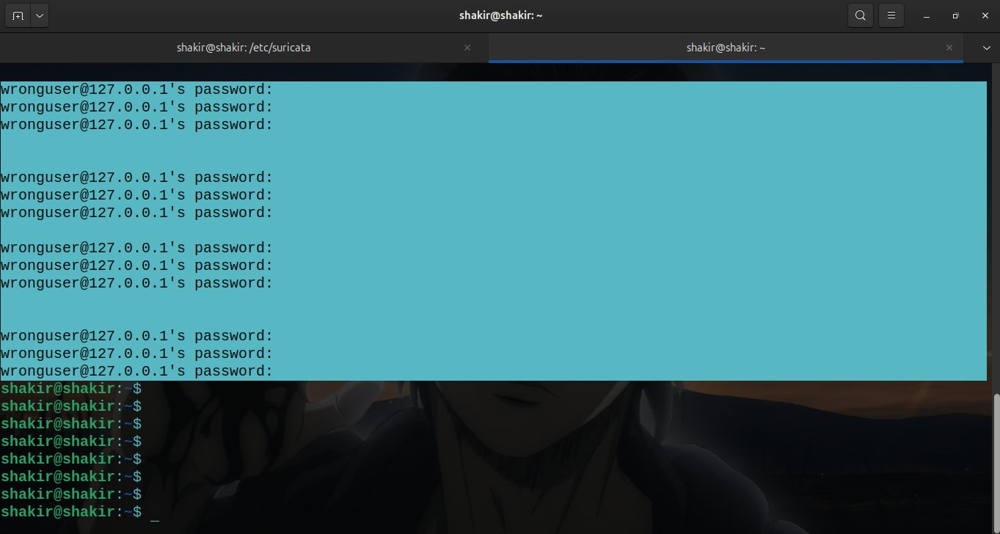
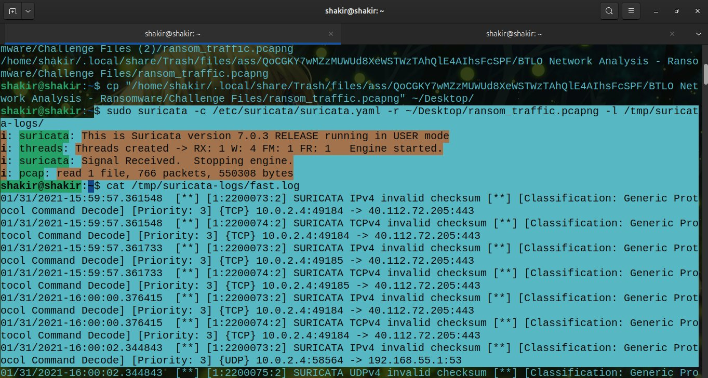
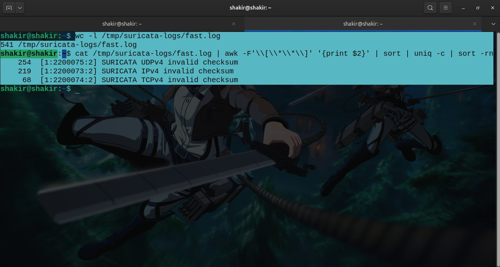

# Day 14 — Suricata IDS Setup & Custom Rule Writing

## 📅 Date
April 11, 2026

## 🎯 Platform
- Ubuntu 24 (Local Machine)
- Suricata 7.0.3
- Wazuh 4.14.4

## 🛠️ Tools Used
- Suricata IDS
- Wazuh SIEM
- Terminal (grep, awk, cat)

---

## 📚 What is Suricata?

Suricata is a free, open-source **Intrusion Detection System (IDS)** and **Intrusion Prevention System (IPS)**. It monitors network traffic in real time and generates alerts when suspicious activity is detected based on rules.

### Suricata vs Snort
| Feature | Suricata | Snort |
|---------|----------|-------|
| Multi-threading | ✅ Yes | ❌ No |
| Performance | High | Medium |
| Protocol detection | Automatic | Manual |
| File extraction | ✅ Yes | ❌ No |
| Cost | Free | Free |

---

## ✅ Step 1 — Installation



```bash
sudo apt install suricata -y
```

Suricata 7.0.3 was successfully installed along with:
- `suricata-update` — rule update tool
- `libhyperscan5` — fast pattern matching library
- `oinkmaster` — rule management tool

---

## ✅ Step 2 — Configuration



### Network Variables
```bash
sudo cat /etc/suricata/suricata.yaml | grep "HOME_NET"
```

**HOME_NET** defines the networks Suricata protects:
```yaml
HOME_NET: "[192.168.0.0/16,10.0.0.0/8,172.16.0.0/12]"
EXTERNAL_NET: "!$HOME_NET"
```

### Built-in Rules Directory
```bash
ls /etc/suricata/rules/
```

Pre-installed rule files include:
- `ssh-events.rules` — SSH anomaly detection
- `http-events.rules` — HTTP anomaly detection
- `dns-events.rules` — DNS anomaly detection
- `tls-events.rules` — TLS/SSL anomaly detection
- `smtp-events.rules` — Email anomaly detection

---

## ✅ Step 3 — Understanding Built-in SSH Rules



```bash
cat /etc/suricata/rules/ssh-events.rules
```

### Rule Structure Breakdown

```
ACTION  PROTOCOL  SRC_IP  SRC_PORT  ->  DST_IP  DST_PORT  (OPTIONS)
alert   ssh       any     any       ->  any     any       (msg:"..."; sid:2228000; rev:1;)
```

| Rule | SID | Detects |
|------|-----|---------|
| SSH invalid banner | 2228000 | Malformed SSH banner — possible scanner |
| SSH too long banner | 2228001 | Oversized banner — possible buffer overflow |
| SSH invalid record | 2228002 | Malformed SSH packet — possible exploit |

---

## ✅ Step 4 — Writing Custom Rules



```bash
sudo nano /var/lib/suricata/rules/custom.rules
```

### 5 Custom Rules Written

```bash
# Rule 1 - Detect SSH Brute Force
alert tcp any any -> $HOME_NET 22 (msg:"SSH Brute Force Attempt Detected"; \
flow:to_server; threshold:type threshold, track by_src, \
count 5, seconds 60; sid:9000001; rev:1;)

# Rule 2 - Detect Port Scanning
alert tcp any any -> $HOME_NET any (msg:"Port Scan Detected"; \
flags:S; threshold:type threshold, track by_src, \
count 20, seconds 10; sid:9000002; rev:1;)

# Rule 3 - Detect Ping Flood (ICMP)
alert icmp any any -> $HOME_NET any (msg:"ICMP Ping Flood Detected"; \
threshold:type threshold, track by_src, \
count 10, seconds 5; sid:9000003; rev:1;)

# Rule 4 - Detect Telnet Connection (insecure protocol)
alert tcp any any -> $HOME_NET 23 (msg:"Telnet Connection Attempt Detected"; \
flow:to_server; sid:9000004; rev:1;)

# Rule 5 - Detect Nmap Scan
alert tcp any any -> $HOME_NET any (msg:"Nmap Scan Detected"; \
flags:S; threshold:type threshold, track by_src, \
count 15, seconds 5; sid:9000005; rev:1;)
```

---

## ✅ Step 5 — Testing SSH Brute Force Rule



Simulated SSH brute force by running multiple failed login attempts:
```bash
for i in {1..10}; do ssh wronguser@127.0.0.1 2>/dev/null; done
```

This triggered repeated `wronguser@127.0.0.1's password:` prompts — simulating a real brute force attack pattern.

---

## ✅ Step 6 — Running Suricata Against Ransomware PCAP



Instead of live traffic, Suricata was run against the **TeslaCrypt ransomware pcap** from Day 12:

```bash
sudo suricata -c /etc/suricata/suricata.yaml \
-r ~/Desktop/ransom_traffic.pcapng \
-l /tmp/suricata-logs/
```

**Results:**
- **766 packets** processed
- **550,308 bytes** analyzed
- **541 alerts** generated

---

## ✅ Step 7 — Analyzing Alerts



```bash
wc -l /tmp/suricata-logs/fast.log
cat /tmp/suricata-logs/fast.log | awk -F'\[**\]' '{print $2}' | sort | uniq -c | sort -rn
```

### Alert Breakdown

| Alert Type | Count | Protocol |
|-----------|-------|----------|
| UDPv4 invalid checksum | 254 | UDP |
| IPv4 invalid checksum | 219 | IP |
| TCPv4 invalid checksum | 68 | TCP |
| **Total** | **541** | **All** |

### Why Checksum Errors?
All alerts were **checksum validation errors** — a common false positive when analyzing pcap files captured inside VirtualBox. VirtualBox offloads checksum calculation to hardware, so packets are captured before checksums are computed.

### False Positive Tuning
In a real SOC environment these would be suppressed:
```yaml
# In suricata.yaml
checksum-validation: no
```

---

## ✅ Step 8 — Wazuh + Suricata Integration

Suricata's `eve.json` output was integrated into Wazuh for centralized alerting:

```bash
sudo nano /var/ossec/etc/ossec.conf
```

Added:
```xml
<localfile>
  <log_format>json</log_format>
  <location>/var/log/suricata/eve.json</location>
</localfile>
```

**Verification:**
```bash
sudo wc -l /var/log/suricata/eve.json
# Result: 3553 events collected
```

Wazuh is now reading **3553 Suricata events** from eve.json! ✅

---

## 🔍 Key Concepts Learned

### Detection Types
| Type | Description |
|------|-------------|
| True Positive | Real threat detected ✅ |
| False Positive | Alert but no real threat ⚠️ |
| True Negative | No threat, no alert ✅ |
| False Negative | Real threat missed ❌ |

### Suricata Rule Keywords
| Keyword | Purpose |
|---------|---------|
| `alert` | Generate an alert |
| `flow:to_server` | Match traffic going to server |
| `threshold` | Rate limiting for alerts |
| `track by_src` | Track by source IP |
| `flags:S` | Match SYN packets |
| `sid` | Unique rule identifier |
| `rev` | Rule revision number |

---

## 🏷️ MITRE ATT&CK Mapping

| Technique | ID | Suricata Rule |
|-----------|-----|--------------|
| Brute Force | T1110 | Rule 1 — SSH Brute Force |
| Network Scanning | T1046 | Rule 2 & 5 — Port/Nmap Scan |
| Remote Services | T1021 | Rule 4 — Telnet Detection |
| Network Denial of Service | T1498 | Rule 3 — ICMP Flood |

---

## 💡 Key Takeaways

1. **Suricata is lightweight and powerful** — runs perfectly on Ubuntu without heavy resources
2. **Rules follow a clear structure** — ACTION PROTOCOL SRC -> DST (OPTIONS)
3. **Custom rules extend detection** — SOC analysts write rules for specific threats
4. **False positives are normal** — tuning rules is a core SOC skill
5. **Suricata + Wazuh = powerful combo** — IDS alerts feed directly into SIEM
6. **eve.json is the key log file** — structured JSON format for easy parsing
7. **Pcap replay is great for testing** — test rules against known attack traffic

---

## 🔗 Resources
- [Suricata Documentation](https://suricata.readthedocs.io)
- [Wazuh Suricata Integration](https://documentation.wazuh.com)
- [MITRE ATT&CK](https://attack.mitre.org)
- [Emerging Threats Rules](https://rules.emergingthreats.net)
