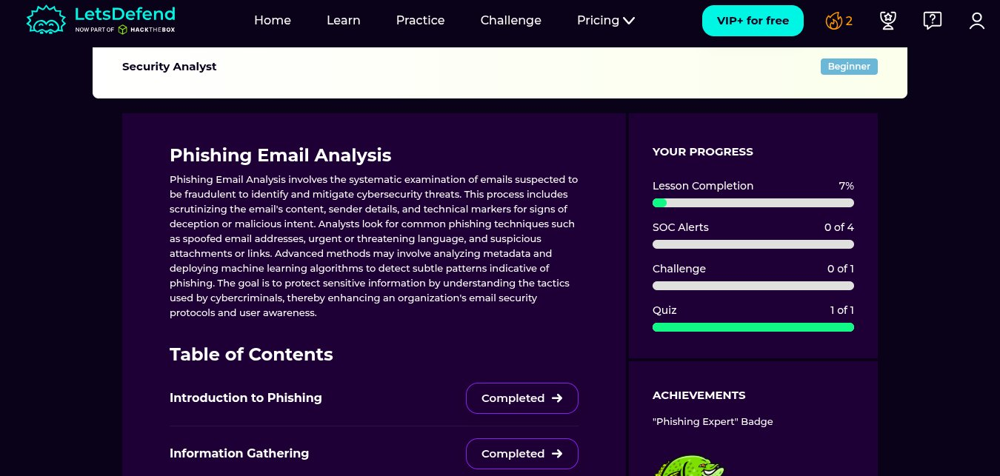
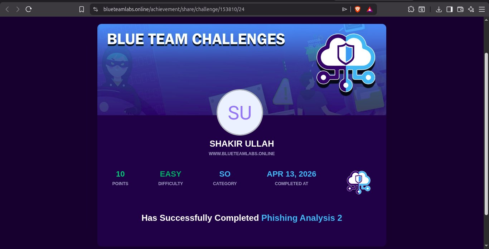
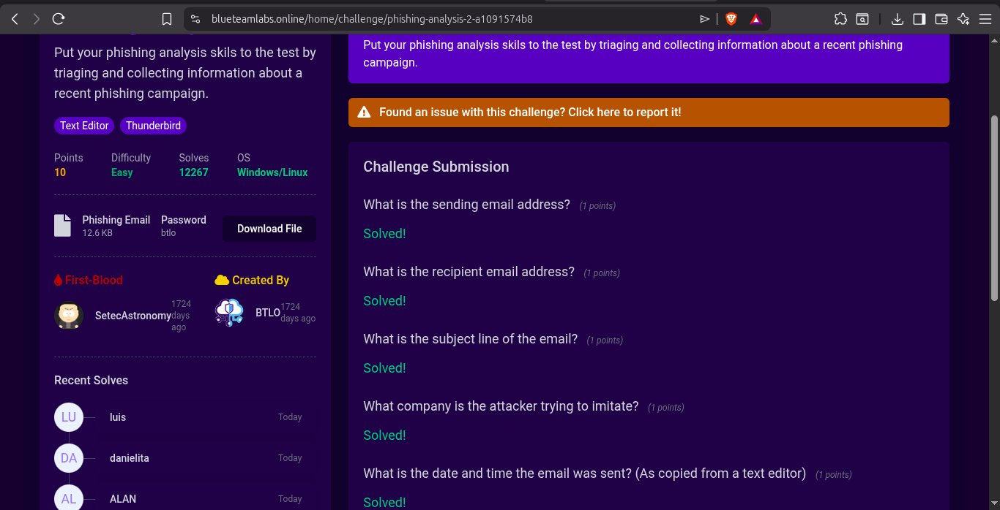
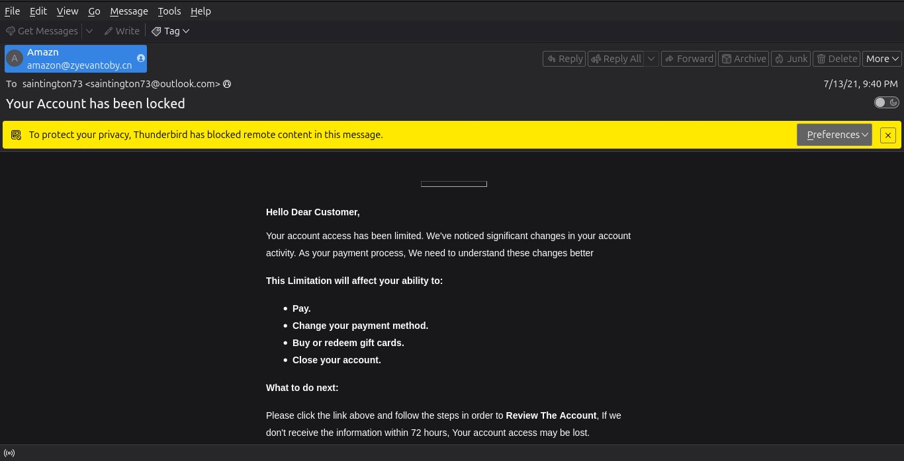
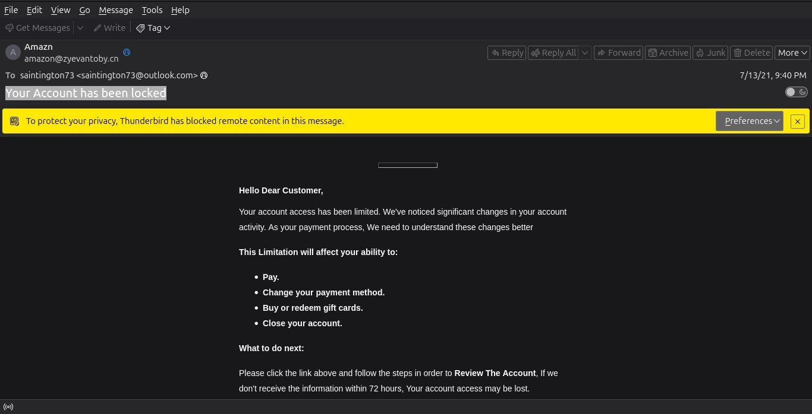
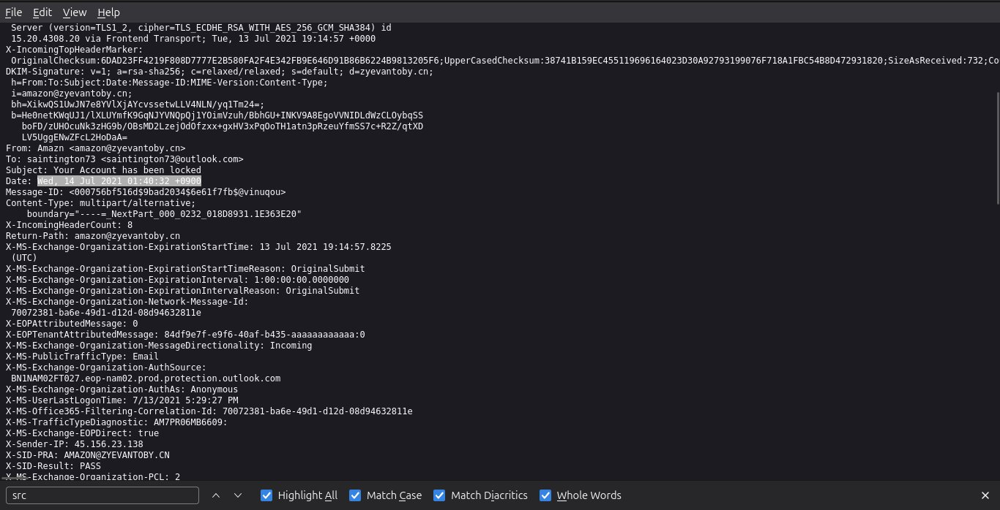
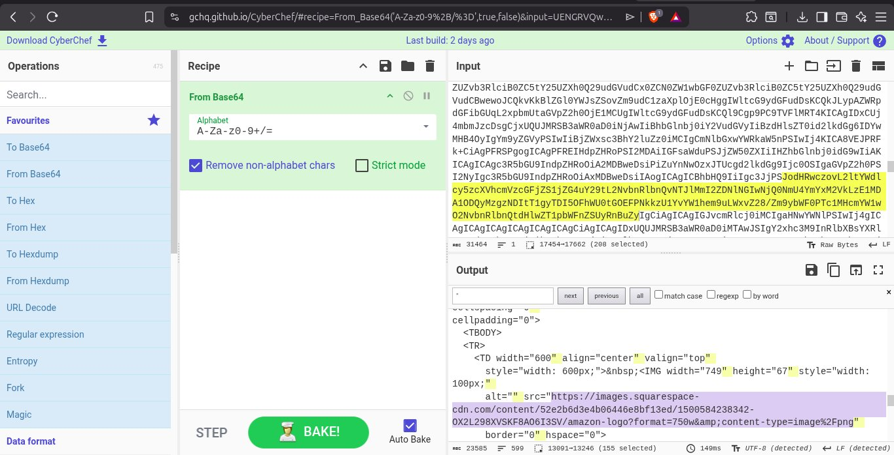
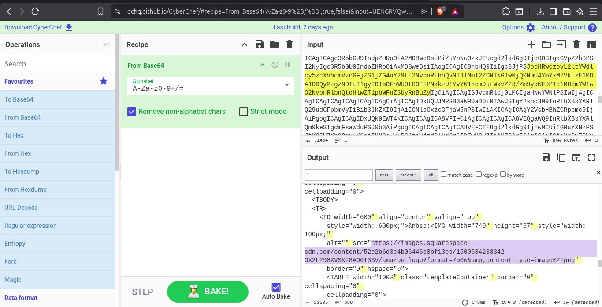
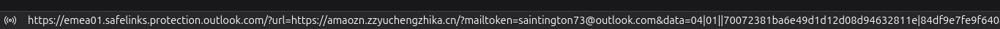
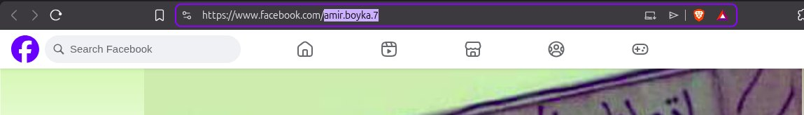

# Day 15 — Phishing Email Analysis & IOC Extraction

## 📅 Date
April 13, 2026

## 🎯 Platforms
- Blue Team Labs Online (BTLO) — Phishing Analysis 2 (Free)
- LetsDefend.io — Phishing Email Analysis Course (Free)

## 🏆 Achievements

| Achievement | Platform | Points |
|-------------|----------|--------|
| Phishing Analysis 2 | BTLO | 10pts |
| Phishing Expert Badge | LetsDefend | — |

## 🛠️ Tools Used
- Mozilla Thunderbird
- CyberChef (gchq.github.io/CyberChef)
- URL2PNG
- Text Editor
- Raw email header analysis

---

## 📚 Theory — What is Phishing? (LetsDefend)



Phishing Email Analysis involves the systematic examination of emails suspected to be fraudulent to identify and mitigate cybersecurity threats. Analysts scrutinize email content, sender details, and technical markers for signs of deception or malicious intent.

### Types of Phishing

| Type | Description |
|------|-------------|
| **Spear Phishing** | Targeted attack on specific individual or organization |
| **Whaling** | Targeted attack on high-level executives (CEO, CFO) |
| **Smishing** | Phishing via SMS text messages |
| **Vishing** | Phishing via voice calls |
| **Clone Phishing** | Duplicate of legitimate email with malicious links |

### Common Phishing Indicators
- Sender email domain doesn't match the company
- Urgent or threatening language
- Generic greetings like "Dear Customer"
- Suspicious links that don't match displayed text
- Unexpected attachments
- Poor grammar and spelling
- Requests for sensitive information

### IOCs in Phishing Emails
| IOC Type | Example |
|----------|---------|
| Sender IP | `45.156.23.138` |
| Malicious URL | `https://amaozn.zzyuchengzhika.cn` |
| Sending domain | `zyevantoby.cn` |
| Encoding | Base64 encoded HTML body |
| Logo URL | Squarespace CDN used to host fake logo |

---

## 🔴 BTLO Challenge — Phishing Analysis 2



### Scenario
A phishing email was forwarded to the SOC. The task was to triage the email, collect artifacts and identify the attacker's campaign.



---

## 🔍 Investigation Process

### Step 1 — Opening the Email in Thunderbird





The email was opened in **Mozilla Thunderbird**. Key observations:
- **From:** Amazn `<amazon@zyevantoby.cn>` — spoofed Amazon address
- **To:** `saintington73@outlook.com`
- **Subject:** `Your Account has been locked`
- **Date:** 7/13/21, 9:40 PM
- Thunderbird **blocked remote content** automatically 🛡️
- Generic greeting: "Hello Dear Customer"
- Creates urgency: "72 hours" deadline
- Pretending to be **Amazon** — brand impersonation

### 🚨 Immediate Red Flags
- Sender domain `zyevantoby.cn` — NOT amazon.com
- Display name "Amazn" — misspelled Amazon
- Generic greeting — not personalized
- Urgency + threat — classic phishing tactic
- Chinese domain (.cn) for an Amazon email

---

### Step 2 — Analyzing Email Headers



Raw email headers revealed:
- **Sender IP:** `45.156.23.138`
- **DKIM:** Signed by `zyevantoby.cn` — confirms fake domain
- **Date:** Wed, 14 Jul 2021 01:40:32 +0900
- **X-SID-Result:** PASS — passed basic spam filter
- **Return-Path:** `amazon@zyevantoby.cn`

---

### Step 3 — Decoding Base64 Content





The email body was encoded in **Base64** — a common technique attackers use to hide malicious content from email security scanners.

Using **CyberChef** (From Base64 recipe):
- Decoded the hidden HTML content
- Revealed the fake Amazon logo URL:
```
https://images.squarespace-cdn.com/content/52e2b6d3e4b06446e8bf13ed/1500584238342-0X2L298XVSKF8AO6I3SV/amazon-logo?format=750w
```
- Found embedded malicious links in the HTML

---

### Step 4 — Extracting the Malicious URL



The call-to-action button in the email pointed to:
```
https://emea01.safelinks.protection.outlook.com/?url=https://amaozn.zzyuchengzhika.cn/?mailtoken=saintington73@outlook.com
```

**Analysis:**
- Wrapped in Microsoft SafeLinks (to bypass detection)
- Real destination: `amaozn.zzyuchengzhika.cn` — typosquatted Amazon domain
- Contains victim's email as parameter — tracks who clicked

---

### Step 5 — Facebook Profile URL Discovery



An unexpected Facebook profile URL was found embedded in the email:
```
https://www.facebook.com/amir.boyka.7
```

**Username:** `amir.boyka.7`

This is likely the attacker's Facebook profile accidentally embedded in the phishing kit template — a common OPSEC mistake by attackers!

---

### Step 6 — URL2PNG Analysis

The main call-to-action URL was checked using URL2PNG:
- **Result:** "This web page could not be loaded"
- Page was taken down but URL2PNG confirmed it existed

---

## 📊 Complete IOC Summary

| IOC | Value | Type |
|-----|-------|------|
| Sender email | amazon@zyevantoby.cn | Email |
| Sender IP | 45.156.23.138 | IP Address |
| Sending domain | zyevantoby.cn | Domain |
| Phishing domain | amaozn.zzyuchengzhika.cn | Domain |
| Facebook profile | amir.boyka.7 | Username |
| Logo CDN | images.squarespace-cdn.com | URL |
| Encoding | Base64 | Technique |
| Company impersonated | Amazon | Brand |

---

## 🏷️ MITRE ATT&CK Mapping

| Technique | ID | Description |
|-----------|-----|-------------|
| Phishing | T1566 | Email phishing attack |
| Spearphishing Link | T1566.002 | Malicious link in email body |
| Obfuscated Files | T1027 | Base64 encoded email body |
| Masquerading | T1036 | Fake Amazon sender identity |
| Acquire Infrastructure | T1583 | Attacker registered zyevantoby.cn |

---

## 💡 Key Takeaways

1. **Always check the sender domain** — display name can say anything, the actual domain reveals the truth
2. **Base64 encoding is a red flag** — legitimate emails rarely encode their body content
3. **Typosquatting is common** — `amaozn` instead of `amazon` tricks inattentive users
4. **SafeLinks wrapping hides malicious URLs** — always unwrap and check the actual destination
5. **Attackers make OPSEC mistakes** — the Facebook profile was accidentally embedded
6. **CyberChef is essential** — the Swiss Army knife for decoding and analyzing content
7. **Urgency + threat = phishing tactic** — "72 hours or your account is lost" creates panic

---

## 🔗 Resources
- [Blue Team Labs Online](https://blueteamlabs.online)
- [LetsDefend Phishing Course](https://app.letsdefend.io)
- [CyberChef](https://gchq.github.io/CyberChef)
- [MITRE ATT&CK T1566](https://attack.mitre.org/techniques/T1566)
- [URL2PNG](https://url2png.com)
