# Day 19 — Cyber Threat Intelligence (CTI) + MITRE ATT&CK Mapping

**Date:** April 21, 2026
**Platforms:** LetsDefend + MITRE ATT&CK Navigator + Blue Team Labs Online (BTLO)
**Category:** Threat Intelligence | ATT&CK Framework | Incident Response
**Difficulty:** Medium (LetsDefend) + Easy (BTLO)
**Points Earned:** 10 pts (BTLO) + 🏅 Threat Analyst Badge (LetsDefend)
**Total BTLO Points So Far:** 150+ pts

---

## 🎯 Objectives

- Complete the **Cyber Threat Intelligence** course on LetsDefend (8 lessons, 3.5 hours)
- Understand CTI types, lifecycle, and how intelligence feeds into SOC workflows
- Explore the **MITRE ATT&CK** framework hands-on — tactics, techniques, and real threat actors
- Build an ATT&CK Navigator layer mapping techniques from my 19-day journey
- Complete the **BTLO: ATT&CK** challenge (IR category, 10 pts)

---

## 📚 Part 1 — LetsDefend: Cyber Threat Intelligence Course

**Course URL:** `app.letsdefend.io/training/lessons/cyber-threat-intelligence`
**Structure:** 8 Lessons · 20 Questions · 1 SOC Alert · 1 Quiz · 3.5 Hours

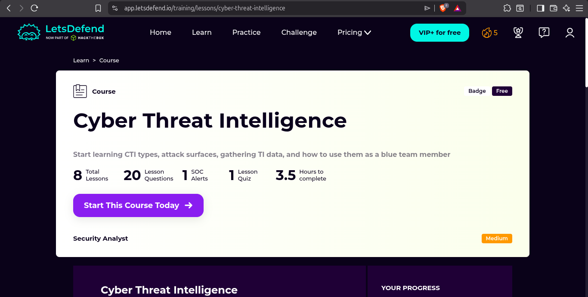

---

### 1.1 Introduction to CTI

Cyber Threat Intelligence (CTI) is a cybersecurity discipline that transforms raw data collected from multiple sources into **actionable output** — intelligence that defenders can use to protect organizations and minimize damage from attacks.

CTI fundamentally aims to understand the **TTPs (Tactics, Techniques, and Procedures)** of adversaries. It collects IOCs and other data, processes it, and produces organization-specific intelligence. Unlike static knowledge, CTI is constantly evolving — it must keep pace with the threat landscape.

Key insight: CTI is not just about collecting threat data. It's about **interpreting** that data in the context of your organization's attack surface and translating it into decisions your security team can act on.

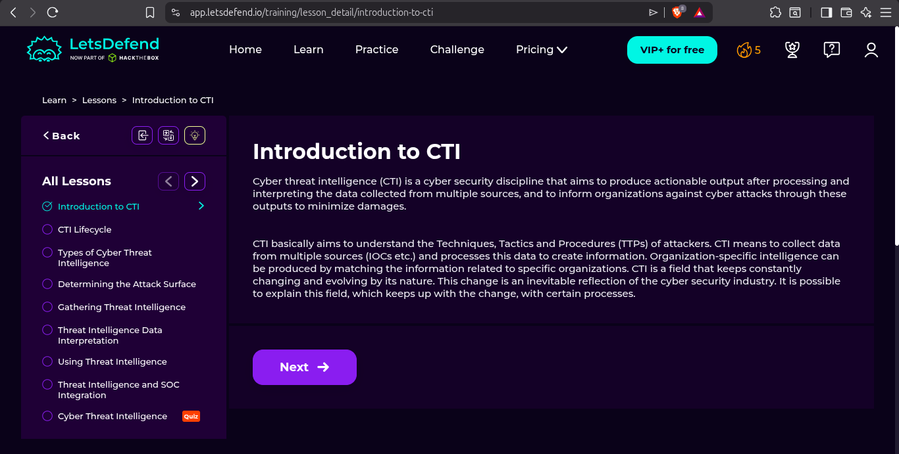

---

### 1.2 CTI Lifecycle

The CTI lifecycle is a continuous process with **5 phases**:

| Phase | Description |
|-------|-------------|
| **Planning & Direction** | Define intelligence requirements — what do we need to know? |
| **Information Gathering** | Collect raw data from internal and external sources |
| **Processing** | Filter out false positives, apply correlation rules, clean the data |
| **Analysis & Production** | Interpret the data, produce consumable intelligence reports |
| **Dissemination & Feedback** | Distribute to the right teams; gather feedback to improve the next cycle |

This is a loop — not a one-time exercise. Every cycle feeds the next.

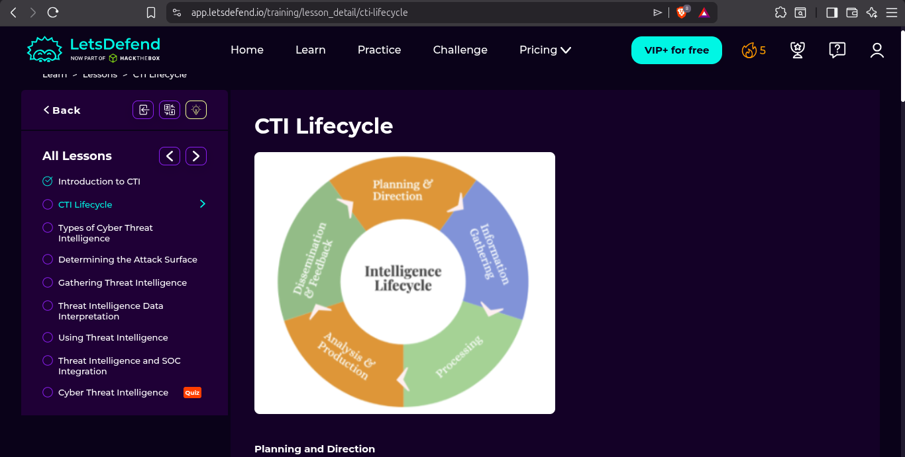

---

### 1.3 Information Gathering Sources

During the **Information Gathering** phase, analysts collect data from both internal and external sources:

**External Sources:**
- Hacker Forums & Ransomware Blogs
- Deep/Dark Web Forums and Bot Markets
- Public Sandboxes (AnyRun, Hybrid Analysis)
- Telegram / IRC / Discord / Social Media
- Surface Web (cybersecurity blogs, vendor advisories)
- Public Research Reports
- File Download Sites & GitHub/GitLab
- Public Cloud Buckets (S3/Azure Blob leaks)
- Shodan / Binary Edge / Zoomeye
- IOC Feeds: Alienvault OTX, AbuseCH, MalwareBazaar
- Honeypots
- Public Leak Databases

**Internal Sources:**
- SIEM alerts and logs
- IDS/IPS events
- Firewall logs
- Endpoint telemetry

The **Processing** phase then filters this noisy data — removing false positives, applying correlation rules — before handing it to analysis.

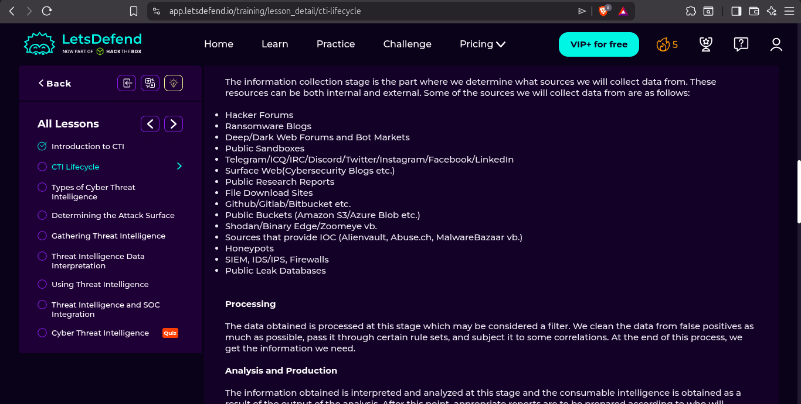

---

### 1.4 Types of Cyber Threat Intelligence

CTI is not one-size-fits-all. There are **4 types** based on the audience and time horizon:

| Type | Focus | Audience | Use |
|------|-------|----------|-----|
| **Strategic** | High-level info on changing risks and threat landscape | Executives, Management | Long-term decisions |
| **Tactical** | Information on attackers' TTPs | SOC Managers, IT Admins | Medium-term defense planning |
| **Operational** | Info on a specific incoming/active attack | Security Manager, Network Defender | Short-term response |
| **Technical** | Specific IOCs (IPs, hashes, domains) | SOC Analysts (us!) | Immediate detection & blocking |

As a SOC analyst, I work primarily with **Technical** and **Operational** intelligence — IOCs that go directly into SIEM rules, firewall blocklists, and incident response playbooks.

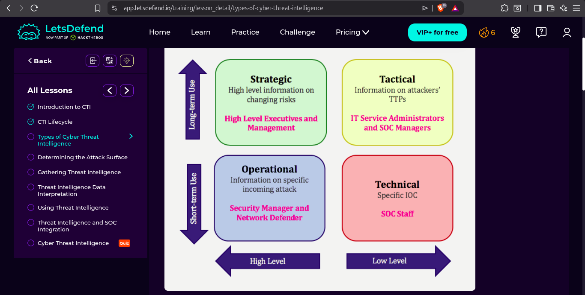

---

### 1.5 Threat Intelligence Data Interpretation

Raw collected data passes through a transformation pipeline before becoming actionable:

```
DATA  →  INFORMATION  →  INTELLIGENCE
```

- **Data**: Raw, unprocessed logs, IP addresses, file hashes, forum posts
- **Information**: Cleaned, correlated, contextualized data (e.g. "this IP was seen in 3 malware campaigns")
- **Intelligence**: Actionable output tied to your organization's risk profile (e.g. "block this IP range — actively targeting your sector")

The lesson emphasized that poor processing leads to false positives overwhelming analysts — a major cause of SOC alert fatigue.

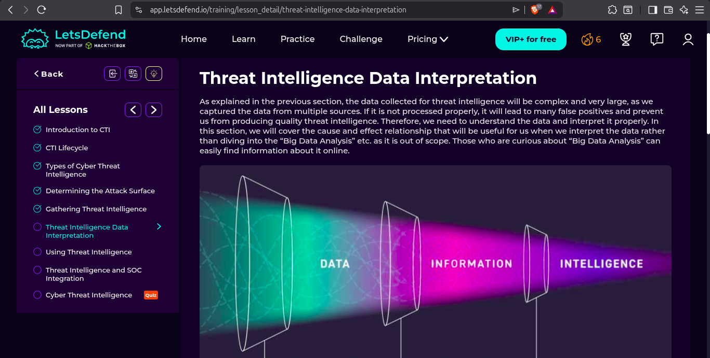

---

### 1.6 Using Threat Intelligence — EASM, DRP, CTI

Once processed, intelligence feeds into **3 operational areas**:

**1. External Attack Surface Management (EASM)**
Manages all external-facing assets of an organization. EASM continuously monitors for new assets, expired domains, subdomain creation, and exposed services — notifying defenders when a new vulnerability surface appears.

**2. Digital Risk Protection (DRP)**
Monitors external digital environments for risks targeting the organization — brand impersonation, data leaks, executive credential exposure, phishing domains.

**3. Cyber Threat Intelligence (CTI)**
The intelligence output itself — feeds into SIEM detection rules, incident response playbooks, threat hunting queries, and red team simulations.

Together these three form **XTI (Extended Threat Intelligence)**.

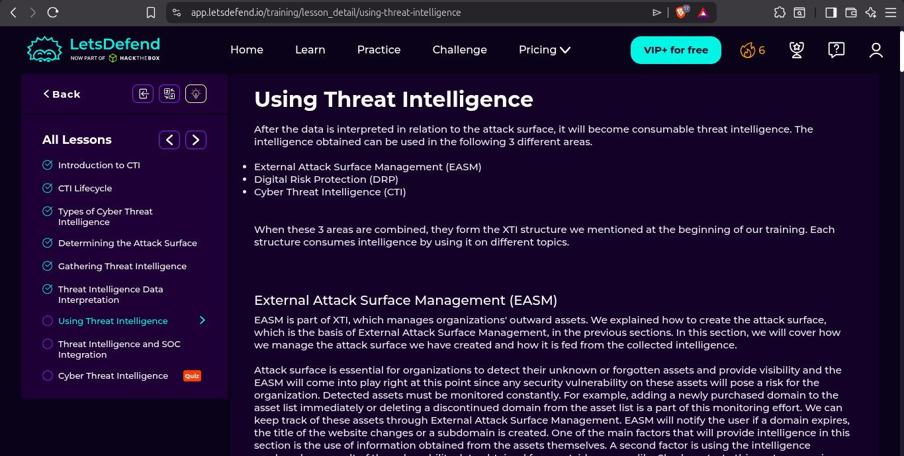

---

### 1.7 Threat Intelligence and SOC Integration

CTI integrates with the full SOC toolstack for maximum effectiveness:

- **SIEM** — IOCs from CTI feeds become detection rules; threat actor TTPs drive correlation logic
- **SOAR** — Automated playbooks consume IOC feeds to auto-block threats
- **EDR** — Endpoint telemetry cross-referenced with known malware hashes
- **Firewall/IDS** — IP/domain blocklists updated from CTI feeds

The lesson diagram shows CTI at the center of the SOC ecosystem — feeding SIEM, SOAR, EDR, and Firewall simultaneously to maximize visibility both inside and outside the organization.

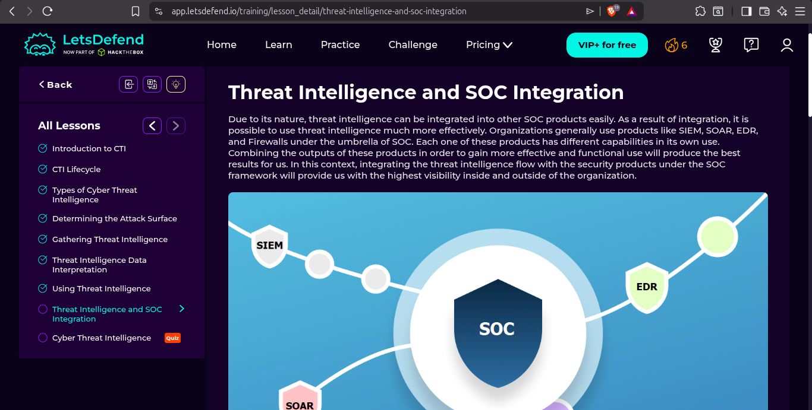

---

### 1.8 🏅 Badge Earned: Threat Analyst

After completing all 8 lessons and passing the quiz, I earned the **Threat Analyst** badge.

**Shaker Ullah** — Cyber Threat Intelligence course completed on **Apr 21, 2026 at 01:26 PM**

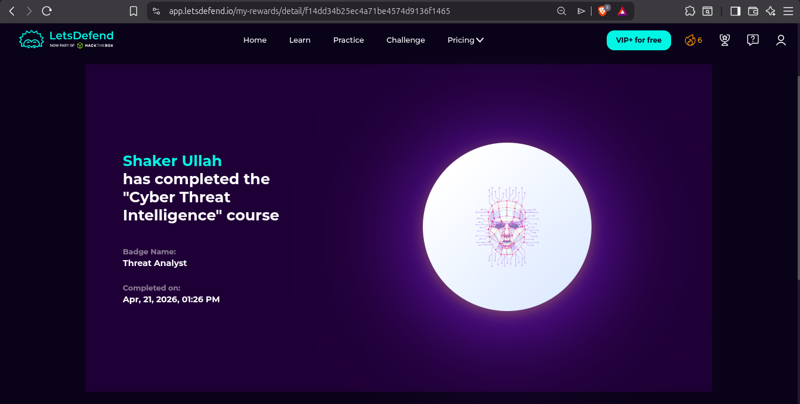

---

## 🗺️ Part 2 — MITRE ATT&CK Framework Exploration

**URL:** `attack.mitre.org`

The MITRE ATT&CK (Adversarial Tactics, Techniques, and Common Knowledge) framework is the global standard for documenting attacker behavior. It covers **14 Tactics** in the Enterprise matrix, each containing multiple techniques and sub-techniques.

---

### 2.1 Technique Explored: T1659 — Content Injection (Initial Access)

**Tactic:** Initial Access / Command and Control
**Platforms:** Linux, Windows, macOS
**Created:** September 2023 | **Last Modified:** April 2025

Adversaries may gain access by injecting malicious content into systems through online network traffic. Rather than luring victims to a malicious payload, they compromise the data-transfer channel itself — injecting content mid-stream or from the side to deliver payloads to already-compromised systems.

**Real-world relevance:** Man-in-the-middle attacks on unencrypted HTTP traffic, ISP-level injection, and compromised CDN nodes are all examples of this technique.

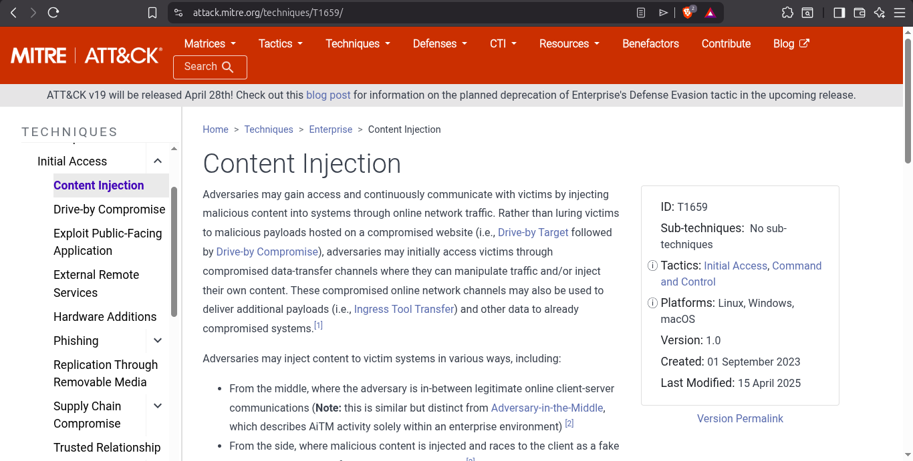

---

### 2.2 Technique Explored: T1199 — Trusted Relationship (Initial Access)

**Tactic:** Initial Access
**Platforms:** IaaS, Identity Provider, Linux, Office Suite, SaaS, Windows, macOS
**Version:** 2.4

Adversaries exploit trusted third-party relationships — IT contractors, managed security providers, HVAC/facilities vendors, infrastructure managers — who have elevated access to the target organization's network. The attacker compromises the third party first, then pivots into the primary target using the trusted access.

**Real-world relevance:** The SolarWinds supply chain attack is the most famous example — attackers compromised the software update mechanism used by thousands of organizations.

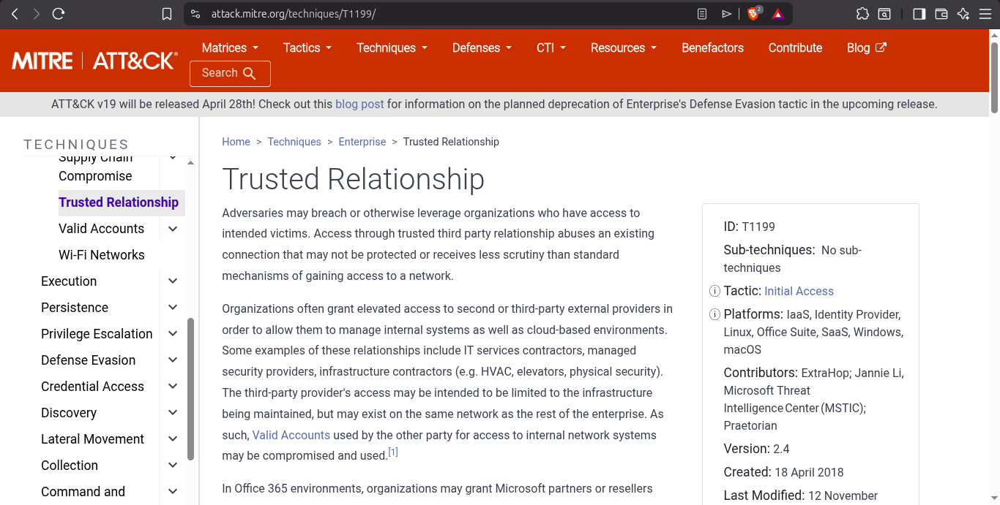

---

### 2.3 Tactic Explored: TA0006 — Credential Access

**Tactic ID:** TA0006
**Goal:** Steal account names and passwords
**Techniques:** 17 techniques including:

| Technique ID | Name |
|-------------|------|
| T1557 | Adversary-in-the-Middle |
| T1110 | Brute Force |
| T1555 | Credentials from Password Stores |
| T1212 | Exploitation for Credential Access |
| T1187 | Forced Authentication |
| T1056 | Input Capture (Keylogging) |
| T1556 | Modify Authentication Process |
| T1111 | Multi-Factor Authentication Interception |

Credential Access is one of the most critical tactics for SOC analysts to monitor — stolen credentials allow attackers to blend in with legitimate user behavior, making detection harder. Using valid credentials gives adversaries the ability to create new accounts and maintain long-term persistence.

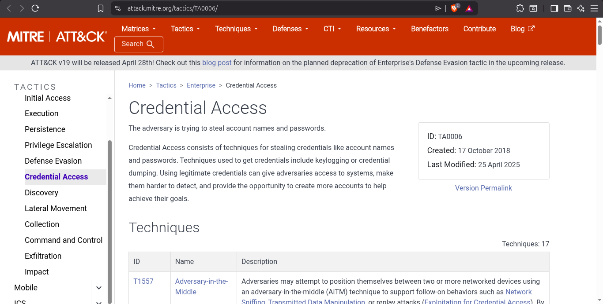

---

### 2.4 ATT&CK Navigator — My Journey Layer

Using the ATT&CK Navigator (`mitre-attack.github.io/attack-navigator`), I created a layer mapping the attack techniques I have encountered across my 19-day SOC journey.

**Highlighted techniques from my cases:**

| Color | Technique | ID | Day / Case |
|-------|-----------|-----|-----------|
| 🔴 Red | Brute Force: Password Guessing | T1110.001 | Day 5 — SSH Brute Force with Hydra |
| 🔴 Red | Exploit Public-Facing Application | T1190 | Day 16 — WordPress WPScan/SQLmap |
| 🔴 Red | Phishing | T1566 | Day 15 — Phishing Email Analysis |
| 🔴 Red | Data Encrypted for Impact | T1486 | Day 12 — BTLO Ransomware |
| 🔴 Red | Exfiltration Over Alternative Protocol | T1048 | Day 18 — AgentTesla SMTP exfil |

The Navigator matrix view gives a powerful visual of which ATT&CK columns (tactics) I've been exposed to — and more importantly, which tactics I haven't touched yet (e.g. Lateral Movement, Persistence, Privilege Escalation).

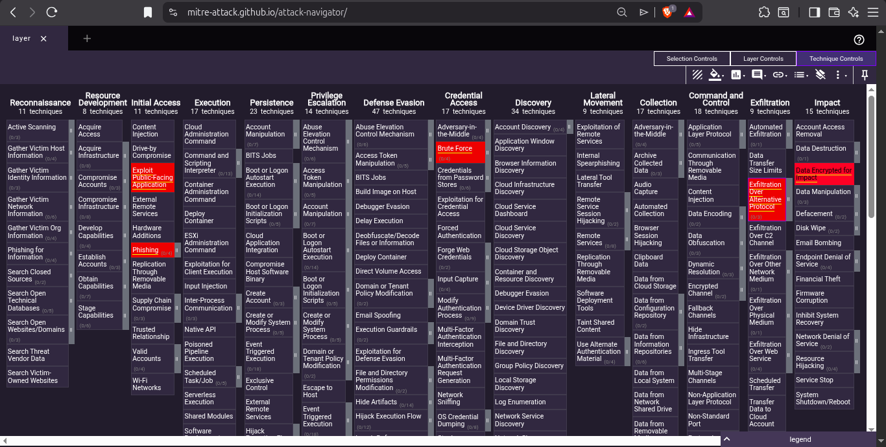

---

## 🖥️ Part 3 — BTLO: ATT&CK Challenge (Easy | 10pts | IR Category)

**Challenge:** ATT&CK framework knowledge quiz — map real scenarios to MITRE technique IDs, tactic IDs, APT groups, and detection methods.
**Completed:** April 21, 2026
**Result:** 10/10 points — All answers correct ✅

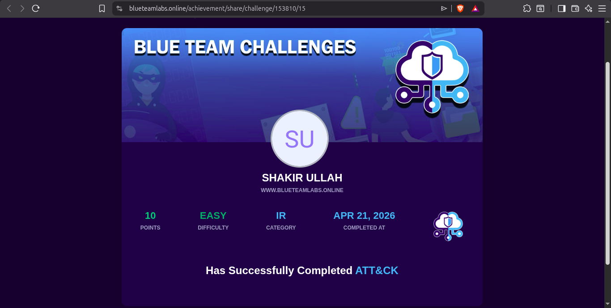

---

### Challenge Questions & Answers

**Q: What technique (T-code) allows an adversary to abuse software or cloud service interfaces to interact with cloud infrastructure components?**
- **Answer:** `T1538` ✅

**Q: You were analyzing a log and found uncommon data flow on port 4050. What APT group might this be?**
- **Answer:** `G0099` ✅ (APT-C-36 / Blind Eagle — known to use non-standard ports for C2 communication)

**Q: The framework has a list of 9 techniques that falls under the tactic to try to get into your network. What is the tactic ID?**
- **Answer:** `TA0001` ✅ (Initial Access — 9 techniques in the Enterprise matrix at time of challenge)

**Q: A software prohibits users from accessing their account by deleting, locking the user account, changing password etc. What such software has been documented by the framework?**
- **Answer:** `S0372` ✅ (LockerGoga ransomware — documented for account lockout behavior)

**Q: Using 'Pass the Hash' technique to enter and control remote systems on a network is common. How would you detect it in your company?**
- **Answer:** `Monitor newly created logons and credentials used in events and review for discrepancies` ✅

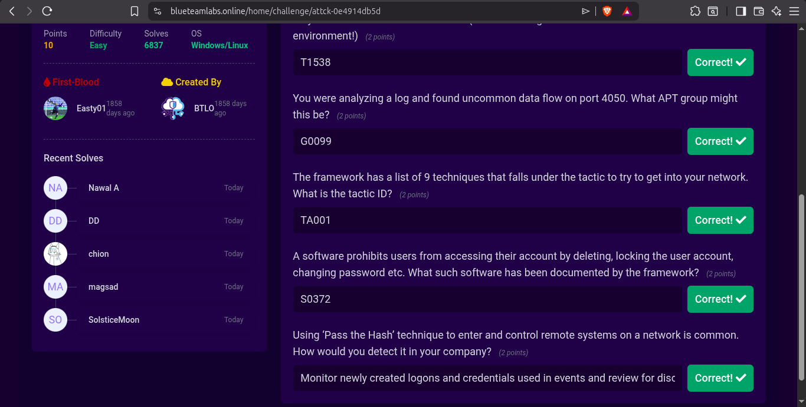

---

## 🛠️ Tools Used Today

| Tool | Purpose |
|------|---------|
| LetsDefend | Cyber Threat Intelligence course (8 lessons) |
| MITRE ATT&CK | Tactic/technique research and exploration |
| ATT&CK Navigator | Visual layer mapping of journey techniques |
| BTLO | ATT&CK knowledge challenge |

---

## 🧠 Key Learnings

1. **CTI is not just threat feeds** — it's a full lifecycle: plan → collect → process → analyze → distribute → feedback. Skipping any phase degrades output quality.

2. **Know your audience** — Strategic CTI goes to executives (risk trends), Tactical to SOC managers (TTPs), Operational to incident responders (live attacks), Technical to SOC analysts (IOCs).

3. **EASM is underrated** — organizations often don't know all their internet-facing assets. Forgotten subdomains and expired certificates are real attack entry points.

4. **T1199 (Trusted Relationship) is scary** — if your managed service provider gets compromised, attackers inherit all their access to you. Third-party risk is a major blind spot.

5. **ATT&CK Navigator reveals gaps** — mapping my 19 days of work showed I've covered Initial Access, Credential Access, Exfiltration, and Impact well, but have barely touched Persistence, Privilege Escalation, and Lateral Movement — exactly what Day 22's attack simulation will target.

6. **APT groups are mapped in ATT&CK** — the framework documents specific threat actor groups (G-codes), their preferred techniques, and the software (S-codes) they use. This is incredibly useful for threat hunting based on who is likely targeting your sector.

7. **Pass the Hash detection** — monitoring event logs for newly created logons and credential discrepancies is the key detection method for this classic lateral movement technique.

---

## 🗺️ MITRE ATT&CK Mapping — Full Journey Summary (Days 1–19)

| Day | Case / Activity | Technique | ID | Tactic |
|-----|----------------|-----------|-----|--------|
| 1–2 | SSH Failed Logins | Brute Force: Password Guessing | T1110.001 | Credential Access |
| 5 | Hydra SSH Attack | Brute Force: Password Spraying | T1110.003 | Credential Access |
| 12 | BTLO Ransomware | Data Encrypted for Impact | T1486 | Impact |
| 13 | WannaCry Memory | Exploit Public-Facing App | T1190 | Initial Access |
| 13 | WannaCry Memory | Obfuscated Files or Information | T1027 | Defense Evasion |
| 15 | Phishing Email | Spearphishing Attachment | T1566.001 | Initial Access |
| 16 | WordPress Attack | Exploit Public-Facing Application | T1190 | Initial Access |
| 16 | WordPress Attack | OS Command Injection (SQLmap) | T1059 | Execution |
| 18 | AgentTesla RAT | Exfiltration Over Alt Protocol (SMTP) | T1048.002 | Exfiltration |
| 18 | AgentTesla RAT | Input Capture: Keylogging | T1056.001 | Collection |
| 18 | AgentTesla RAT | Steal Web Session Cookie | T1539 | Credential Access |
| 18 | SSH Log Analysis | Valid Accounts | T1078 | Defense Evasion |
| 19 | BTLO ATT&CK | Cloud Service Dashboard | T1538 | Discovery |

---

## 📊 Progress Update

| Metric | Value |
|--------|-------|
| Day | 19 / 30 |
| BTLO Points Today | 10 pts |
| BTLO Total | 150+ pts |
| New LetsDefend Badge | ✅ Threat Analyst |
| Total LetsDefend Badges | 7 |
| ATT&CK Techniques Mapped | 13+ across journey |

---

## 🔗 Resources

- [LetsDefend — Cyber Threat Intelligence](https://app.letsdefend.io/training/lessons/cyber-threat-intelligence)
- [MITRE ATT&CK Enterprise Matrix](https://attack.mitre.org)
- [ATT&CK Navigator](https://mitre-attack.github.io/attack-navigator/)
- [BTLO: ATT&CK Challenge](https://blueteamlabs.online/home/challenge/attck-0e4914db5d)
- [AlienVault OTX](https://otx.alienvault.com)
- [MalwareBazaar](https://bazaar.abuse.ch)
