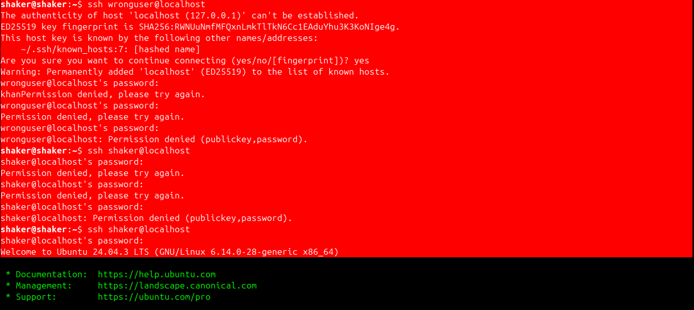
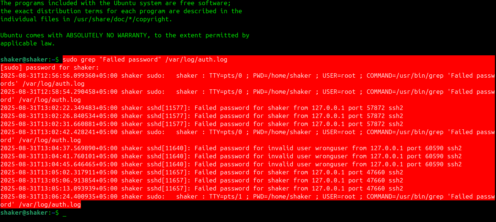

# Case Study: Failed SSH Login Attempts (Day 1)

**Date:** Sept 1, 2025  
**System:** Ubuntu  

---

## 🎯 Objective
Detect failed SSH login attempts by analyzing `/var/log/auth.log`.

---

## 🛠️ Steps Taken
1. Installed & enabled OpenSSH server:
   ```bash
   sudo apt install openssh-server -y
   sudo systemctl enable ssh --now
   ```
2. Tried logging in with wrong credentials:
   ```bash
   ssh wronguser@localhost
   ssh shaker@localhost   # with wrong password
   ```
3. Checked logs for failed logins:
   ```bash
   sudo grep "Failed password" /var/log/auth.log
   ```

---

## 📊 Findings
- **Total failed attempts:** 9  
  - 3 attempts with **unknown user**  
  - 6 attempts with **invalid password**  
- Sample log lines:
  ```
  Aug 31 14:05:12 ubuntu sshd[3124]: Failed password for invalid user wronguser from 127.0.0.1 port 54321 ssh2
  Aug 31 14:05:15 ubuntu sshd[3126]: Failed password for root from 127.0.0.1 port 54322 ssh2
  ```
- Attack source: `127.0.0.1` (localhost)  
- Target accounts: `wronguser`, `shaker`  

---

## ✅ Conclusion
The SSH server correctly logs failed login attempts in `/var/log/auth.log`.  
In total, 9 failed attempts were detected:  
- 3 invalid users (account does not exist)  
- 6 invalid password attempts on existing accounts  

This shows how brute-force attempts can be detected early by analyzing authentication logs.  

---

## 📷 Evidence
### SSH login attempt (wrong password)


### Log output showing failed attempts


---
