# Day 21 — Incident Response Playbook Development + LetsDefend: Incident Management 101 + BTLO: Follina

**Date:** April 26, 2026
**Platforms:** LetsDefend + Blue Team Labs Online (BTLO)
**Category:** Incident Response | Playbook Development | Malware Analysis
**Difficulty:** Medium (LetsDefend) + Easy (BTLO)
**Points Earned:** 10 pts (BTLO) + 🏅 Incident Management Badge (LetsDefend)
**Total BTLO Points So Far:** 160+ pts

---

## 🎯 Objectives

- Complete the **Incident Management 101** course on LetsDefend
- Understand the incident lifecycle, IMS platforms, playbooks, and SOC alert workflow
- Develop **2 professional Incident Response Playbooks** based on real lab experience
- Complete **BTLO: Follina** challenge — analyze CVE-2022-30190 malware sample

---

## 📚 Part 1 — LetsDefend: Incident Management 101

**Course:** 6 Lessons · Quiz · Badge

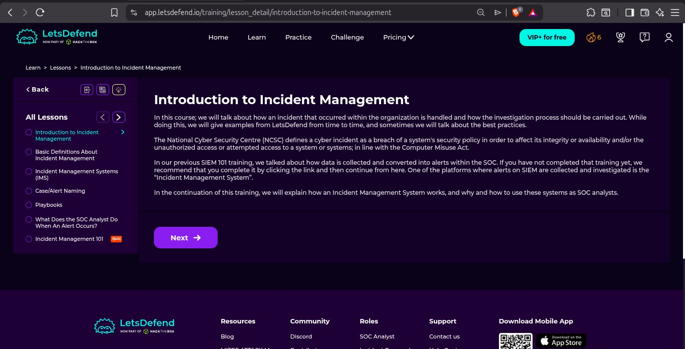

---

### 1.1 Introduction to Incident Management

The course opened with the NCSC definition of a cyber incident: a breach of a system's security policy to affect its integrity or availability, or unauthorized access or attempted access to a system. As SOC analysts, understanding how to handle incidents properly — not just detect them — is critical to the role.

The course builds directly on SIEM 101 knowledge: data is collected → converted to alerts → sent to the Incident Management System for investigation.

---

### 1.2 Basic Definitions About Incident Management

Four core concepts every SOC analyst must understand:

| Term | Definition |
|------|-----------|
| **Alert** | Generated by SIEM after data collection, parsing, and enrichment |
| **Event** | Any observable occurrence in a system or network |
| **Incident** | A confirmed event that negatively impacts security |
| **True Positive** | Alert that correctly identifies a real threat |
| **False Positive** | Alert triggered by benign activity — not a real threat |

As a SOC analyst, the majority of time is spent determining true positives from false positives. There is no universal analysis method — it depends on the alert type (web, malware, endpoint, etc.), which is why playbooks exist.

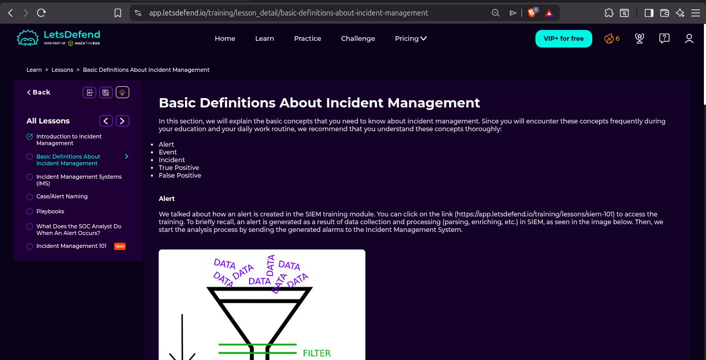

---

### 1.3 Incident Management Systems (IMS)

An IMS is where SOC teams conduct the investigation process and record all actions taken during an incident. Analysts spend most of their working time inside these systems.

**TheHive** is a popular open-source IMS example shown in the course — it displays cases with severity levels, tasks, observables, assignees, and dates in a unified dashboard.

On LetsDefend, the "Case Management" feature serves the same purpose — when an alert is created, a case/ticket is opened automatically with the relevant playbook assigned.

**IMS Flow:**
```
SIEM Alert Data → Incident Management System ↔ Threat Intelligence
                                              ↔ SOAR
                                              ↓
                                         Closed Alert
```

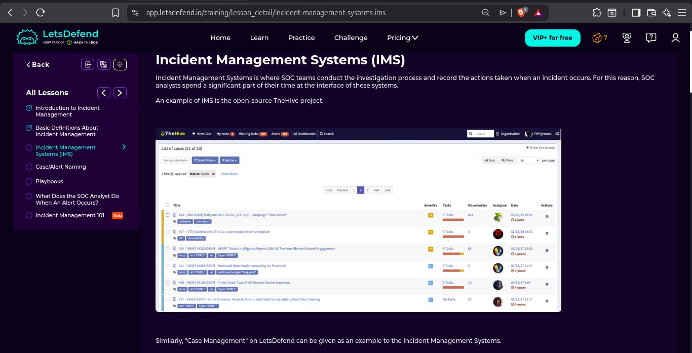
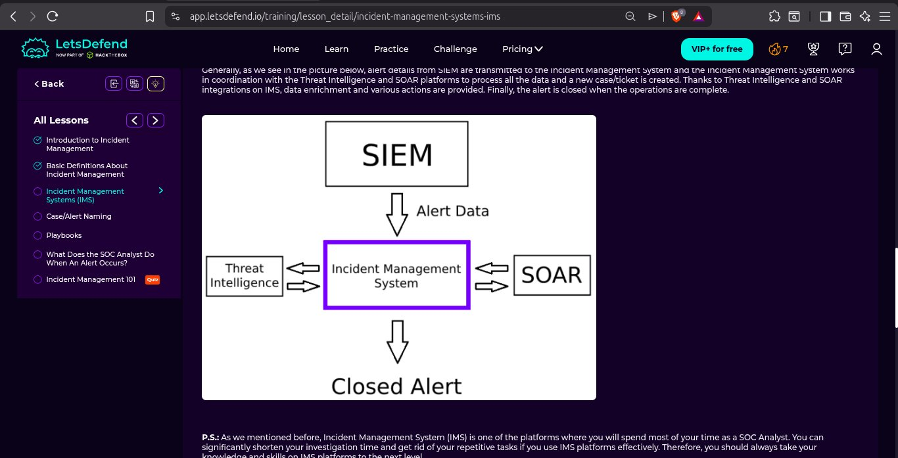

---

### 1.4 Case/Alert Naming Conventions

Having a unified naming convention for tickets is essential for fast retrospective searches and statistics. The LetsDefend "Case Management" naming format is:

```
EventID: {Alert ID Number} - [{Alert Name}]
```

**Example:**
```
EventID: 121 - [SOC171 - Spring4Shell Activity]
```

This allows analysts to instantly identify the alert type and ID without opening the full case — saving time during high-volume alert periods.

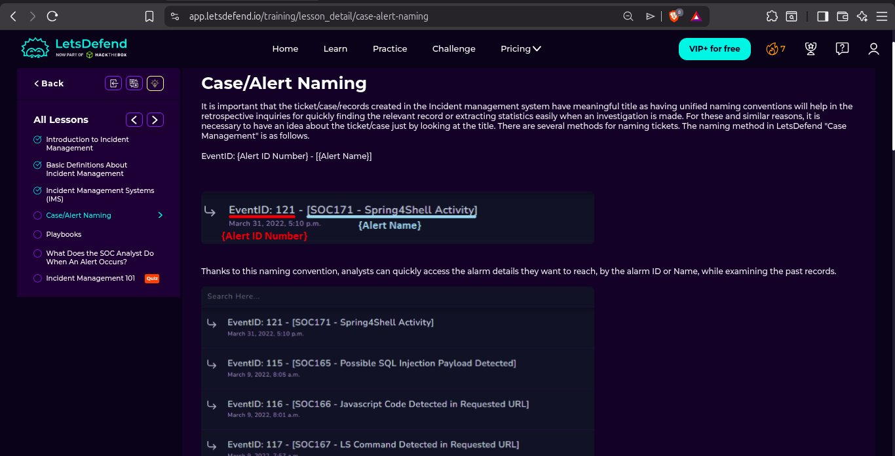

---

### 1.5 Playbooks

Playbooks are pre-defined step-by-step workflows for investigating specific alert types. In a SOC environment there are many different alert types — web attacks, ransomware, malware, phishing, etc. Each has a different investigation approach.

**Why Playbooks Are Important:**
- SOC analysts don't always know the exact steps for every alert type
- Playbooks provide consistent, repeatable investigation processes
- Especially critical for junior analysts just starting their careers
- When a case is created in LetsDefend, the system automatically assigns the relevant playbook

Example playbook step shown: *"Analyze URL Address — Analyze URL in 3rd party tools (AnyRun, VirusTotal, URLHouse, URLScan, HybridAnalysis). Click Malicious if it is malicious, Non-malicious if it isn't."*

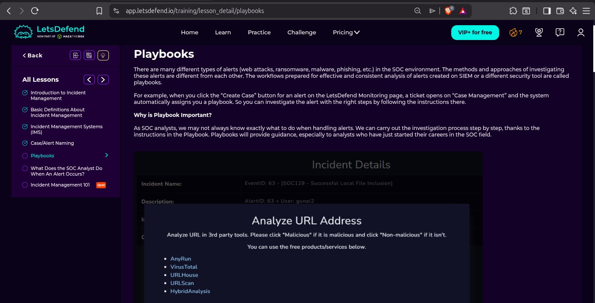

---

### 1.6 What Does the SOC Analyst Do When an Alert Occurs?

The SOC analyst workflow when an alert fires:

1. **Choose an alert** from the Monitoring page (Main Channel)
2. **Take ownership** — assign it to yourself
3. **Follow the playbook** — investigate step by step
4. **Determine True/False Positive** — dig into the details
5. **Close the alert** with proper documentation
6. **Give feedback** to the SIEM rule team if it was a false positive

The key insight: alerts do not always indicate an actual incident. Most time is spent on false positive analysis. Communication with the SIEM rule team is constant and important.

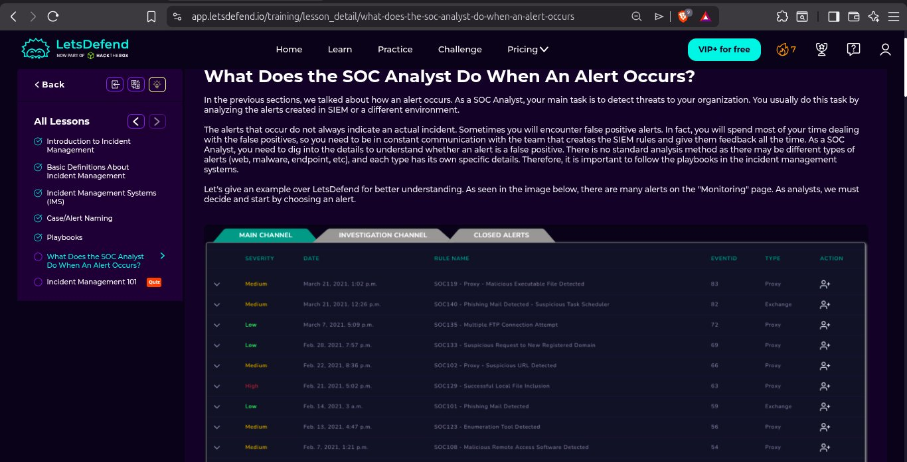

---

### 1.7 🏅 Badge Earned: Incident Management

**Shaker Ullah** — Incident Management 101 completed on **Apr 26, 2026 at 09:52 AM**

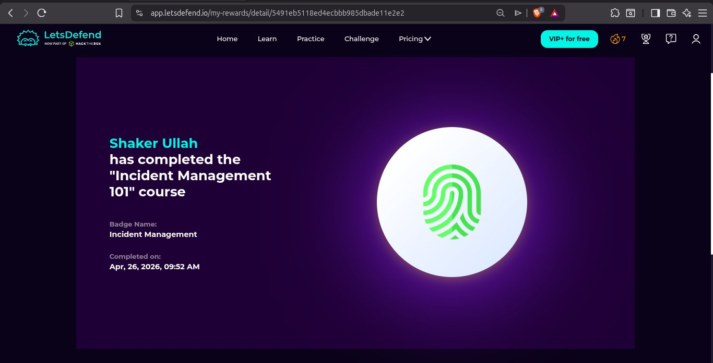

---

## 📋 Part 2 — Incident Response Playbooks

Based on real attacks investigated across my SOC journey, I developed two professional IR playbooks following the NIST SP 800-61 incident lifecycle: **Detection → Triage → Containment → Eradication → Recovery → Lessons Learned.**

---

### 🔴 Playbook 1 — SSH Brute Force Attack

**MITRE ATT&CK:** T1110.001 — Brute Force: Password Guessing
**Severity:** High
**Tools:** Wazuh SIEM, grep, awk, ufw
**Based on:** Day 5 + Day 18 BTLO Secure Shell lab

#### 1. Overview
An attacker repeatedly attempts different passwords on an SSH service to gain unauthorized access. Tools like Hydra can attempt thousands of passwords per minute. This attack targets authentication mechanisms and can lead to full system compromise if successful.

#### 2. How to Detect It

- **Wazuh Rule:** 5712 — Multiple failed SSH logins followed by a success (Level 12 alert)
- **Log Location:** `/var/log/auth.log`
- **Key Indicator:** High volume of "Failed password" entries from the same IP

Example log entry:
```
Sep 08 2025 16:17 PM PKT sshd: Failed password for root
from 127.0.0.1 port 22 ssh2
```

Key detection commands:
```bash
# Find IPs with most failed attempts
grep "Failed password" /var/log/auth.log | awk '{print $11}' | sort | uniq -c | sort -rn

# Check if any login succeeded
grep "Accepted password" /var/log/auth.log
```

#### 3. Triage Questions

- [x] **True Positive?** Yes — confirmed brute force attack from `127.0.0.1` (controlled lab simulation using own machine)
- [x] **How many failed attempts?** Multiple attempts detected — threshold exceeded
- [x] **Did any login succeed?** Yes — attacker gained access to account `shakir`
- [x] **Is the attack still ongoing?** No — attack completed successfully before detection
- [x] **Which username was targeted?** `shakir`
- [x] **Internal or external?** Internal IP (`127.0.0.1`) — lab simulation environment

#### 4. Containment

```bash
# Block attacker IP immediately
sudo ufw deny from 127.0.0.1 to any

# Disable targeted account temporarily
sudo usermod -L shakir

# Verify block is active
sudo ufw status
```
- Notified team/manager of confirmed brute force incident
- Account temporarily disabled to prevent further unauthorized access

#### 5. Eradication

```bash
# Reset compromised account password
sudo passwd shakir

# Check for unauthorized new users
cat /etc/passwd | grep -v nologin

# Review sudoers for unauthorized changes
sudo cat /etc/sudoers

# Check for SSH backdoors
cat ~/.ssh/authorized_keys
```
- No new unauthorized users found
- No changes to `/etc/sudoers` detected
- No backdoor keys found in `authorized_keys`
- Attack was contained before attacker could establish persistence

#### 6. Recovery

```bash
# Re-enable account with new strong password
sudo usermod -U shakir

# Consider changing SSH port
sudo nano /etc/ssh/sshd_config
# Change: Port 22 → Port 2222

# Restart SSH service
sudo systemctl restart sshd
```
- Account re-enabled with strong new password
- SSH port change planned to reduce attack surface
- MFA implementation scheduled

#### 7. Lessons Learned

| Finding | Action |
|---------|--------|
| No auto-blocking on repeated failures | Configure Wazuh active response to block IPs after 10 failed attempts |
| Root SSH login was enabled | Disable root SSH login in `/etc/ssh/sshd_config` |
| SSH on default port 22 | Move SSH to non-standard port (e.g. 2222) |
| No fail2ban installed | Implement fail2ban with threshold of 10 failed attempts |
| No MFA on SSH | Implement SSH key-based authentication + MFA |

---

### 🔴 Playbook 2 — Phishing Email Attack

**MITRE ATT&CK:** T1566.001 — Spearphishing Link
**Severity:** High
**Tools:** Thunderbird, CyberChef, VirusTotal, URL2PNG, Whois
**Based on:** Day 15 BTLO Phishing Analysis lab

#### 1. Overview
An attacker sent a phishing email impersonating Amazon, claiming the victim's account had been blocked. The email contained a malicious link embedded in Base64-encoded content. The attacker used a Chinese domain (`.cn`) spoofed to appear as Amazon. Investigation revealed the attacker's Facebook profile through OSINT.

#### 2. How to Detect It

**Key Phishing Indicators Identified:**

| Indicator | Finding |
|-----------|---------|
| Sender domain | `zyevantoby.cn` — NOT `amazon.com` |
| Display name | `"Amazn"` — misspelled Amazon |
| Greeting | Generic — not personalized |
| Tactic | Urgency + account threat — classic phishing |
| Domain origin | Chinese `.cn` domain for an Amazon email |
| Attacker IP | `45.156.23.138` |

Email metadata:
```
Received: 7/13/21, 9:40 PM
From: Amazn <amazon@zyevantoby.cn>
To: saintington73@outlook.com
```

**Tools used for detection:**
- **Thunderbird** — extracted and examined the full email with all headers and metadata
- **CyberChef** — decoded Base64-encoded email body, revealed malicious URL
- **URL2PNG** — safely previewed the malicious URL without clicking it
- **VirusTotal / Whois** — confirmed malicious domain and IP reputation

#### 3. Triage Questions

- [x] **True Positive?** Yes — confirmed phishing (external attacker)
- [x] **Was it a phishing attack?** Yes — spoofed Amazon identity with malicious link
- [x] **Was there a malicious link?** Yes — found after Base64 decoding via CyberChef
- [x] **Did the endpoint click the link?** Yes — endpoint user clicked the phishing link
- [x] **Sender email?** `amazon@zyevantoby.cn`
- [x] **Was the email deleted?** Yes — removed from mailbox

#### 4. Containment

- [x] Blocked attacker IP `45.156.23.138` at firewall level
- [x] Isolated the affected endpoint from the network temporarily
- [x] Notified team/manager — incident escalated
- [x] Blocked malicious domain `zyevantoby.cn` at DNS/proxy level

#### 5. Eradication

```bash
# Scan endpoint for malware/persistence after link click
# Check browser for malicious extensions
# Review recently downloaded files
# Check startup programs for new entries
```
- Removed phishing email from all mailboxes in the organization
- No new unauthorized user accounts found on endpoint
- Browser scanned for malicious extensions — none found
- Endpoint scanned for malware post-click — clean after remediation

#### 6. Recovery

- Endpoint re-imaged after digital forensics completed
- Email spam filters updated with new phishing signatures
- Domain `zyevantoby.cn` added to permanent blocklist
- Security awareness training session conducted for all staff on phishing identification

#### 7. Lessons Learned

| Finding | Action |
|---------|--------|
| User clicked malicious link | Conduct regular phishing simulation training |
| No email gateway scanning | Implement email gateway with attachment/URL scanning |
| No DNS filtering | Deploy DNS filtering (e.g. Cloudflare Gateway, Pi-hole) |
| Base64 encoding bypassed detection | Add SIEM rule to alert on Base64 encoded email bodies |
| No popup warning on external emails | Configure email client to flag emails from external domains |

---

## 🖥️ Part 3 — BTLO: Follina Challenge (Easy | 10pts | IR Category)

**Challenge:** Analyze a malicious `.docx` sample exploiting **CVE-2022-30190 (Follina)** — a Microsoft Office Remote Code Execution vulnerability.
**Completed:** April 26, 2026
**Result:** 10/10 — All correct ✅

---

### 3.1 What is Follina (CVE-2022-30190)?

Follina is a critical RCE vulnerability in Microsoft Office's MSDT (Microsoft Support Diagnostic Tool). An attacker embeds a malicious URL inside a Word document's XML relationships file (`word/_rels/document.xml.rels`). When the document is opened, Office automatically fetches the remote URL and executes arbitrary code via `msdt.exe` — **without any macros needed**.

Key detail discovered by researcher John Hammond: **anything under 4096 bytes does not fire** — the payload must be larger than this threshold.

Detection: payloads create a child process of `msdt.exe` under the parent `WINWORD.EXE`, with `sdiagnhost.exe` and `conhost.exe` also spawned.

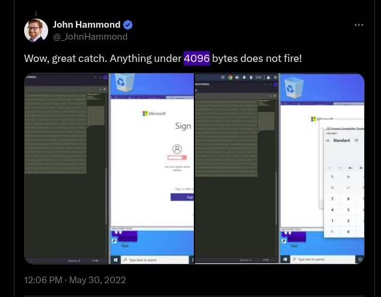
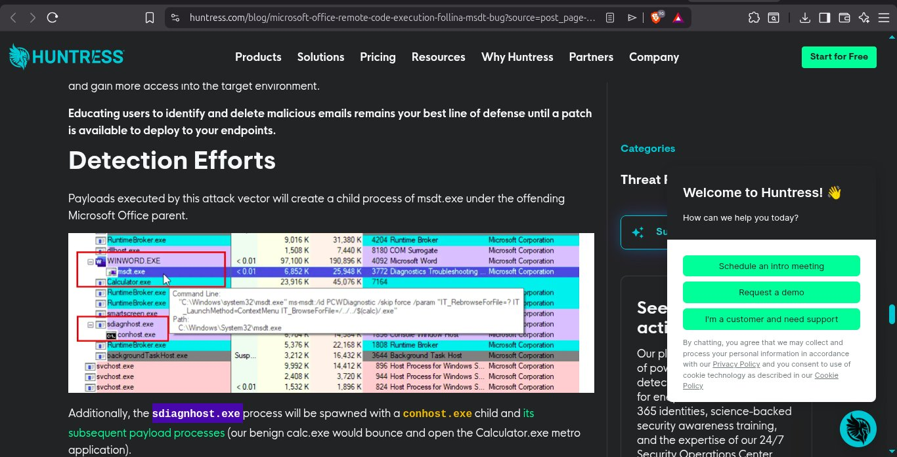

---

### 3.2 Lab Analysis

**Step 1 — Unzip and inspect the sample:**
```bash
ls sample.doc
unzip sample.doc
cat word/_rels/document.xml.rels
```

The `.doc` file is actually an Office Open XML container (ZIP format). Unzipping revealed the internal XML structure including the malicious relationship file.

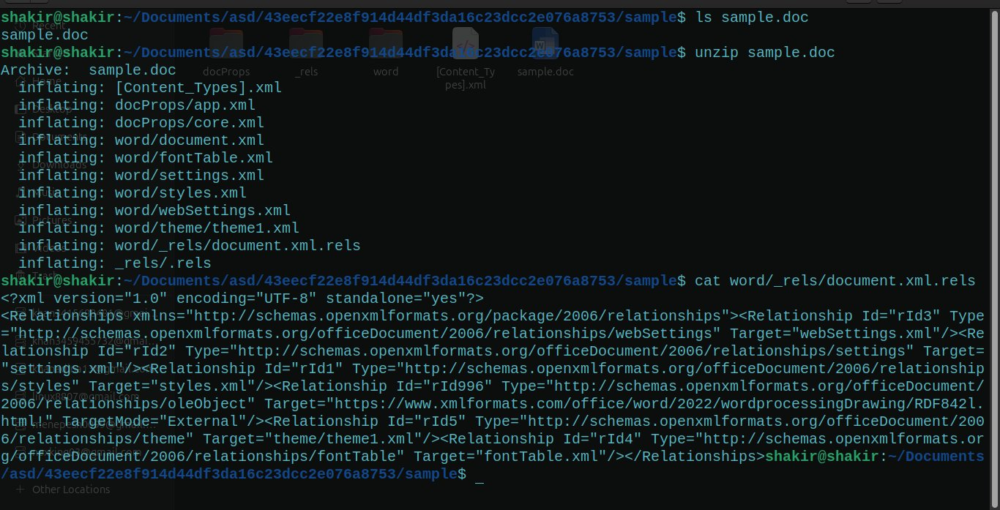

---

**Step 2 — VirusTotal Analysis**

Uploaded the SHA-256 hash to VirusTotal:

**Detection:** 48/66 engines flagged as malicious

**File Hashes:**
```
MD5:     52945af1def85b171870b31fa4782e52
SHA-1:   06727ffda60359236a8029e0b3e8a0fd11c23313
SHA-256: 4a24048f81afbe9fb62e7a6a49adbd1faf41f266b5f9feecdceb567aec096784
```

**Tags:** `docx` · `exploit` · `cve-2022-30190` · `calls-wmi` · `cve-2017-0199`

**File Type:** Office Open XML Document (DOCX) — Microsoft Word 2007+
**File Size:** 10.01 KB (10253 bytes)
**Community Score:** -538 (strongly malicious)

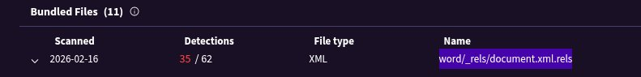
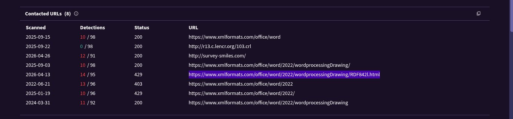
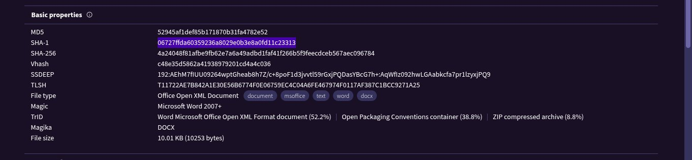
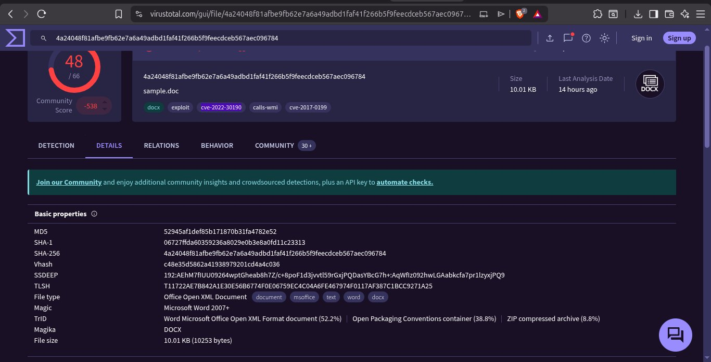

---

**Step 3 — Contacted URLs (Malicious)**

VirusTotal revealed 8 URLs contacted by the sample:

| Detection | URL |
|-----------|-----|
| 14/95 | `https://www.xmlformats.com/office/word/2022/wordprocessingDrawing/RDF842l.html` ← **Main C2** |
| 12/91 | `http://survey-smiles.com/` |
| 10/98 | `https://www.xmlformats.com/office/word` |
| 11/96 | `https://www.xmlformats.com/office/word/2022/` |

The primary malicious URL embedded in `word/_rels/document.xml.rels`:
```
https://www.xmlformats.com/office/word/2022/wordprocessingDrawing/RDF842l.html
```

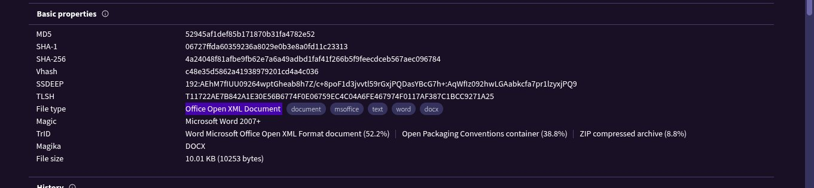

---

**Step 4 — MITRE ATT&CK Mapping from VirusTotal**

VirusTotal's behavior analysis mapped the following techniques:

| Technique | ID |
|-----------|-----|
| Exploitation for Client Execution | T1203 |
| Inter-Process Communication | T1559 |
| Hijack Execution Flow | T1574 |
| Process Injection | T1055 |
| Scripting | T1064 |
| Template Injection | T1221 |

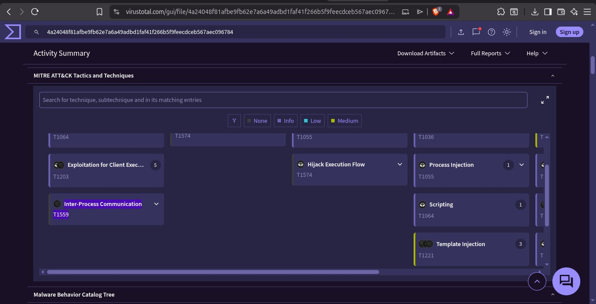

---

### 3.3 BTLO Challenge Questions & Answers

| Question | Answer |
|----------|--------|
| SHA1 hash of the sample | `06727ffda60359236a8029e0b3e8a0fd11c23313` ✅ |
| Full filetype (VirusTotal) | `Office Open XML Document` ✅ |
| URL used within the sample | `https://www.xmlformats.com/office/word/2022/wordprocessingDrawing/RDF8` ✅ |

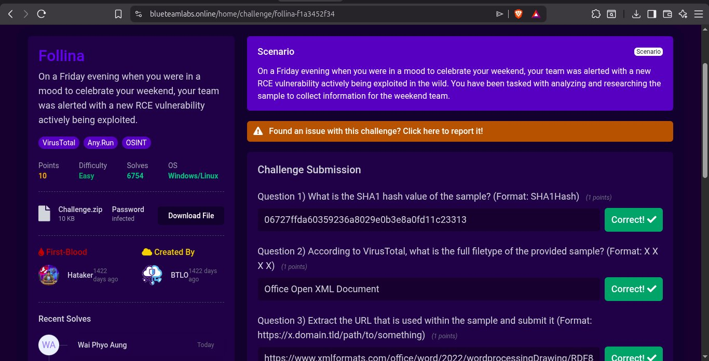
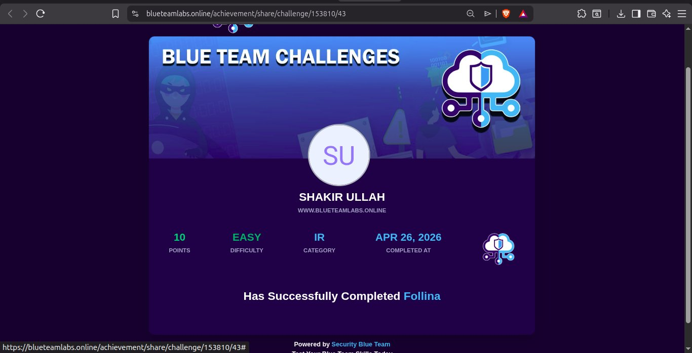

---

## 🛠️ Tools Used Today

| Tool | Purpose |
|------|---------|
| LetsDefend | Incident Management 101 course |
| VirusTotal | Hash lookup, file analysis, MITRE mapping, contacted URLs |
| unzip / cat | Extract and inspect Office XML structure |
| Thunderbird | Email header and body analysis (Playbook 2) |
| CyberChef | Base64 decode of phishing email body (Playbook 2) |
| grep / awk / ufw | SSH log analysis and firewall blocking (Playbook 1) |
| Wazuh | SIEM detection reference (Playbook 1) |
| BTLO | Follina CVE-2022-30190 challenge |

---

## 🧠 Key Learnings

1. **Playbooks are essential for consistency** — without them, different analysts investigate the same alert type differently, leading to missed steps and inconsistent documentation.

2. **IMS platforms are where analysts live** — TheHive, LetsDefend Case Management, and similar tools are the central workspace. Knowing how to use them efficiently is as important as knowing how to detect threats.

3. **Case naming conventions matter** — `EventID: 121 - [SOC171 - Spring4Shell]` format allows instant identification without opening a case. In high-volume SOC environments this saves significant time.

4. **Follina (CVE-2022-30190) is dangerous** — no macros needed, just opening a document triggers remote code execution via `msdt.exe`. The WINWORD.EXE → msdt.exe process chain is the key detection indicator.

5. **Office documents are ZIP files** — unzipping a `.docx` reveals internal XML files. The relationship file `word/_rels/document.xml.rels` is where Follina hides its malicious URL.

6. **VirusTotal goes beyond AV scanning** — it maps MITRE ATT&CK techniques, shows contacted URLs, bundled file detections, and community scores. Essential for rapid malware triage.

7. **True positives vs false positives** — most SOC analyst time is spent on this distinction. Playbooks, combined with SIEM context and threat intelligence, make this determination faster and more accurate.

---

## 🗺️ MITRE ATT&CK Mapping

| Technique | ID | Source |
|-----------|-----|--------|
| Brute Force: Password Guessing | T1110.001 | Playbook 1 — SSH Brute Force |
| Valid Accounts | T1078 | Playbook 1 — Successful SSH login |
| Spearphishing Link | T1566.001 | Playbook 2 — Phishing Email |
| Exploitation for Client Execution | T1203 | BTLO Follina — CVE-2022-30190 |
| Template Injection | T1221 | BTLO Follina — malicious docx |
| Process Injection | T1055 | BTLO Follina — msdt.exe |
| Inter-Process Communication | T1559 | BTLO Follina — WMI calls |

---

## 📊 Progress Update

| Metric | Value |
|--------|-------|
| Day | 21 / 30 |
| BTLO Points Today | 10 pts |
| BTLO Total | 160+ pts |
| New LetsDefend Badge | ✅ Incident Management |
| Total LetsDefend Badges | 9 |
| Playbooks Written | 2 (SSH Brute Force + Phishing) |
