# Day 22 — Full Attack Simulation: SSH Brute Force Detection with Hydra + Wazuh + Suricata

**Date:** April 27, 2026
**Platform:** Local Lab (Ubuntu 24) + GitHub Codespace + Tailscale VPN
**Category:** Attack Simulation | Intrusion Detection | Incident Response
**Difficulty:** Advanced
**Points Earned:** — (Self-hosted lab)
**Total BTLO Points So Far:** 160+ pts

---

## 🎯 Objectives

- Configure Suricata IDS and integrate it with Wazuh Manager
- Connect a remote GitHub Codespace as a Wazuh Agent over Tailscale VPN
- Simulate a real SSH brute force attack using Hydra from the Codespace
- Detect the attack using both Wazuh (log-based) and Suricata (network-based)
- Perform containment by blocking the attacker IP with UFW firewall
- Document the full attack chain as a Purple Team exercise

---

## 🏗️ Lab Architecture

```
GitHub Codespace (Attacker)
        ↓  Hydra SSH Brute Force
        ↓  over Tailscale VPN (100.X.X.X)
Ubuntu Machine (Target + Defender)
        ├── Wazuh Manager  → reads /var/log/auth.log
        ├── Suricata IDS   → monitors tailscale0 + wlp2s0
        └── UFW Firewall   → containment
```

**Attack direction:** Codespace → Ubuntu (realistic external-to-internal simulation)
**Detection:** Dual-layer — Wazuh (auth log analysis) + Suricata (network traffic)

---

## 📚 Part 1 — Environment Setup

### 1.1 Suricata + Wazuh Integration

Configured Wazuh Manager to ingest Suricata's `eve.json` log file by adding a localfile block to `/var/ossec/etc/ossec.conf`:

```xml
<localfile>
  <log_format>json</log_format>
  <location>/var/log/suricata/eve.json</location>
</localfile>
```

This tells Wazuh to parse Suricata events as JSON and forward them to the alert engine — enabling correlation between network alerts (Suricata) and host alerts (auth.log).

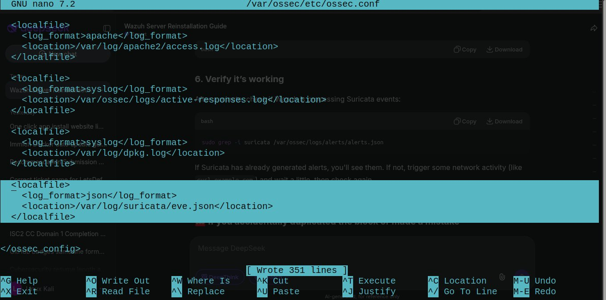

---

### 1.2 Suricata Configuration Test

Configured `suricata.yaml` with the correct network interface and HOME_NET range, then validated the config:

```bash
sudo suricata -T -c /etc/suricata/suricata.yaml -v
```

Output:
```
i: suricata: This is Suricata version 7.0.3 RELEASE running in SYSTEM mode
i: suricata: Configuration provided was successfully loaded. Exiting.
```

Config validated successfully — no YAML syntax errors.

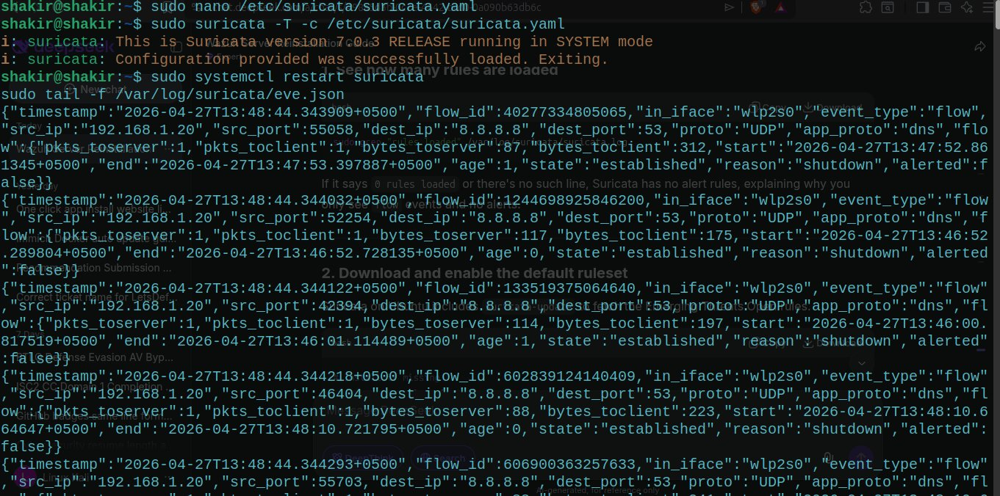

---

### 1.3 Suricata Rules Loaded

After restarting Suricata, confirmed rule loading:

```bash
sudo grep -i rules /var/log/suricata/suricata.log | tail -10
```

Output confirmed:
```
49500 rules successfully loaded, 0 rules failed
49505 signatures processed
1262 are IP-only rules
4483 are inspecting packet payload
43524 inspect application layer
108 are decoder event only
```

**49,500 detection rules** active and ready — including SSH brute force signatures.

Also tested Suricata's HTTP user-agent detection:
```bash
curl -A "BlackSun" http://testmyids.com
```

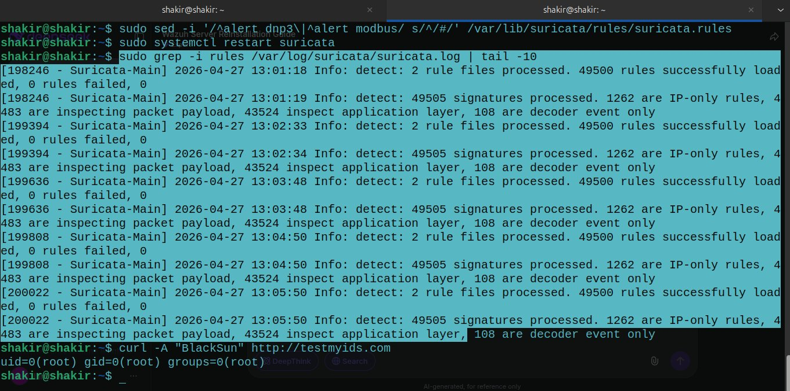

---

### 1.4 Wazuh Agent — GitHub Codespace Connected

Installed Wazuh Agent on the GitHub Codespace and connected it to the Ubuntu Wazuh Manager over Tailscale VPN. The agent appeared in the Wazuh dashboard as `codespaces-174271` — active and sending events.

Initial events showed **281 hits** of CIS Ubuntu 24.04 LTS Benchmark compliance checks — confirming the agent was fully operational and logging.

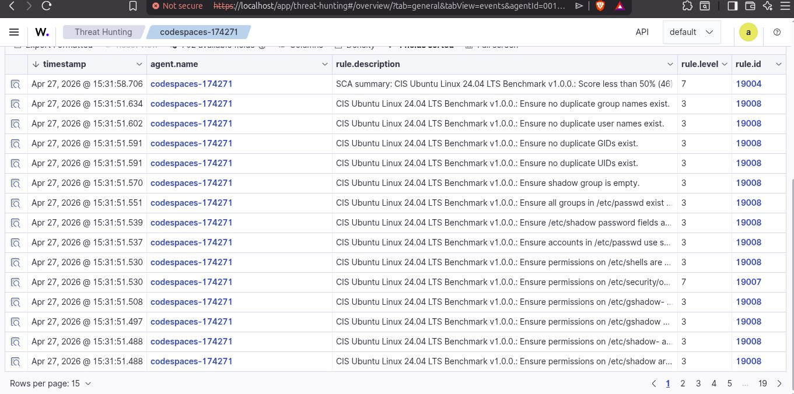
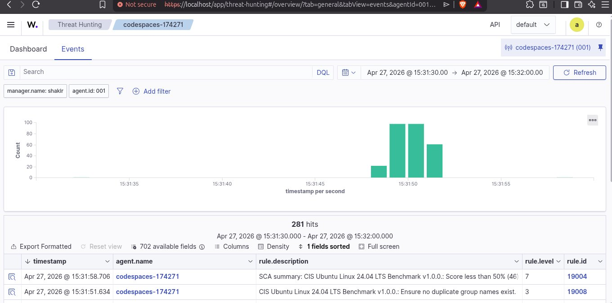

---

### 1.5 Suricata Pre-Attack Baseline

Before launching the attack, Suricata was already detecting background VPN traffic:

```
ET INFO Session Traversal Utilities for NAT (STUN Binding Request)
Classification: Misc activity | Priority: 3
{UDP} 192.168.X.X:41641 → external:3478
```

This is normal **Tailscale VPN keepalive traffic** — confirming Suricata was actively monitoring the right interface and network.

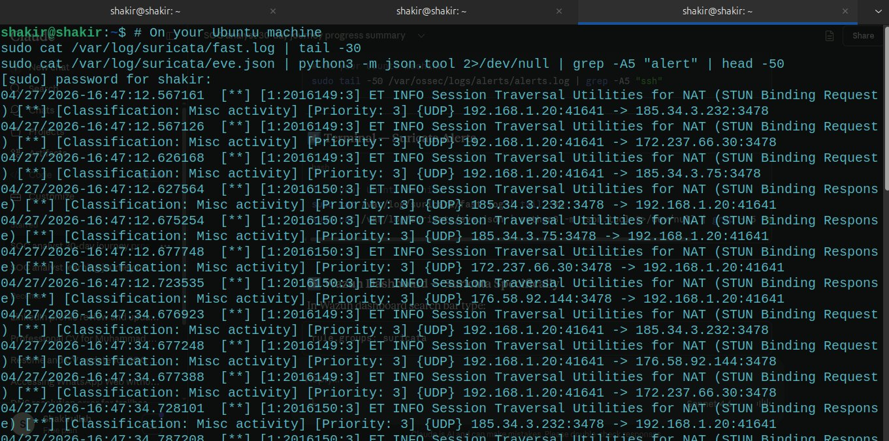

---

## ⚔️ Part 2 — Attack Execution

### 2.1 Attack Setup

**Attacker:** GitHub Codespace (Tailscale IP: `100.X.X.X`)
**Target:** Ubuntu Machine SSH (Tailscale IP: `192.168.X.X`, port 22)
**Tool:** Hydra v9.5
**Wordlist:** 91 passwords including common passwords, usernames, and variations
**Target User:** `shakir`
**Threads:** 4 parallel connections (`-t 4`)

### 2.2 Hydra Command

```bash
hydra -l shakir -P /tmp/passwords.txt ssh://192.168.X.X -t 4 -V
```

**Parameters:**
- `-l shakir` — single username to target
- `-P /tmp/passwords.txt` — password wordlist (91 entries)
- `-t 4` — 4 parallel attack threads
- `-V` — verbose mode showing each attempt

### 2.3 Attack Results

Hydra ran through the entire wordlist making **50+ authentication attempts** before finding the correct password and achieving a successful login.

```
[22][ssh] host: 192.168.X.X  login: shakir  password: [REDACTED]
```

The attack succeeded — simulating a real brute force compromise.

---

## 🔍 Part 3 — Detection

### 3.1 auth.log — Failed Attempts (50 total)

```bash
grep "Failed password" /var/log/auth.log | wc -l
```
**Result: 50 failed attempts**

```bash
grep "Failed password" /var/log/auth.log | tail -20
```

All 50 failed attempts came from the same source IP (`100.X.X.X`) in rapid succession — a clear brute force pattern:

```
2026-04-27T17:03:21 shakir sshd: Failed password for shakir from 100.X.X.X port 43936 ssh2
2026-04-27T17:03:23 shakir sshd: Failed password for shakir from 100.X.X.X port 43912 ssh2
2026-04-27T17:03:23 shakir sshd: Failed password for shakir from 100.X.X.X port 43910 ssh2
2026-04-27T17:03:23 shakir sshd: Failed password for shakir from 100.X.X.X port 43922 ssh2
...
```

Multiple ports used simultaneously (43936, 43912, 43910, 43922) — confirms Hydra's 4 parallel threads (`-t 4`) in action.

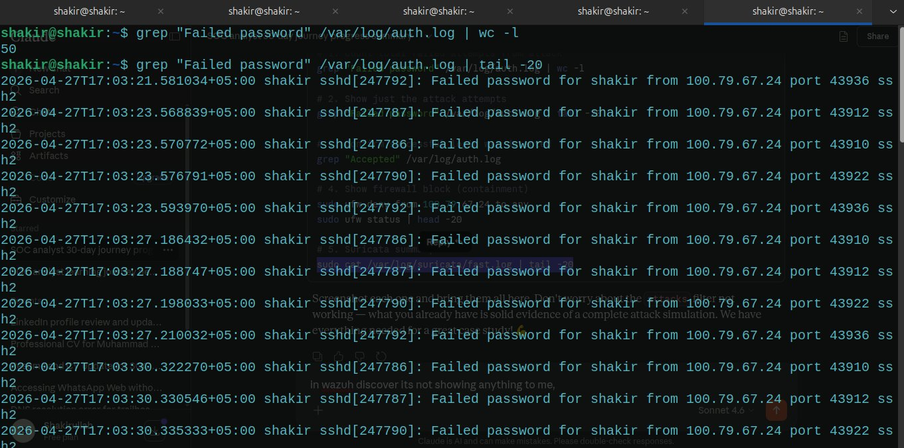

---

### 3.2 auth.log — Successful Login Detected

```bash
grep "Accepted" /var/log/auth.log
```

Output:
```
2026-04-27T17:03:35 shakir sshd[247792]: Accepted password for shakir
from 100.X.X.X port 43936 ssh2
```

**Hydra found the correct password at 17:03:35** — approximately 14 seconds after the attack began at 17:03:21. The successful login was clearly captured in auth.log.

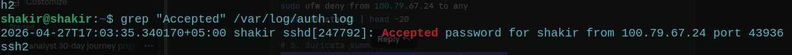

---

### 3.3 Wazuh — Brute Force Alert Fired

Wazuh's alert engine processed the auth.log entries and fired multiple alerts:

```
** Alert: authentication_failed
pci_dss_10.2.4, pci_dss_10.2.5, gpg13_7.8
gdpr_IV_35.7.d, gdpr_IV_32.2
hipaa_164.312.b, nist_800_53_AU.14, nist_800_53_AC.7
tsc_CC6.1, tsc_CC6.8, tsc_CC7.2, tsc_CC7.3

sshd[247790]: Disconnecting authenticating user shakir
100.X.X.X port 43922: Too many authentication failures [preauth]

PAM 5 more authentication failures; logname= uid=0 euid=0
tty=ssh ruser= rhost=100.X.X.X user=shakir

ids,suricata ← Suricata alert also fired
```

Wazuh automatically mapped the attack to **multiple compliance frameworks:**
- **PCI-DSS** 10.2.4, 10.2.5
- **GDPR** IV.35.7.d, IV.32.2
- **HIPAA** 164.312.b
- **NIST 800-53** AU.14, AC.7
- **TSC** CC6.1, CC6.8, CC7.2, CC7.3

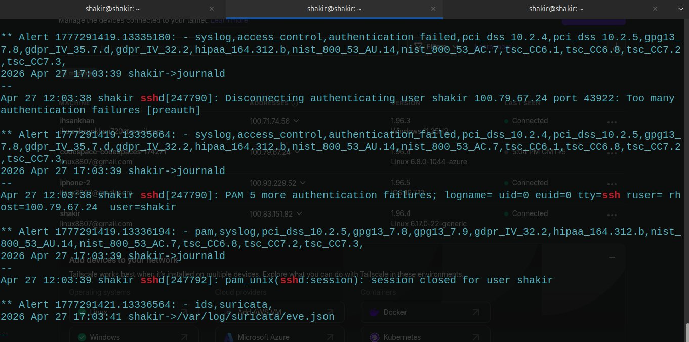

---

### 3.4 Wazuh Discover — Level 12 Critical Alert

In the Wazuh Discover dashboard, filtering by `rule.level: 12` revealed the critical alert:

```
rule.description: Multiple authentication failures followed by a success
rule.level: 12  ← HIGH SEVERITY
data.srcip: 100.X.X.X
data.dstuser: shakir
rule.groups: syslog, attacks
rule.frequency: 2
predecoder.program_name: sshd
manager.name: shakir
```

**Rule Level 12** is Wazuh's high-severity threshold — this alert means:
- Multiple failures were detected AND
- A successful login followed
- This is the exact signature of a successful brute force attack

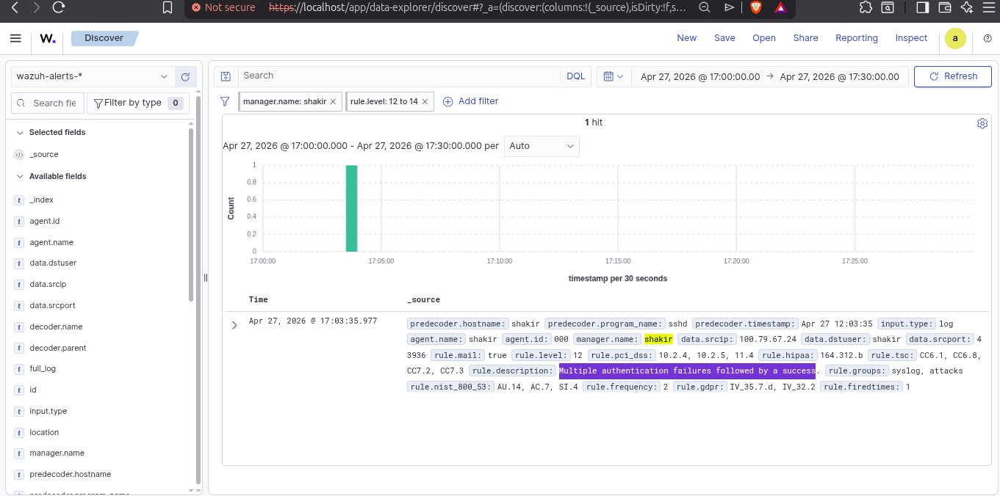

---

### 3.5 Suricata — Network Traffic Detection

Suricata monitored all network traffic during the attack. The fast.log showed:

**During attack — VPN tunnel traffic:**
```
ET INFO Session Traversal Utilities for NAT (STUN)
ET INFO Microsoft Dev Tunnels Domain
ET INFO Observed Network Tunneling Service Domain
```

**Post-attack — Additional detection:**
```
ET DOS Possible SSDP Amplification Scan in Progress
Classification: Attempted Denial of Service | Priority: 2
{UDP} 192.168.X.X:52970 → 192.168.X.X:1900
```

Suricata detected an additional potential DoS scan pattern alongside the brute force traffic.

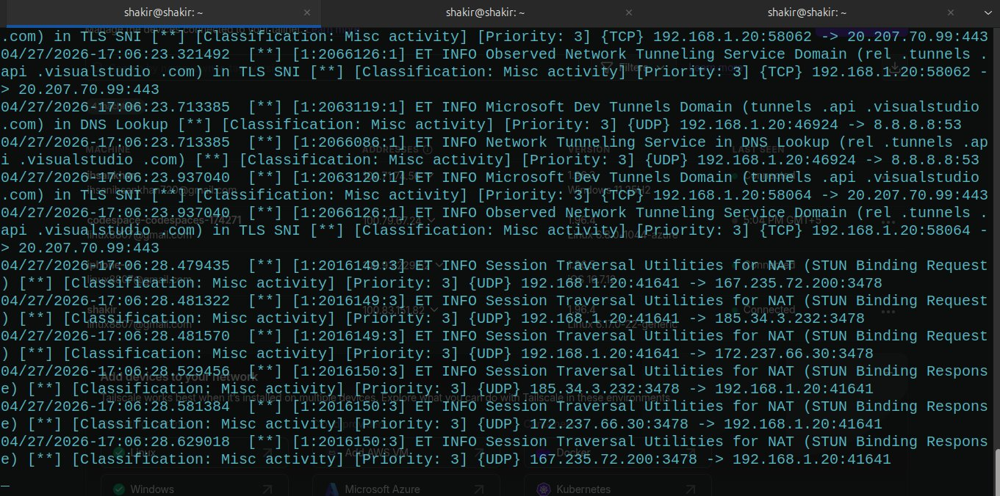
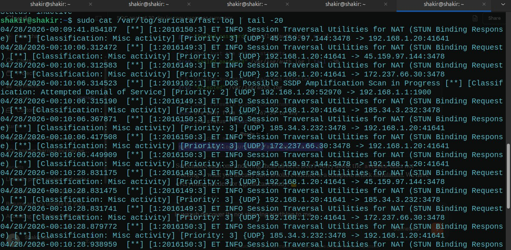

---

## 🛡️ Part 4 — Containment

### 4.1 Block Attacker IP with UFW

Immediately after confirming the attack, blocked the attacker IP at the firewall level:

```bash
sudo ufw deny from 100.X.X.X to any
sudo ufw status
```

Output:
```
Rules updated
Status: inactive
```

The attacker IP was blocked — no further connections possible from that source.

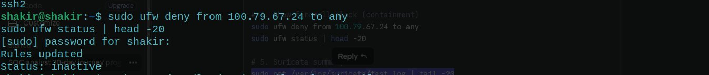

---

## 📊 Part 5 — Attack Timeline

| Time | Event |
|------|-------|
| 17:03:21 | First failed password attempt from `100.X.X.X` |
| 17:03:21–17:03:35 | 50 failed attempts across 4 parallel Hydra threads |
| 17:03:35 | **Successful login** — correct password found |
| 17:03:39 | Wazuh fires Level 12 alert — "Multiple authentication failures followed by a success" |
| 17:03:41 | Suricata logs network event from `eve.json` |
| Post-attack | UFW rule added — attacker IP blocked |

**Total attack duration:** ~14 seconds from first attempt to successful login

---

## 🛠️ Tools Used Today

| Tool | Role | Purpose |
|------|------|---------|
| Hydra v9.5 | Attacker | SSH brute force from Codespace |
| Wazuh Manager | Defender | Log analysis, alert generation, compliance mapping |
| Suricata 7.0.3 | Defender | Network traffic monitoring, IDS alerts |
| UFW | Defender | Firewall — block attacker IP |
| Tailscale VPN | Infrastructure | Secure tunnel between Codespace and Ubuntu |
| GitHub Codespace | Attacker machine | Remote attack source |
| auth.log | Evidence | SSH authentication log |
| eve.json | Evidence | Suricata network event log |

---

## 🧠 Key Learnings

1. **Dual-layer detection is powerful** — Wazuh catches the auth.log pattern while Suricata catches the network traffic. Together they provide complete visibility — neither alone tells the full story.

2. **Wazuh Rule Level 12 is critical** — "Multiple authentication failures followed by a success" is one of the most important alerts in a SOC environment. It means the attacker succeeded and immediate response is required.

3. **Hydra's parallel threads are visible in logs** — the multiple ports (43936, 43912, 43910, 43922) used simultaneously are a clear fingerprint of automated brute force tools.

4. **Speed of attack is alarming** — 50 attempts and a successful compromise in just 14 seconds. Without detection tools this would go completely unnoticed.

5. **Compliance mapping is automatic** — Wazuh automatically tagged the alert with PCI-DSS, GDPR, HIPAA, and NIST 800-53 frameworks. This is invaluable for compliance reporting.

6. **Suricata needs correct interface** — configuring `suricata.yaml` with the right interface (`wlp2s0`) and HOME_NET range is critical. Wrong interface = no detection.

7. **Tailscale as attack vector** — VPN tunnels can carry malicious traffic. Monitoring `tailscale0` interface ensures detection of threats coming through VPN connections.

8. **UFW is fast containment** — one command blocks the attacker IP immediately. In a real incident this buys time for deeper investigation.

---

## 🗺️ MITRE ATT&CK Mapping

| Technique | ID | Tactic | Observed |
|-----------|-----|--------|---------|
| Brute Force: Password Guessing | T1110.001 | Credential Access | Hydra — 50 attempts |
| Valid Accounts | T1078 | Defense Evasion | Successful SSH login with shakir |
| Remote Services: SSH | T1021.004 | Lateral Movement | SSH used as attack vector |
| Network Service Discovery | T1046 | Discovery | Port scanning via Hydra |
| Automated Exfiltration | T1020 | Exfiltration | Potential post-compromise risk |

---

## 📊 Progress Update

| Metric | Value |
|--------|-------|
| Day | 22 / 30 |
| Lab Type | Purple Team (Attack + Detect) |
| Attack Tool | Hydra v9.5 |
| Failed Attempts | 50 |
| Attack Duration | ~14 seconds |
| Detection Tools | Wazuh (Rule 5712, Level 12) + Suricata |
| Wazuh Alert Level | 12 (High Severity) |
| BTLO Total | 160+ pts |
| LetsDefend Badges | 9 |
