# Day 23 — OSINT for SOC: Threat Intelligence Tools + TryHackMe Rooms + Shodan + AbuseIPDB

**Date:** May 11, 2026
**Platforms:** TryHackMe + Shodan + AbuseIPDB + URLScan + ThreatFox + VirusTotal + Cisco Talos + Epieos + IPInfo
**Category:** OSINT | Threat Intelligence | Digital Forensics
**Difficulty:** Easy → Medium
**TryHackMe Points Earned:** 152 pts (Threat Intelligence Tools) + 180 pts (Have a Break)
**Total BTLO Points So Far:** 160+ pts

---

## 🎯 Objectives

- Complete TryHackMe **Threat Intelligence Tools** room (9 tasks, 152 pts)
- Complete TryHackMe **Have a Break** OSINT challenge room (180 pts)
- Perform hands-on OSINT investigation using Shodan, AbuseIPDB, URLScan, ThreatFox, Feodo Tracker, SSL Blacklist, URLhaus, PhishTool, and Cisco Talos
- Investigate real malware samples, phishing emails, and suspicious IPs
- Practice domain enumeration using `whois` and `dig` on a real phishing domain from Day 15

---

## 📚 Part 1 — TryHackMe: Threat Intelligence Tools Room

**Room:** `tryhackme.com/room/threatinteltools`
**Tasks:** 9 | **Points:** 152 | **Completed:** 100% ✅

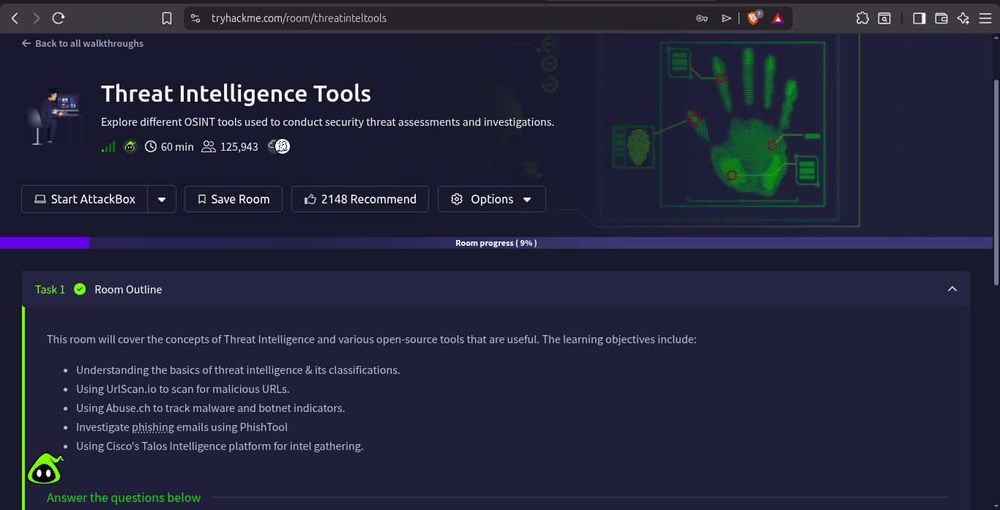

---

### 1.1 Threat Intelligence Classifications

Threat Intelligence is geared toward understanding the relationship between the operational environment and the adversary. The four classifications covered:

| Type | Description | Audience |
|------|-------------|----------|
| **Strategic Intel** | High-level intel on threat landscape and risk areas based on trends and patterns | Executives, Board |
| **Technical Intel** | Evidence and artefacts of attacks — used by IR teams to create attack surface baselines | IR Teams, Analysts |
| **Tactical Intel** | Assesses adversaries' TTPs to strengthen security controls through real-time investigations | SOC Analysts |
| **Operational Intel** | Looks into adversary motives and intent — identifies critical assets that may be targeted | Security Managers |

Key insight: as a SOC analyst, I work primarily with **Technical** and **Tactical** intelligence — IOCs and TTPs that feed directly into detection and response.

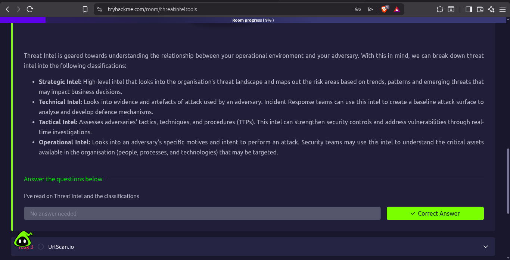

---

### 1.2 URLScan.io

**URLScan.io** is a free service that automates the browsing and crawling of websites to record all activities and interactions. When a URL is submitted, it records:
- Domains and IPs contacted
- Resources requested
- A visual screenshot of the page
- Technologies used
- SSL certificate details
- HTTP transactions

**Practical investigation — `www.dot-games.org`:**

The scan revealed:
- Submitted URL redirected to `algoresfloridamyserver.com` (2 days old)
- Effective URL resolved to `www.dot-games.org` — a Minecraft hosting blog (3 years old)
- Main IP: `2a02:26f0:b700:3::210:cc8e` — located in **Hamburg, Germany**, belonging to **AKAMAI-ASN1**
- Contacted **17 IPs** across **2 countries** with **61 HTTP transactions**
- TLS certificate issued by Go Daddy Secure Certificate Authority — valid 1 year
- **Verdict: No classification** (clean) ✅

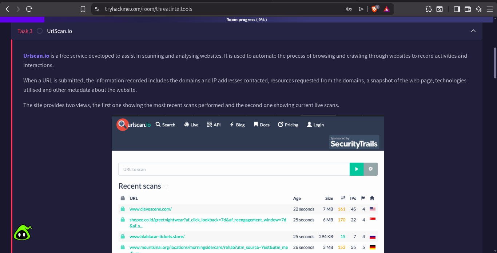
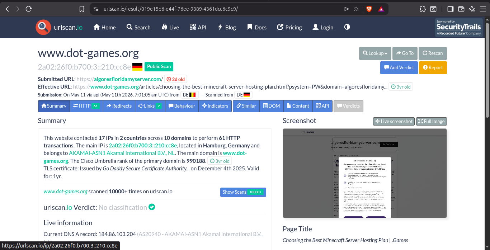

---

### 1.3 Abuse.ch — The 5 Platforms

**Abuse.ch** is a research project by the Institute for Cybersecurity and Engineering at Bern University of Applied Sciences, Switzerland. It provides five operational threat intelligence platforms:

| Platform | Purpose |
|---------|---------|
| **MalwareBazaar** | All-in-one malware collection and analysis database — upload samples, hunt by YARA/ClamAV rules |
| **FeodoTracker** | Tracks botnet C&C infrastructure — Emotet, Dridex, TrickBot, QakBot, BazarLoader |
| **SSL Blacklist (SSLBL)** | Identifies malicious SSL certificates and JA3 fingerprints used by botnet C&C servers |
| **URLhaus** | Shares malicious URLs used for malware distribution — searchable by domain, URL, hash, filetype |
| **ThreatFox** | Shares and exports IOCs — MISP events, Suricata IDS ruleset, DNS RPZ, JSON, CSV |

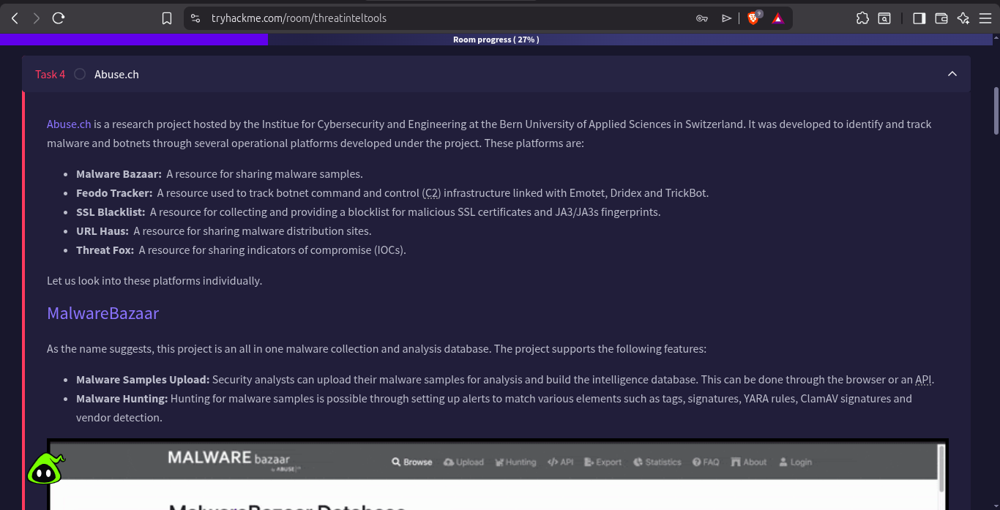

---

### 1.4 FeodoTracker — Botnet C&C Investigation

**FeodoTracker** shares intelligence on botnet Command & Control servers associated with **Dridex, Emotet (Heodo), TrickBot, QakBot, and BazarLoader**. It provides IP/IOC blocklists and mitigation guidance.

**Investigation — IP `178.134.47.166`:**

| Field | Value |
|-------|-------|
| IP Address | 178.134.47.166 |
| Hostname | 178-134-47-166.dsl.utg.ge |
| AS Number | AS35805 |
| AS Name | SILKNET-AS |
| Country | Georgia 🇬🇪 |
| First Seen | 2021-04-22 22:04:30 UTC |
| Last Online | 2022-04-04 12:xx:xx UTC |

This IP was a known **botnet C&C server** — now offline but historically used for malware command and control.

The room also showed the **FeodoTracker live dashboard** with active and offline C&C servers across QakBot, Emotet, and other malware families — including entries from Pakistan (PK Telecom AS), Mexico (Uninet), and Australia (Microplex PTY).

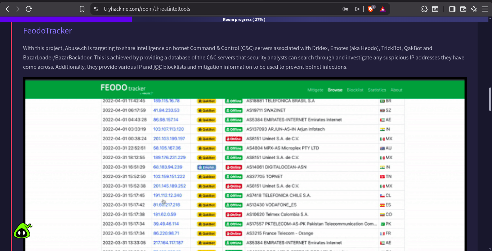
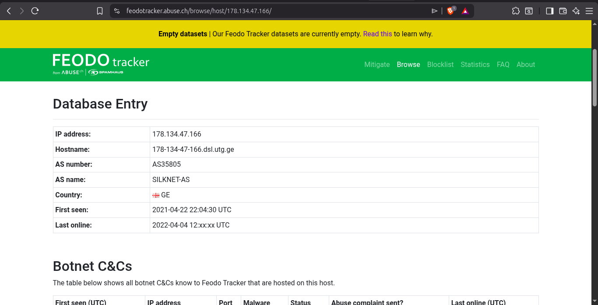

---

### 1.5 SSL Blacklist — JA3 Fingerprint Investigation

**SSL Blacklist (SSLBL)** detects malicious SSL connections by blacklisting SSL certificates used by botnet C&C servers. It also identifies **JA3 fingerprints** — a method to fingerprint SSL/TLS client applications to detect malware traffic at the TCP layer.

**Investigation — JA3 fingerprint `7e60f3980eea90869b68c58a8`:**

| Field | Value |
|-------|-------|
| Listing Date | 2018-12-17 07:47:19 UTC |
| JA3 Fingerprint | `51c64c77e60f3980eea90869b68c58a8` |
| Listing Reason | **Dridex** banking trojan |
| Malware Samples | 304,943 |

This JA3 fingerprint is associated with **Dridex** — a banking trojan known for credential theft and financial fraud. The massive 304,943 sample count confirms how widespread this threat actor's infrastructure was.

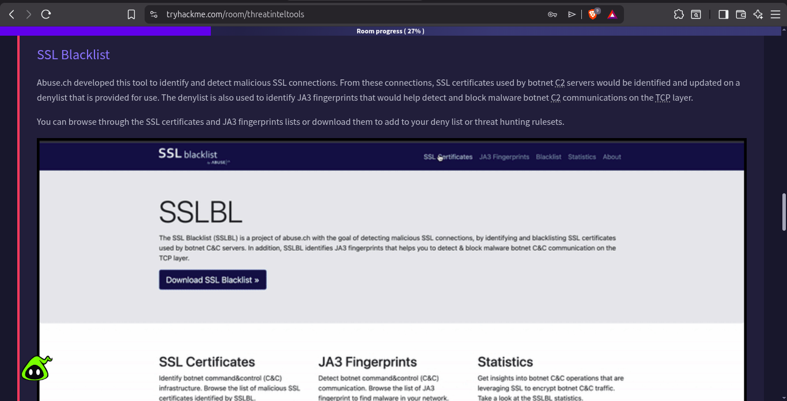
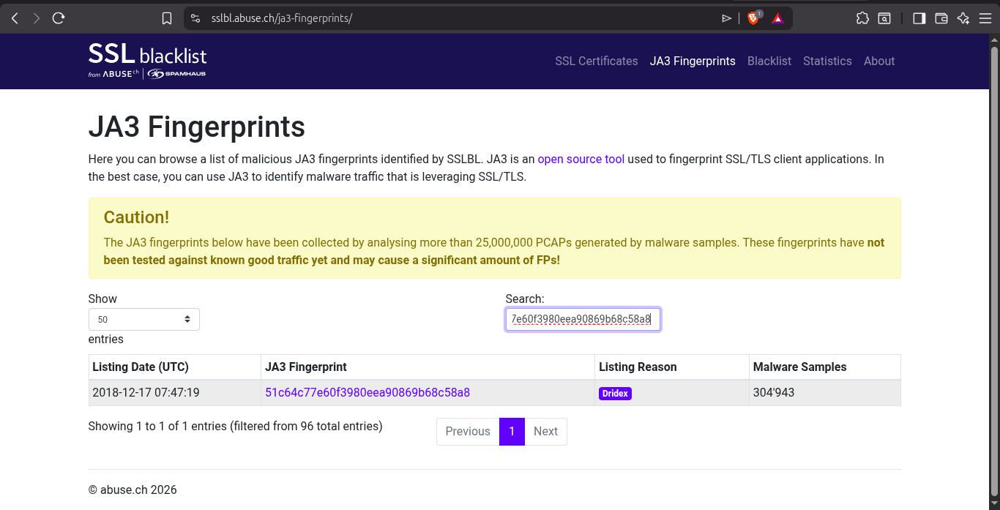

---

### 1.6 URLhaus — Malware Distribution URL Investigation

**URLhaus** focuses on sharing malicious URLs used for malware distribution. Analysts can search by domain, URL, hash, or filetype.

**Investigation — `http://218.58.2.226:51002/Mozi.m`:**

| Field | Value |
|-------|-------|
| ID | 2131004 |
| URL | `http://218.58.2.226:51002/Mozi.m` |
| URL Status | 🔴 **Online** (active!) |
| Host | 218.58.2.226 |
| Date Added | 2022-04-04 16:51:06 UTC |

This URL was distributing **Mozi** — a botnet malware that targets routers and IoT devices to conduct DDoS attacks and mine cryptocurrency.

**ASN Investigation — AS14061 (DIGITALOCEAN-ASN):**
URLhaus also showed the ASN report for **DigitalOcean (AS14061)** — a major cloud provider frequently abused by malware operators to host C&C infrastructure due to its ease of provisioning and anonymity.

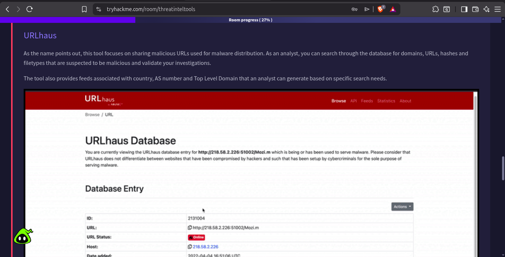
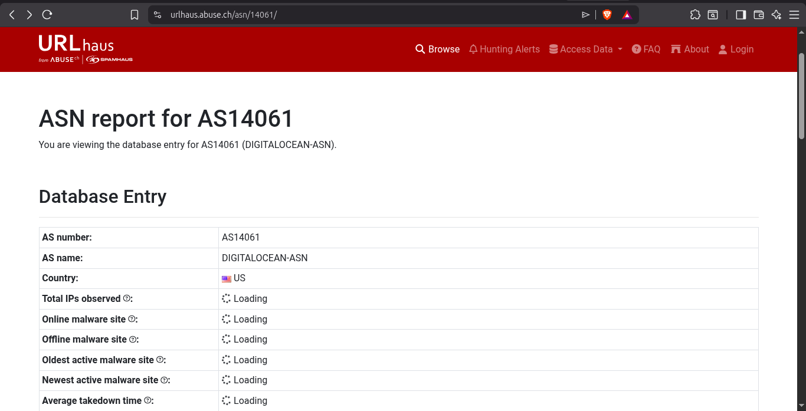

---

### 1.7 ThreatFox — IOC Database Investigation

**ThreatFox** allows analysts to search, share, and export IOCs in multiple formats including MISP events, Suricata IDS rulesets, DNS RPZ, JSON, and CSV files.

**Investigation 1 — Emotet hash IOC:**

| Field | Value |
|-------|-------|
| IOC ID | 489566 |
| IOC (SHA256) | `074fe207b3d855ca464e4bb3a7cecb46b755570cdc29bc5e477a7e31d59fc553` |
| IOC Type | sha256_hash |
| Threat Type | payload |
| Malware | **Emotet** |
| Malware Alias | Geodo, Heodo |
| Confidence Level | 🟢 **High (100%)** |
| First Seen | 2022-04-04 16:54:04 UTC |

**Investigation 2 — Mirai C&C IOC:**

Searching `ioc:212.192.246.30:5555` in ThreatFox:

| Field | Value |
|-------|-------|
| IOC | `212.192.246.30:5555` |
| Malware | **Mirai** |
| Tags | Mirai |
| Reporter | abuse_ch |
| Date | 2022-03-15 07:20 UTC |

The Mirai botnet page (`elf.mirai`) showed:
- **Malware alias:** Katana
- **First seen:** 2020-12-27
- **Last seen:** 2026-05-10 (still active!)
- **Number of IOCs:** 26,224

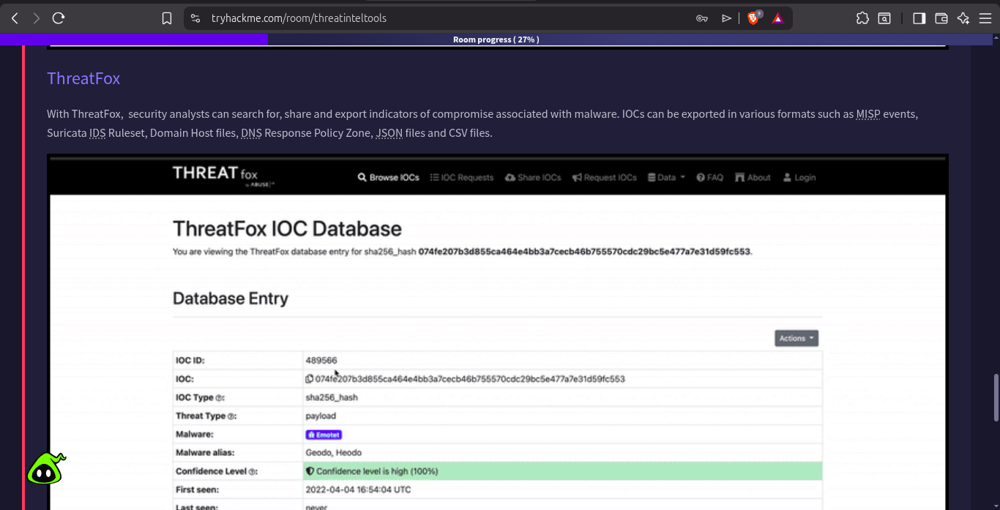
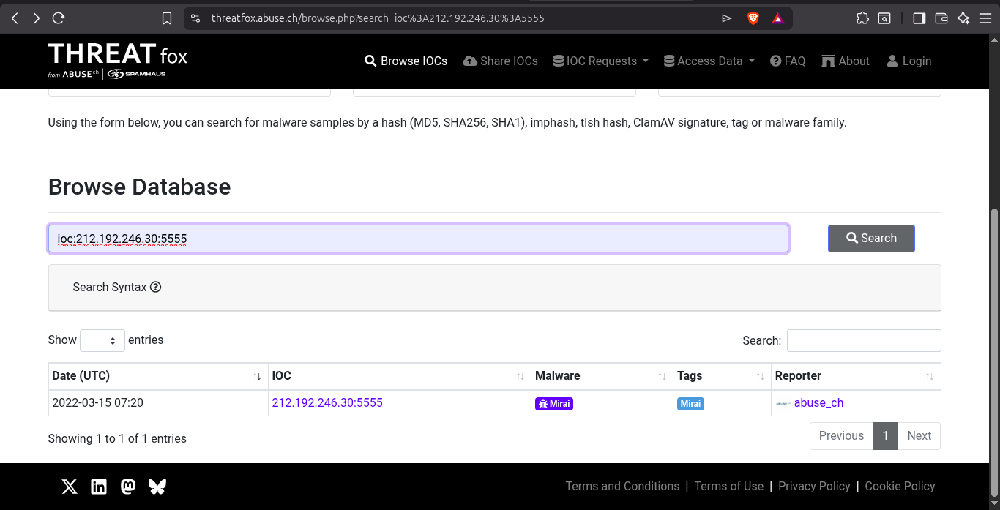
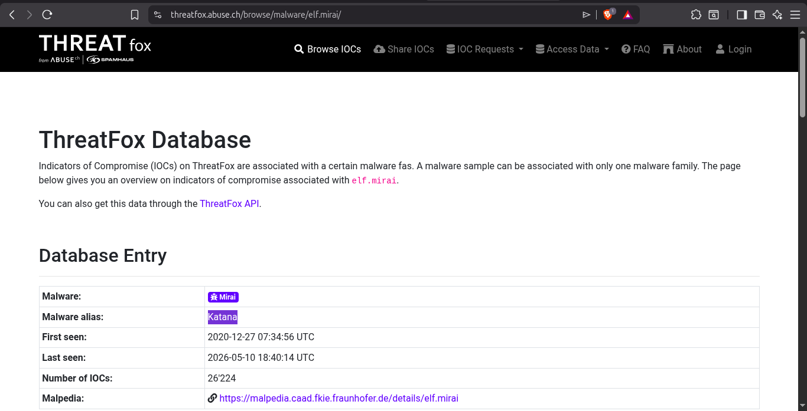

---

### 1.8 PhishTool — Email Phishing Analysis

**PhishTool** elevates the perception of phishing as a severe attack form and provides a rapid means of email security analysis. It allows analysts to:
- Uncover email IOCs
- Prevent breaches through email investigation
- Produce forensic reports
- Prevent containment and enable training engagements

In the room, PhishTool was used alongside **Mozilla Thunderbird** to analyze phishing emails. The analysis revealed:

- **X-Sender-IP:** `204.93.183.11` (the originating server IP)
- **X-MS-Exchange-Organization-AuthAs:** Anonymous
- **X-SID-PRA:** `DARKABUTLA@SC500.WHPSERVERS.COM`
- The email passed through **4 hops** before reaching the recipient
- Remote content was blocked by Thunderbird to protect privacy

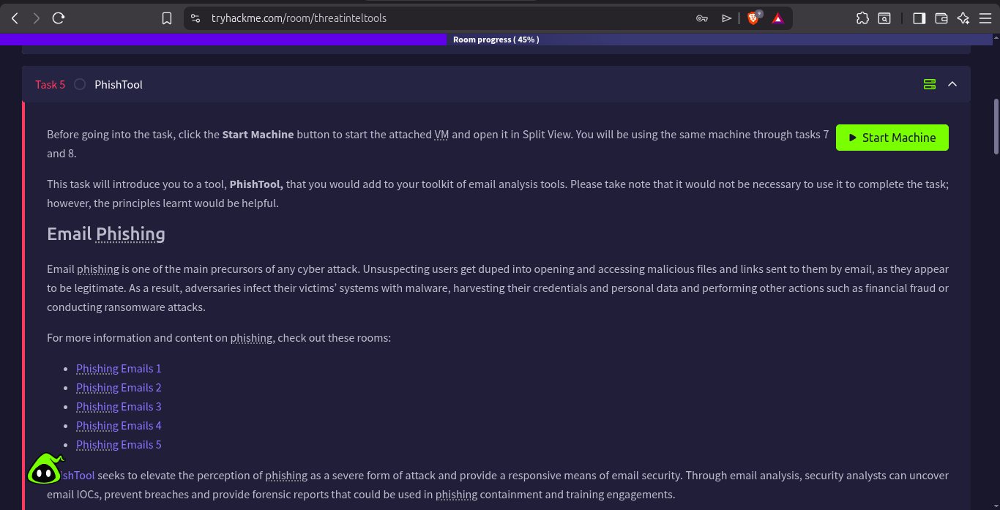
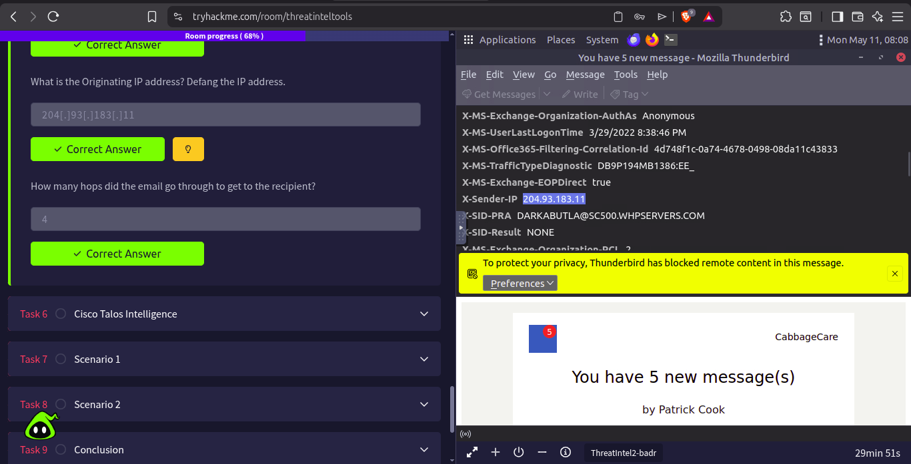

---

### 1.9 Cisco Talos Intelligence

**Cisco Talos** is one of the largest commercial threat intelligence teams in the world. It encompasses six key teams:

| Team | Function |
|------|---------|
| **Threat Intelligence & Interdiction** | Quick correlation and tracking — turns IOCs into context-rich intel |
| **Detection Research** | Vulnerability and malware analysis to create detection rules |
| **Engineering & Development** | Maintains infrastructure and tools for threat identification |
| **Vulnerability Research & Discovery** | Works with vendors to develop repeatable vulnerability identification |
| **Communities** | Maintains open-source solutions |
| **Global Outreach** | Disseminates intelligence through publications |

**Investigation — Originating IP `204.93.183.11`:**

Talos Intelligence lookup revealed:
- **Domain:** whpservers.com
- **Hostname:** 204.93.183.11
- **Network Owner:** DEFT.COM
- **Web Reputation:** Neutral
- This was the email server IP from the PhishTool analysis

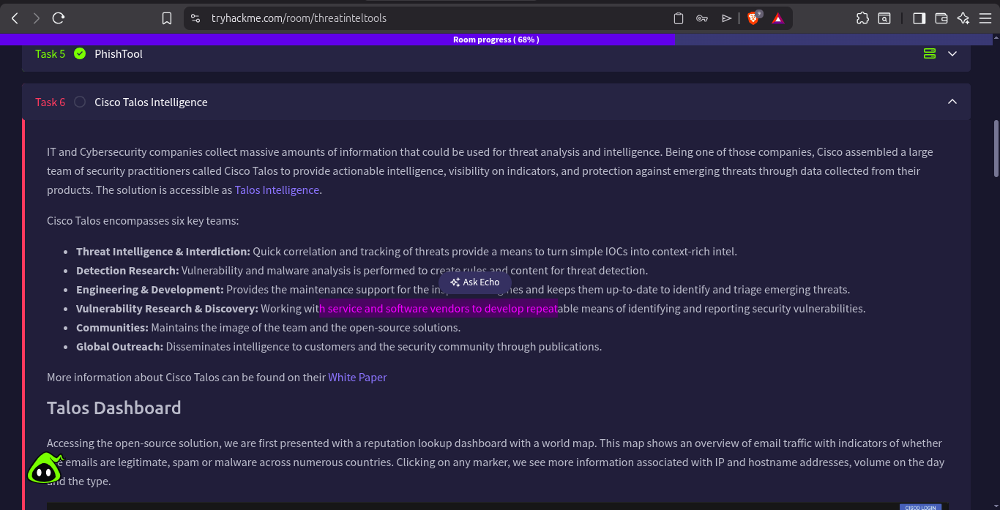
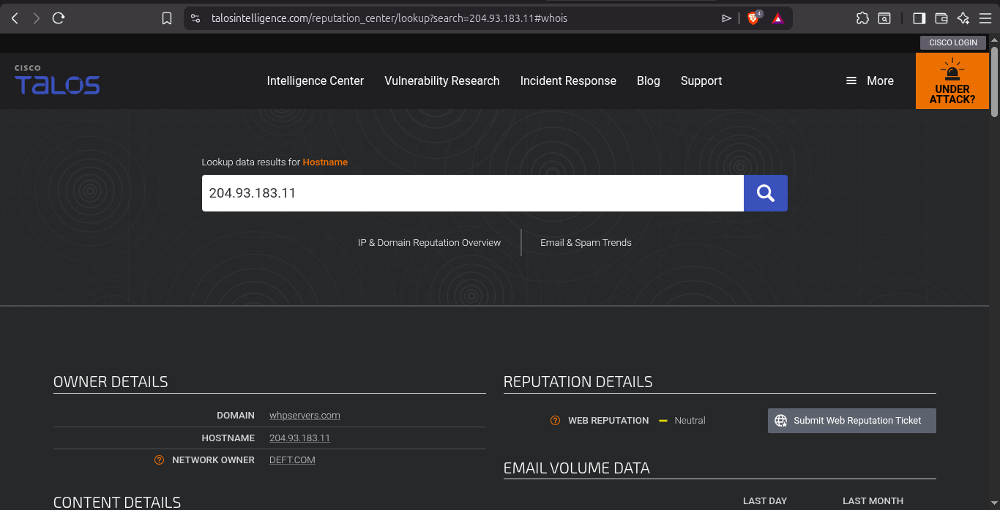

---

### 1.10 Scenario 1 — Email2.eml Investigation

Using the TryHackMe AttackBox with Thunderbird and the provided email files:

```bash
cd Desktop/
ls
# Emails  mate-terminal.desktop  thunderbird.desktop
cd Emails/
ls
# Email1.eml  Email2.eml  Email3.eml
sha256sum Email2.eml
# 97028b1b198af6da1043b78e40e1efe519fe3def754cd9d1f29380ca11e5c361
```

**Findings from Email2.eml:**
- **Recipient:** `chris.lyons@supercarcenterdetroit.com` ✅
- **SHA256 hash** used to look up on VirusTotal
- **First submission on VirusTotal:** **2017** ✅

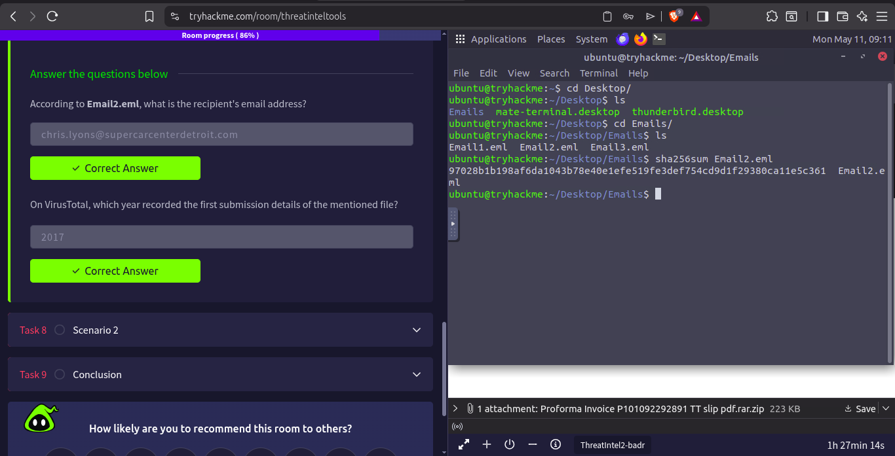

---

### 1.11 Scenario 2 — Email3.eml Investigation (Dridex)

```bash
sha256sum Email3.eml
# f4d97603256a36e81bfe7ef5e0ccaee44f77de6bb041fa41f0b3a0db53f4aba9
```

VirusTotal analysis of Email3.eml:

| Field | Value |
|-------|-------|
| Detection | **32/62 security vendors flagged as malicious** |
| File Name | Email3.eml |
| Size | 114.55 KB |
| Tags | `email`, `spreader` |
| Popular Threat Label | `trojan.dridex/x97m` |
| Threat Categories | trojan, downloader, dropper |
| Family Labels | dridex, x97m, w97m |

**Answers:**
- **Attachment name:** `Sales_Receipt 5606.xls` ✅
- **Malware family:** **Dridex** ✅ (a notorious banking trojan)

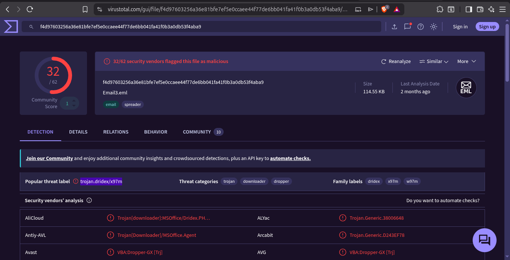
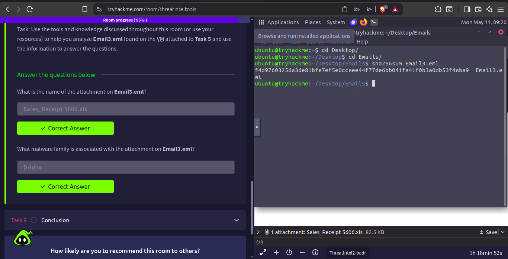

---

### 1.12 ✅ Room Completed — 152 Points

**TryHackMe: Threat Intelligence Tools** — Room completed with 9/9 tasks and 152 points earned.

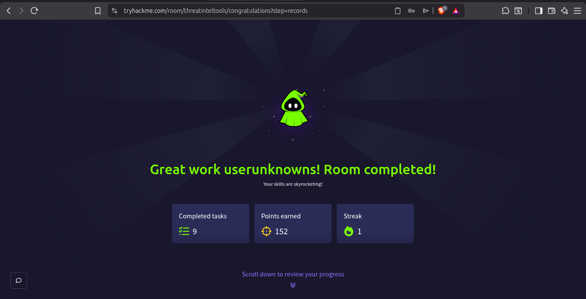
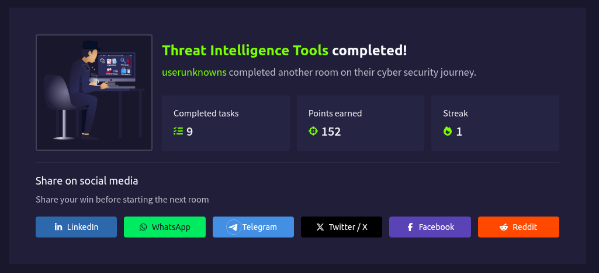

---

## 🔍 Part 2 — Hands-On OSINT Investigation

### 2.1 Shodan — Internet Intelligence

**Shodan** (`shodan.io`) is a search engine for internet-connected devices. SOC analysts use it to:
- Check what services an IP is exposing
- Identify vulnerable or misconfigured systems
- Understand an organization's attack surface
- Research threat actor infrastructure

**Search 1 — `port:22 country:PK` (Exposed SSH servers in Pakistan):**

Results: **17,958 exposed SSH servers** in Pakistan!

| City | Count |
|------|-------|
| Karachi | 5,778 |
| Lahore | 4,825 |
| Rawalpindi | 1,735 |
| Islamabad | 1,177 |
| Faisalabad | 800 |

Top organizations with exposed SSH: Pakistan Telecommunication (2,445), Worldcall Telecom (1,708), National WiMax/IMS (1,151)

This is alarming — thousands of SSH services exposed to the internet with no protection are prime targets for brute force attacks like the one we simulated on Day 22.

**Search 2 — `apache country:PK` (Exposed Apache web servers in Pakistan):**

Results: **14,621 exposed Apache servers**

- Karachi: 5,346 | Lahore: 5,318 | Rawalpindi: 1,511
- Top ports: 80 (3,415), 443 (2,839), 8080 (326)
- First result tagged as **honeypot** — showing Shodan even identifies honeypots
- Second result showed a KSBL login page running Apache 2.4.56 with PHP 8.2.4

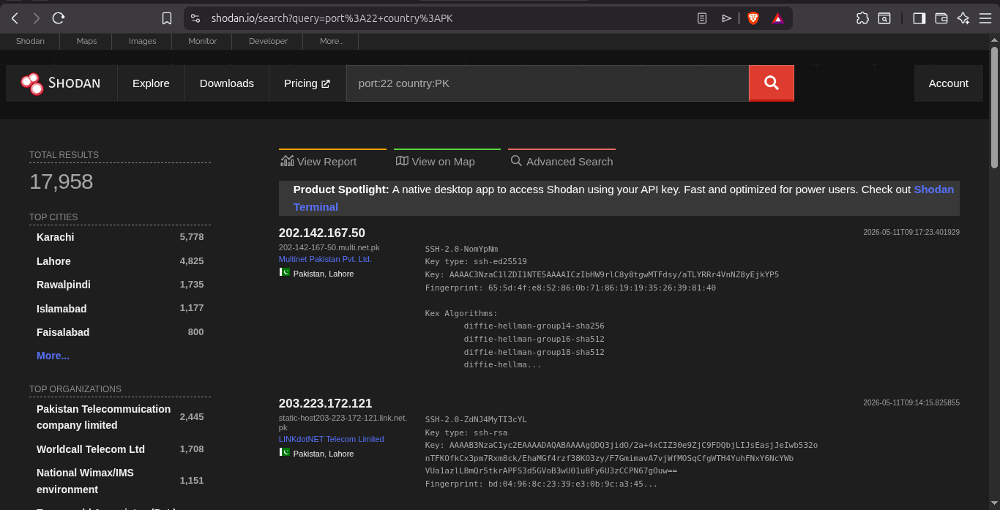
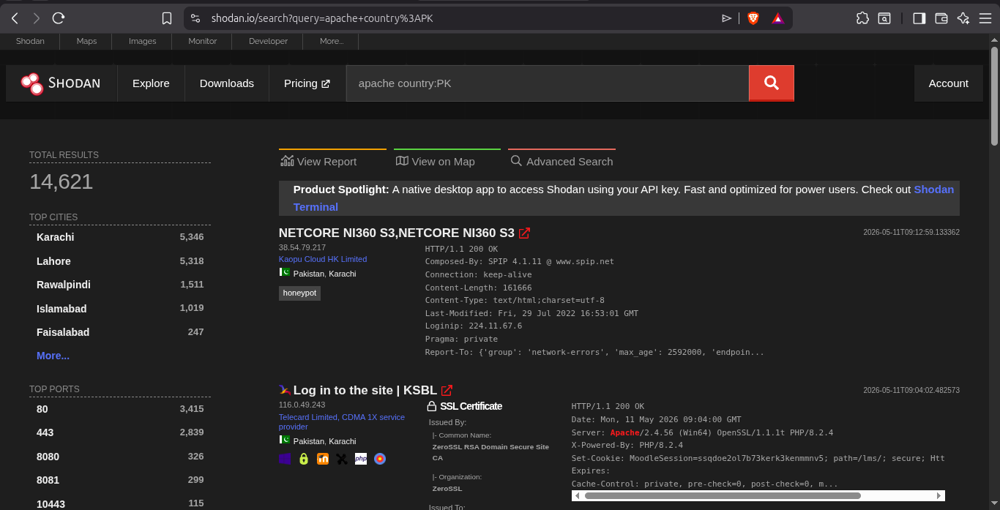

---

### 2.2 AbuseIPDB — Known Malicious IP Lookup

**AbuseIPDB** is a crowdsourced database where security professionals report malicious IPs. SOC analysts check this for every suspicious IP in an alert.

**Investigation — `185.220.101.1` (Known Tor Exit Node):**

| Field | Value |
|-------|-------|
| Reports | **6,625 times** |
| Confidence of Abuse | **100%** 🔴 |
| ISP | Artikel10 e.V. |
| Usage Type | Commercial |
| ASN | AS60729 |
| Hostname | berlin01.tor-exit.artikel10.org |
| Domain | artikel10.org |
| Country | Germany 🇩🇪 |
| City | Berlin |
| Note | ⚠️ This address is a Tor exit node |

**Key finding:** This IP has been reported 6,625 times with 100% abuse confidence. It's a known Tor exit node — which means attackers route traffic through it to anonymize their origin. Any alert from this IP should be treated as high priority.

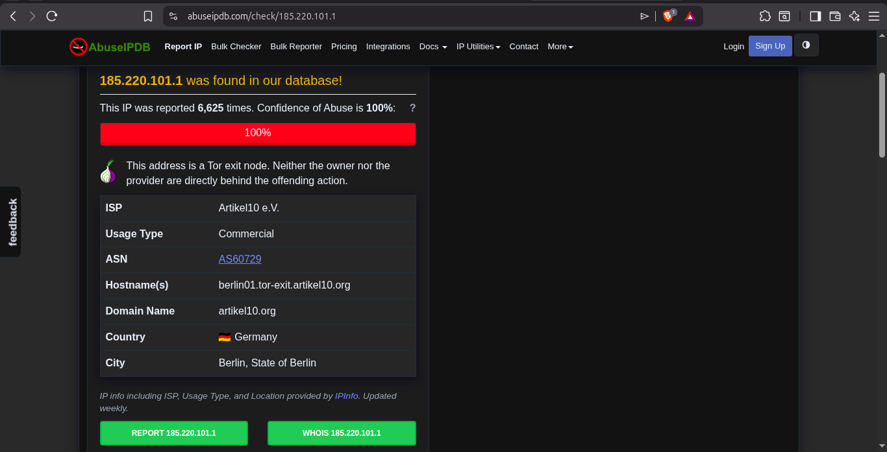

---

### 2.3 Terminal — Whois & Dig on Phishing Domain

Investigated `zyevantoby.cn` — the phishing domain from the **Day 15 phishing email** case where the attacker impersonated Amazon.

```bash
whois zyevantoby.cn
# No matching record.
# Domain has been taken down / no registration data available
# This confirms it was likely a temporary attack domain

dig zyevantoby.cn ANY
# ;; ->>HEADER<<- opcode: QUERY, status: NXDOMAIN, id: 57634
# ;; flags: qr rd ra; QUERY: 1, ANSWER: 0, AUTHORITY: 1, ADDITIONAL: 1
# zyevantoby.cn.    10800  IN  SOA  a.dns.cn. root.cnnic.cn.
# Status: NXDOMAIN — domain no longer exists
```

**Analysis:**
- **Whois:** No matching record — the domain was registered anonymously or has been removed
- **DNS Status: NXDOMAIN** — the domain no longer resolves, confirming it was a temporary attack infrastructure
- **Authority:** SOA record pointing to `a.dns.cn` / `root.cnnic.cn` — Chinese DNS root, consistent with the `.cn` TLD used by the attacker
- This is a classic pattern: attackers register cheap disposable domains, use them briefly for a campaign, then abandon them

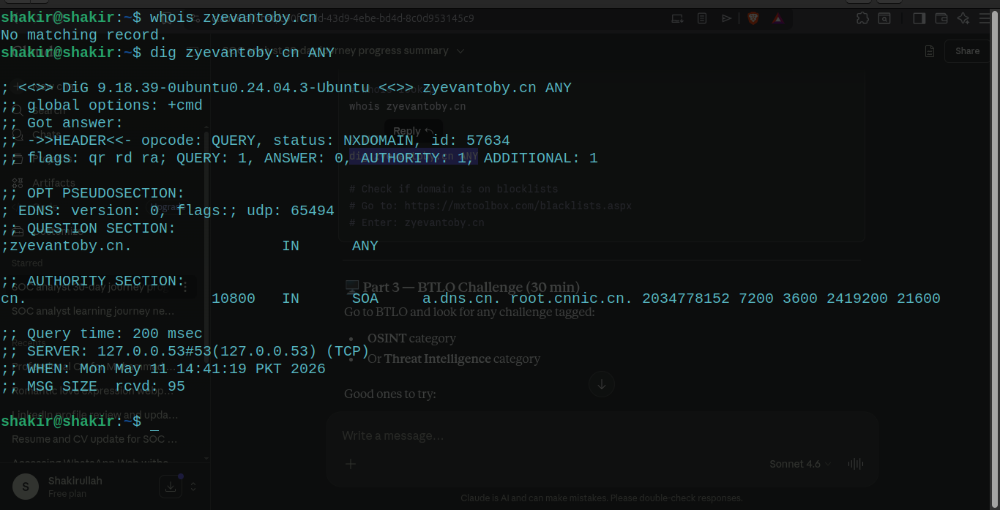

---

## 🕵️ Part 3 — TryHackMe: Have a Break (OSINT Challenge Room)

**Room:** `tryhackme.com/room/haveabreak`
**Theme:** Uncover the mystery behind the KitKat heist
**Points:** 180 | **Tasks:** 1 | **Completed:** 100% ✅

This room used pure OSINT techniques to investigate a fictional corporate incident involving leaked data, employee information, and digital footprints.

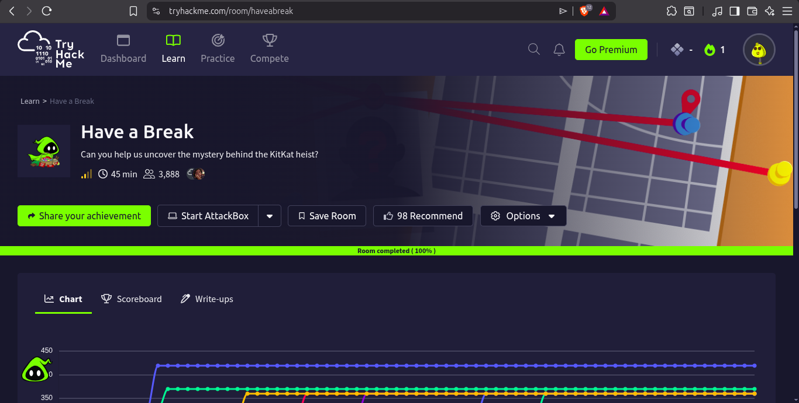

---

### 3.1 File Access Log Analysis

Analyzed a file access log (`transeuro_data`) containing employee file activity:

```
2026-03-25,09:20:33,BR-0204,ROUTE_CZ_SK_Q1_2026.pdf,VIEW
2026-03-25,09:21:14,BR-0204,ROUTE_AT_HU_Q1_2026.pdf,VIEW
...
2026-03-25,22:14:09,BR-0291,ROUTE_IT_PL_Q1_2026.pdf,EXPORT ← suspicious!
...
2026-03-27,09:12:07,BR-0291,ROUTE_IT_PL_Q1_2026.pdf,ACCESS_DENIED
2026-03-27,09:14:33,BR-0204,ROUTE_IT_PL_Q1_2026.pdf,ACCESS_DENIED
```

**Key finding:** Employee **BR-0291** exported `ROUTE_IT_PL_Q1_2026.pdf` at 22:14 on March 25 — outside business hours. The next day (March 27), multiple employees started getting ACCESS_DENIED on the same files — indicating a security response was triggered.

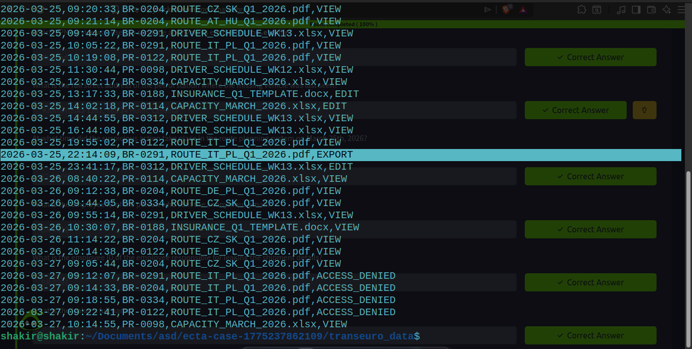

---

### 3.2 Employee Data Leak Investigation

Analyzed a leaked `employees.csv` file containing company employee data:

```
employee_id,role,office,hometown,email
BR-0188,Finance & Compliance,Brno,Brno,br0188@transeuro-log.cz
BR-0204,Route Planner,Brno,Zlín,br0204@transeuro-log.cz
BR-0255,IT Systems,Brno,Brno,br0255@transeuro-log.cz
BR-0291,Route Planner,Brno,Králice nad Oslavou,br0291@transeuro-log.cz
BR-0312,Dispatch Operator,Brno,Olomouc,br0312@transeuro-log.cz ← highlighted
...
```

The highlighted employee **BR-0312** (Dispatch Operator, Olomouc) was identified as a key person of interest in the investigation — cross-referenced with the file access anomaly found in the logs.

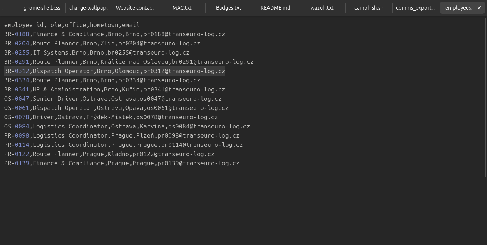

---

### 3.3 IP Geolocation — IPInfo Investigation

**Investigation — `193.32.249.132`:**

| Field | Value |
|-------|-------|
| Location | Amsterdam, North Holland 🇳🇱 |
| ASN | AS39351 |
| Company | 31173 Services AB |
| Hostname | — |
| Range | 193.32.249.0/24 |
| Privacy | ✅ true |
| AS Type | Hosting |
| Abuse Contact | abuse-cust-nl@31173.se |

**Key finding:** The IP belongs to a **hosting provider** in Amsterdam with Privacy flag set to `true` — commonly used by VPN services or anonymous hosting. Hosting IPs in Amsterdam are frequently used as attack infrastructure due to permissive hosting policies.

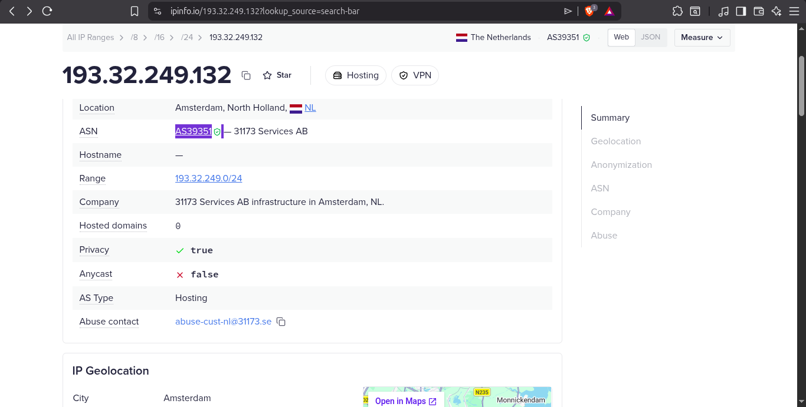

---

### 3.4 Email OSINT — Epieos

**Epieos** (`epieos.com`) is an OSINT tool that can check if an email address is linked to a Google account or has left Google Maps reviews.

**Investigation — `kraliknovak09@gmail.com`:**

- **Result:** 1 result found (4.8 seconds)
- Email is linked to a Google account
- Google Maps reviews were found

This led to further investigation through Google Maps to identify the physical location of the person of interest.


---

### 3.5 Google Maps OSINT

Following the Epieos lead, investigated the Google Maps profile:

**Reviewer Profile — Radovan Blšták:**
- Local Guide Level 1
- 4 points away from Level 2
- Reviews and photos examined for geographic clues
- Location identified: **Swat River area, Pakistan** visible in the map context

Also investigated a business address found in the data:
- **ORLEN Gas Station**, Kroměřížská 1281, 768 24 Hulín, Czechia
- Phone: +420 573 352 233
- What3Words: 8F82+7R Hulín, Czechia
- This was used to corroborate the physical location of a suspect

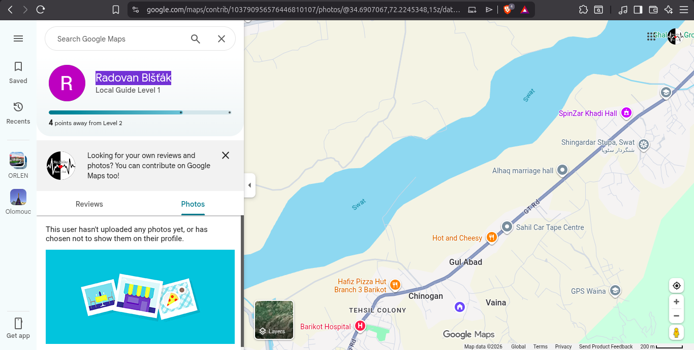
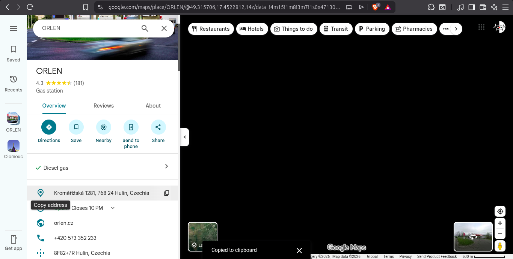

---

### 3.6 ✅ Have a Break Room Completed — 180 Points

**TryHackMe: Have a Break** — Room completed with 180 points earned.


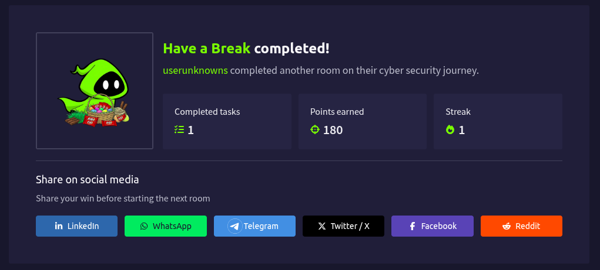

---

## 🛠️ Tools Used Today

| Tool | Category | Purpose |
|------|---------|---------|
| TryHackMe | Learning Platform | Threat Intelligence Tools + Have a Break rooms |
| URLScan.io | URL Analysis | Safe URL scanning, page screenshots, HTTP transactions |
| MalwareBazaar | Malware Intel | Malware sample database and hunting |
| FeodoTracker | Botnet Intel | Botnet C&C server tracking (Emotet, Dridex, QakBot) |
| SSL Blacklist | SSL Intel | Malicious SSL certificates and JA3 fingerprints |
| URLhaus | URL Intel | Malicious URL database for malware distribution |
| ThreatFox | IOC Database | IOC search, export in MISP/Suricata/JSON/CSV formats |
| PhishTool | Email Analysis | Phishing email IOC extraction and forensic reporting |
| Cisco Talos | Threat Intel | IP/domain reputation, email spam trends |
| VirusTotal | Multi-AV | File hash lookups, detection ratios, threat family identification |
| Shodan | Device Search | Internet-exposed device discovery, attack surface mapping |
| AbuseIPDB | IP Reputation | Crowdsourced malicious IP reporting and confidence scoring |
| Epieos | Email OSINT | Google account and Google Maps review lookup |
| IPInfo | IP Geolocation | IP geolocation, ASN, hosting type, privacy flags |
| Google Maps | Location OSINT | Physical location corroboration from digital footprints |
| whois | Domain OSINT | Domain registration lookup |
| dig | DNS Analysis | DNS record enumeration and NXDOMAIN confirmation |

---

## 🧠 Key Learnings

1. **Abuse.ch is a complete threat intel ecosystem** — MalwareBazaar, FeodoTracker, SSL Blacklist, URLhaus, and ThreatFox together cover malware samples, C&C servers, SSL fingerprints, malicious URLs, and IOCs. Every SOC analyst should have these bookmarked.

2. **JA3 fingerprints are powerful** — Unlike IP-based detection that changes constantly, JA3 fingerprints identify the TLS client behavior. Dridex had 304,943 malware samples all using the same JA3 fingerprint — one rule blocks them all.

3. **Shodan shows Pakistan's attack surface** — 17,958 exposed SSH servers and 14,621 exposed Apache servers in Pakistan alone. This is why Day 22's brute force attack was so realistic — these services are real targets.

4. **AbuseIPDB 100% = immediate block** — When an IP has 100% abuse confidence and thousands of reports, it goes on the blocklist without question. `185.220.101.1` (Tor exit node) is a prime example.

5. **NXDOMAIN confirms temporary attack infrastructure** — The phishing domain `zyevantoby.cn` from Day 15 is now NXDOMAIN — typical of threat actors who use disposable domains for one campaign then abandon them.

6. **Dridex loves Excel** — Email3.eml's attachment was `Sales_Receipt 5606.xls` — a malicious Excel file. This is a classic Dridex delivery mechanism — macro-enabled Office documents disguised as business documents.

7. **OSINT chains are powerful** — In the Have a Break room, a chain of: email → Epieos → Google account → Google Maps reviews → physical location demonstrated how public digital footprints can reveal real-world locations.

8. **File access logs tell a story** — Unusual EXPORT activity outside business hours (22:14) followed by ACCESS_DENIED events the next day is a classic insider threat or compromised account pattern.

9. **Hosting IPs with Privacy=true are suspicious** — `193.32.249.132` in Amsterdam with privacy flags set is a red flag — hosting providers that support anonymous services are commonly used for attack infrastructure.

---

## 🗺️ MITRE ATT&CK Mapping

| Technique | ID | Tactic | Observed In |
|-----------|-----|--------|-------------|
| Phishing: Spearphishing Attachment | T1566.001 | Initial Access | Dridex via Email3.eml (Sales_Receipt 5606.xls) |
| User Execution: Malicious File | T1204.002 | Execution | Dridex Excel macro execution |
| Command and Control | T1071 | C&C | FeodoTracker botnet C&C servers |
| Exfiltration Over Web Service | T1567 | Exfiltration | BR-0291 EXPORT outside hours |
| Gather Victim Network Info | T1590 | Reconnaissance | Shodan — exposed SSH/Apache servers |
| Search Open Technical Databases | T1596 | Reconnaissance | Shodan, AbuseIPDB, URLScan |
| Acquire Infrastructure: Domains | T1583.001 | Resource Dev | zyevantoby.cn — temp attack domain |
| Hide Infrastructure via Tor | T1090.003 | C&C | 185.220.101.1 Tor exit node |

---

## 📊 Progress Update

| Metric | Value |
|--------|-------|
| Day | 23 / 30 |
| TryHackMe Points Today | 152 + 180 = **332 pts** |
| TryHackMe Rooms Completed | 2 (Threat Intel Tools + Have a Break) |
| OSINT Tools Practiced | 16 tools |
| BTLO Total | 160+ pts |
| LetsDefend Badges | 9 |
| Days Complete | 23 / 30 |
