# Day 24 — TryHackMe SOC Level 1 Path: Junior Security Analyst, Kill Chains, Snort IDS & Windows Logging for SOC

**Date:** May 13, 2026
**Platform:** TryHackMe (Free Rooms)
**Path:** SOC Level 1
**Device:** Dell i3 3rd Gen, Ubuntu 24
**GitHub:** [SOC-Analyst-Journey](https://github.com/ShakiUllah/SOC-Analyst-Journey)

---

## Overview

Day 24 was a big one. I worked through multiple rooms in the TryHackMe **SOC Level 1** learning path, which is estimated at 65+ hours in total. I completed rooms I had not yet finished and revisited Snort — which I previously used during my internship — working through it again properly on TryHackMe's guided environment. By the end of the day, I had finished 5 rooms, earned the **Network Hog** badge, and accumulated **360 TryHackMe points** across just two rooms (232 pts for Snort + 128 pts for Windows Logging for SOC). This day was one of the heavier days mentally, especially the Windows Logging room, because Windows log handling is very different from Linux and honestly pretty confusing when you're used to simple text log files.

---

## Part 1 — TryHackMe SOC Level 1 Path Overview

**Room:** [tryhackme.com/paths](https://tryhackme.com/paths)

The SOC Level 1 path is TryHackMe's flagship blue team path. It is designed to train analysts who will work in a Security Operations Center — triaging alerts, investigating logs, working with SIEM tools, and responding to incidents. The path covers:

- Blue Team Introduction (SOC roles, analyst workflow)
- Cyber Defence Frameworks (Kill Chains, MITRE ATT&CK, Diamond Model)
- Cyber Threat Intelligence
- Network Security & Traffic Analysis (Snort, Zeek, Wireshark)
- Endpoint Security Monitoring (Windows logs, Sysmon)
- Security Information & Event Management (SIEM, ELK Stack)
- Digital Forensics & Incident Response (DFIR)

The estimated time is **65 hours 29 minutes**, which shows how broad and deep the content is.

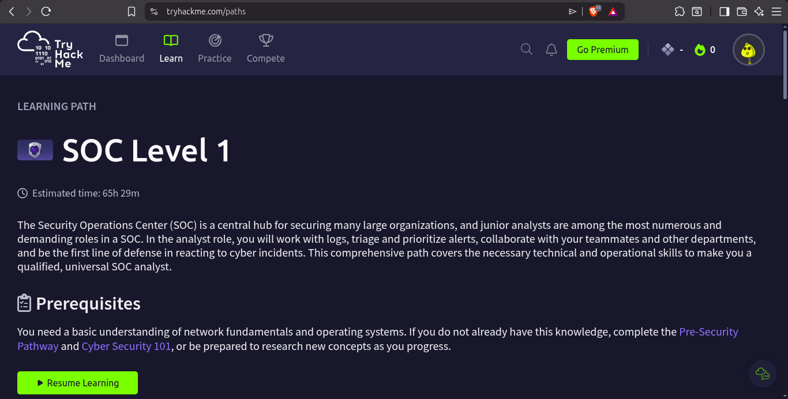

---

## Part 2 — Junior Security Analyst Intro (Room Completed 100%)

**Room:** [tryhackme.com/room/jrsecanalystintrouxo](https://tryhackme.com/room/jrsecanalystintrouxo)
**Difficulty:** Easy | **Time:** 15 min | **Users Completed:** 643,015+

This room introduced the role and daily responsibilities of a junior SOC analyst. It had 3 tasks, all completed successfully.

### Task 1 — Junior Security Analyst Journey

This task sets the scene: a junior analyst's job is to monitor alerts, triage incidents, escalate when needed, and protect the organization. It emphasized that the analyst is the **first line of defense**.

Key takeaway: Being a security analyst is not just about technical skills — it is about consistent vigilance, communication with teammates, and responding correctly under pressure.

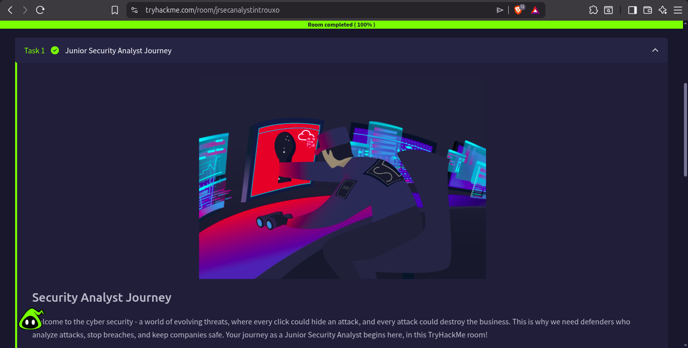

### Task 2 — Security Operations Center (SOC)

This task explained what a SOC actually is and who works in it. A SOC is a centralized team responsible for monitoring an organization's security posture 24/7. Key roles include:

- **SOC Engineer** — configures and maintains security tools (SIEM, firewalls, etc.)
- **SOC Analyst (Tier 1/2/3)** — monitors alerts, investigates incidents, escalates
- **Threat Intelligence Analyst** — researches active threats and adversary TTPs
- **Incident Responder** — handles confirmed breaches

The room explained the three tiers of analysts:
- Tier 1: Alert triage, initial investigation
- Tier 2: Deep dive investigation, escalation decisions
- Tier 3: Advanced hunting, forensics, red team collaboration

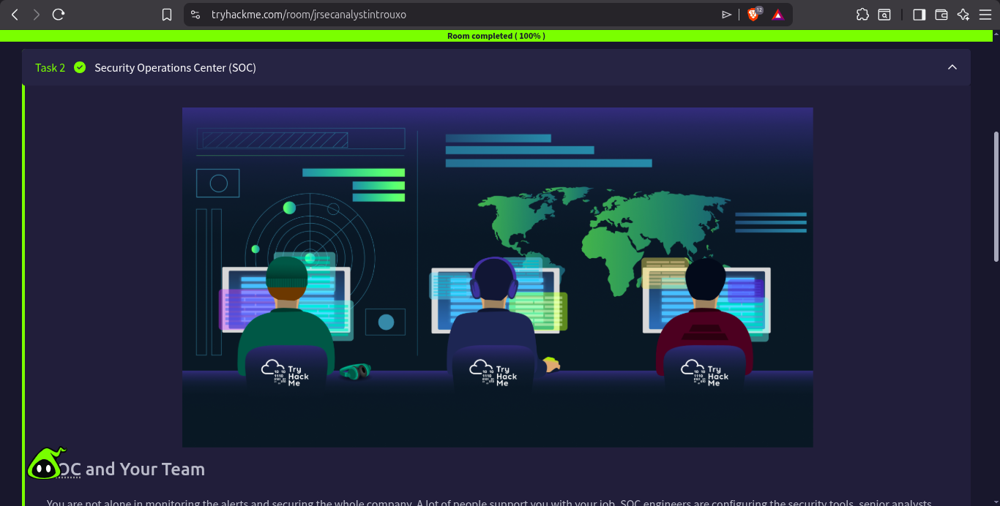

### Task 3 — A Day in the Life of a Security Analyst

This was the most interesting task in this room. It simulated a realistic analyst workflow: tickets come in constantly, you investigate, you correlate with threat intelligence, you decide whether to escalate or close. It made one thing very clear — the volume of alerts in a real SOC is overwhelming, and analysts must prioritize effectively.

The simulation involved a "ticket queue" style interface, reinforcing that SOC work is structured around cases and playbooks, not ad-hoc responses.

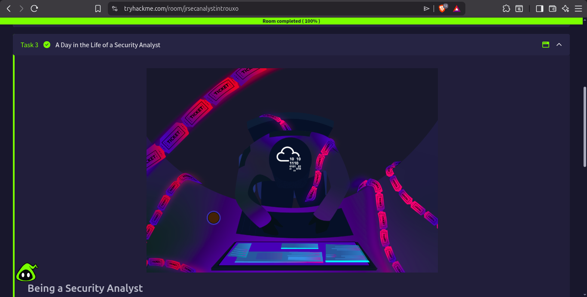

**Room Completed — 100%**

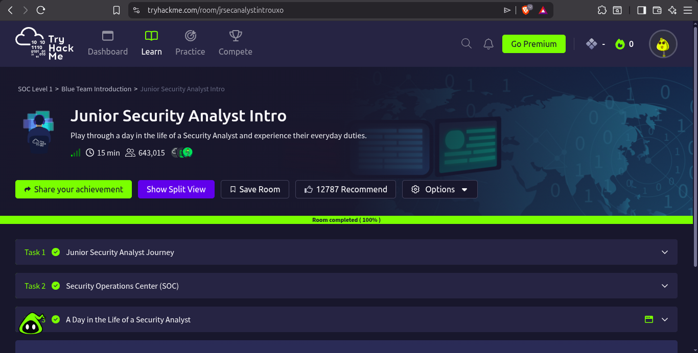

---

## Part 3 — Pyramid of Pain (Room Completed 100%)

**Room:** [tryhackme.com/room/pyramidofpainax](https://tryhackme.com/room/pyramidofpainax)
**Difficulty:** Easy | **Time:** 30 min | **Users Completed:** 312,489+

I had studied this concept before, but completing it formally on TryHackMe was worth doing. The Pyramid of Pain is a model created by security researcher David Bianco. It ranks Indicators of Compromise (IOCs) by how painful they are for an attacker to change if a defender blocks them.

### The Six Levels (Bottom to Top)

| Level | Indicator Type | Pain for Attacker if Blocked |
|---|---|---|
| 1 (Bottom) | Hash Values | Trivial — change one byte, hash changes |
| 2 | IP Addresses | Easy — use VPNs, proxies, cloud infrastructure |
| 3 | Domain Names | Simple — register a new domain in minutes |
| 4 | Network/Host Artifacts | Annoying — requires tool re-tooling |
| 5 | Tools | Challenging — requires writing new tools |
| 6 (Top) | TTPs (Tactics, Techniques, Procedures) | Tough — must fundamentally change how they operate |

### Key Lesson
The reason this pyramid matters for SOC analysts is prioritization. Blocking file hashes in your AV is easy but does almost nothing — attackers just modify the file. Detecting and blocking TTPs (for example: detecting the specific behavior of a lateral movement technique) forces attackers to fundamentally change their approach, which is expensive and takes time.

**This model directly connects to MITRE ATT&CK** — TTPs map to ATT&CK techniques. The higher you operate on the pyramid, the more detection engineering effort required, but the greater the impact on the attacker.

Tasks completed:
- Task 1: Introduction
- Task 2: Hash Values (Trivial)
- Task 3: IP Address (Easy)
- Task 4: Domain Names (Simple)
- Task 5: Host Artifacts (Annoying)
- Task 6: Network Artifacts (Annoying)
- Task 7: Tools (Challenging)
- Task 8: TTPs (Tough)

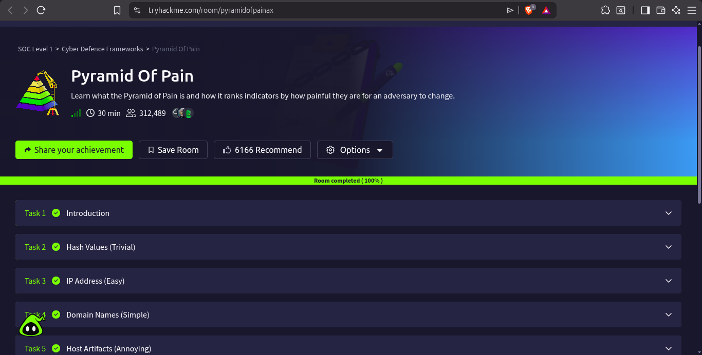

---

## Part 4 — Cyber Kill Chain (Room Completed 100%)

**Room:** [tryhackme.com/room/cyberkillchainzmt](https://tryhackme.com/room/cyberkillchainzmt)
**Difficulty:** Easy | **Time:** 45 min | **Users Completed:** 231,069+

The Cyber Kill Chain is a framework developed by Lockheed Martin to describe the stages of a cyberattack. Understanding this model helps defenders identify **where in an attack chain** they can intervene.

### The 7 Stages

| Stage | Description | Defender Goal |
|---|---|---|
| **1. Reconnaissance** | Attacker gathers information about the target (OSINT, scanning) | Reduce public exposure, monitor for scanning |
| **2. Weaponization** | Attacker creates a weapon — a malicious payload (e.g. malware + exploit) | Signature detection, sandbox analysis |
| **3. Delivery** | Attacker delivers the weapon (phishing email, USB, watering hole) | Email filters, user training, web proxies |
| **4. Exploitation** | Payload executes, exploiting a vulnerability | Patch management, EDR, AV |
| **5. Installation** | Malware installs persistence mechanisms on the target | EDR, behavior monitoring |
| **6. Command & Control (C2)** | Attacker establishes a communication channel to the compromised host | Network monitoring, DNS filtering, firewall |
| **7. Actions on Objectives** | Attacker achieves their goal (data theft, ransomware, destruction) | SIEM correlation, incident response |

### Why This Matters for a SOC Analyst
In a SOC, you often receive an alert that maps to one stage in the kill chain. Your job is to understand what stage the attacker is in, what has likely already happened (earlier stages), and what might happen next. This is how you prioritize your response and containment actions.

For example: if you detect a C2 callback (Stage 6), the attacker already exploited a vulnerability (Stage 4) and installed persistence (Stage 5) — containment must address all three, not just the C2 alert.

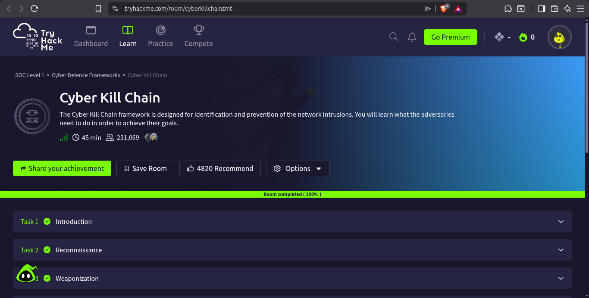

---

## Part 5 — Unified Kill Chain (Room Completed 100%)

**Room:** [tryhackme.com/room/unifiedkillchain](https://tryhackme.com/room/unifiedkillchain)
**Difficulty:** Easy | **Time:** 40 min | **Users Completed:** 156,937+

The Unified Kill Chain (UKC) is a more modern and comprehensive version of the Lockheed Martin Kill Chain. It was developed by Paul Pols in 2017 and merges concepts from both the Cyber Kill Chain and MITRE ATT&CK.

### Three Phases of the UKC

**Phase 1 — IN (Initial Foothold)**
This phase covers how the attacker gets into the network: reconnaissance, social engineering, exploitation, persistence, and defense evasion.

**Phase 2 — THROUGH (Network Propagation)**
Once inside, the attacker moves through the network: discovery, privilege escalation, lateral movement, pivoting, and credential access.

**Phase 3 — OUT (Action on Objectives)**
The attacker achieves their goal: collection, exfiltration, impact (like ransomware), command & control.

### Difference from the Original Kill Chain
The Lockheed Kill Chain is linear and assumes a single external entry point. The UKC is **non-linear** — attackers can loop back, skip stages, or start from different positions (e.g. insider threat starts at Phase 2). This makes it more realistic for modern attacks.

Tasks completed in this room:
- Task 1: Introduction
- Task 2: What is a Kill Chain
- Task 3: What is Threat Modelling
- Task 4: Introducing the Unified Kill Chain
- (Plus additional tasks on all UKC phases)

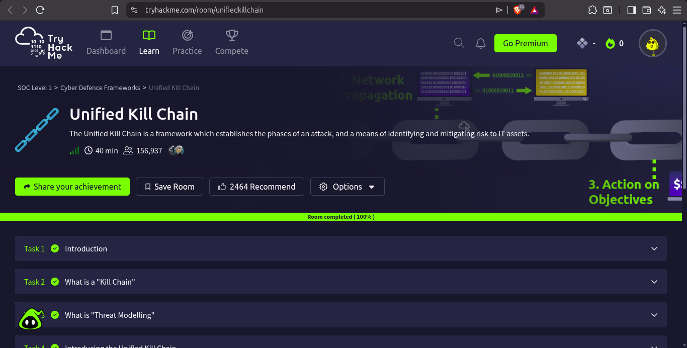

---

## Part 6 — Snort (Room Completed 100%) — IDS/IPS Deep Dive

**Room:** [tryhackme.com/room/snort](https://tryhackme.com/room/snort)
**Difficulty:** Medium | **Points Earned:** 232 pts | **Tasks:** 11

This is one of the most important rooms I did today. I have worked with Snort before during my internship and also did Day 14 on Suricata (which uses the same rule syntax as Snort). Going through this room again was a good refresh and helped me fill in some gaps, especially around the different operation modes.

### What is Snort?

Snort is an open-source **Network Intrusion Detection/Prevention System (NIDS/NIPS)**. Originally developed by Marty Roesch in 1998, it is now maintained by Cisco Talos. Snort can operate in three main modes:

- **IDS (Intrusion Detection System)** — passively monitors and generates alerts
- **IPS (Intrusion Prevention System)** — actively blocks malicious traffic in real-time
- **Network packet sniffer/logger** — captures and logs raw traffic

### Task 3 — Introduction to IDS/IPS

This task clarified the difference between IDS and IPS:

- **IDS** sits out of band — it watches a copy of the traffic and raises alerts but cannot block anything. Good for visibility.
- **IPS** sits inline — all traffic passes through it and it can drop malicious packets. Blocks but adds latency.
- **HIDS** (Host IDS) — monitors a single host (like Wazuh's agent mode).
- **NIDS** (Network IDS) — monitors the entire network at a chokepoint.

### Task 4 — First Interaction with Snort

The room used an interactive VM. To verify Snort version and test connectivity:

```bash
snort -V
snort --daq-list
```

The first exercise required navigating to the Task-Exercises folder and running a script:

```bash
cd ~/Desktop/Task-Exercises
./easy.sh
```

Output: `Too Easy!` — which confirmed the VM was working correctly.

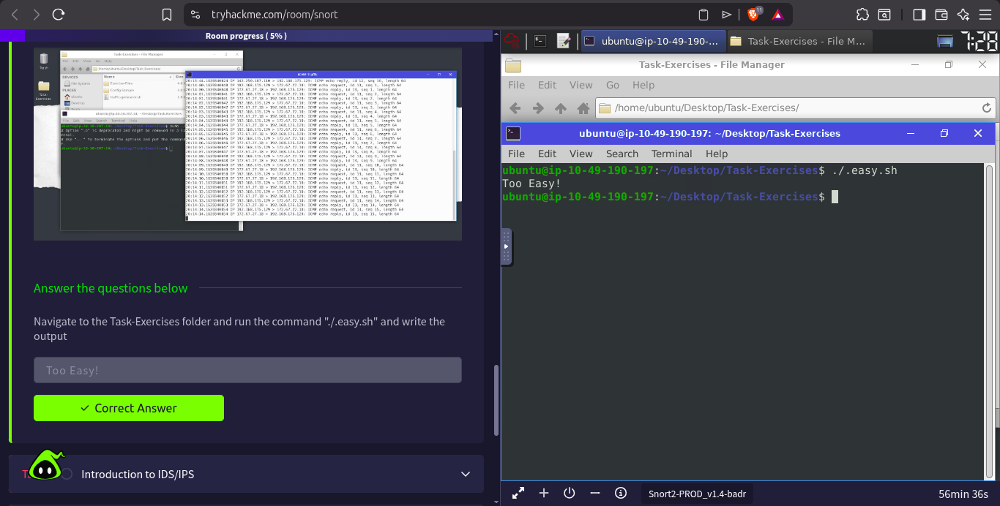

### Task 5 — Operation Mode 1: Sniffer Mode

In Sniffer Mode, Snort acts like tcpdump — it captures and displays packet data in real time. This is useful for quick live traffic inspection.

Common sniffer mode flags:

```bash
snort -v                     # Verbose: show IP/TCP headers
snort -d                     # Dump packet payload (application layer data)
snort -e                     # Display data link layer headers (Ethernet MAC)
snort -X                     # Full hex + ASCII dump of each packet
snort -i eth0                # Specify network interface
snort -v -i eth0             # Sniff verbosely on eth0
```

### Task 6 — Operation Mode 2: Packet Logger Mode

In Packet Logger Mode, Snort saves captured packets to disk for later analysis — similar to saving a .pcap file with Wireshark/tcpdump.

```bash
snort -dev -l /var/log/snort/          # Log all traffic with full verbosity
snort -dev -l /var/log/snort/ -K ASCII # Log in human-readable ASCII format
snort -r captured.pcap                 # Read back and analyze a saved pcap
snort -r captured.pcap -n 10          # Read only first 10 packets
```

### Task 7 — Operation Mode 3: IDS/IPS Mode

This is the real-world mode. Snort reads a rules file and inspects all passing traffic against those rules, generating alerts when a rule matches.

```bash
# Run Snort as IDS with a rules file, alert to console
snort -c /etc/snort/snort.conf -A console

# Run against a pcap (great for lab exercises)
snort -c /etc/snort/snort.conf -r malicious.pcap -A console

# Run in IPS mode (inline, requires NFQ or afpacket DAQ)
snort -c /etc/snort/snort.conf -Q --daq afpacket -i eth0:eth1
```

Alert modes available:
- `full` — full alert info
- `fast` — minimal one-line alert
- `console` — print to terminal
- `cmg` — CMG style (headers + content)
- `none` — suppress alerts (only log)

### Task 8 — Operation Mode 4: PCAP Investigation

This is extremely useful in a SOC context. When you receive a suspicious pcap file as evidence, you can run Snort against it to automatically identify known attack patterns.

```bash
snort -c /etc/snort/snort.conf -r suspicious.pcap -l /var/log/snort/
snort -r /var/log/snort/snort.log.xxxxxxx    # Review generated log
```

### Task 9 — Snort Rule Structure

This is the most technically important part. Snort rules follow a precise syntax. Every rule has two sections: a **Rule Header** and **Rule Options**.

```
action protocol src_ip src_port direction dst_ip dst_port (options)
```

**Full example:**
```
alert tcp any any -> any 80 (msg:"HTTP Traffic Detected"; sid:1000001; rev:1;)
```

| Component | Meaning |
|---|---|
| `alert` | Action: alert, log, drop, reject, pass |
| `tcp` | Protocol: tcp, udp, icmp, ip |
| `any any` | Source IP and Source Port (any = all) |
| `->` | Direction (one-way). `<>` means bidirectional |
| `any 80` | Destination IP and Destination Port |
| `msg:` | Human-readable alert message |
| `sid:` | Snort rule ID (must be unique, >1,000,000 for custom) |
| `rev:` | Rule revision number |

**More rule option keywords:**
- `content:"keyword"` — match specific string in payload
- `nocase` — case-insensitive match
- `flags:S` — match TCP SYN flag (detects SYN scans)
- `threshold:type limit, track by_src, count 5, seconds 60` — rate-based detection
- `reference:cve,CVE-2021-xxxx` — link to CVE or external reference
- `classtype:trojan-activity` — categorize the rule type

**ICMP detection example:**
```
alert icmp any any <> any any (msg:"ICMP Packet Detected"; sid:1000002; rev:1;)
```

**SSH brute-force detection example:**
```
alert tcp any any -> any 22 (msg:"Possible SSH Brute Force"; flags:S; threshold:type threshold, track by_src, count 10, seconds 60; sid:1000003; rev:1;)
```

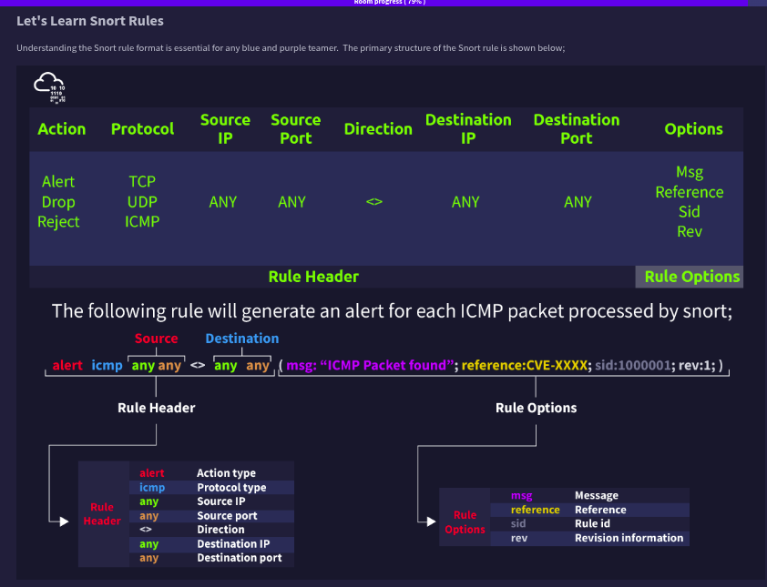

### Task 10 — Snort2 Operation Logic: Points to Remember

Key points about how Snort processes traffic:
- Rules are matched against packets in order — the first matching rule wins
- The `pass` action is processed first, then `drop`, then `alert`
- Snort reads its configuration from `/etc/snort/snort.conf`
- Custom rules can be placed in `/etc/snort/rules/local.rules`
- Always increment `rev:` when you modify a rule

### Room Completion

Snort room completed with 11 tasks, 232 points earned, and the **Network Hog badge** awarded.

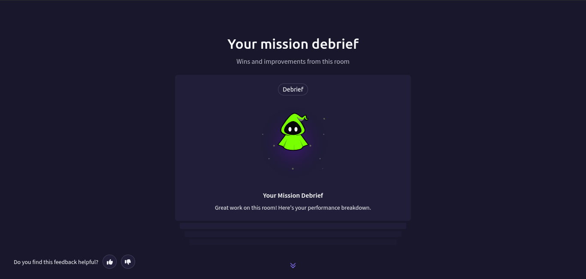

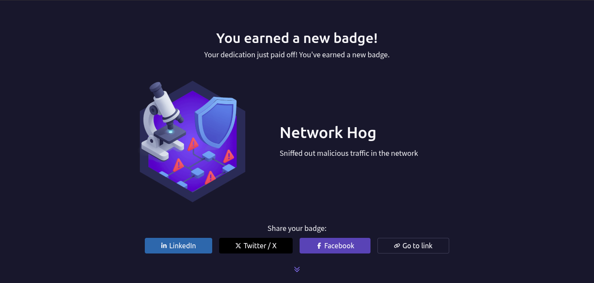

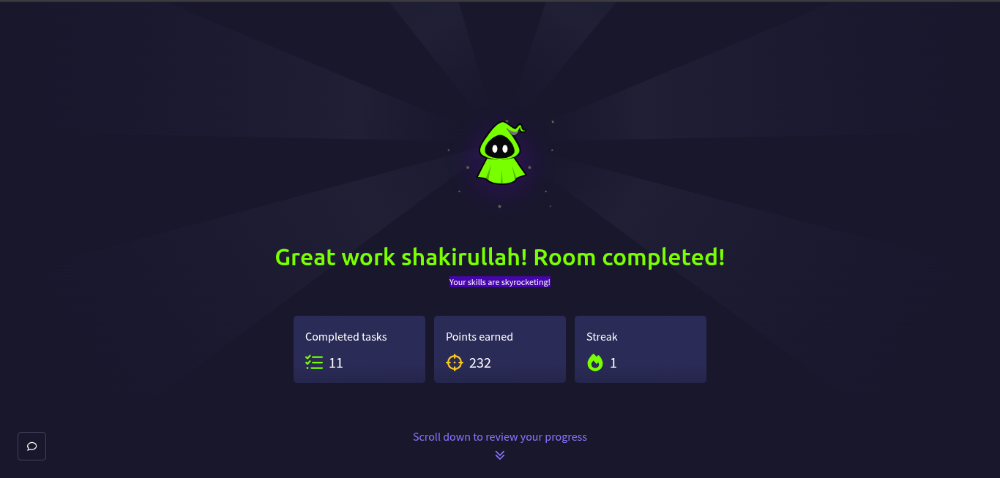

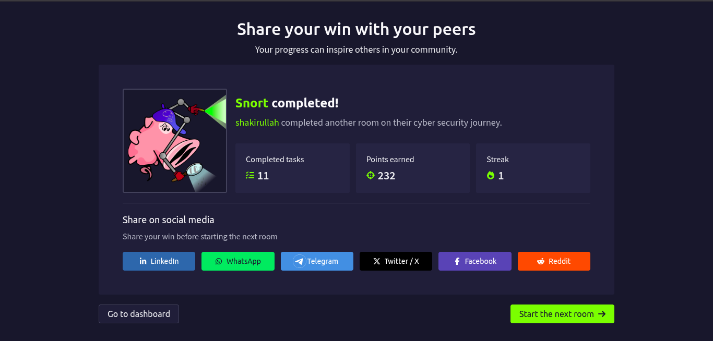

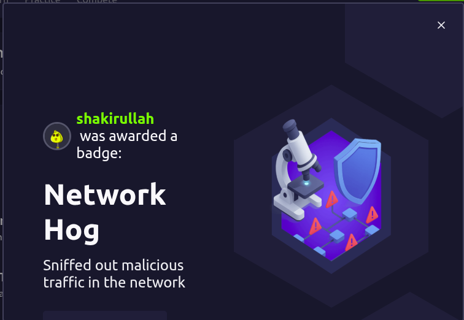

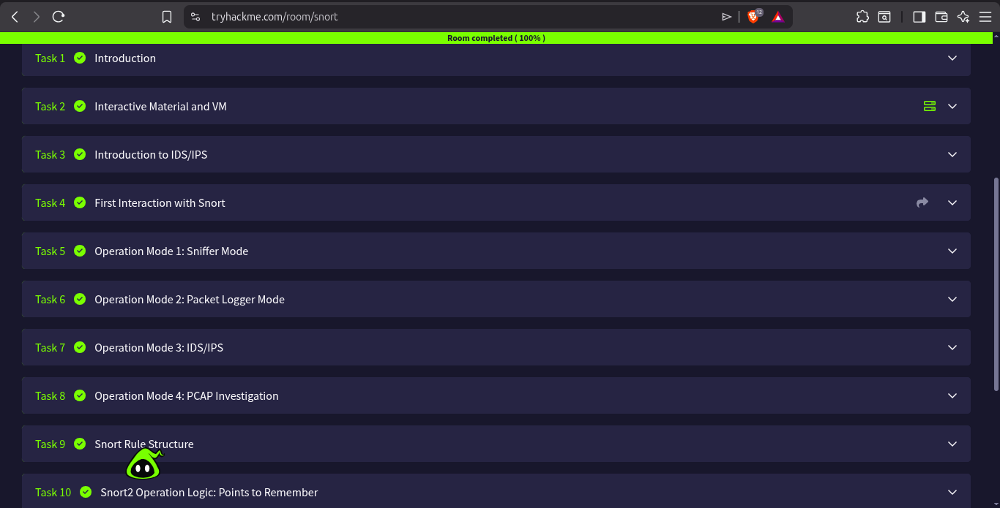

---

## Part 7 — Windows Logging for SOC (Room Completed 100%) ← The Hard Part

**Room:** [tryhackme.com/room/windowsloggingforsoc](https://tryhackme.com/room/windowsloggingforsoc)
**Difficulty:** Medium | **Points Earned:** 128 pts | **Tasks:** 8
**Estimated Time:** 60 min

This was the most challenging room today. Windows is significantly different from Linux when it comes to logging, and I genuinely struggled with understanding how it all works. On Linux, logs are plain text files in `/var/log/` — you can `cat` them, `grep` them, pipe them into anything. On Windows, logs are stored in a **proprietary binary format** (`.evtx`) inside `C:\Windows\System32\winevt\Logs\`. You cannot just open them in a text editor. This is confusing and frustrating when you're used to Linux.

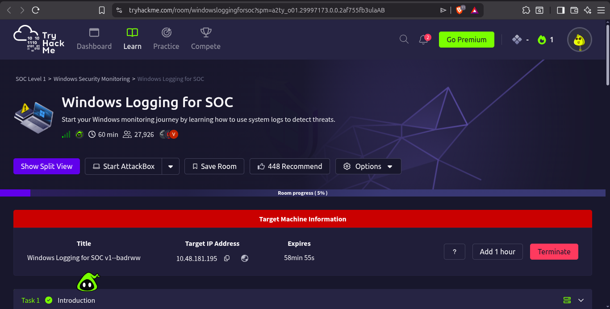

### Task 1 — Introduction

The room introduced the Windows logging ecosystem and why it matters for a SOC analyst. The key message: Windows is one of the most widely used operating systems in enterprise environments, and most SOC work involves Windows logs. If you cannot read Windows logs, you cannot investigate Windows-based incidents.

### Task 2 — What Is Logged

This task explained the fundamentals of Windows logging.

**Logging Overview**

Every user action and system event on Windows gets recorded by the operating system. When you log in, start an application, open a file, or even plug in a USB device, Windows logs it. These logs are called **Event Logs** and they serve three critical SOC functions:

- **Incident Response** — logs show when and how an attack occurred, what actions the attacker took
- **Threat Hunting** — you search logs proactively for signs of malicious activity
- **Alerting and Triage** — SIEM rules pull from Windows event logs to generate alerts

**Why Windows Logging is Hard**

The first challenge is that Windows stores logs in binary `.evtx` format. The path is:

```
C:\Windows\System32\winevt\Logs\
```

If you try to open a `.evtx` file in Notepad or read it on Linux, you get garbage characters. The file must be opened in:
- **Windows Event Viewer** (GUI tool, built into Windows)
- **PowerShell** with `Get-WinEvent`
- **Log analysis tools** like Splunk, Elastic/ELK, Wazuh (which parse the XML underneath)

This is one reason why Wazuh (which I set up on Day 3-4) is so valuable — it collects Windows event logs from agents and converts them into searchable JSON/XML that you can query like any other log.

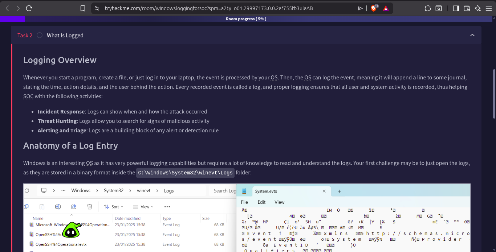

**Anatomy of a Windows Log Entry**

Each Windows Event Log entry contains:

| Field | Description |
|---|---|
| **Event ID** | A unique number identifying the type of event |
| **Timestamp** | Date and time the event occurred |
| **Source** | The application or service that generated the event |
| **Log Name** | Which log channel it belongs to (Security, System, Application) |
| **Computer** | The hostname of the machine |
| **User** | The account involved (if applicable) |
| **Description** | Human-readable details about what happened |

**The Three Main Log Channels**

| Channel | What It Records |
|---|---|
| **Security** | Login events, authentication, privilege use, object access |
| **System** | OS events, service start/stop, driver errors, hardware changes |
| **Application** | Application-specific events, crashes, errors |

**Important Windows Event IDs for SOC Analysts**

These are the most critical Event IDs every SOC analyst must know:

| Event ID | Meaning | Why It Matters |
|---|---|---|
| **4624** | Successful login | Baseline normal behavior; anomalies = lateral movement |
| **4625** | Failed login | Repeated failures = brute force attempt |
| **4648** | Logon using explicit credentials (RunAs) | Common in lateral movement and pass-the-hash |
| **4672** | Special privileges assigned | Admin-level access; high risk if unexpected |
| **4688** | New process created | Detects malware execution, suspicious child processes |
| **4698** | Scheduled task created | Persistence mechanism |
| **4702** | Scheduled task modified | Existing persistence modified |
| **4720** | User account created | Unauthorized account creation |
| **4726** | User account deleted | Covering tracks |
| **4732** | User added to security-enabled local group | Privilege escalation |
| **4776** | NTLM authentication attempt | Pass-the-hash, NTLM relay attacks |
| **7045** | New service installed | Malware may install as a service for persistence |

**Logon Types**

Understanding logon types helps distinguish normal from malicious activity:

| Logon Type | Number | Meaning |
|---|---|---|
| Interactive | 2 | Physical keyboard login |
| Network | 3 | Remote access (file share, SMB, etc.) |
| Batch | 4 | Scheduled task |
| Service | 5 | Windows service login |
| RemoteInteractive | 10 | RDP session |
| CachedInteractive | 11 | Offline cached credentials |

**Practical Example: Detecting a Brute Force**

If an attacker is brute-forcing RDP (Remote Desktop Protocol), you would see in the Security log:
- Multiple Event ID **4625** (Failed Login), Logon Type **10** (RemoteInteractive)
- All from the same source IP
- Within a short time window

When they succeed, you'd see Event ID **4624** with Logon Type **10** — which stands out if that account doesn't normally use RDP.

**Querying Windows Logs with PowerShell**

```powershell
# Get all failed logins (Event ID 4625) from the Security log
Get-WinEvent -LogName Security | Where-Object {$_.Id -eq 4625}

# Filter by time range
Get-WinEvent -LogName Security -MaxEvents 100 | Where-Object {$_.Id -eq 4624}

# Export to XML for analysis
Get-WinEvent -LogName Security | Export-Clixml -Path C:\logs\security_events.xml
```

**Why This Room Was Hard**

I'm going to be honest — Windows logging was difficult for me. The main reasons:

1. **Binary format** — Can't just read files like Linux. Everything needs a tool.
2. **Multiple log channels** — On Linux it's mostly `/var/log/auth.log` and `/var/log/syslog`. On Windows there are dozens of logs.
3. **Event IDs** — You have to memorize or reference specific numeric codes. There's no intuitive naming like Linux.
4. **The GUI (Event Viewer)** — It's slow and filtering is not straightforward.
5. **XML underneath** — Windows events are actually stored as XML inside the binary .evtx, which makes sense but adds another layer of complexity when you're trying to parse them.

Despite the difficulty, I pushed through and completed all 8 tasks in the room.

### Room Completion

**Windows Logging for SOC completed** — 8 tasks, 128 points earned.

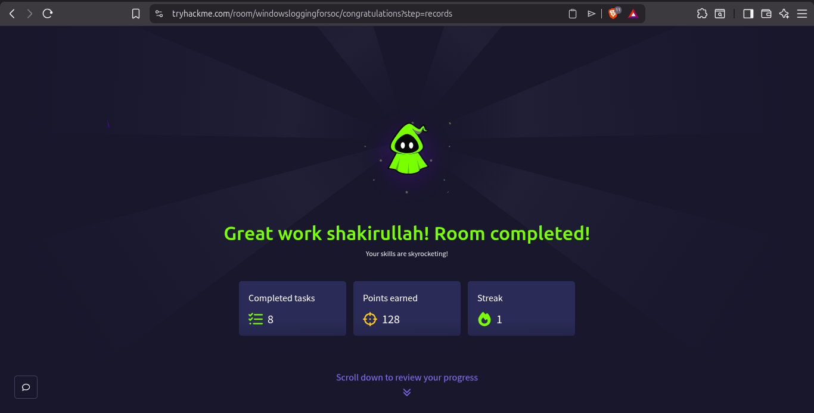

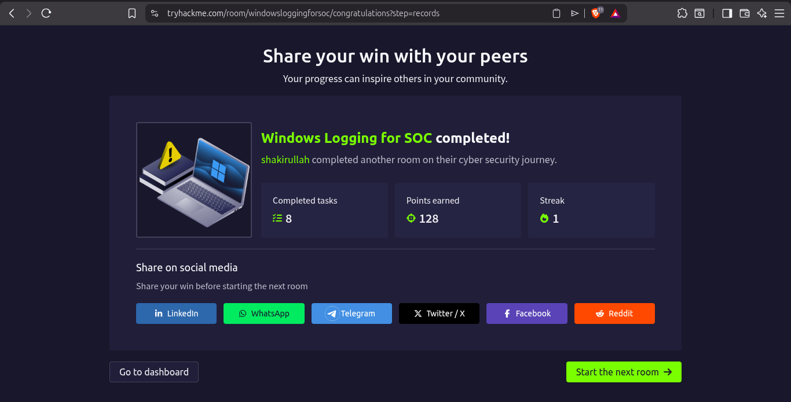

---

## Summary of Rooms Completed Today

| Room | Path Section | Points | Badge |
|---|---|---|---|
| Junior Security Analyst Intro | Blue Team Introduction | — | — |
| Pyramid of Pain | Cyber Defence Frameworks | — | — |
| Cyber Kill Chain | Cyber Defence Frameworks | — | — |
| Unified Kill Chain | Cyber Defence Frameworks | — | — |
| Snort | Network Security | 232 pts | 🏆 Network Hog |
| Windows Logging for SOC | Endpoint Security | 128 pts | — |

**Total TryHackMe points earned today: 360 pts**

---

## Key Takeaways

- **Pyramid of Pain** teaches prioritization — focus detection efforts on TTPs, not just hashes and IPs
- **Cyber Kill Chain** gives a structured mental model of attack stages, helping analysts understand context and predict attacker next steps
- **Unified Kill Chain** is a more realistic, non-linear model that accounts for modern multi-stage attacks
- **Snort** remains a fundamental IDS/IPS tool — rule syntax is directly transferable to Suricata (which I already use)
- **Windows logging** is fundamentally different from Linux logging and requires specific knowledge of Event IDs, logon types, and binary .evtx format
- The most critical Event IDs for daily SOC work: 4624, 4625, 4648, 4672, 4688, 4720, 4732

---

## Tools & Concepts Used

- TryHackMe AttackBox VM (Ubuntu-based)
- Snort IDS/IPS
- Snort rule syntax (`alert`, `content`, `flags`, `threshold`, `sid`, `rev`)
- Windows Event Viewer (via AttackBox VM)
- PowerShell `Get-WinEvent`
- Windows `.evtx` binary log format
- MITRE ATT&CK framework (referenced throughout)

---

## References

- TryHackMe SOC Level 1 Path: https://tryhackme.com/paths
- Snort Official Docs: https://www.snort.org/documents
- Pyramid of Pain (David Bianco): http://detect-respond.blogspot.com/2013/03/the-pyramid-of-pain.html
- Lockheed Martin Cyber Kill Chain: https://www.lockheedmartin.com/en-us/capabilities/cyber/cyber-kill-chain.html
- Unified Kill Chain: https://www.unifiedkillchain.com/
- Windows Security Event IDs: https://learn.microsoft.com/en-us/windows/security/threat-protection/auditing/security-auditing-overview
