# Day 25 — Cloud Security for SOC: AWS CloudTrail Log Analysis

**Date:** May 14–15, 2026
**Platform:** TryHackMe + Local Lab (Ubuntu 24)
**Module:** Cloud Security for SOC
**Device:** Dell i3 3rd Gen, Ubuntu 24
**GitHub:** [SOC-Analyst-Journey](https://github.com/ShakiUllah/SOC-Analyst-Journey)

---

## Overview

Day 25 focused on cloud security from a SOC analyst perspective. The cloud is no longer optional in enterprise environments — the majority of organizations run some or all of their infrastructure on AWS, Azure, or GCP. As a SOC analyst, you will inevitably receive alerts and logs from cloud environments, and if you don't understand how cloud logging works, you cannot investigate cloud-based incidents.

Today covered:
- TryHackMe **Cloud Security for SOC** module (Cloud Security Pitfalls + Cloud Computing Fundamentals)
- Local hands-on **AWS CloudTrail log analysis** using `jq` and `grep` on Ubuntu
- A full simulated incident investigation — credential stuffing, IAM backdoor creation, data exfiltration, and audit log destruction

**Total TryHackMe points earned: 136 pts** (80 pts + 56 pts)

---

## Part 1 — TryHackMe: Cloud Security for SOC Module

**Module:** [tryhackme.com/module/cloud-security-soc](https://tryhackme.com/module/cloud-security-soc)

This module is specifically designed for SOC analysts who need to understand cloud security monitoring. It covers AWS with a focus on detection and SIEM-based investigation. The module contains four rooms:
- Cloud Security Pitfalls
- Monitoring AWS Logins
- Monitoring AWS Services
- Monitoring AWS Workloads

Today I completed the two free rooms: Cloud Security Pitfalls and Cloud Computing Fundamentals.

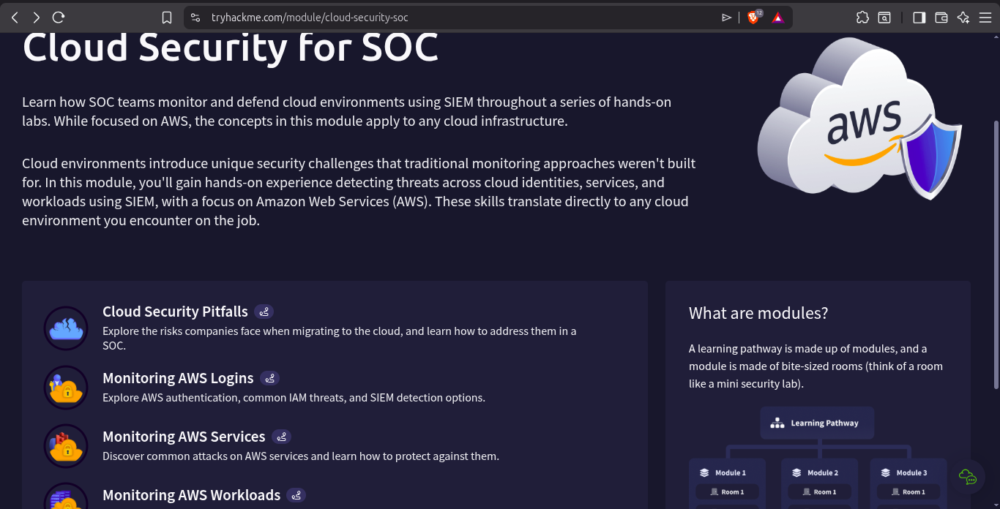

---

## Room 1 — Cloud Security Pitfalls (Completed 100%)

**Room:** [tryhackme.com/room/cloudsecuritypitfalls](https://tryhackme.com/room/cloudsecuritypitfalls)
**Points:** 80 pts | **Tasks:** 7 | **Time:** 30 min

This room explores the security risks that organizations face when migrating to the cloud, and how a SOC team addresses them.

### Task 1 — Introduction

Cloud security is fundamentally different from on-premises security. In a traditional data center, you control everything — the hardware, the network, the access. In the cloud, you share responsibility with the provider. This changes the entire security model and introduces risks that traditional security tools were never designed to handle.

### Task 2 — What Is Cloud

Cloud computing delivers computing resources — servers, storage, databases, networking, software — over the internet on demand. The three main service models:

| Model | What Provider Manages | What You Manage | Example |
|---|---|---|---|
| **IaaS** (Infrastructure as a Service) | Physical hardware, hypervisor, networking | OS, apps, data | AWS EC2, Azure VMs |
| **PaaS** (Platform as a Service) | Infrastructure + OS + runtime | Applications, data | AWS Elastic Beanstalk |
| **SaaS** (Software as a Service) | Everything | Just your data/settings | Gmail, Office 365 |

Deployment models:
- **Public Cloud** — shared infrastructure (AWS, Azure, GCP)
- **Private Cloud** — dedicated infrastructure for one org
- **Hybrid Cloud** — mix of both (most common in enterprise)

### Task 3 — Security OF the Cloud

**Security of the cloud** is the provider's responsibility — they secure the physical data centers, hardware, hypervisors, and network infrastructure. If an AWS data center burns down, that's Amazon's problem.

Key controls the provider handles:
- Physical access to data centers
- Hardware redundancy and failure
- Network backbone security
- Hypervisor isolation between tenants

### Task 4 — Security IN the Cloud

**Security in the cloud** is YOUR responsibility as the customer. This is the most important concept for a SOC analyst to understand because misconfigurations here are the cause of the vast majority of cloud breaches.

What you are responsible for:
- IAM (who has access to what)
- Data encryption at rest and in transit
- Network security groups and firewall rules
- Application security
- Logging and monitoring configuration
- Patch management of your VMs

**The most common cloud security failures:**

| Failure | Real-World Impact |
|---|---|
| S3 bucket left public | Millions of records exposed (Capital One, Facebook) |
| No MFA on admin accounts | Attacker logs in with stolen credentials |
| Overly permissive IAM roles | One compromised account = full environment access |
| CloudTrail logging disabled | Attacker operates with zero visibility |
| Security groups open to 0.0.0.0/0 | Any IP on the internet can reach your servers |

### Task 5 — Cloud Security Monitoring

This task connected cloud security directly to SOC work. In an on-premises environment, you monitor Windows event logs, Sysmon, and network traffic. In AWS, the equivalent logs are:

| AWS Service | What It Logs | SOC Equivalent |
|---|---|---|
| **CloudTrail** | All API calls — who did what, when, from where | Windows Security Event Log |
| **CloudWatch** | Metrics, performance, application logs | Performance monitoring |
| **VPC Flow Logs** | Network traffic in and out of VPCs | NetFlow / firewall logs |
| **GuardDuty** | Threat detection, anomaly alerts | IDS/IPS alerts |
| **S3 Access Logs** | Who accessed which S3 bucket and when | File access auditing |

**CloudTrail is the most important for SOC analysts.** Every action taken in an AWS account — login, resource creation, policy change, data access — generates a CloudTrail event. If CloudTrail is disabled or deleted, you are blind.

### Task 6 — Challenge

Completed the room challenge applying the concepts from all previous tasks.

**Room Completed — 7 tasks, 80 pts**

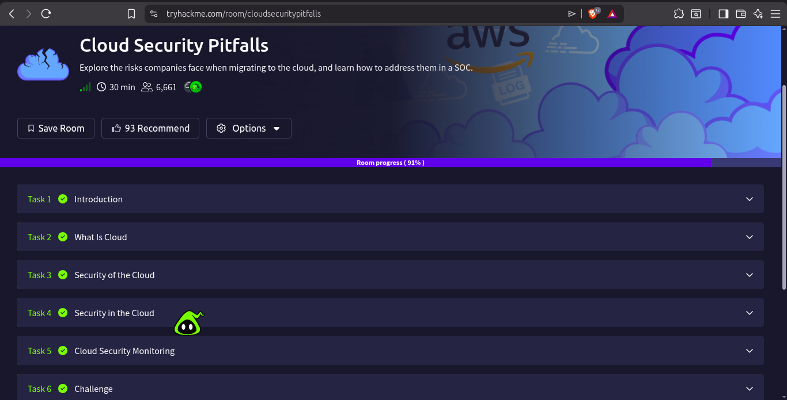

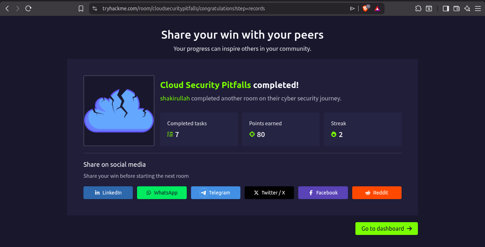

---

## Room 2 — Cloud Computing Fundamentals (Completed 100%)

**Room:** [tryhackme.com/room/cloudcomputingfundamentals](https://tryhackme.com/room/cloudcomputingfundamentals)
**Points:** 56 pts | **Tasks:** 4 | **Time:** 30 min

This room covered the technical foundations of how cloud computing works — important context before diving into cloud security.

### Task 1 — Introduction

Cloud computing solves a fundamental problem: scalability. If you host your own servers, you buy hardware for peak load — meaning 90% of the time that expensive hardware sits idle. Cloud lets you pay only for what you use and scale up or down instantly.

The cloud is built on virtualization and containerization — technologies that allow many isolated workloads to run on shared physical hardware without interfering with each other.

### Task 2 — Cloud Service Models

Revisited IaaS, PaaS, and SaaS with practical examples relevant to security:

- **IaaS** — you control the OS, so you are responsible for patching. A vulnerable unpatched EC2 instance is your problem, not AWS's.
- **PaaS** — you only write the code. The provider patches the OS and runtime.
- **SaaS** — you just use the app. You are responsible only for who has access to it (IAM, MFA).

### Task 3 — Cloud Deployment Models

Covered public, private, hybrid, and multi-cloud architectures. From a SOC perspective, multi-cloud environments are the hardest to monitor because logs are spread across multiple providers — AWS CloudTrail, Azure Monitor, GCP Cloud Logging — each with different formats and query languages.

### Task 4 — Virtualization and Containers

Explained how VMs and containers underpin cloud infrastructure. Each EC2 instance is a VM running on a shared physical host. Containers (Docker, Kubernetes) are even more lightweight — multiple containers share the same OS kernel. From a security standpoint, container escapes are a known attack vector where a compromised container breaks out to the host.

**Room Completed — 4 tasks, 56 pts**

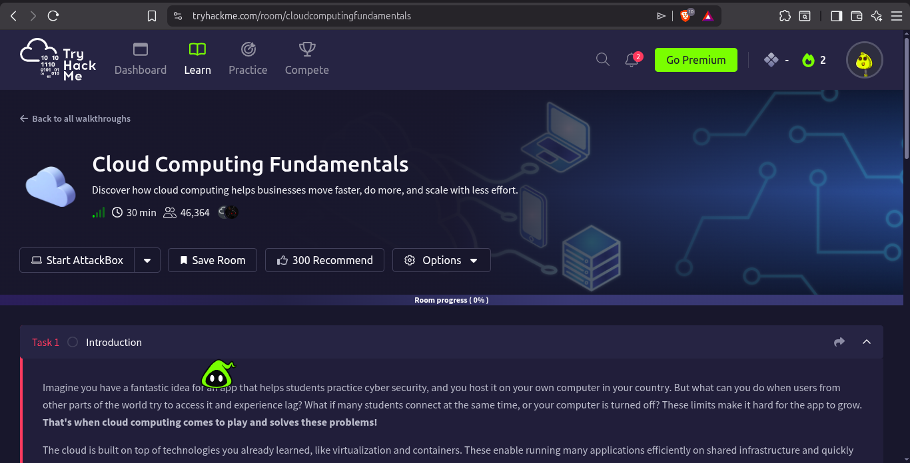

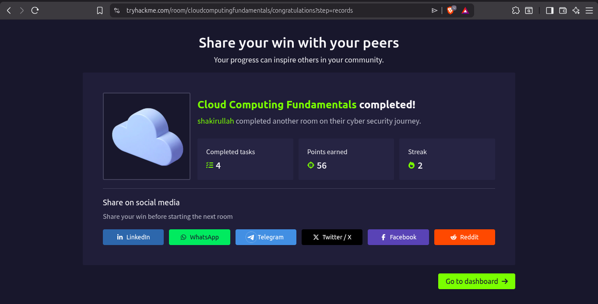

---

## Part 2 — Local Lab: AWS CloudTrail Log Analysis on Ubuntu

**Tool:** `jq` (JSON processor)
**File:** `~/cloudtrail-lab/cloudtrail.json`
**Scenario:** Simulated AWS account compromise — investigate the CloudTrail logs and reconstruct the full attack timeline

This is the hands-on core of Day 25. Real CloudTrail logs are JSON files. In a real SOC, they come from S3 buckets, are ingested into a SIEM like Splunk or Elastic, and you query them. Today I replicated that workflow locally using `jq` on Ubuntu — the same logic applies whether you're querying JSON on the command line or writing SPL in Splunk.

### Lab Setup

```bash
mkdir ~/cloudtrail-lab && cd ~/cloudtrail-lab
# Created cloudtrail.json with 14 simulated events
jq --version   # confirmed jq installed
```

---

### Task 1 — View All Events

```bash
jq '.Records[] | {time: .eventTime, event: .eventName, user: .userIdentity.userName, ip: .sourceIPAddress}' cloudtrail.json
```

**Output summary — 14 events detected:**

| Time | Event | User | IP |
|---|---|---|---|
| 08:12:34 | ConsoleLogin | john.admin | 185.220.101.45 |
| 08:13:01 | ConsoleLogin | john.admin | 185.220.101.45 |
| 08:13:15 | ConsoleLogin | john.admin | 185.220.101.45 |
| 08:13:44 | ConsoleLogin | john.admin | 185.220.101.45 |
| 08:14:02 | ConsoleLogin | john.admin | 185.220.101.45 |
| 08:15:22 | CreateUser | john.admin | 185.220.101.45 |
| 08:16:10 | AttachUserPolicy | john.admin | 185.220.101.45 |
| 08:18:33 | ListBuckets | john.admin | 185.220.101.45 |
| 08:19:05 | GetObject | john.admin | 185.220.101.45 |
| 08:19:45 | GetObject | john.admin | 185.220.101.45 |
| 08:20:11 | GetObject | john.admin | 185.220.101.45 |
| 08:21:30 | DeleteTrail | john.admin | 185.220.101.45 |
| 09:00:00 | ConsoleLogin | sarah.dev | 203.0.113.25 |
| 09:05:00 | RunInstances | sarah.dev | 203.0.113.25 |

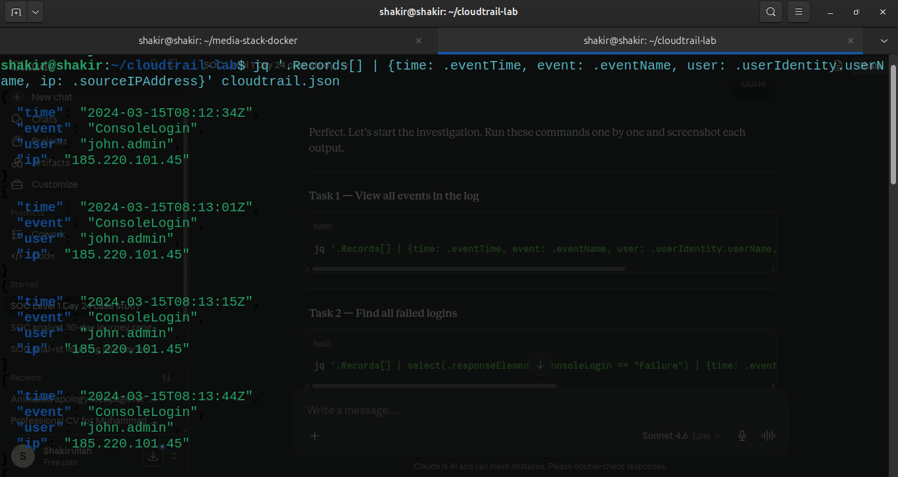

---

### Task 2 — Find All Failed Logins

```bash
jq '.Records[] | select(.responseElements.ConsoleLogin == "Failure") | {time: .eventTime, user: .userIdentity.userName, ip: .sourceIPAddress}' cloudtrail.json
```

**Finding:** 3 failed login attempts for `john.admin` from `185.220.101.45` between 08:13:01 and 08:13:44 — all within 43 seconds. This is a classic credential stuffing / brute force pattern.

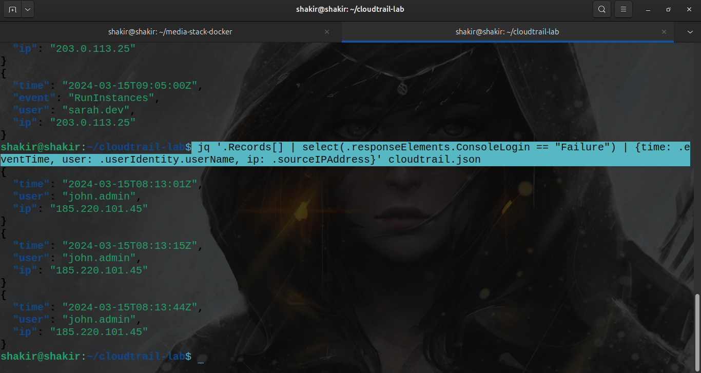

---

### Task 3 — Find All Successful Logins + MFA Status

```bash
jq '.Records[] | select(.responseElements.ConsoleLogin == "Success") | {time: .eventTime, user: .userIdentity.userName, ip: .sourceIPAddress, mfa: .additionalEventData.MFAUsed}' cloudtrail.json
```

**Finding:** Two successful logins:
- `john.admin` at 08:12:34 — **MFA: No** — from `185.220.101.45`
- `john.admin` at 08:14:02 — **MFA: No** — from `185.220.101.45` (after 3 failures)
- `sarah.dev` at 09:00:00 — **MFA: Yes** — from `203.0.113.25`

`john.admin` logged in without MFA — a critical security gap that made this attack possible.

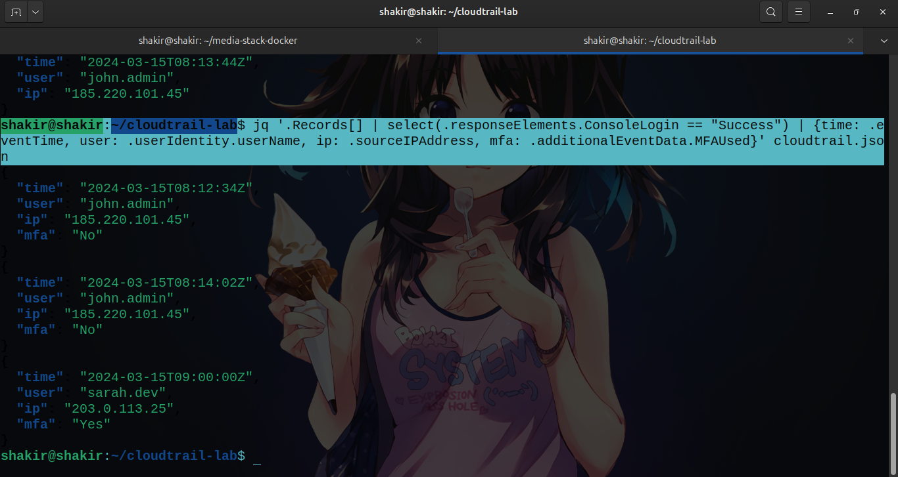

---

### Task 4 — Find Logins Without MFA

```bash
jq '.Records[] | select(.additionalEventData.MFAUsed == "No") | {time: .eventTime, user: .userIdentity.userName, ip: .sourceIPAddress}' cloudtrail.json
```

**Finding:** All 5 login attempts (both successful and failed) for `john.admin` had MFA disabled. In a real SOC, an alert rule should fire any time an admin account logs in without MFA — this is a high-severity detection.

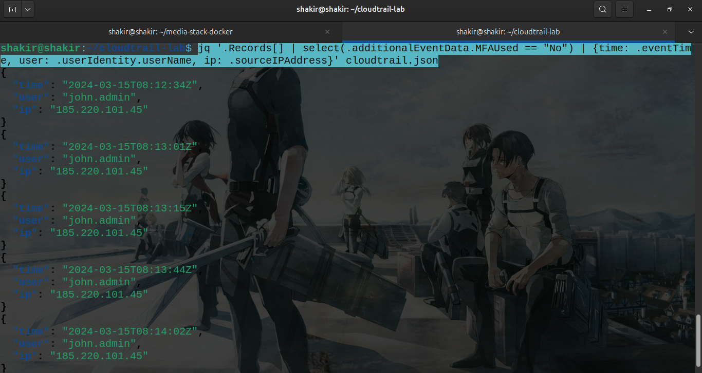

---

### Task 5 — Backdoor User Created

```bash
jq '.Records[] | select(.eventName == "CreateUser") | {time: .eventTime, createdBy: .userIdentity.userName, newUser: .requestParameters.userName, ip: .sourceIPAddress}' cloudtrail.json
```

**Finding:** At 08:15:22, just 1 minute and 20 seconds after successfully logging in, `john.admin` created a new IAM user named `backdoor.user` from the same attacker IP `185.220.101.45`.

This is a persistence technique — the attacker creates a hidden account so they can return to the environment even if `john.admin`'s password gets changed or the account gets locked.

**MITRE ATT&CK:** T1136.003 — Create Account: Cloud Account

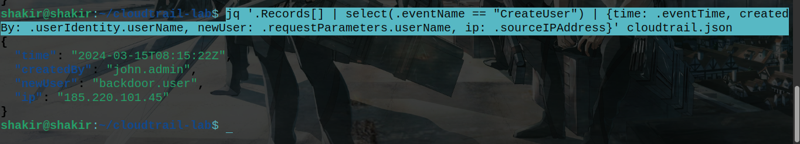

---

### Task 6 — Administrator Policy Attached to Backdoor User

```bash
jq '.Records[] | select(.eventName == "AttachUserPolicy") | {time: .eventTime, user: .userIdentity.userName, targetUser: .requestParameters.userName, policy: .requestParameters.policyArn, ip: .sourceIPAddress}' cloudtrail.json
```

**Finding:** At 08:16:10, `john.admin` attached `arn:aws:iam::aws:policy/AdministratorAccess` to `backdoor.user`. This gives the backdoor account full unrestricted access to every AWS service and resource in the account — the highest possible permission level.

This is privilege escalation — the backdoor account now has more power than most legitimate users.

**MITRE ATT&CK:** T1098 — Account Manipulation

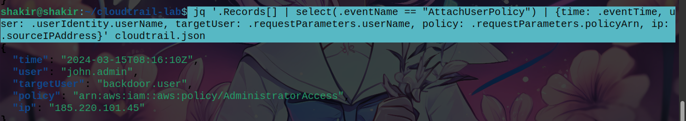

---

### Task 7 — S3 Data Exfiltration

```bash
jq '.Records[] | select(.eventName == "GetObject") | {time: .eventTime, user: .userIdentity.userName, bucket: .requestParameters.bucketName, file: .requestParameters.key, ip: .sourceIPAddress}' cloudtrail.json
```

**Finding:** Between 08:19:05 and 08:20:11, `john.admin` downloaded 3 sensitive files from the `company-sensitive-data` S3 bucket:

| Time | File Downloaded |
|---|---|
| 08:19:05 | `financial-records-2024.csv` |
| 08:19:45 | `employee-records.csv` |
| 08:20:11 | `customer-database-export.csv` |

This is data exfiltration — financial records, employee PII, and the full customer database were stolen in under 2 minutes. Before downloading, at 08:18:33 the attacker ran `ListBuckets` to enumerate all S3 buckets in the account and identify targets.

**MITRE ATT&CK:** T1530 — Data from Cloud Storage Object

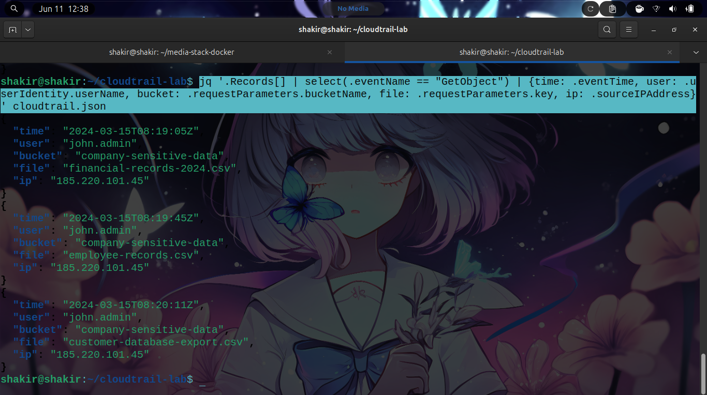

---

### Task 8 — Audit Log Destruction (Most Dangerous Action)

```bash
jq '.Records[] | select(.eventName == "DeleteTrail") | {time: .eventTime, user: .userIdentity.userName, deleted: .requestParameters.name, ip: .sourceIPAddress}' cloudtrail.json
```

**Finding:** At 08:21:30, `john.admin` deleted the CloudTrail trail named `company-audit-trail`.

This is the most dangerous single action in the entire attack chain. By deleting the CloudTrail:
- All future AWS API activity in this account stops being logged
- The attacker can now operate with complete invisibility
- Any actions taken by `backdoor.user` after this point leave no trace
- Incident responders lose their primary evidence source

This is the equivalent of a burglar cutting the CCTV system after entering a building — everything before the cut is recorded, but everything after is invisible.

**MITRE ATT&CK:** T1562.008 — Impair Defenses: Disable Cloud Logs

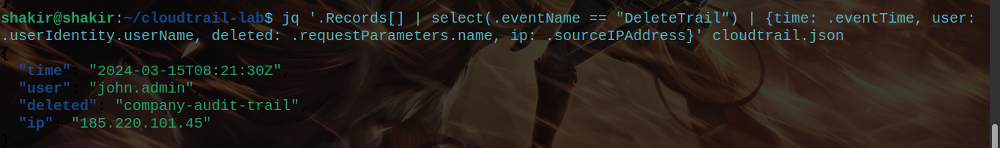

---

## Analyst Investigation Q&A

These are the investigation questions I answered based on the CloudTrail evidence — the same questions a Tier 1 SOC analyst would document in a case ticket.

**Q1. What IP address did the attacker use throughout the whole attack?**
`185.220.101.45` — this IP is consistent across all 12 malicious events. In a real investigation, this IP would be queried against threat intel feeds (AbuseIPDB, VirusTotal, Shodan) to determine if it is a known Tor exit node, VPN, or previously flagged IP.

**Q2. How many times did the login fail before the attacker got in?**
3 failed attempts between 08:13:01 and 08:13:44 — all within 43 seconds — before a successful login at 08:14:02. The very first attempt at 08:12:34 also succeeded, suggesting the attacker may have had valid credentials from a prior breach or phishing attack.

**Q3. What was the name of the backdoor user created?**
`backdoor.user` — created at 08:15:22, just 81 seconds after gaining access. Speed indicates a scripted or pre-planned attack, not improvisation.

**Q4. What permission/policy was given to the backdoor user?**
`arn:aws:iam::aws:policy/AdministratorAccess` — full unrestricted admin access to all AWS services. The attacker gave their backdoor account the highest possible permission level.

**Q5. How many files were exfiltrated from S3? What were their names?**
3 files from the `company-sensitive-data` bucket:
- `financial-records-2024.csv`
- `employee-records.csv`
- `customer-database-export.csv`

This constitutes a data breach of financial, employee PII, and customer data — potentially triggering regulatory reporting obligations (GDPR, PCI-DSS).

**Q6. What was the last thing the attacker did — and why is it the most dangerous?**
Deleted the CloudTrail trail `company-audit-trail` at 08:21:30. This is the most dangerous action because it terminates all future logging for the AWS account. The backdoor user `backdoor.user` with full `AdministratorAccess` still exists in the account — but any actions it takes after the CloudTrail deletion are completely invisible. The attacker has persistence and invisibility simultaneously.

**Q7. Which user behaved legitimately? How can you tell?**
`sarah.dev` — she logged in at 09:00:00 from a completely different IP (`203.0.113.25`), had **MFA enabled** (unlike the attacker), and only performed normal developer activity: launching a `t2.micro` EC2 instance. She showed no signs of enumeration, privilege escalation, data access, or defense evasion.

---

## Full Attack Timeline Reconstruction

| Time | Action | Stage |
|---|---|---|
| 08:12:34 | `john.admin` logs in — no MFA | Initial Access |
| 08:13:01–08:13:44 | 3 failed logins (possible tool retry) | Credential Access |
| 08:14:02 | Successful login after failures | Initial Access |
| 08:15:22 | Creates `backdoor.user` | Persistence |
| 08:16:10 | Attaches `AdministratorAccess` to backdoor | Privilege Escalation |
| 08:18:33 | Lists all S3 buckets | Discovery |
| 08:19:05–08:20:11 | Downloads 3 sensitive files from S3 | Exfiltration |
| 08:21:30 | Deletes CloudTrail trail | Defense Evasion |

**Total time from first login to covering tracks: 9 minutes**

---

## MITRE ATT&CK Mapping

| Technique | ID | Tactic | Evidence |
|---|---|---|---|
| Valid Accounts: Cloud Accounts | T1078.004 | Initial Access | john.admin login without MFA |
| Brute Force: Credential Stuffing | T1110.004 | Credential Access | 3 failed logins in 43 seconds |
| Create Account: Cloud Account | T1136.003 | Persistence | backdoor.user created |
| Account Manipulation | T1098 | Privilege Escalation | AdministratorAccess attached |
| Cloud Storage Data | T1530 | Collection / Exfiltration | 3 files from S3 |
| Disable Cloud Logs | T1562.008 | Defense Evasion | DeleteTrail event |

---

## Key Takeaways

- **CloudTrail is the single most important AWS log source** for SOC analysts — treat disabling it as a critical severity alert
- **No MFA on admin accounts** is one of the most dangerous misconfigurations in any cloud environment
- **The Shared Responsibility Model** means the customer is responsible for IAM, logging, and data security — not AWS
- **`jq`** is a powerful tool for querying CloudTrail JSON logs locally without needing a SIEM
- **Speed of attack matters** — this entire compromise took 9 minutes. Detection and response must be faster
- Cloud attacks follow the same patterns as on-prem attacks: initial access → persistence → privilege escalation → exfiltration → defense evasion

---

## Tools Used

- `jq` — JSON processor for CloudTrail log analysis
- `grep` — string filtering
- TryHackMe AttackBox (Cloud Security Pitfalls room)
- MITRE ATT&CK Navigator (technique mapping)

---

## References

- TryHackMe Cloud Security for SOC Module: https://tryhackme.com/module/cloud-security-soc
- AWS CloudTrail Documentation: https://docs.aws.amazon.com/cloudtrail/
- MITRE ATT&CK Cloud Matrix: https://attack.mitre.org/matrices/enterprise/cloud/
- AWS IAM Best Practices: https://docs.aws.amazon.com/IAM/latest/UserGuide/best-practices.html
