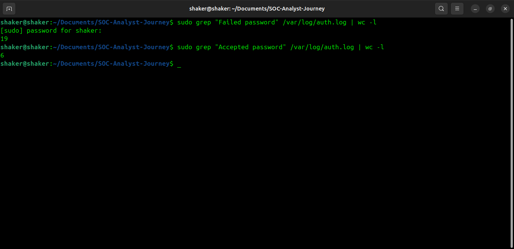

# 🔐 Day 2 – Successful vs Failed SSH Logins (Linux)

## 🎯 Objective
Analyze SSH authentication logs in Ubuntu to compare **failed** vs **successful** login attempts and identify suspicious activity.

---

## 🛠️ Steps Performed
1. Checked **failed login attempts**:
   ```bash
   sudo grep "Failed password" /var/log/auth.log
   ```
2. Checked **successful login attempts**:
   ```bash
   sudo grep "Accepted password" /var/log/auth.log
   ```
3. Counted total failed vs successful:
   ```bash
   sudo grep "Failed password" /var/log/auth.log | wc -l
   sudo grep "Accepted password" /var/log/auth.log | wc -l
   ```
4. Extracted usernames involved:
   ```bash
   # Failed login usernames
   sudo grep "Failed password" /var/log/auth.log | awk '{print $(NF-5)}' | sort | uniq -c
   
   # Successful login usernames
   sudo grep "Accepted password" /var/log/auth.log | awk '{print $(NF-5)}' | sort | uniq -c
   ```

---

## 📊 Findings
- **Total failed logins:** 17  
- **Total successful logins:** 3  

**Failed login usernames:**
```
6 shaker
9 USER=root
3 wronguser
```

**Successful login usernames:**
```
1 shaker
4 USER=root
```

---

## 📷 Screenshots
-   
-   
-   
-   

---

## 📝 Conclusion
- There were significantly more failed logins (17) compared to successful ones (3).  
- The majority of failed attempts targeted the **root** user, which is suspicious and often a brute-force target.  
- There were also failed attempts for a **nonexistent account** (`wronguser`), indicating possible enumeration attempts.  
- Mitigation steps:  
  - Disable direct root login over SSH.  
  - Use **fail2ban** to block repeated failed attempts.  
  - Enforce strong passwords or SSH key-based authentication.

---
