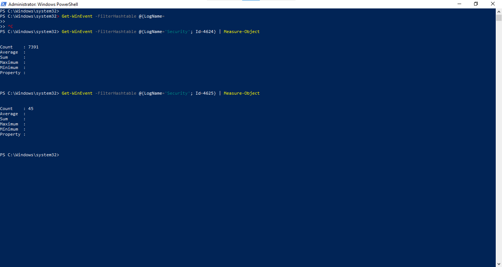
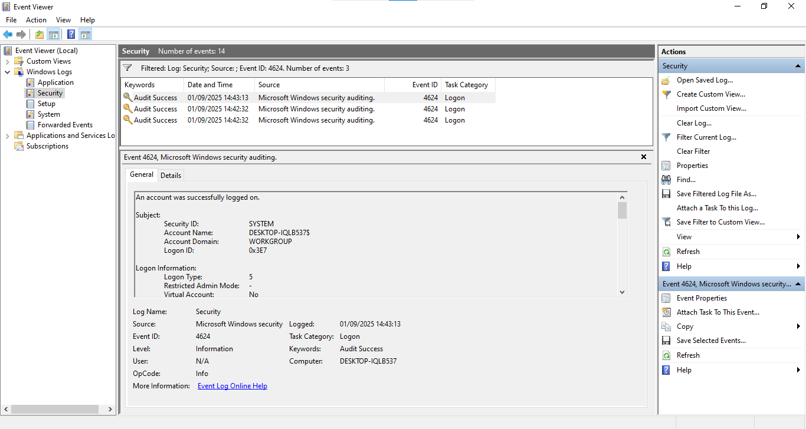
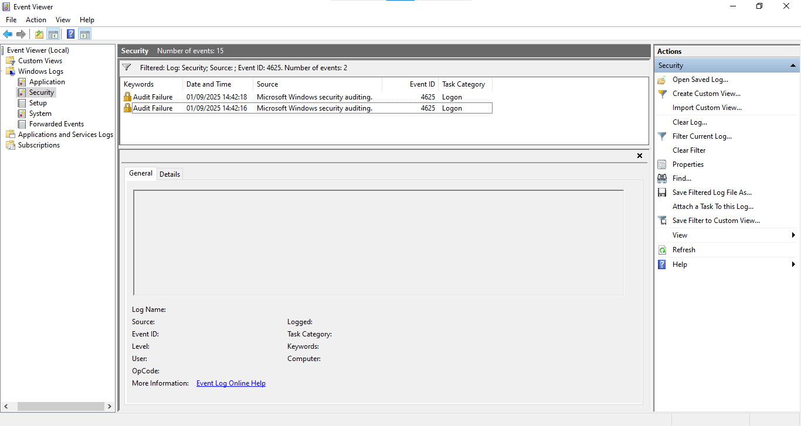

# 🪟 Day 2 – Successful vs Failed Logins (Windows)

## 🎯 Objective
Use Windows Event Viewer to analyze **successful (4624)** vs **failed (4625)** login attempts and identify suspicious activity.

---

## 🛠️ Steps Performed
1. Opened **Event Viewer** (`Win + R` → `eventvwr.msc`).  
2. Navigated to:
   ```
   Windows Logs > Security
   ```
3. Filtered events by ID:
   - **4624** → Successful logon  
   - **4625** → Failed logon  
4. Collected counts of both events and reviewed details of selected logs.  
5. Took screenshots of:
   - Counts of login attempts  
   - Sample failed login events  
   - Sample successful login events  

---

## 📊 Findings
- **Total failed logins (4625):** 45  
- **Total successful logins (4624):** 7391  

**Failed login examples:**
- Account `wronguser` tried to log in but failed.  
- Account `admin` showed repeated failures.  

**Successful login examples:**
- User `faras` logged in successfully.  
- Legitimate system accounts also logged in without errors.  

---

## 📷 Screenshots
-   
-   
-   

---

## 📝 Conclusion
- Multiple failed login attempts were observed, targeting accounts like `wronguser` and `admin`.  
- Successful logins matched expected users (`faras`).  
- Failed login events are a sign of possible brute-force or misconfigured credentials.  

### 🔒 Recommendations:
- Enable **account lockout policies** to stop repeated failures.  
- Monitor for suspicious IP addresses attempting multiple logins.  
- Apply **MFA (Multi-Factor Authentication)** where possible.  
- Regularly review Security logs for unusual activity.  

---
