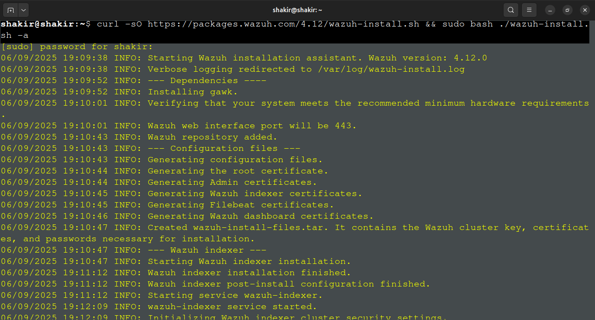
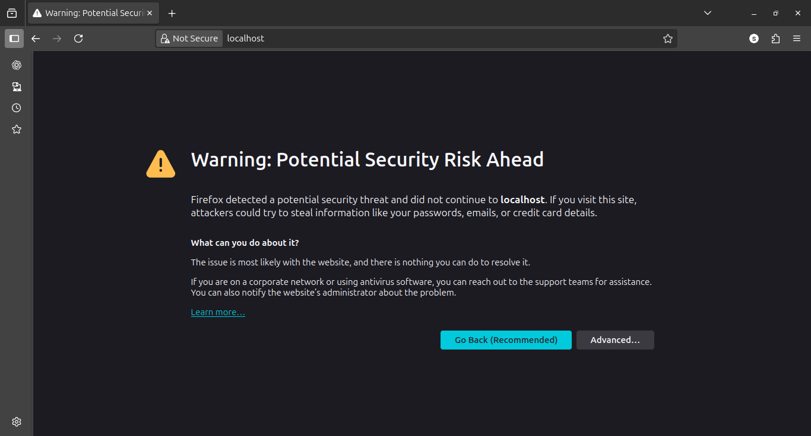
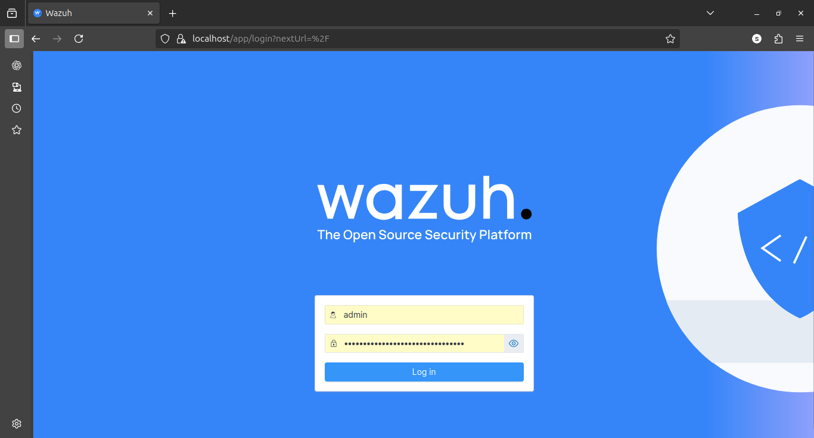
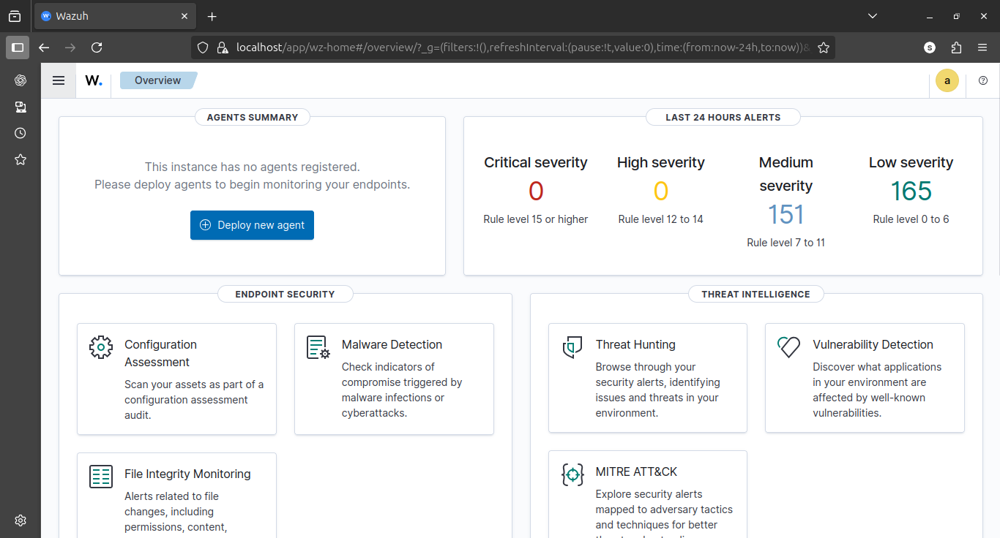
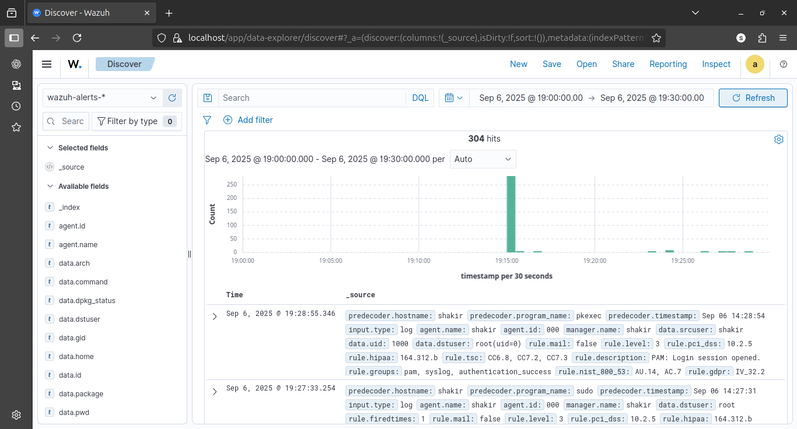
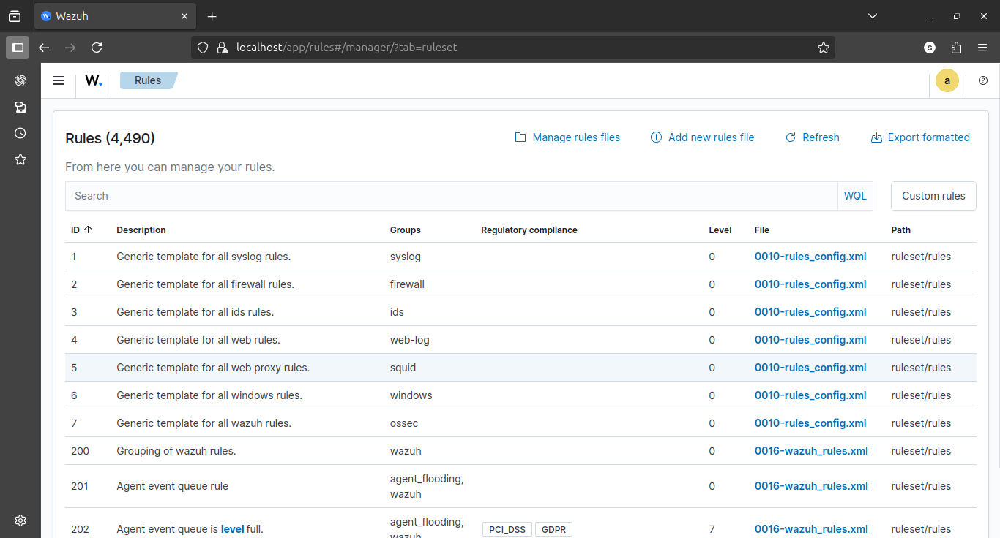
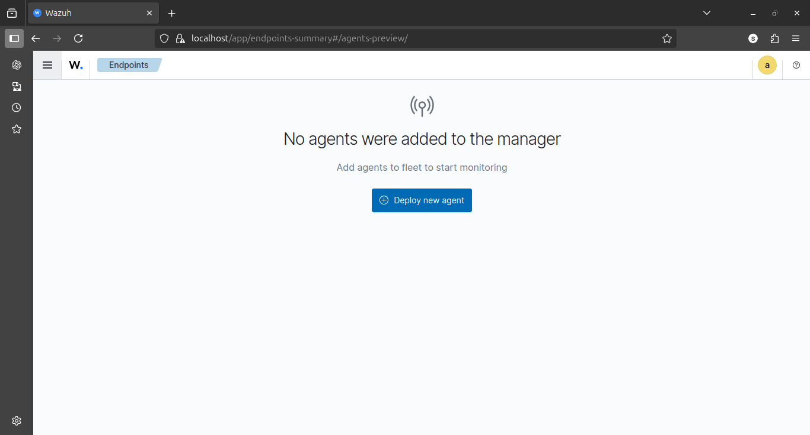

# 🛡️ Day 3 – Wazuh SIEM Installation & Exploration

## 🎯 Objective
Install and explore the **Wazuh SIEM** dashboard to understand how a SIEM tool centralizes and analyzes security logs.

---

## 🛠️ Steps Performed
1. Updated Ubuntu system:
   ```bash
   sudo apt update && sudo apt upgrade -y
   ```
2. Downloaded and executed the Wazuh installer:
   ```bash
   curl -sO https://packages.wazuh.com/4.7/wazuh-install.sh
   sudo bash ./wazuh-install.sh -a
   ```
3. Saved the **admin credentials** displayed at the end of the installation.
4. Opened Wazuh Dashboard in browser:
   ```
   https://localhost:443
   ```
   *(Accepted browser security warning and logged in).*
5. Explored key modules:
   - **Home** → Overview of the SIEM.  
   - **Explore → Discover** → Viewed live security events and logs.  
   - **Server management → Ruleset** → Checked built-in detection rules.  
   - **Agents management** → Confirmed no agents connected yet.  

---

## 📷 Screenshots
-   
-   
-   
-   
-   
-   
-   

---

## 📊 Findings
- Wazuh installed successfully and the dashboard is accessible.  
- **Discover (wazuh-alerts-*)** shows raw logs and security events.  
- **Ruleset** lists default detection rules (e.g., failed SSH logins, privilege escalation, FIM alerts).  
- **Agents management** is currently empty → no endpoints added yet.  

---

## 📝 Conclusion
- A fully functional **SIEM** (Wazuh) is now set up.  
- The dashboard provides a centralized view of logs and alerts.  
- This environment will be used in upcoming days to add Linux/Windows agents and analyze real events.  

---
