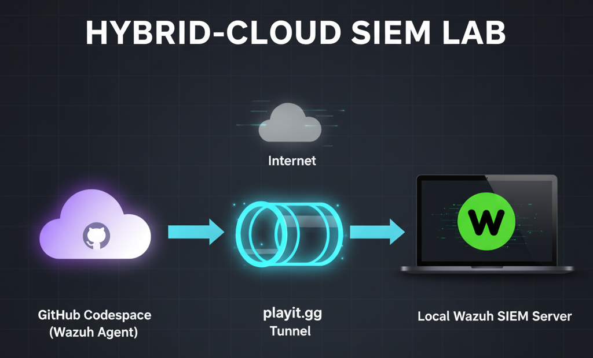

# 🚀 Project Write‑up: Building a Hybrid‑Cloud SIEM Lab

-   

This document describes the engineering and troubleshooting journey of building a **hybrid‑cloud security monitoring lab** using **Wazuh SIEM**.  
What started as a simple local setup evolved into a real‑world scenario that required advanced troubleshooting, pivoting between tools, and ultimately creating a hybrid solution.  

---

## 🎯 Objective  

The original goal was straightforward:  
- Run a **local virtual machine (VM)** as an endpoint.  
- Deploy a **Wazuh SIEM server** on the same host.  
- Practice log collection, alerting, and incident detection in a contained lab.  

---

## 🧱 Challenges & Troubleshooting Journey  

### 1. Virtualization Failure: Secure Boot Block  

Attempts to create a VM with **VirtualBox** and **VMware Player** failed due to kernel module errors (`vboxdrv`, `vmmon`).  

🔎 Root Cause:  
The host system’s **Secure Boot** policy prevented unsigned kernel modules from loading. Normally this can be resolved by disabling Secure Boot in BIOS/UEFI, but a **forgotten BIOS password** made this impossible.  

➡️ Outcome: Forced pivot away from local virtualization.  

*_ VMware kernel module error screenshot_*  
-   

---

### 2. Network Tunneling Challenge  

To connect a cloud endpoint back to the home SIEM, tunneling was required.  
- **ngrok** was the first choice, but its free tier required a credit card for TCP tunnels.  
- **playit.gg** was adopted as the alternative, successfully providing a free persistent TCP tunnel.  

---

## 💡 The Pivot: Hybrid‑Cloud Architecture  

With local virtualization blocked, the project was re‑scoped into a hybrid design:  

- **Endpoint:** A **GitHub Codespace** running Ubuntu, acting as a monitored remote system.  
- **Network:** A **playit.gg tunnel** exposing the Wazuh agent port (1514) to the public internet.  
- **Server:** A **Wazuh SIEM** deployed locally on the home laptop.  

Architecture diagram:  

```
[GitHub Codespace (Agent)] ---> [Public Internet] ---> [playit.gg Tunnel] ---> [Home Laptop (Wazuh Server)]
```  

✅ Verification: The `codespace-vm` endpoint checked in and appeared as **Active** in the Wazuh Dashboard.  

*_(Screenshot of active agent in dashboard)_*  
-  
- 

---

## 📊 Testing & Indicators of Compromise  

A controlled SSH brute‑force test was run from the Codespace against itself to validate monitoring.  

| Indicator Type   | Value         | Description                                  |
|------------------|---------------|----------------------------------------------|
| **Attacker IP**  | `127.0.0.1`   | Attack originated locally in the Codespace. |
| **Target User**  | `codespace`   | Default Codespace account.                  |
| **Service**      | `SSH (22)`    | Service targeted by brute‑force.            |
| **Wazuh Rules**  | `5712`, `5716`| Detected brute‑force attempts + success.    |

---

## 🎓 Key Skills & Lessons Learned  

This project provided real‑world, hands‑on security engineering experience:  

- **System‑Level Troubleshooting:** Diagnosed and worked around Secure Boot restrictions blocking virtualization.  
- **Hybrid‑Cloud Networking:** Engineered secure connectivity between a cloud container (Codespace) and a private SIEM using tunnels.  
- **Adaptability & Tool Pivoting:** Pivoted from VirtualBox → VMware → Codespace, and from ngrok → playit.gg.  
- **SIEM Deployment:** Successfully deployed a Wazuh agent on a remote cloud container, configured keys, and validated log ingestion.  

---

✅ The result is a **realistic hybrid‑cloud SIEM lab** that mirrors modern enterprise environments — central SIEM monitoring endpoints across different locations and networks.  
